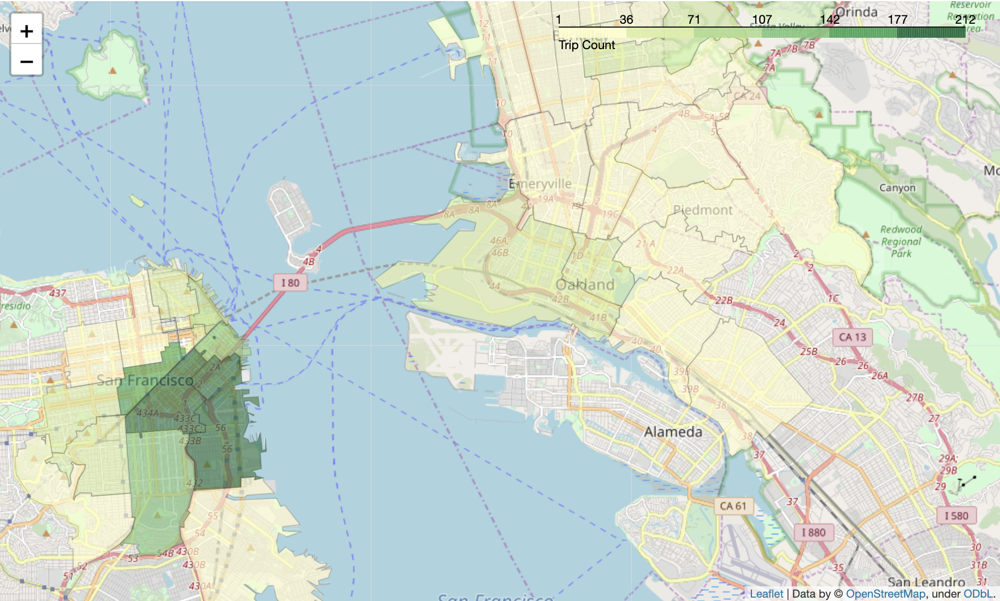

# BayWheel Bike Data Visualziation

Welcome to Baywheel's bike visualization! Here we have a dataset from Lyft showcasing the useage of shared bike in the Bay area in 2018. We want to figure out the basic demography of the users as well as its relationship with trip duration. In addition, we want to derive some time-based visualizations illustrating when people like to bike based on time in a day, days in a week, and months in a year. Lastly, we want to explore where exactly people like to bike in the Bay - thus we've dived deep and done some hardcore work in transforming original dataset into geojson data, setting up the schema grouped by zip, and finally visualizing the trip frequencies on a Bay area map. 

# Dataset

I chose Lyft's bikeshare dataset at this [link](https://www.lyft.com/bikes/bay-wheels/system-data). It's a set of CSV files containing shared-bike usage in the Bay Area in the year of 2018. The reason I chose it is that it is by itself quite clean and has a lot of useful fields regarding the individual bike trip details (e.g., start/end location coordinates, trip duration, user demography) that would be interesting to dig in and examine multiple types of relationships.

# Main Findings

## Reflection of the Process

- I definitely enjoyed this project more than any other project in the Data Analyst Nanodegree. I'm a pretty visual person and really passionate about my works/findings in a easy-to-understand, aesthetically-pleasing manner. I think the data extraction/cleaning part is relatively straightword as I've already familiared myself with those skills during the previous NanoDegree projects. The visualization part is a bit tricky because it's hard to determine the theme of the visualizations. Different from the two datasets in the lectures, this BayWheel dataset doesn't have many numerical fields (and even for the categorical fields, a lot of them are derived by the original columns), so apparently I can't do a lot of scatter plots or plots of that nature. Instead, I focused on the basic questions: Who? When? Where? (I skipped how and why because they're beyond the scope) of people's biking habits and tried to draw more detailed questions from there. I was able to have a lot of fruitful insights by creating a lot of customized fields and measuing the data against them.

- Another difficult piece of the project I encountered was trying to map the count of trips based on zipcode on a Bay Area map. Believe it or not, it's not as easy as it sounds. I've tried different libraries including GeoPandas and Basemap to no avail, before I turned to Folium, a Python wrapper based on leaflet.js. As I don't have the processed GeoJson data with zip, I created my own with some Python scripts and then managed to (literally) map the results to the map. It was quite an endeavour but rewarding as well.

## Key Insights from Visualization

- From a timing perspective: most people ride on weekdays rather than on the weekend. In terms of specific hours, people mostly ride in the morning and late afternoon/early evening - which might imply that most people ride for commuting, especially for those living in the city. In terms of months, more riders use Baywheel in summer and fall, when the weather is most likely more pleasant than the other seasons. 

- From a demographic perspective, the age group with most riders is young adult (aged between 20-35), followed by adults (aged between 35-55). The elder and teens have significant less riders. People aged between 30-40 bike the most, taking a big lead against the runner-up, those aged between 20-30 by almost 200,000 rides. The majority of the riders are regular subscribers rather than customers. Teens, however, ride longer than others with an average trip duration of 17min, where as the young adults seem to have a shorter commute.

- From a geospatial perspective, most riders ride in the City of San Francisco, especially in downtown/financial district and the areas along the piers. For the suburbs, Oakland has a slightly heavier traffic than the other towns, but the coverage of BayWheel is indeed very broad, from Berkeley to Alameda.

# List of Resources

- Google's [GeoCoding API](https://developers.google.com/maps/documentation/geocoding) for mapping the coordinate sets to zipcodes
- The awesome [Folium](https://python-visualization.github.io/folium/) library for visualizing GeoJson data on map
- The official [GeoJson website](http://geojson.io) to define and transform the original data to GeoJson format
- The City of San Francisco's Bay Area Shape [data](https://data.sfgov.org/Geographic-Locations-and-Boundaries/Bay-Area-ZIP-Codes/u5j3-svi6)
- A very helpful [blog post](https://medium.com/@sosterburg/mapping-data-with-folium-356f0d6f88a9) that shedded light on the geospatial visualization process for me 
- Python's own ReGex, datetime and os libraries