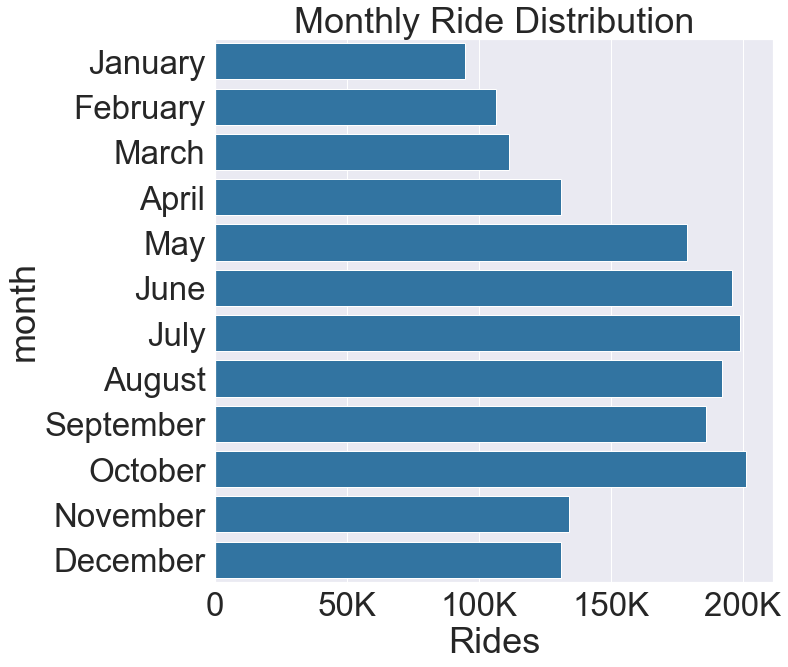

#                                   BayWheel Bike Data Visualziation

Welcome to Baywheel's bike visualization! Here we have a dataset from Lyft showcasing the useage of shared bike in the Bay area in 2018. We want to figure out the basic demography of the users as well as its relationship with trip duration. In addition, we want to derive some time-based visualizations illustrating when people like to bike based on time in a day, days in a week, and months in a year. Lastly, we want to explore where exactly people like to bike in the Bay - thus we've dived deep and done some hardcore work in transforming original dataset into geojson data, setting up the schema grouped by zip, and finally visualizing the trip frequencies on a Bay area map. 


```python
import pandas as pd
import numpy as np
import matplotlib.pyplot as plt
import seaborn as sb
import math
import datetime
import json
%matplotlib inline
```


```python
import os
import conda
import folium
import re
from pygeocoder import Geocoder

# load the libraries for map visualization
conda_file_dir = conda.__file__
conda_dir = conda_file_dir.split('lib')[0]
proj_lib = os.path.join(os.path.join(conda_dir, 'share'), 'proj')
os.environ["PROJ_LIB"] = proj_lib
```

## Data Extraction


```python
# import all the csv files from Lyft's website 
files = ['201801-fordgobike-tripdata.csv', '201802-fordgobike-tripdata.csv',
        '201803-fordgobike-tripdata.csv','201804-fordgobike-tripdata.csv',
        '201805-fordgobike-tripdata.csv','201806-fordgobike-tripdata.csv',
        '201807-fordgobike-tripdata.csv','201808-fordgobike-tripdata.csv',
        '201809-fordgobike-tripdata.csv','201810-fordgobike-tripdata.csv',
        '201811-fordgobike-tripdata.csv','201812-fordgobike-tripdata.csv']
```


```python
# loop through the file directory, append each file to the dataframe then reset the index 
df = pd.DataFrame()
for file in files:
    if df.empty:
        df = pd.read_csv(file)
    else:
        new_df = pd.read_csv(file)
        df = pd.concat([df, new_df], ignore_index=True)
df.reset_index()
```

## Data Exploration/Cleaning


```python
df.shape
```


    (1863721, 19)


```python
# check the fields of the dataframe
df.columns
```


```python
# derive the time duration in terms of minute and hour from duration_sec
df['duration_min'] = df['duration_sec'].apply(lambda d: d/60).astype(float)
df['duration_hr'] = df['duration_min'].apply(lambda d: d/60).astype(float)
```


```python
# round to 2 decimals 
df['duration_min'] = df['duration_min'].apply(lambda x: round(x, 2))
df['duration_hr'] = df['duration_hr'].apply(lambda x: round(x, 2))
```


```python
# derive the age from members' birth year
df['member_age'] = df['member_birth_year'].apply(lambda b:0 if pd.isnull(b) else 2019-b).astype(int)
```


```python
# make a copy of the data frame for further exploration
dfc = df.copy()
```


```python
# convert end_time column to datetime type
dfc['end_time'] = pd.to_datetime(dfc['end_time'])
```


```python
# extract month, date, day, and hour from the end_time column utilizing the datetime library
dfc['month'] = dfc['end_time'].apply(lambda time: time.strftime("%B"))
dfc['date'] = dfc['end_time'].apply(lambda time: time.strftime("%d"))
dfc['day'] = dfc['end_time'].apply(lambda time: time.strftime("%A"))
dfc['hour'] = dfc['end_time'].apply(lambda time: time.strftime("%H"))
```


```python
# assign a certain day to weekday/weekend
def assign_weektime(day):
    weekdays = ['Monday','Tuesday', 'Wednesday','Thursday','Friday']
    weekend = ['Saturday', 'Sunday']
    if day in weekdays:
        return "Weekday"
    else:
        return "Weekend"
```


```python
dfc['timeofweek'] = dfc['day'].apply(lambda day: assign_weektime(day))
```


```python
dfc['hour'] = dfc['hour'].astype(int)
```


```python
# assign a specific time period of the day (morning, afternoon, evening)
def assign_dayperiod(hour):
    if (hour >= 4 and hour <= 12):
        return "Morning"
    elif (hour > 12 and hour <= 18):
        return "Afternoon"
    else:
        return "Evening"
```


```python
dfc['dayperiod'] = dfc['hour'].apply(lambda hour: assign_dayperiod(hour))
```


```python
# assign age group to the users
def assign_agegroup(age):
    if (age >= 0 and age <=10):
        return "Children"
    elif (age > 10 and age <=20):
        return "Teen"
    elif (age > 20 and age <=35):
        return "Young Adult"
    elif (age > 35 and age <=55):
        return "Adult"
    else:
        return "Senior"
```


```python
dfc['member_age_group'] = dfc['member_age'].apply(lambda age: assign_agegroup(age))
```


```python
# test age group categorization 
dfc.member_age_group.value_counts()
```


    Young Adult    1003679
    Adult           628064
    Children        110718
    Senior          102522
    Teen             18738
    Name: member_age_group, dtype: int64


```python
# define the default color for module visualization 
base_color = sb.color_palette()[0]
```

### Average Trip Duration by Age Group


```python
age_order = ['Children', 'Teen', 'Young Adult', 'Adult', 'Senior']
age_range = [0, 10, 20, 35, 55, 120]
```


```python
dfc_byAge = dfc.loc[dfc.member_age != 0].reset_index()
```


```python
bin_idxs = pd.cut(dfc_byAge['member_age'], age_range, labels=age_order)
```

Last but not least, since a lot of the plots will have number of data rows (i.e., count of trips) as the y axis, let's develop a mechanism to display the trip counts in thousands (K) so it looks cleaner.


```python
def format_ride_count(count):
    if (count == 0):
        return "0"
    elif (len(str(count)) <=3):
        return str(count)
    else:
        return "{:,}".format(int(count/1000)) + "K"
```


```python
# test format function 
format_ride_count(3334334)
```


    '3,334K'


# Data Viualization

### Q1: When does people usually like to bike?

First of all, we'd like to figure out when people like to bike around in different metrics. That'd be useful to build a pattern that would help better distributing the bikes based on demand of different time periods.

We'll start off by weekday/weekend.


```python
plt.figure(figsize=[8,8])
timeofweek_counts = dfc.timeofweek.value_counts()
plt.pie(timeofweek_counts, labels=timeofweek_counts.index, startangle=90, autopct=lambda val: val.round(2));
plt.axis('square');
```


Apparently, the majority of the bikes ride on the weekday. Do they bike to commute or just for fun? Maybe taking a look at the day period (morning/afternoon/evening) distribution would help us determine.


```python
plt.figure(figsize = [12, 10])
dayperiod_order = ['Morning', 'Afternoon', 'Evening']
sb.countplot(data=dfc, x="dayperiod", color=base_color, order=dayperiod_order);
y_ticks_props = np.arange(0, dfc.groupby('dayperiod').bike_id.count().max()+1, 100000);
y_ticks_display = [ format_ride_count(numRide) for numRide in y_ticks_props]
plt.yticks(y_ticks_props, y_ticks_display);
plt.ylabel('Rides');
plt.title('Ride Distribution in Day Periods', pad=20);
```


Maybe they do bike for commuting as the majority of rides takes place during morning and afternoon. To confirm, let's dive deep and take a look at the hourly distribution.


```python
plt.figure(figsize = [12, 10])
hour_order = np.arange(0, 24, 1)
sb.countplot(data=dfc, x="hour", color=base_color, order=hour_order);
y_ticks_props = np.arange(0, dfc.groupby('hour').bike_id.count().max()+1, 50000);
y_ticks_display = [ format_ride_count(numRide) for numRide in y_ticks_props]
plt.xticks(np.arange(0, 24+1, 3), np.arange(0, 24+1, 3));
plt.yticks(y_ticks_props, y_ticks_display);
plt.ylabel('Rides');
plt.title('Hourly Ride Distribution');
```


It might actually be the case. As we can see from the bar chart, the peak traffic is around 7-9 (morning commute) and 16-18 (afternoon commute(). There's a consistent traffic in between the two peaks, and after 7pm traffic starts to go down.

Now let's examine the data set from the month's perspective. In which month do people bike the most? Let's find out by building a barplot based on month.


```python
plt.figure(figsize = [10, 10])
month_order = ['January', 'February', 'March', 'April', 'May', 'June', 'July', 'August', 'September', 'October', 'November', 'December']
sb.countplot(data=dfc, y="month", color=base_color, order=month_order);
plt.xlabel('Rides');
plt.ylabel('Month');
x_ticks_props = np.arange(0, dfc.month.value_counts().max()+1, 50000);
x_ticks_display = [ format_ride_count(numRide) for numRide in x_ticks_props]
plt.xticks(x_ticks_props, x_ticks_display);
plt.title('Monthly Ride Distribution');
```





To better display the month labels, I've set the barplot to be horizontal. Here we could see that apparently people like to bike in summer and fall - especially in the months from May to October. It makes sense because the weather during that those seasons are more ideal for biking.

Now that we've examined the data from a chronological standpoint, let's switch gears and try to play around with demographic attributes. Nos vamos!

### Q2: Who likes to ride a bike the most?

We would like to start off with some usual univariate analysis. Let's take a look at the age group - do older people prefer to bike than the younger people? 


```python
plt.figure(figsize = [10, 10])
age_order = ['Children', 'Teen', 'Young Adult', 'Adult', 'Senior']
sb.countplot(data=dfc, y="member_age_group", color=base_color, order=age_order);
x_ticks_props_age = np.arange(0, dfc['member_age_group'].value_counts().max()+1, 250000);
x_ticks_display_age = [ format_ride_count(numRide) for numRide in x_ticks_props_age]
plt.xticks(x_ticks_props_age, x_ticks_display_age);
plt.xlabel('Rides');
plt.ylabel('Age Group');
plt.title('Ride Distribution among Age Aroups');
x_ticks_display_age
```


    ['0', '250K', '500K', '750K', '1,000K']


This categorization might be a bit general. What if we break down the age by range of 10?


```python
bin_edges = np.arange(0, dfc.member_age.max(), 10)
dfc['age_by_10'] = pd.cut(dfc.member_age, bin_edges, right=False)
```


```python
# todo: convert xtick label to "start_age - end_age", e.g., 10-20 instead of [10, 20]
plt.figure(figsize=[15,10])
sb.countplot(data=dfc, y="age_by_10", color=base_color);
x_ticks_props = np.arange(0, dfc['age_by_10'].value_counts().max()+1, 100000);
x_ticks_display = [ format_ride_count(numRide) for numRide in x_ticks_props]
plt.xticks(x_ticks_props, x_ticks_display);
plt.xlabel('Rides');
plt.ylabel('Age');
plt.title('Ride Distribution among Age Aroups, range of 10');
```


As we could see from above, most riders fall into the range of 20-50, which makes sense. Let's now try a bivariate visualization. What's the relationship between trip duration and age group? For the sake of simplicity, we'll use the duration in minute as our metric.


```python
plt.figure(figsize = [20, 10])
plt.subplot(1, 2, 1)
ax1 = sb.violinplot(data=dfc, x="member_age_group", y="duration_min", color=base_color, order=age_order)
plt.ylim(0, 50);
plt.ylabel("Duration (min)")

plt.subplot(1, 2, 2)
ax2 = sb.boxplot(data=dfc, x="member_age_group", y="duration_min", color=base_color, order=age_order)
plt.ylabel("Duration (min)");
plt.ylim(0, 50);
```


As we could see, surprisingly children seem to have the longest duration. However as we recall for a lot the records that don't have a birth year, we simply assign their age to be 0. Let's clean it up and run the plots again. 


```python
dfc.query('member_age == 0').count()['bike_id']
```


    110718


```python
dfc_by_age = dfc.loc[dfc.member_age != 0]
```


```python
dfc_by_age.member_age_group.value_counts()
```


    Young Adult    1003679
    Adult           628064
    Senior          102522
    Teen             18738
    Name: member_age_group, dtype: int64


```python
plt.figure(figsize = [20, 10])
plt.subplot(1, 2, 1)
ax1 = sb.violinplot(data=dfc_by_age, x="member_age_group", y="duration_min", color=base_color, order=age_order[1:])
plt.ylim(0, 50);
plt.xlabel("Age Group", fontsize='xx-small');
plt.ylabel("Duration (min)")

plt.subplot(1, 2, 2)
ax2 = sb.boxplot(data=dfc_by_age, x="member_age_group", y="duration_min", color=base_color, order=age_order[1:])
plt.xlabel("Age Group", fontsize='xx-small');
plt.ylabel("Duration (min)");
plt.ylim(0, 50);
```


Hmm, that makes a difference. Now the children group is completely gone - and teens take the lead among all age groups. Surprisingly, the seniors come nextm trailing by a small margin.

Next, let's examine the distribution between user types (subscriber/customer)


```python
g = sb.FacetGrid(data=dfc, col="user_type");
sb.set(font_scale = 3)
g.fig.set_size_inches(20,10)
g.map(plt.hist, "duration_min", range=[0,40]);
g.set_titles('{col_name}', pad=20);
for ax in g.axes.flatten():
    ax.set_xlabel('Duration (min)');
y_ticks_props = np.arange(0, dfc.user_type.value_counts().max()+1, 100000);
y_ticks_display = [ format_ride_count(numRide) for numRide in y_ticks_props]
plt.yticks(y_ticks_props, y_ticks_display);
```


As we could see, the majority of users are subscribers while just a small portion of users are occasional customers. For both groups, most data points fall into the range of 0-20 minutes. Nevertheless, the spread of subscribers is much greater than the customers, which is comparatively more even-out. For subscribers, the bulk of the data points of subscribers fall in 5-15 minutes.

### Q3: How about taking both time and age into consideration in terms of the trip duration?

Let's try to draw a clustered bar plot to illustrate the impacts of day period (morning/afternoon/evening) and age on average trip duration.


```python
plt.figure(figsize = [24, 10])
ax = sb.barplot(data=dfc_by_age, x="member_age_group", y="duration_min", hue="dayperiod", order=age_order, palette="BuGn_r");
ax.legend(loc=3, framealpha=0.8)
plt.title("Relationship between Trip Duration and Daytime, Age", pad=20);
plt.xlabel("Age Group");
plt.ylabel("Trip Duration");
```


We could also examine the relationship from a hourly perspective. Here we will draw a line chart of different age group's ride count in 24 hours.


```python
plt.figure(figsize = [15, 20])
dfc_by_age_sample = dfc_by_age.groupby(['member_age_group', 'hour']).bike_id.count().reset_index()
sb.lineplot(data=dfc_by_age_sample, x="hour", y="bike_id", hue="member_age_group")
y_ticks_props = np.arange(0, dfc_by_age.groupby(['member_age_group', 'hour']).bike_id.count().max()+1, 20000);
y_ticks_display = [format_ride_count(numRide) for numRide in y_ticks_props]
plt.yticks(y_ticks_props, y_ticks_display);
plt.ylabel("Rides");
plt.legend(loc=2, fontsize='xx-small');
```


    <matplotlib.legend.Legend at 0x1a40b75c18>


Here, let's do the same but this time using histogram. For a better look, we'll remove the fillings of the bins and only leave the borders so it's easier to trace the trends.


```python
#todo: change the y_tick_props so that it's not hard-coded 
g = sb.FacetGrid(data=dfc_by_age, hue="member_age_group", height=12);
g.map(plt.hist, "hour", histtype="step");
plt.legend(fontsize='xx-small', loc=2);
plt.xticks(np.arange(0, 24+1, 3));
plt.ylabel("Number of Rides");
y_ticks_props = np.arange(0, 250000, 50000);
y_ticks_display = [ format_ride_count(numRide) for numRide in y_ticks_props]
plt.yticks(y_ticks_props, y_ticks_display);
```


Wonderful! So through the line plot as well as the pseudo-histogram we can see that almost all the age groups share the same pattern in terms of hourly rides, with two peaks in the morning and late afternoon/early evening. For teens, the pattern is not so obvious but that's also because the sample size is smaller compared to the other groups.

### Q4: In which area does people bike the most?

Notice that this visualization is more like a proof-of-concept experimentation. We wanted to figure out where (here we're primarily curious about the zip) people like to bike. We'll use Google's Geocoding API for computing the zip based on the latitude and longtitude extracted from a small sample of the dataframe (it's not feasible to do all of them because the Geocoding API is costly beyond a certain threshold), then visualize it on a map illustrating the most popular areas where people like to bike. For the sake of simplicity, we'll just use the start location's data for this analysis and visualization, but we can always dive deeper further onwards.


```python
# load the API credential from env
%reload_ext dotenv
%dotenv
```


```python
# sample a selection of the original dataset for the proof-of-concept illustration
dfc_geo = dfc.sample(1500).reset_index()
```


```python
API_KEY = os.getenv("GEO_API_KEY")
```


```python
# IMPORTANT: Please do not run the commented code. This is just to show how I extracted the zip data using Google's GeoCoder API.
# However, the plan has a quota limit and might not go beyond a certain threshod. Please only run the read_csv command
# to read the pre-complied data


# for index, row in dfc_geo.iterrows():
#     try:
#         lat, lon = dfc_geo.loc[index, ['start_station_latitude', 'start_station_longitude']]
#         start_loc = Geocoder(API_KEY).reverse_geocode(lat, lon)
#         start_loc_zip = start_loc.postal_code
#         dfc_geo.loc[index, 'zip'] = start_loc_zip
#     except Exception as e:
#         print('failed: index ', index, ' message: ', str(e))
#         continue

dfc_geo = pd.read_csv('geo_results.csv')
```


```python
# get a list of unique zips from the data frame for querying in the geojson data later 
ziplist = dfc_geo.zip.unique()
```


```python
# save the dataframe to CSV just in case 
# dfc_geo.to_csv('geo_results.csv', index=False)
```


```python
# group trips by zip
dfc_geo_zip = dfc_geo.groupby('zip').bike_id.count().reset_index()
```


```python
# rename the bike_id to count 
dfc_geo_zip.rename(columns={"bike_id": "count"}, inplace=True)
```


```python
# load GeoJSON
with open('sf_zip_geojson.json', 'r') as jsonFile:
    geo_data = json.load(jsonFile) 
tmp = geo_data
```

So here we have a problem. I'm not able to find any GeoJson data with zipcode property from the Internet, and the only one I could find is a [link](https://data.sfgov.org/Geographic-Locations-and-Boundaries/Bay-Area-ZIP-Codes/u5j3-svi6) of Bay area's zipcode shape file from the City of San Francisco's [website](https://datasf.org).

However, I'm still going to take advantage of this dataset and do some dirty manual wrangling work to transform this JSON file into a dataset in standard [GeoJson format](https://geojson.org). We'll then use a Python library called Folium to draw the map and visualize the cleaned data on the map.


```python
# define a function to load the default GeoJson template as a Python dictionary
def create_feature_template(zip):
    feature = {
        "type": "Feature",
        "id": zip,
        "properties": {
            "zip": zip
          },
        "geometry": {
            "type": "Polygon",
            "coordinates": ""
        }
    }
    return feature
```


```python
# wrangle the data to reformat the way coordinates are organized 
def wrangle_coordinates(polygon):
    # remove the opening/closing parentheses
    polygon = polygon[2:-2]
    
    # initialize the containers
    coordinates_container = []
    coordinates = []
   # break the set of coordinates into individual pairs of coordinates
    pre_coordinates = polygon.split(',')
    
    # loop through each pair of coordinates
    for pre_coordinate in pre_coordinates:
        # a container to house the cleaned coordinates
        coordinate = []
         # break the coordinate into latitude and longitude 
        cors = pre_coordinate.strip().split(' ')
        # convert the coordinate string to float then append to the container 
        coordinate.append(float(cors[0]))
        coordinate.append(float(cors[1]))
        coordinates.append(coordinate)
    coordinates_container.append(coordinates)
    return coordinates_container
```


```python
# this function is to populate the feature template depending on the shape 
# here we have polygon or multipolygon, so we'll handle them accordingly
def populate_feature(shape, zip):
    # load a default feature template 
    new_feature = create_feature_template(zip)
    # find all matching shapes
    res = re.findall(r'\(\([^()]*\)\)', shape)
    # find the length of shape and determine its shape
    num_shapes = len(res)
    if (num_shapes == 1):
        # polygon
        container = wrangle_coordinates(res[0])
        new_feature['geometry']['coordinates'] = container
    else:
        # multipolygon, have to create an additional outer container to house the arrays of coordinates
        new_feature['geometry']['type'] = 'MultiPolygon'
        coordinate_container_multipolygon = []
        for polygon in res:
            container = wrangle_coordinates(polygon)
            coordinate_container_multipolygon.append(container)
        new_feature['geometry']['coordinates'] = coordinate_container_multipolygon
    return new_feature
```


```python
# call the populate_feature to append the shapes to pre-defined features array
features = []
for row in tmp['data']:
    zip = row[-4]
    # filter out those shapes whose corresponding zip not in our dataset
    if (zip in ziplist):
        features.append(populate_feature(row[-5][14:-1], zip))
```


```python
# creating the outermost JSON object as the featureCollection
new_json = dict.fromkeys(['type','features'])
new_json['type'] = 'FeatureCollection'
new_json['features'] = features
# save updated featureCollection
open("sf_geojson_cleaned.json", "w").write(json.dumps(new_json, sort_keys=True, indent=4, separators=(',', ': ')));
```


    444699


```python
# todo: add the top 10 most popular stations on the map (as Markers)

# define the center of the map and zoom level, then create the map 
SF_COORDINATES = (37.80, -122.30)
map = folium.Map(location=SF_COORDINATES, zoom_start=12)

folium.Choropleth(
        # the cleaned data in GeoJson format
        geo_data="sf_geojson_cleaned.json",
        name='choropleth',
        # trips count grouped by zip
        data=dfc_geo_zip,
        # the foreign key and the column we're interested in
        columns=['zip', 'count'],
        # the Pandas dataframe relates to the GeoJson data's zip property
        key_on='feature.properties.zip',
        fill_color='YlGn',
        fill_opacity=0.6,
        line_opacity=0.2,
        legend_name='Trip Count'
).add_to(map)

# show the populated map 
display(map)
```


As we can see from the color-coded map, people actually bike over all the Bay Area! Nevertheless, there's clearly more users of BayWheel in the City of San Francisco area rather than in the outskirts (Oakland, Emeryville, Berkeley, Piedmont, Alameda, etc). Within San Francisco, the east side seems more popular, epsecially in the zip areas along the piers, which makes sense as there're lot of companies, businesses and others in those area. For the suburbs, west Oakland has a slightly heavier traffic than the other areas, which are quite residential.

# Main Findings

## Reflection of the Process

- I definitely enjoyed this project more than any other project in the Data Analyst Nanodegree. I'm a pretty visual person and really passionate about my works/findings in a easy-to-understand, aesthetically-pleasing manner. I think the data extraction/cleaning part is relatively straightword as I've already familiared myself with those skills during the previous NanoDegree projects. The visualization part is a bit tricky because it's hard to determine the theme of the visualizations. Different from the two datasets in the lectures, this BayWheel dataset doesn't have many numerical fields (and even for the categorical fields, a lot of them are derived by the original columns), so apparently I can't do a lot of scatter plots or plots of that nature. Instead, I focused on the basic questions: Who? When? Where? (I skipped how and why because they're beyond the scope) of people's biking habits and tried to draw more detailed questions from there. I was able to have a lot of fruitful insights by creating a lot of customized fields and measuing the data against them.

- Another difficult piece of the project I encountered was trying to map the count of trips based on zipcode on a Bay Area map. Believe it or not, it's not as easy as it sounds. I've tried different libraries including GeoPandas and Basemap to no avail, before I turned to Folium, a Python wrapper based on leaflet.js. As I don't have the processed GeoJson data with zip, I created my own with some Python scripts and then managed to (literally) map the results to the map. It was quite an endeavour but rewarding as well.

## Key Insights from Visualization

- From a timing perspective: most people ride on weekdays rather than on the weekend. In terms of specific hours, people mostly ride in the morning and late afternoon/early evening - which might imply that most people ride for commuting, especially for those living in the city. In terms of months, more riders use Baywheel in summer and fall, when the weather is most likely more pleasant than the other seasons. 

- From a demographic perspective, the age group with most riders is young adult (aged between 20-35), followed by adults (aged between 35-55). The elder and teens have significant less riders. People aged between 30-40 bike the most, taking a big lead against the runner-up, those aged between 20-30 by almost 200,000 rides. The majority of the riders are regular subscribers rather than customers. Teens, however, ride longer than others with an average trip duration of 17min, where as the young adults seem to have a shorter commute.

- From a geospatial perspective, most riders ride in the City of San Francisco, especially in downtown/financial district and the areas along the piers. For the suburbs, Oakland has a slightly heavier traffic than the other towns, but the coverage of BayWheel is indeed very broad, from Berkeley to Alameda.
