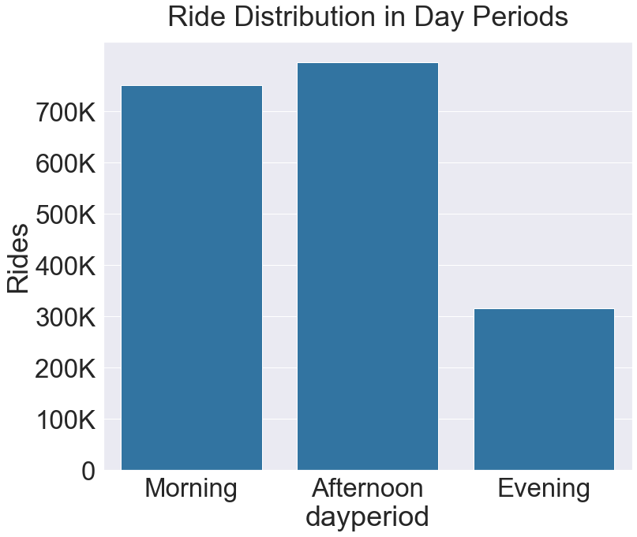
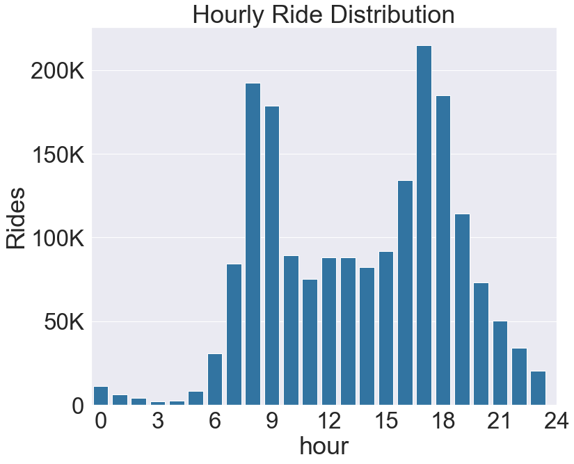
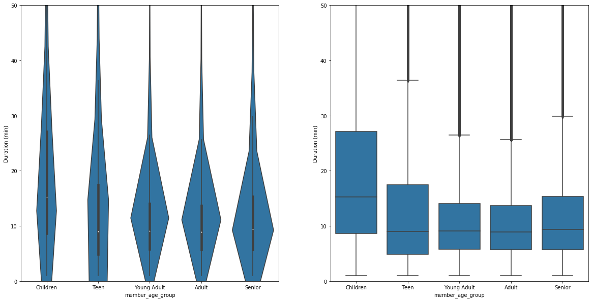
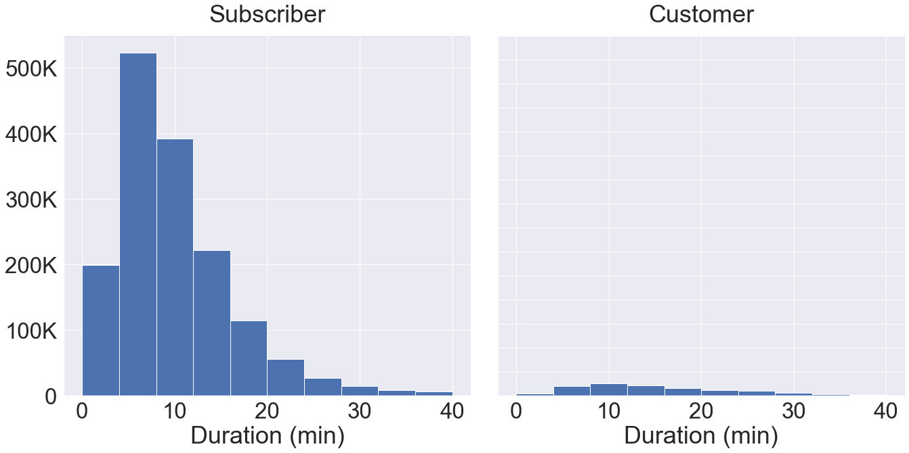

#                                   BayWheel Bike Data Visualziation

Welcome to Baywheel's bike visualization! Here we have a dataset from Lyft showcasing the useage of shared bike in the Bay area in 2018. We want to figure out the basic demography of the users as well as its relationship with trip duration. In addition, we want to derive some time-based visualizations illustrating when people like to bike based on time in a day, days in a week, and months in a year. Lastly, we want to explore where exactly people like to bike in the Bay - thus we've dived deep and done some hardcore work in transforming original dataset into geojson data, setting up the schema grouped by zip, and finally visualizing the trip frequencies on a Bay area map. 


```python
import pandas as pd
import numpy as np
import matplotlib.pyplot as plt
import seaborn as sb
import math
import datetime
import json
%matplotlib inline
```


```python
import os
import conda
import folium
import re
from pygeocoder import Geocoder

# load the libraries for map visualization
conda_file_dir = conda.__file__
conda_dir = conda_file_dir.split('lib')[0]
proj_lib = os.path.join(os.path.join(conda_dir, 'share'), 'proj')
os.environ["PROJ_LIB"] = proj_lib
```

## Data Extraction


```python
# import all the csv files from Lyft's website 
files = ['201801-fordgobike-tripdata.csv', '201802-fordgobike-tripdata.csv',
        '201803-fordgobike-tripdata.csv','201804-fordgobike-tripdata.csv',
        '201805-fordgobike-tripdata.csv','201806-fordgobike-tripdata.csv',
        '201807-fordgobike-tripdata.csv','201808-fordgobike-tripdata.csv',
        '201809-fordgobike-tripdata.csv','201810-fordgobike-tripdata.csv',
        '201811-fordgobike-tripdata.csv','201812-fordgobike-tripdata.csv']
```


```python
# loop through the file directory, append each file to the dataframe then reset the index 
df = pd.DataFrame()
for file in files:
    if df.empty:
        df = pd.read_csv(file)
    else:
        new_df = pd.read_csv(file)
        df = pd.concat([df, new_df], ignore_index=True)
df.reset_index()
```

## Data Exploration/Cleaning


```python
df.shape
```


    (1863721, 19)


```python
# check the fields of the dataframe
df.columns
```


```python
# derive the time duration in terms of minute and hour from duration_sec
df['duration_min'] = df['duration_sec'].apply(lambda d: d/60).astype(float)
df['duration_hr'] = df['duration_min'].apply(lambda d: d/60).astype(float)
```


```python
# round to 2 decimals 
df['duration_min'] = df['duration_min'].apply(lambda x: round(x, 2))
df['duration_hr'] = df['duration_hr'].apply(lambda x: round(x, 2))
```


```python
# derive the age from members' birth year
df['member_age'] = df['member_birth_year'].apply(lambda b:0 if pd.isnull(b) else 2019-b).astype(int)
```


```python
# make a copy of the data frame for further exploration
dfc = df.copy()
```


```python
# convert end_time column to datetime type
dfc['end_time'] = pd.to_datetime(dfc['end_time'])
```


```python
# extract month, date, day, and hour from the end_time column utilizing the datetime library
dfc['month'] = dfc['end_time'].apply(lambda time: time.strftime("%B"))
dfc['date'] = dfc['end_time'].apply(lambda time: time.strftime("%d"))
dfc['day'] = dfc['end_time'].apply(lambda time: time.strftime("%A"))
dfc['hour'] = dfc['end_time'].apply(lambda time: time.strftime("%H"))
```


```python
# assign a certain day to weekday/weekend
def assign_weektime(day):
    weekdays = ['Monday','Tuesday', 'Wednesday','Thursday','Friday']
    weekend = ['Saturday', 'Sunday']
    if day in weekdays:
        return "Weekday"
    else:
        return "Weekend"
```


```python
dfc['timeofweek'] = dfc['day'].apply(lambda day: assign_weektime(day))
```


```python
dfc['hour'] = dfc['hour'].astype(int)
```


```python
# assign a specific time period of the day (morning, afternoon, evening)
def assign_dayperiod(hour):
    if (hour >= 4 and hour <= 12):
        return "Morning"
    elif (hour > 12 and hour <= 18):
        return "Afternoon"
    else:
        return "Evening"
```


```python
dfc['dayperiod'] = dfc['hour'].apply(lambda hour: assign_dayperiod(hour))
```


```python
# assign age group to the users
def assign_agegroup(age):
    if (age >= 0 and age <=10):
        return "Children"
    elif (age > 10 and age <=20):
        return "Teen"
    elif (age > 20 and age <=35):
        return "Young Adult"
    elif (age > 35 and age <=55):
        return "Adult"
    else:
        return "Senior"
```


```python
dfc['member_age_group'] = dfc['member_age'].apply(lambda age: assign_agegroup(age))
```


```python
# test age group categorization 
dfc.member_age_group.value_counts()
```


    Young Adult    1003679
    Adult           628064
    Children        110718
    Senior          102522
    Teen             18738
    Name: member_age_group, dtype: int64


```python
# define the default color for module visualization 
base_color = sb.color_palette()[0]
```

### Average Trip Duration by Age Group


```python
age_order = ['Children', 'Teen', 'Young Adult', 'Adult', 'Senior']
age_range = [0, 10, 20, 35, 55, 120]
```


```python
dfc_byAge = dfc.loc[dfc.member_age != 0].reset_index()
```


```python
bin_idxs = pd.cut(dfc_byAge['member_age'], age_range, labels=age_order)
```

Last but not least, since a lot of the plots will have number of data rows (i.e., count of trips) as the y axis, let's develop a mechanism to display the trip counts in thousands (K) so it looks cleaner.


```python
def format_ride_count(count):
    if (count == 0):
        return "0"
    elif (len(str(count)) <=3):
        return str(count)
    else:
        return "{:,}".format(int(count/1000)) + "K"
```


```python
# test format function 
format_ride_count(3334334)
```


    '3,334K'


# Data Viualization

### Q1: When does people usually like to bike?

First of all, we'd like to figure out when people like to bike around in different metrics. That'd be useful to build a pattern that would help better distributing the bikes based on demand of different time periods.

We'll start off by weekday/weekend.


```python
plt.figure(figsize=[8,8])
timeofweek_counts = dfc.timeofweek.value_counts()
plt.pie(timeofweek_counts, labels=timeofweek_counts.index, startangle=90, autopct=lambda val: val.round(2));
plt.axis('square');
```


Apparently, the majority of the bikes ride on the weekday. Do they bike to commute or just for fun? Maybe taking a look at the day period (morning/afternoon/evening) distribution would help us determine.


```python
plt.figure(figsize = [12, 10])
dayperiod_order = ['Morning', 'Afternoon', 'Evening']
sb.countplot(data=dfc, x="dayperiod", color=base_color, order=dayperiod_order);
y_ticks_props = np.arange(0, dfc.groupby('dayperiod').bike_id.count().max()+1, 100000);
y_ticks_display = [ format_ride_count(numRide) for numRide in y_ticks_props]
plt.yticks(y_ticks_props, y_ticks_display);
plt.ylabel('Rides');
plt.title('Ride Distribution in Day Periods', pad=20);
```





Maybe they do bike for commuting as the majority of rides takes place during morning and afternoon. To confirm, let's dive deep and take a look at the hourly distribution.


```python
plt.figure(figsize = [12, 10])
hour_order = np.arange(0, 24, 1)
sb.countplot(data=dfc, x="hour", color=base_color, order=hour_order);
y_ticks_props = np.arange(0, dfc.groupby('hour').bike_id.count().max()+1, 50000);
y_ticks_display = [ format_ride_count(numRide) for numRide in y_ticks_props]
plt.xticks(np.arange(0, 24+1, 3), np.arange(0, 24+1, 3));
plt.yticks(y_ticks_props, y_ticks_display);
plt.ylabel('Rides');
plt.title('Hourly Ride Distribution');
```





It might actually be the case. As we can see from the bar chart, the peak traffic is around 7-9 (morning commute) and 16-18 (afternoon commute(). There's a consistent traffic in between the two peaks, and after 7pm traffic starts to go down.

Now let's examine the data set from the month's perspective. In which month do people bike the most? Let's find out by building a barplot based on month.


```python
plt.figure(figsize = [10, 10])
month_order = ['January', 'February', 'March', 'April', 'May', 'June', 'July', 'August', 'September', 'October', 'November', 'December']
sb.countplot(data=dfc, y="month", color=base_color, order=month_order);
plt.xlabel('Rides');
plt.ylabel('Month');
x_ticks_props = np.arange(0, dfc.month.value_counts().max()+1, 50000);
x_ticks_display = [ format_ride_count(numRide) for numRide in x_ticks_props]
plt.xticks(x_ticks_props, x_ticks_display);
plt.title('Monthly Ride Distribution');
```


To better display the month labels, I've set the barplot to be horizontal. Here we could see that apparently people like to bike in summer and fall - especially in the months from May to October. It makes sense because the weather during that those seasons are more ideal for biking.

Now that we've examined the data from a chronological standpoint, let's switch gears and try to play around with demographic attributes. Nos vamos!

### Q2: Who likes to ride a bike the most?

We would like to start off with some usual univariate analysis. Let's take a look at the age group - do older people prefer to bike than the younger people? 


```python
plt.figure(figsize = [10, 10])
age_order = ['Children', 'Teen', 'Young Adult', 'Adult', 'Senior']
sb.countplot(data=dfc, y="member_age_group", color=base_color, order=age_order);
x_ticks_props_age = np.arange(0, dfc['member_age_group'].value_counts().max()+1, 250000);
x_ticks_display_age = [ format_ride_count(numRide) for numRide in x_ticks_props_age]
plt.xticks(x_ticks_props_age, x_ticks_display_age);
plt.xlabel('Rides');
plt.ylabel('Age Group');
plt.title('Ride Distribution among Age Aroups');
x_ticks_display_age
```


    ['0', '250K', '500K', '750K', '1,000K']


This categorization might be a bit general. What if we break down the age by range of 10?


```python
bin_edges = np.arange(0, dfc.member_age.max(), 10)
dfc['age_by_10'] = pd.cut(dfc.member_age, bin_edges, right=False)
```


```python
# todo: convert xtick label to "start_age - end_age", e.g., 10-20 instead of [10, 20]
plt.figure(figsize=[15,10])
sb.countplot(data=dfc, y="age_by_10", color=base_color);
x_ticks_props = np.arange(0, dfc['age_by_10'].value_counts().max()+1, 100000);
x_ticks_display = [ format_ride_count(numRide) for numRide in x_ticks_props]
plt.xticks(x_ticks_props, x_ticks_display);
plt.xlabel('Rides');
plt.ylabel('Age');
plt.title('Ride Distribution among Age Aroups, range of 10');
```


As we could see from above, most riders fall into the range of 20-50, which makes sense. Let's now try a bivariate visualization. What's the relationship between trip duration and age group? For the sake of simplicity, we'll use the duration in minute as our metric.


```python
plt.figure(figsize = [20, 10])
plt.subplot(1, 2, 1)
ax1 = sb.violinplot(data=dfc, x="member_age_group", y="duration_min", color=base_color, order=age_order)
plt.ylim(0, 50);
plt.ylabel("Duration (min)")

plt.subplot(1, 2, 2)
ax2 = sb.boxplot(data=dfc, x="member_age_group", y="duration_min", color=base_color, order=age_order)
plt.ylabel("Duration (min)");
plt.ylim(0, 50);
```





As we could see, surprisingly children seem to have the longest duration. However as we recall for a lot the records that don't have a birth year, we simply assign their age to be 0. Let's clean it up and run the plots again. 


```python
dfc.query('member_age == 0').count()['bike_id']
```


    110718


```python
dfc_by_age = dfc.loc[dfc.member_age != 0]
```


```python
dfc_by_age.member_age_group.value_counts()
```


    Young Adult    1003679
    Adult           628064
    Senior          102522
    Teen             18738
    Name: member_age_group, dtype: int64


```python
plt.figure(figsize = [20, 10])
plt.subplot(1, 2, 1)
ax1 = sb.violinplot(data=dfc_by_age, x="member_age_group", y="duration_min", color=base_color, order=age_order[1:])
plt.ylim(0, 50);
plt.xlabel("Age Group", fontsize='xx-small');
plt.ylabel("Duration (min)")

plt.subplot(1, 2, 2)
ax2 = sb.boxplot(data=dfc_by_age, x="member_age_group", y="duration_min", color=base_color, order=age_order[1:])
plt.xlabel("Age Group", fontsize='xx-small');
plt.ylabel("Duration (min)");
plt.ylim(0, 50);
```


Hmm, that makes a difference. Now the children group is completely gone - and teens take the lead among all age groups. Surprisingly, the seniors come nextm trailing by a small margin.

Next, let's examine the distribution between user types (subscriber/customer)


```python
g = sb.FacetGrid(data=dfc, col="user_type");
sb.set(font_scale = 3)
g.fig.set_size_inches(20,10)
g.map(plt.hist, "duration_min", range=[0,40]);
g.set_titles('{col_name}', pad=20);
for ax in g.axes.flatten():
    ax.set_xlabel('Duration (min)');
y_ticks_props = np.arange(0, dfc.user_type.value_counts().max()+1, 100000);
y_ticks_display = [ format_ride_count(numRide) for numRide in y_ticks_props]
plt.yticks(y_ticks_props, y_ticks_display);
```





As we could see, the majority of users are subscribers while just a small portion of users are occasional customers. For both groups, most data points fall into the range of 0-20 minutes. Nevertheless, the spread of subscribers is much greater than the customers, which is comparatively more even-out. For subscribers, the bulk of the data points of subscribers fall in 5-15 minutes.

### Q3: How about taking both time and age into consideration in terms of the trip duration?

Let's try to draw a clustered bar plot to illustrate the impacts of day period (morning/afternoon/evening) and age on average trip duration.


```python
plt.figure(figsize = [24, 10])
ax = sb.barplot(data=dfc_by_age, x="member_age_group", y="duration_min", hue="dayperiod", order=age_order, palette="BuGn_r");
ax.legend(loc=3, framealpha=0.8)
plt.title("Relationship between Trip Duration and Daytime, Age", pad=20);
plt.xlabel("Age Group");
plt.ylabel("Trip Duration");
```


We could also examine the relationship from a hourly perspective. Here we will draw a line chart of different age group's ride count in 24 hours.


```python
plt.figure(figsize = [15, 20])
dfc_by_age_sample = dfc_by_age.groupby(['member_age_group', 'hour']).bike_id.count().reset_index()
sb.lineplot(data=dfc_by_age_sample, x="hour", y="bike_id", hue="member_age_group")
y_ticks_props = np.arange(0, dfc_by_age.groupby(['member_age_group', 'hour']).bike_id.count().max()+1, 20000);
y_ticks_display = [format_ride_count(numRide) for numRide in y_ticks_props]
plt.yticks(y_ticks_props, y_ticks_display);
plt.ylabel("Rides");
plt.legend(loc=2, fontsize='xx-small');
```


    <matplotlib.legend.Legend at 0x1a40b75c18>


Here, let's do the same but this time using histogram. For a better look, we'll remove the fillings of the bins and only leave the borders so it's easier to trace the trends.


```python
#todo: change the y_tick_props so that it's not hard-coded 
g = sb.FacetGrid(data=dfc_by_age, hue="member_age_group", height=12);
g.map(plt.hist, "hour", histtype="step");
plt.legend(fontsize='xx-small', loc=2);
plt.xticks(np.arange(0, 24+1, 3));
plt.ylabel("Number of Rides");
y_ticks_props = np.arange(0, 250000, 50000);
y_ticks_display = [ format_ride_count(numRide) for numRide in y_ticks_props]
plt.yticks(y_ticks_props, y_ticks_display);
```


Wonderful! So through the line plot as well as the pseudo-histogram we can see that almost all the age groups share the same pattern in terms of hourly rides, with two peaks in the morning and late afternoon/early evening. For teens, the pattern is not so obvious but that's also because the sample size is smaller compared to the other groups.

### Q4: In which area does people bike the most?

Notice that this visualization is more like a proof-of-concept experimentation. We wanted to figure out where (here we're primarily curious about the zip) people like to bike. We'll use Google's Geocoding API for computing the zip based on the latitude and longtitude extracted from a small sample of the dataframe (it's not feasible to do all of them because the Geocoding API is costly beyond a certain threshold), then visualize it on a map illustrating the most popular areas where people like to bike. For the sake of simplicity, we'll just use the start location's data for this analysis and visualization, but we can always dive deeper further onwards.


```python
# load the API credential from env
%reload_ext dotenv
%dotenv
```


```python
# sample a selection of the original dataset for the proof-of-concept illustration
dfc_geo = dfc.sample(1500).reset_index()
```


```python
API_KEY = os.getenv("GEO_API_KEY")
```


```python
# IMPORTANT: Please do not run the commented code. This is just to show how I extracted the zip data using Google's GeoCoder API.
# However, the plan has a quota limit and might not go beyond a certain threshod. Please only run the read_csv command
# to read the pre-complied data


# for index, row in dfc_geo.iterrows():
#     try:
#         lat, lon = dfc_geo.loc[index, ['start_station_latitude', 'start_station_longitude']]
#         start_loc = Geocoder(API_KEY).reverse_geocode(lat, lon)
#         start_loc_zip = start_loc.postal_code
#         dfc_geo.loc[index, 'zip'] = start_loc_zip
#     except Exception as e:
#         print('failed: index ', index, ' message: ', str(e))
#         continue

dfc_geo = pd.read_csv('geo_results.csv')
```


```python
# get a list of unique zips from the data frame for querying in the geojson data later 
ziplist = dfc_geo.zip.unique()
```


```python
# save the dataframe to CSV just in case 
# dfc_geo.to_csv('geo_results.csv', index=False)
```


```python
# group trips by zip
dfc_geo_zip = dfc_geo.groupby('zip').bike_id.count().reset_index()
```


```python
# rename the bike_id to count 
dfc_geo_zip.rename(columns={"bike_id": "count"}, inplace=True)
```


```python
# load GeoJSON
with open('sf_zip_geojson.json', 'r') as jsonFile:
    geo_data = json.load(jsonFile) 
tmp = geo_data
```

So here we have a problem. I'm not able to find any GeoJson data with zipcode property from the Internet, and the only one I could find is a [link](https://data.sfgov.org/Geographic-Locations-and-Boundaries/Bay-Area-ZIP-Codes/u5j3-svi6) of Bay area's zipcode shape file from the City of San Francisco's [website](https://datasf.org).

However, I'm still going to take advantage of this dataset and do some dirty manual wrangling work to transform this JSON file into a dataset in standard [GeoJson format](https://geojson.org). We'll then use a Python library called Folium to draw the map and visualize the cleaned data on the map.


```python
# define a function to load the default GeoJson template as a Python dictionary
def create_feature_template(zip):
    feature = {
        "type": "Feature",
        "id": zip,
        "properties": {
            "zip": zip
          },
        "geometry": {
            "type": "Polygon",
            "coordinates": ""
        }
    }
    return feature
```


```python
# wrangle the data to reformat the way coordinates are organized 
def wrangle_coordinates(polygon):
    # remove the opening/closing parentheses
    polygon = polygon[2:-2]
    
    # initialize the containers
    coordinates_container = []
    coordinates = []
   # break the set of coordinates into individual pairs of coordinates
    pre_coordinates = polygon.split(',')
    
    # loop through each pair of coordinates
    for pre_coordinate in pre_coordinates:
        # a container to house the cleaned coordinates
        coordinate = []
         # break the coordinate into latitude and longitude 
        cors = pre_coordinate.strip().split(' ')
        # convert the coordinate string to float then append to the container 
        coordinate.append(float(cors[0]))
        coordinate.append(float(cors[1]))
        coordinates.append(coordinate)
    coordinates_container.append(coordinates)
    return coordinates_container
```


```python
# this function is to populate the feature template depending on the shape 
# here we have polygon or multipolygon, so we'll handle them accordingly
def populate_feature(shape, zip):
    # load a default feature template 
    new_feature = create_feature_template(zip)
    # find all matching shapes
    res = re.findall(r'\(\([^()]*\)\)', shape)
    # find the length of shape and determine its shape
    num_shapes = len(res)
    if (num_shapes == 1):
        # polygon
        container = wrangle_coordinates(res[0])
        new_feature['geometry']['coordinates'] = container
    else:
        # multipolygon, have to create an additional outer container to house the arrays of coordinates
        new_feature['geometry']['type'] = 'MultiPolygon'
        coordinate_container_multipolygon = []
        for polygon in res:
            container = wrangle_coordinates(polygon)
            coordinate_container_multipolygon.append(container)
        new_feature['geometry']['coordinates'] = coordinate_container_multipolygon
    return new_feature
```


```python
# call the populate_feature to append the shapes to pre-defined features array
features = []
for row in tmp['data']:
    zip = row[-4]
    # filter out those shapes whose corresponding zip not in our dataset
    if (zip in ziplist):
        features.append(populate_feature(row[-5][14:-1], zip))
```


```python
# creating the outermost JSON object as the featureCollection
new_json = dict.fromkeys(['type','features'])
new_json['type'] = 'FeatureCollection'
new_json['features'] = features
# save updated featureCollection
open("sf_geojson_cleaned.json", "w").write(json.dumps(new_json, sort_keys=True, indent=4, separators=(',', ': ')));
```


    444699


```python
# todo: add the top 10 most popular stations on the map (as Markers)

# define the center of the map and zoom level, then create the map 
SF_COORDINATES = (37.80, -122.30)
map = folium.Map(location=SF_COORDINATES, zoom_start=12)

folium.Choropleth(
        # the cleaned data in GeoJson format
        geo_data="sf_geojson_cleaned.json",
        name='choropleth',
        # trips count grouped by zip
        data=dfc_geo_zip,
        # the foreign key and the column we're interested in
        columns=['zip', 'count'],
        # the Pandas dataframe relates to the GeoJson data's zip property
        key_on='feature.properties.zip',
        fill_color='YlGn',
        fill_opacity=0.6,
        line_opacity=0.2,
        legend_name='Trip Count'
).add_to(map)

# show the populated map 
display(map)
```


<div style="width:100%;"><div style="position:relative;width:100%;height:0;padding-bottom:60%;"><iframe src="data:text/html;charset=utf-8;base64,PCFET0NUWVBFIGh0bWw+CjxoZWFkPiAgICAKICAgIDxtZXRhIGh0dHAtZXF1aXY9ImNvbnRlbnQtdHlwZSIgY29udGVudD0idGV4dC9odG1sOyBjaGFyc2V0PVVURi04IiAvPgogICAgCiAgICAgICAgPHNjcmlwdD4KICAgICAgICAgICAgTF9OT19UT1VDSCA9IGZhbHNlOwogICAgICAgICAgICBMX0RJU0FCTEVfM0QgPSBmYWxzZTsKICAgICAgICA8L3NjcmlwdD4KICAgIAogICAgPHNjcmlwdCBzcmM9Imh0dHBzOi8vY2RuLmpzZGVsaXZyLm5ldC9ucG0vbGVhZmxldEAxLjUuMS9kaXN0L2xlYWZsZXQuanMiPjwvc2NyaXB0PgogICAgPHNjcmlwdCBzcmM9Imh0dHBzOi8vY29kZS5qcXVlcnkuY29tL2pxdWVyeS0xLjEyLjQubWluLmpzIj48L3NjcmlwdD4KICAgIDxzY3JpcHQgc3JjPSJodHRwczovL21heGNkbi5ib290c3RyYXBjZG4uY29tL2Jvb3RzdHJhcC8zLjIuMC9qcy9ib290c3RyYXAubWluLmpzIj48L3NjcmlwdD4KICAgIDxzY3JpcHQgc3JjPSJodHRwczovL2NkbmpzLmNsb3VkZmxhcmUuY29tL2FqYXgvbGlicy9MZWFmbGV0LmF3ZXNvbWUtbWFya2Vycy8yLjAuMi9sZWFmbGV0LmF3ZXNvbWUtbWFya2Vycy5qcyI+PC9zY3JpcHQ+CiAgICA8bGluayByZWw9InN0eWxlc2hlZXQiIGhyZWY9Imh0dHBzOi8vY2RuLmpzZGVsaXZyLm5ldC9ucG0vbGVhZmxldEAxLjUuMS9kaXN0L2xlYWZsZXQuY3NzIi8+CiAgICA8bGluayByZWw9InN0eWxlc2hlZXQiIGhyZWY9Imh0dHBzOi8vbWF4Y2RuLmJvb3RzdHJhcGNkbi5jb20vYm9vdHN0cmFwLzMuMi4wL2Nzcy9ib290c3RyYXAubWluLmNzcyIvPgogICAgPGxpbmsgcmVsPSJzdHlsZXNoZWV0IiBocmVmPSJodHRwczovL21heGNkbi5ib290c3RyYXBjZG4uY29tL2Jvb3RzdHJhcC8zLjIuMC9jc3MvYm9vdHN0cmFwLXRoZW1lLm1pbi5jc3MiLz4KICAgIDxsaW5rIHJlbD0ic3R5bGVzaGVldCIgaHJlZj0iaHR0cHM6Ly9tYXhjZG4uYm9vdHN0cmFwY2RuLmNvbS9mb250LWF3ZXNvbWUvNC42LjMvY3NzL2ZvbnQtYXdlc29tZS5taW4uY3NzIi8+CiAgICA8bGluayByZWw9InN0eWxlc2hlZXQiIGhyZWY9Imh0dHBzOi8vY2RuanMuY2xvdWRmbGFyZS5jb20vYWpheC9saWJzL0xlYWZsZXQuYXdlc29tZS1tYXJrZXJzLzIuMC4yL2xlYWZsZXQuYXdlc29tZS1tYXJrZXJzLmNzcyIvPgogICAgPGxpbmsgcmVsPSJzdHlsZXNoZWV0IiBocmVmPSJodHRwczovL3Jhd2Nkbi5naXRoYWNrLmNvbS9weXRob24tdmlzdWFsaXphdGlvbi9mb2xpdW0vbWFzdGVyL2ZvbGl1bS90ZW1wbGF0ZXMvbGVhZmxldC5hd2Vzb21lLnJvdGF0ZS5jc3MiLz4KICAgIDxzdHlsZT5odG1sLCBib2R5IHt3aWR0aDogMTAwJTtoZWlnaHQ6IDEwMCU7bWFyZ2luOiAwO3BhZGRpbmc6IDA7fTwvc3R5bGU+CiAgICA8c3R5bGU+I21hcCB7cG9zaXRpb246YWJzb2x1dGU7dG9wOjA7Ym90dG9tOjA7cmlnaHQ6MDtsZWZ0OjA7fTwvc3R5bGU+CiAgICAKICAgICAgICAgICAgPG1ldGEgbmFtZT0idmlld3BvcnQiIGNvbnRlbnQ9IndpZHRoPWRldmljZS13aWR0aCwKICAgICAgICAgICAgICAgIGluaXRpYWwtc2NhbGU9MS4wLCBtYXhpbXVtLXNjYWxlPTEuMCwgdXNlci1zY2FsYWJsZT1ubyIgLz4KICAgICAgICAgICAgPHN0eWxlPgogICAgICAgICAgICAgICAgI21hcF82MTE0YjdjMjc1MzE0NGMxOWM1NjZiYzFjYzZkMTlmNSB7CiAgICAgICAgICAgICAgICAgICAgcG9zaXRpb246IHJlbGF0aXZlOwogICAgICAgICAgICAgICAgICAgIHdpZHRoOiAxMDAuMCU7CiAgICAgICAgICAgICAgICAgICAgaGVpZ2h0OiAxMDAuMCU7CiAgICAgICAgICAgICAgICAgICAgbGVmdDogMC4wJTsKICAgICAgICAgICAgICAgICAgICB0b3A6IDAuMCU7CiAgICAgICAgICAgICAgICB9CiAgICAgICAgICAgIDwvc3R5bGU+CiAgICAgICAgCiAgICA8c2NyaXB0IHNyYz0iaHR0cHM6Ly9jZG5qcy5jbG91ZGZsYXJlLmNvbS9hamF4L2xpYnMvZDMvMy41LjUvZDMubWluLmpzIj48L3NjcmlwdD4KPC9oZWFkPgo8Ym9keT4gICAgCiAgICAKICAgICAgICAgICAgPGRpdiBjbGFzcz0iZm9saXVtLW1hcCIgaWQ9Im1hcF82MTE0YjdjMjc1MzE0NGMxOWM1NjZiYzFjYzZkMTlmNSIgPjwvZGl2PgogICAgICAgIAo8L2JvZHk+CjxzY3JpcHQ+ICAgIAogICAgCiAgICAgICAgICAgIHZhciBtYXBfNjExNGI3YzI3NTMxNDRjMTljNTY2YmMxY2M2ZDE5ZjUgPSBMLm1hcCgKICAgICAgICAgICAgICAgICJtYXBfNjExNGI3YzI3NTMxNDRjMTljNTY2YmMxY2M2ZDE5ZjUiLAogICAgICAgICAgICAgICAgewogICAgICAgICAgICAgICAgICAgIGNlbnRlcjogWzM3LjgsIC0xMjIuM10sCiAgICAgICAgICAgICAgICAgICAgY3JzOiBMLkNSUy5FUFNHMzg1NywKICAgICAgICAgICAgICAgICAgICB6b29tOiAxMiwKICAgICAgICAgICAgICAgICAgICB6b29tQ29udHJvbDogdHJ1ZSwKICAgICAgICAgICAgICAgICAgICBwcmVmZXJDYW52YXM6IGZhbHNlLAogICAgICAgICAgICAgICAgfQogICAgICAgICAgICApOwoKICAgICAgICAgICAgCgogICAgICAgIAogICAgCiAgICAgICAgICAgIHZhciB0aWxlX2xheWVyX2RkNjJkMzA5NTQ0MjQ0OTU4ZDQ3ZmExNTE2YjQzMTM3ID0gTC50aWxlTGF5ZXIoCiAgICAgICAgICAgICAgICAiaHR0cHM6Ly97c30udGlsZS5vcGVuc3RyZWV0bWFwLm9yZy97en0ve3h9L3t5fS5wbmciLAogICAgICAgICAgICAgICAgeyJhdHRyaWJ1dGlvbiI6ICJEYXRhIGJ5IFx1MDAyNmNvcHk7IFx1MDAzY2EgaHJlZj1cImh0dHA6Ly9vcGVuc3RyZWV0bWFwLm9yZ1wiXHUwMDNlT3BlblN0cmVldE1hcFx1MDAzYy9hXHUwMDNlLCB1bmRlciBcdTAwM2NhIGhyZWY9XCJodHRwOi8vd3d3Lm9wZW5zdHJlZXRtYXAub3JnL2NvcHlyaWdodFwiXHUwMDNlT0RiTFx1MDAzYy9hXHUwMDNlLiIsICJkZXRlY3RSZXRpbmEiOiBmYWxzZSwgIm1heE5hdGl2ZVpvb20iOiAxOCwgIm1heFpvb20iOiAxOCwgIm1pblpvb20iOiAwLCAibm9XcmFwIjogZmFsc2UsICJvcGFjaXR5IjogMSwgInN1YmRvbWFpbnMiOiAiYWJjIiwgInRtcyI6IGZhbHNlfQogICAgICAgICAgICApLmFkZFRvKG1hcF82MTE0YjdjMjc1MzE0NGMxOWM1NjZiYzFjYzZkMTlmNSk7CiAgICAgICAgCiAgICAKICAgICAgICAgICAgdmFyIGNob3JvcGxldGhfODMxNDM5NzA2ZTQyNDg5Zjg2OGMwYTlhZTkxMDNmZmIgPSBMLmZlYXR1cmVHcm91cCgKICAgICAgICAgICAgICAgIHt9CiAgICAgICAgICAgICkuYWRkVG8obWFwXzYxMTRiN2MyNzUzMTQ0YzE5YzU2NmJjMWNjNmQxOWY1KTsKICAgICAgICAKICAgIAogICAgICAgIGZ1bmN0aW9uIGdlb19qc29uXzUzNTAxYjBkMzcwNTQ4NmU5NTA3Njg1MGFhNWYxNzg3X3N0eWxlcihmZWF0dXJlKSB7CiAgICAgICAgICAgIHN3aXRjaChmZWF0dXJlLmlkKSB7CiAgICAgICAgICAgICAgICBjYXNlICI5NDEwMyI6IGNhc2UgIjk0MTA3IjogCiAgICAgICAgICAgICAgICAgICAgcmV0dXJuIHsiY29sb3IiOiAiYmxhY2siLCAiZmlsbENvbG9yIjogIiMwMDY4MzciLCAiZmlsbE9wYWNpdHkiOiAwLjYsICJvcGFjaXR5IjogMC4yLCAid2VpZ2h0IjogMX07CiAgICAgICAgICAgICAgICBjYXNlICI5NDEwNSI6IGNhc2UgIjk0MTEwIjogCiAgICAgICAgICAgICAgICAgICAgcmV0dXJuIHsiY29sb3IiOiAiYmxhY2siLCAiZmlsbENvbG9yIjogIiM3OGM2NzkiLCAiZmlsbE9wYWNpdHkiOiAwLjYsICJvcGFjaXR5IjogMC4yLCAid2VpZ2h0IjogMX07CiAgICAgICAgICAgICAgICBjYXNlICI5NDEwNCI6IGNhc2UgIjk0NzA0IjogY2FzZSAiOTQ2MDciOiBjYXNlICI5NDYxMiI6IGNhc2UgIjk0MTMzIjogY2FzZSAiOTQxMTciOiBjYXNlICI5NDExNCI6IAogICAgICAgICAgICAgICAgICAgIHJldHVybiB7ImNvbG9yIjogImJsYWNrIiwgImZpbGxDb2xvciI6ICIjZDlmMGEzIiwgImZpbGxPcGFjaXR5IjogMC42LCAib3BhY2l0eSI6IDAuMiwgIndlaWdodCI6IDF9OwogICAgICAgICAgICAgICAgY2FzZSAiOTQxMTEiOiAKICAgICAgICAgICAgICAgICAgICByZXR1cm4geyJjb2xvciI6ICJibGFjayIsICJmaWxsQ29sb3IiOiAiI2FkZGQ4ZSIsICJmaWxsT3BhY2l0eSI6IDAuNiwgIm9wYWNpdHkiOiAwLjIsICJ3ZWlnaHQiOiAxfTsKICAgICAgICAgICAgICAgIGNhc2UgIjk0MTAyIjogCiAgICAgICAgICAgICAgICAgICAgcmV0dXJuIHsiY29sb3IiOiAiYmxhY2siLCAiZmlsbENvbG9yIjogIiMzMWEzNTQiLCAiZmlsbE9wYWNpdHkiOiAwLjYsICJvcGFjaXR5IjogMC4yLCAid2VpZ2h0IjogMX07CiAgICAgICAgICAgICAgICBkZWZhdWx0OgogICAgICAgICAgICAgICAgICAgIHJldHVybiB7ImNvbG9yIjogImJsYWNrIiwgImZpbGxDb2xvciI6ICIjZmZmZmNjIiwgImZpbGxPcGFjaXR5IjogMC42LCAib3BhY2l0eSI6IDAuMiwgIndlaWdodCI6IDF9OwogICAgICAgICAgICB9CiAgICAgICAgfQogICAgICAgIGZ1bmN0aW9uIGdlb19qc29uXzUzNTAxYjBkMzcwNTQ4NmU5NTA3Njg1MGFhNWYxNzg3X29uRWFjaEZlYXR1cmUoZmVhdHVyZSwgbGF5ZXIpIHsKICAgICAgICAgICAgbGF5ZXIub24oewogICAgICAgICAgICAgICAgY2xpY2s6IGZ1bmN0aW9uKGUpIHsKICAgICAgICAgICAgICAgICAgICBtYXBfNjExNGI3YzI3NTMxNDRjMTljNTY2YmMxY2M2ZDE5ZjUuZml0Qm91bmRzKGUudGFyZ2V0LmdldEJvdW5kcygpKTsKICAgICAgICAgICAgICAgIH0KICAgICAgICAgICAgfSk7CiAgICAgICAgfTsKICAgICAgICB2YXIgZ2VvX2pzb25fNTM1MDFiMGQzNzA1NDg2ZTk1MDc2ODUwYWE1ZjE3ODcgPSBMLmdlb0pzb24obnVsbCwgewogICAgICAgICAgICAgICAgb25FYWNoRmVhdHVyZTogZ2VvX2pzb25fNTM1MDFiMGQzNzA1NDg2ZTk1MDc2ODUwYWE1ZjE3ODdfb25FYWNoRmVhdHVyZSwKICAgICAgICAgICAgCiAgICAgICAgICAgICAgICBzdHlsZTogZ2VvX2pzb25fNTM1MDFiMGQzNzA1NDg2ZTk1MDc2ODUwYWE1ZjE3ODdfc3R5bGVyLAogICAgICAgIH0pLmFkZFRvKGNob3JvcGxldGhfODMxNDM5NzA2ZTQyNDg5Zjg2OGMwYTlhZTkxMDNmZmIpOwogICAgICAgICAgICBnZW9fanNvbl81MzUwMWIwZDM3MDU0ODZlOTUwNzY4NTBhYTVmMTc4Ny5hZGREYXRhKHsiZmVhdHVyZXMiOiBbeyJnZW9tZXRyeSI6IHsiY29vcmRpbmF0ZXMiOiBbW1stMTIyLjQyNjQwOTAwMTc0OTkzLCAzNy43NjQ2NzM5OTg0MzI5Ml0sIFstMTIyLjQyNjUzMzAwMTIzNDIsIDM3Ljc2NjI5NDk5Nzk5NDk2XSwgWy0xMjIuNDI2Njc5MDAwMzgwMTgsIDM3Ljc2Nzg4NDk5OTkwODkyXSwgWy0xMjIuNDI2ODc0MDAyNjAzOTEsIDM3Ljc2OTIwODAwMDY3MDMxXSwgWy0xMjIuNDI2MjIzMDAyMjcyNzYsIDM3Ljc2OTY0OTAwMDcyNjM0Nl0sIFstMTIyLjQyNDg5NzAwMDg1MTY3LCAzNy43NzA3MTM5OTk5ODQ5N10sIFstMTIyLjQyNDA0NTAwMjA0NTk3LCAzNy43NzEzODI5OTkwNTMxN10sIFstMTIyLjQyMzg1NjAwMTIzMTksIDM3Ljc3MTU0OTk5OTU5MjEyXSwgWy0xMjIuNDIxOTQwMDAxMzQ4OTksIDM3Ljc3MzA2ODk5ODQ1NTg1NV0sIFstMTIyLjQyMDU3NTAwMTc3NDA3LCAzNy43NzQxODE5OTgzNjExMTVdLCBbLTEyMi40MTkyODAwMDMyMTA4MywgMzcuNzc1MTk0OTk4NjczNzU0XSwgWy0xMjIuNDE3NTU3MDAxODg5OTksIDM3Ljc3NjUzMTk5ODcyMzQxNF0sIFstMTIyLjQxNjI4ODAwMTgxNzA4LCAzNy43Nzc1NzQwMDAzODc1MV0sIFstMTIyLjQxNDc2OTAwMTMyMTQ3LCAzNy43Nzg3NDM5OTg4MTI2XSwgWy0xMjIuNDEyNTE2MDAwNTgyNzQsIDM3Ljc4MDUxNzAwMDU5NDI3XSwgWy0xMjIuNDEwNTU0MDAxNjgxOTQsIDM3Ljc4MjA1NTk5ODU4MzE1XSwgWy0xMjIuNDA4MDUyMDAzMTc5ODUsIDM3Ljc4NDAyNTk5ODQ0NTA5XSwgWy0xMjIuNDA3NTkzMDAxNjA1MTQsIDM3Ljc4NDM5OTk5OTQ1NDY1Nl0sIFstMTIyLjQwNjA3NTAwMjk3OTY2LCAzNy43ODU2MTQ5OTgzOTc0Ml0sIFstMTIyLjQwMzU1MTAwMTEyOTkzLCAzNy43ODc1NjU5OTk1NDMyOV0sIFstMTIyLjQwMjAyNjAwMTU3NzYsIDM3Ljc4NjI3MDAwMDA0NjQ2NF0sIFstMTIyLjQwMTQ4OTAwMTczNzk2LCAzNy43ODU4NjIwMDA2OTAwOF0sIFstMTIyLjM5OTk0MTAwMjYxNTk2LCAzNy43ODcwNjU5OTg4ODYyMDZdLCBbLTEyMi4zOTk0NjMwMDA2NDk4MywgMzcuNzg2Njg2OTk5MTIyMzk1XSwgWy0xMjIuNDAwMTI0MDAyNjAzOTMsIDM3Ljc4NjE5NTk5OTY0NjI4XSwgWy0xMjIuNDAwOTQxMDAwNTk0MTYsIDM3Ljc4NTQwNTk5ODI1NjY2XSwgWy0xMjIuMzk4OTQwMDAwNTQ2MjIsIDM3Ljc4MzgxMDAwMDQ3NTE3XSwgWy0xMjIuNDAwMzQ5MDAwNTgyMTcsIDM3Ljc4MjY2Nzk5ODg1MzZdLCBbLTEyMi40MDExOTQwMDI1NzM0OSwgMzcuNzgyMDQ0OTk5MTkxMV0sIFstMTIyLjQwMzQwOTAwMzAwMDczLCAzNy43ODAyODc5OTk2NTE4MjZdLCBbLTEyMi40MDU2MzQwMDMwNzA3NywgMzcuNzc4NTM4OTk5NjUxNjZdLCBbLTEyMi40MDI1MjUwMDI2NzQ1LCAzNy43NzYwNjAwMDA3Mzk5OV0sIFstMTIyLjM5OTQxODAwMjM5NzYxLCAzNy43NzM2MDk5OTk4NTcyXSwgWy0xMjIuNDAxNjUzMDAxNjgyMjIsIDM3Ljc3MTc5MDk5OTkzOTc0XSwgWy0xMjIuNDAzODYyMDAxMTA4OTUsIDM3Ljc3MDEwOTk5ODc5NzU0NF0sIFstMTIyLjQwMzQ5MDAwMDUxMjA4LCAzNy43Njk4MjgwMDAyOTc0NjZdLCBbLTEyMi40MDIxMDUwMDEyOTQ2MSwgMzcuNzY5OTEyMDAwMzY1NTQ0XSwgWy0xMjIuNDAyMDkxMDAzMDA2MTUsIDM3Ljc2OTcxNjAwMDE0ODkxXSwgWy0xMjIuNDAxNjg1MDAzMjY5MDQsIDM3Ljc2OTcyMDk5ODAzNjY1NF0sIFstMTIyLjQwMTk2NDAwMjQ1NzkzLCAzNy43Njg3MjcwMDA3NzYwNl0sIFstMTIyLjQwMTc2ODAwMDM4OTcsIDM3Ljc2NzM5NTAwMDY3NDk2Nl0sIFstMTIyLjQwMDkwNDAwMDc2NzEzLCAzNy43Njc0MjQ5OTg0ODc3M10sIFstMTIyLjM5OTgwMDAwMDgzNzE2LCAzNy43NjY4MDY5OTgxOTUwNl0sIFstMTIyLjM5OTY4ODAwMzA5NTQsIDM3Ljc2NTAwNTAwMDE3Nzc5NF0sIFstMTIyLjQwMjUzODAwMzEzMjUyLCAzNy43NjQ4Mjc5OTk2Njk2OV0sIFstMTIyLjQwNDUyODAwMDYwNTk5LCAzNy43NjQ2ODU5OTg0NjE4XSwgWy0xMjIuNDA1MTAzMDAyNDA2NywgMzcuNzY0NjQ2OTk5ODMzMDddLCBbLTEyMi40MDc0MjYwMDM3MzU4OSwgMzcuNzY0NTIzOTk5MTAxNzFdLCBbLTEyMi40MDc1NTAwMDMzNjEzNCwgMzcuNzY1Nzk4MDAwNDIzODZdLCBbLTEyMi40MTA0NTkwMDEwOTAwNSwgMzcuNzY1NjM5OTk5NDAyNjk0XSwgWy0xMjIuNDExNDU1MDAzMjA3MjQsIDM3Ljc2NTU3MDk5ODY0MDA0NF0sIFstMTIyLjQxNTMxNjAwMDcyMjc0LCAzNy43NjUzNTE5OTk1OTQzMTZdLCBbLTEyMi40MTk2NjAwMDM1MjgxOCwgMzcuNzY1MDkxOTk5NjAyMjFdLCBbLTEyMi40MjEyMzIwMDIzOTQ3NiwgMzcuNzY0OTY5OTk5MjcxOTc2XSwgWy0xMjIuNDIxMTQ4MDAwNzc1OSwgMzcuNzYzNzA4MDAwMTk0N10sIFstMTIyLjQyMTAzMTAwMTEzNTU2LCAzNy43NjMzNTAwMDAzNjE4M10sIFstMTIyLjQyMTc0MzAwMDcwMTcyLCAzNy43NjMzMTA5OTk1MDM2OTVdLCBbLTEyMi40MjE4OTgwMDE2NTAwNiwgMzcuNzY0OTQ4MDAwMTU3MDddLCBbLTEyMi40MjQxMDkwMDMyMDUxMiwgMzcuNzY0ODAzOTk5MzUyMzRdLCBbLTEyMi40MjY0MDkwMDE3NDk5MywgMzcuNzY0NjczOTk4NDMyOTJdXV0sICJ0eXBlIjogIlBvbHlnb24ifSwgImlkIjogIjk0MTAzIiwgInByb3BlcnRpZXMiOiB7InppcCI6ICI5NDEwMyJ9LCAidHlwZSI6ICJGZWF0dXJlIn0sIHsiZ2VvbWV0cnkiOiB7ImNvb3JkaW5hdGVzIjogW1tbLTEyMi40MTE5NTAwMDE4NzU5MSwgMzcuNzg4ODU3OTk4NTE1MzldLCBbLTEyMi40MTE4ODIwMDMzMzkyNiwgMzcuNzg4NTI4OTk4NjIzMjU2XSwgWy0xMjIuNDExNzU0MDAwNDQ4NTEsIDM3Ljc4NzkwNDk5OTk1OTYzNl0sIFstMTIyLjQxMzM4NDAwMDg3MjU4LCAzNy43ODc3MDI5OTk1ODYyMl0sIFstMTIyLjQxMzE5MDAwMjcxOTQzLCAzNy43ODY3NjY5OTkzNDQzMV0sIFstMTIyLjQxNDgzODAwMjUzNzk4LCAzNy43ODY1NTIwMDA0MTQzNV0sIFstMTIyLjQxNDUzMzAwMzY4NDA4LCAzNy43ODUwOTMwMDAxOTg1NF0sIFstMTIyLjQxNDQ0OTAwMTg0OTk2LCAzNy43ODQ2ODY5OTgzNzkxMV0sIFstMTIyLjQxNDI1OTAwMjc0NTk1LCAzNy43ODM3NTgwMDAxOTkxODVdLCBbLTEyMi40MTU5MjQwMDM1MDI1OCwgMzcuNzgzNTI2OTk5MTIwNTI1XSwgWy0xMjIuNDE3NTY0MDAwODE5MjQsIDM3Ljc4MzMxMjk5OTI2MTIzNF0sIFstMTIyLjQxOTIwMTAwMDgwOTAzLCAzNy43ODMxMTE5OTgwMjkxOV0sIFstMTIyLjQyMDg4NjAwMjU4NjI2LCAzNy43ODI5MDg5OTkyMDY2OF0sIFstMTIyLjQyNDEzNTAwMjQyMDQ2LCAzNy43ODI0ODk5OTg0OTUzNl0sIFstMTIyLjQyNzQyMTAwMzM4MjgsIDM3Ljc4MjA3NzAwMDExMDIyXSwgWy0xMjIuNDI3NjE2MDAyMzYzOTgsIDM3Ljc4MzAwMzk5OTU1OTVdLCBbLTEyMi40MjgwMDQwMDA5MTk2LCAzNy43ODQ4OTA5OTkyODM5NV0sIFstMTIyLjQyODAzNzAwMjY5NDk0LCAzNy43ODUwODI5OTg2NTUwOV0sIFstMTIyLjQyODE3ODAwMzA1MDQ1LCAzNy43ODU4MjAwMDA0OTg0Ml0sIFstMTIyLjQyODM2MzAwMDMxMjcxLCAzNy43ODY3NTIwMDAwNTQxNl0sIFstMTIyLjQyODU2MjAwMzY5MDE5LCAzNy43ODc2Nzg5OTk1NjYwN10sIFstMTIyLjQyODc2NDAwMTM2MzMzLCAzNy43ODg1OTQ5OTkyOTcyNDZdLCBbLTEyMi40MjkxNDMwMDIyNjg0OSwgMzcuNzkwNDgxOTk4MDQ2NDI0XSwgWy0xMjIuNDI5NTA4MDAyMzc2NjIsIDM3Ljc5MjI1NTk5OTEzMDk0NF0sIFstMTIyLjQyOTg4MDAwMDYxNTM2LCAzNy43OTQwMTYwMDAwODk4OV0sIFstMTIyLjQzMDA3ODAwMDI5NzMxLCAzNy43OTQ5NjA5OTgxNTk0MjVdLCBbLTEyMi40MjgzNzUwMDExMjY3OCwgMzcuNzk1MTUzOTk5Mzk5NzE2XSwgWy0xMjIuNDI2NzI0MDAwODc5MjUsIDM3Ljc5NTMzOTk5OTkxNzA3XSwgWy0xMjIuNDIzNDkwMDAwOTkwNCwgMzcuNzk1NzYxMDAwMTI4Nl0sIFstMTIyLjQyMzczNDAwMjM3OSwgMzcuNzk2NzE5MDAwNDIxNDldLCBbLTEyMi40MjM4OTgwMDMyMzYyNiwgMzcuNzk3NjUwOTk4MzkzNjNdLCBbLTEyMi40MjQyNzYwMDE4MDM2LCAzNy43OTk1MTYwMDAyNjM2NF0sIFstMTIyLjQyNDEyMDAwMTUsIDM3Ljc5OTUzOTAwMDY1MjkyXSwgWy0xMjIuNDI0MzA1MDAxMzA5NjksIDM3LjgwMDQzMzk5ODMwNDMxNF0sIFstMTIyLjQyNDQ0OTAwMTM1MzE4LCAzNy44MDA0MjgwMDAyMDgwODZdLCBbLTEyMi40MjQ2MTgwMDMwODc4NywgMzcuODAxMjcyOTk4NzE1ODY2XSwgWy0xMjIuNDI0OTg0MDAxNjk4OTksIDM3LjgwMzIxOTk5OTA1ODUyXSwgWy0xMjIuNDI1MTgxMDAzNDI1NDIsIDM3LjgwNDEzNjk5Nzk5NzMwNF0sIFstMTIyLjQyNTU2MjAwMTEzODY2LCAzNy44MDYwMDk5OTg3MzkxMl0sIFstMTIyLjQyNTM3NDAwMzcyOTEzLCAzNy44MDYxMDY5OTk2OTY1NzRdLCBbLTEyMi40MjYzNTIwMDA3Nzc0NywgMzcuODA3NTI3OTk5OTAwNjFdLCBbLTEyMi40MjQ3OTYwMDA0Mjk0LCAzNy44MDY2NTU5OTk4NDI3XSwgWy0xMjIuNDIzNDY2MDAyNzcxNzIsIDM3LjgwNjc1NTk5OTM3NTI2XSwgWy0xMjIuNDIxMzgxMDAyNjU4NjksIDM3LjgwODE4Nzk5OTg3MDExNF0sIFstMTIyLjQyMTA2NDAwMDU5ODc5LCAzNy44MDg3OTI5OTg4NzkzNzZdLCBbLTEyMi40MjI3NzgwMDM3NjEzOCwgMzcuODEwMjIwOTk4MDE3NDddLCBbLTEyMi40MjA5NjcwMDMwMjg3MSwgMzcuODA4OTg2OTk4NTM3NjM0XSwgWy0xMjIuNDIwNzYxMDAzMjQ4MTMsIDM3LjgwOTA2Mzk5ODk4NjU4XSwgWy0xMjIuNDIwNDQwMDAyMTMzNDUsIDM3LjgwOTA1MDAwMDY2MDE1XSwgWy0xMjIuNDIwNDI4MDAyMjMxMzYsIDM3LjgwODk4NzAwMDMxNjg3Nl0sIFstMTIyLjQyMDY4MjAwMTczOTkzLCAzNy44MDg5NzI5OTk1ODU5MDVdLCBbLTEyMi40MjA0MzIwMDA0MjI3NSwgMzcuODA4MzA4MDAwNzkyODJdLCBbLTEyMi40MTkyMDEwMDAzNzUzLCAzNy44MDg0NjI5OTgzMTMxNV0sIFstMTIyLjQxODYwMzAwMTg1NDk1LCAzNy44MDUwNjY5OTg3MTA2OV0sIFstMTIyLjQxODQxOTAwMDI5NzIyLCAzNy44MDQxMTc5OTk0NDI0MjVdLCBbLTEyMi40MTgyMDQwMDE1NzkzNSwgMzcuODAzMTU0OTk4MjM1NjM0XSwgWy0xMjIuNDE3ODgyMDAwOTM5MywgMzcuODAxNjg5MDAwMjYwMjVdLCBbLTEyMi40MTc4NjAwMDE5Mjk1NSwgMzcuODAxMzIzOTk5ODg4NDldLCBbLTEyMi40MTc0NjYwMDIyODMwOCwgMzcuNzk5NDI3OTk4NjUwMzFdLCBbLTEyMi40MTcyODEwMDI5OTIyNywgMzcuNzk4NTQzOTk4MDc3OTZdLCBbLTEyMi40MTU2MjYwMDMwOTc3OCwgMzcuNzk4NzM1OTk5MDUwOTA1XSwgWy0xMjIuNDE1NDIwMDAxNTM4ODMsIDM3Ljc5Nzc4OTAwMDU2MzM1XSwgWy0xMjIuNDE1MjAxMDAzNTI1MTMsIDM3Ljc5Njc5MTk5ODEwOTVdLCBbLTEyMi40MTUwNDkwMDIwNjc0NSwgMzcuNzk1OTE2OTk5MzIzNzVdLCBbLTEyMi40MTQ4ODMwMDE1OTYyNywgMzcuNzk1MDMwMDAwMjI0NTZdLCBbLTEyMi40MTQ3MDMwMDMxNjY2MiwgMzcuNzk0MTU2OTk5NzE5NzI1XSwgWy0xMjIuNDE0NTE1MDAyMzIyOCwgMzcuNzkzMjY5OTk5OTU2ODJdLCBbLTEyMi40MTQ0NDYwMDMxNjM5MywgMzcuNzkyODI3OTk4MzA3NDY2XSwgWy0xMjIuNDE0MzQ4MDAwNzE3MTcsIDM3Ljc5MjM4Njk5OTA5NjA1XSwgWy0xMjIuNDE0MTg3MDAxNzA5OCwgMzcuNzkxNDUzOTk4MDUzNTddLCBbLTEyMi40MTI1MDEwMDI0NjI1MiwgMzcuNzkxNjQwOTk4NTgxNTg1XSwgWy0xMjIuNDEyMzMzMDAyNDM0NjgsIDM3Ljc5MDcyNTk5ODQzNDU4XSwgWy0xMjIuNDEyMTM1MDAwNDA3MywgMzcuNzg5NzYyOTk5NzU4ODM1XSwgWy0xMjIuNDExOTUwMDAxODc1OTEsIDM3Ljc4ODg1Nzk5ODUxNTM5XV1dLCAidHlwZSI6ICJQb2x5Z29uIn0sICJpZCI6ICI5NDEwOSIsICJwcm9wZXJ0aWVzIjogeyJ6aXAiOiAiOTQxMDkifSwgInR5cGUiOiAiRmVhdHVyZSJ9LCB7Imdlb21ldHJ5IjogeyJjb29yZGluYXRlcyI6IFtbWy0xMjIuMTk0NTc2MDAxODMwMTcsIDM3Ljc3MzU0OTk5OTg0MzA4NF0sIFstMTIyLjE5NzI2OTAwMTM1MjU1LCAzNy43NzE2NjQ5OTg1NTQ2ODRdLCBbLTEyMi4xOTgzNTIwMDMwMzQ4MSwgMzcuNzcwOTE1OTk5MzI5NDJdLCBbLTEyMi4yMDM1OTUwMDMxMzQxLCAzNy43NjcxODkwMDA2NjgyOTZdLCBbLTEyMi4yMDQ5MjgwMDA3ODg2OCwgMzcuNzY3NzA4OTk5ODg3OF0sIFstMTIyLjIwNzg0MDAwMjYxMDIxLCAzNy43NjU2NDI5OTkyMzY0MV0sIFstMTIyLjIwOTQ1NzAwMDgzNjAzLCAzNy43NjQ0NDg5OTk3NDc1MV0sIFstMTIyLjIxMDc4NTAwMTc3NjA2LCAzNy43NjMyMDIwMDA1MDQ4OF0sIFstMTIyLjIxMzUxMjAwMzEzNDYyLCAzNy43NjUzMDU5OTkwNjA2ODZdLCBbLTEyMi4yMTUyMzkwMDExMDc5NiwgMzcuNzYyNjc1OTk5NzQ3MzldLCBbLTEyMi4yMTQ4NzMwMDEwNTUwMSwgMzcuNzYxNTIwOTk4NjU1NzldLCBbLTEyMi4yMTUwMzMwMDE0ODY0NSwgMzcuNzYxNDE2OTk4OTUzNzldLCBbLTEyMi4yMTcwODEwMDE1NjI2OSwgMzcuNzYwMjM3OTk4MzYxNTI1XSwgWy0xMjIuMjE3NDE2MDAyNDcwODMsIDM3Ljc2MDM5Nzk5OTgzNjUwNl0sIFstMTIyLjIxODc2MzAwMjc2Mzc1LCAzNy43NjAzMDE5OTkzNzg4MV0sIFstMTIyLjIyMTgxNTAwMTg3MjI5LCAzNy43NTg1Nzk5OTg4OTMwOV0sIFstMTIyLjIyMzA3MzAwMjcwNjUsIDM3Ljc1OTU4NTk5ODQyMzcyNF0sIFstMTIyLjIyMjk5MTAwMjk1MzAxLCAzNy43NjA0MTQ5OTg5MjU5NV0sIFstMTIyLjIyNDMxMzAwMjcwMjQ2LCAzNy43NjQ3NTAwMDAyNDQxMDZdLCBbLTEyMi4yMjY4MjkwMDE2NzQ1NiwgMzcuNzY3NzE1OTk5NzQ2MTZdLCBbLTEyMi4yMzI0ODQwMDM2NjY1LCAzNy43NzA1OTE5OTkzODUyM10sIFstMTIyLjIzNjIxNjAwMTI4NjIyLCAzNy43NzIxMjQ5OTk1NTA0MTRdLCBbLTEyMi4yMzU3NDYwMDM0NDg5LCAzNy43NzMyMzc5OTc5NjM5OTZdLCBbLTEyMi4yMzY4NDcwMDI4NTkwNSwgMzcuNzc3NTI5MDAwNzQzMzg1XSwgWy0xMjIuMjM2NzEzMDAwNzQ0MzMsIDM3Ljc3OTA1Mjk5ODA0NTYyXSwgWy0xMjIuMjM3NDE2MDAwOTUyMjIsIDM3Ljc4MjI0MTk5OTA2NjgwNV0sIFstMTIyLjIzNjI3MzAwMTkyMDc4LCAzNy43ODI5Mjc5OTk3MzQ2N10sIFstMTIyLjIzNTk5MDAwMzI2NzUsIDM3Ljc4MzM5NDAwMDM1NjMyNF0sIFstMTIyLjIzNTkzMzAwMDYwMTE4LCAzNy43ODM0NTM5OTk3OTQ5XSwgWy0xMjIuMjM1MzQzMDAyNjcxNzgsIDM3Ljc4NDA4Mjk5ODg0MDIyXSwgWy0xMjIuMjM0MDc4MDAwMjk4NzQsIDM3Ljc4NTIwNDk5OTA1MTk0XSwgWy0xMjIuMjMzNDA5MDAxMzQxNCwgMzcuNzg1NzEyMDAwMDEwMDNdLCBbLTEyMi4yMzI1MzcwMDIzODA4NywgMzcuNzg2NjA5OTk4NDk2Mzc0XSwgWy0xMjIuMjMxOTQ2MDAzODAyNzYsIDM3Ljc4Nzg5NTAwMDQ0OTQyNF0sIFstMTIyLjIzMTY5ODAwMTg2MjcxLCAzNy43ODg2OTA5OTg5MTg2OV0sIFstMTIyLjIzMDE3MjAwMzA5MDEsIDM3Ljc5MDI1NTk5OTQ2OTY0XSwgWy0xMjIuMjI4Mzk2MDAxODc1NDgsIDM3Ljc5MTM0MjAwMDMyNzE3XSwgWy0xMjIuMjI4MzM2MDAxMTE1MzIsIDM3Ljc5MTUyMjk5ODA1MDA3XSwgWy0xMjIuMjI3NjM5MDAxNzQxOTYsIDM3Ljc5MjI0MDk5OTY2MTA5XSwgWy0xMjIuMjI2Nzk1MDAxMDIwMTIsIDM3Ljc5MzQ0NjAwMDY1ODYyXSwgWy0xMjIuMjI2MDk5MDAzNzg4NzMsIDM3Ljc5NTQ3ODk5OTYzMTAyXSwgWy0xMjIuMjI0Nzk4MDAwODE2NDYsIDM3Ljc5NTIyMTk5ODc3MzQ2XSwgWy0xMjIuMjI0ODY5MDAzNTIwNDEsIDM3Ljc5NDE4Mzk5ODMwNzM2XSwgWy0xMjIuMjI0MzEwMDAzNjc2NzgsIDM3Ljc5NDYwNjk5ODk3Nzk1NV0sIFstMTIyLjIyMzE1NDAwMTU2NTcsIDM3Ljc5NDMzNTk5ODYzNzZdLCBbLTEyMi4yMjI3NjgwMDMyOTU5MywgMzcuNzk1Mjk3OTk4ODA1OTE0XSwgWy0xMjIuMjIwOTI5MDAyMTU1MjMsIDM3Ljc5NTA2OTk5OTQ4NzI4XSwgWy0xMjIuMjIwNDQ4MDAxODIyMTUsIDM3Ljc5NTAxNTAwMDYwMTI1XSwgWy0xMjIuMjIwODcyMDAyMDI0MDUsIDM3Ljc5NDA0OTk5ODMxNDE4XSwgWy0xMjIuMjE5NzI4MDAzNDgzMjcsIDM3Ljc5MzI0Mzk5OTQyMDA2XSwgWy0xMjIuMjE5MDc3MDAyNjA4ODQsIDM3Ljc5MzA0NjAwMDYzNTI2NV0sIFstMTIyLjIxODk3NjAwMTI4NjcsIDM3Ljc5MzI5OTAwMDEyNzQzXSwgWy0xMjIuMjE3MDAwMDAzNzEyOSwgMzcuNzkyODExOTk5MDI1NF0sIFstMTIyLjIxNDgwOTAwMzI2OTcsIDM3Ljc5MTc4Njk5OTAyOTE5XSwgWy0xMjIuMjExNTg4MDAwNjU5OSwgMzcuNzkwMjU3OTk5OTMzMjQ2XSwgWy0xMjIuMjExMDgwMDAzMDQyMDYsIDM3Ljc4OTY5NTk5ODA5MTU3NF0sIFstMTIyLjIwOTg0MzAwMTk3NjUyLCAzNy43ODgzMjM5OTgwOTcxMl0sIFstMTIyLjIxMDM2NjAwMDkxMTMyLCAzNy43ODgwMTI5OTk4MzA1Nl0sIFstMTIyLjIwOTE3MTAwMjg5MDQsIDM3Ljc4NjkyODAwMDQ4MDkyXSwgWy0xMjIuMjA3NDI0MDAzMTg4OTUsIDM3Ljc4NTM5ODk5ODEyMTIyNF0sIFstMTIyLjIwNTg5OTAwMTcxMzkzLCAzNy43ODQwNTQ5OTk1MjIyMl0sIFstMTIyLjIwMzU4NTAwMDk5MzM2LCAzNy43ODIwOTc5OTkxMDQwMV0sIFstMTIyLjIwMDUwMTAwMzEyMjUzLCAzNy43NzkyOTc5OTk3Njg0OV0sIFstMTIyLjIwMDA5NzAwMDU1MzcxLCAzNy43Nzg5MzU5OTk0Njc5NTRdLCBbLTEyMi4xOTg2MDEwMDA0NjIyNSwgMzcuNzc3MjU3OTk4NDg4OTRdLCBbLTEyMi4xOTQ1NzYwMDE4MzAxNywgMzcuNzczNTQ5OTk5ODQzMDg0XV1dLCAidHlwZSI6ICJQb2x5Z29uIn0sICJpZCI6ICI5NDYwMSIsICJwcm9wZXJ0aWVzIjogeyJ6aXAiOiAiOTQ2MDEifSwgInR5cGUiOiAiRmVhdHVyZSJ9LCB7Imdlb21ldHJ5IjogeyJjb29yZGluYXRlcyI6IFtbWy0xMjIuNDI4NTA4MDAwNDA3MSwgMzcuNzc5MDY0OTk5MjA1OTJdLCBbLTEyMi40Mjk5ODEwMDI3NTM3NiwgMzcuNzc4ODc4OTk4MTAxODRdLCBbLTEyMi40MzM0MjEwMDIwODA4OCwgMzcuNzc4NDQ0MDAwNTExMzVdLCBbLTEyMi40MzUwMzYwMDE2NzcyNSwgMzcuNzc4MjUwOTk5NTI5NDA1XSwgWy0xMjIuNDM2NzAyMDAzMjA1MzQsIDM3Ljc3ODAzMTk5OTk4NTE3NF0sIFstMTIyLjQzODM4MTAwMjE0NDY0LCAzNy43Nzc4MDc5OTgwNTI4ODZdLCBbLTEyMi40NDAwNDEwMDExMDQ5NCwgMzcuNzc3NjAwOTk4NjgzNTJdLCBbLTEyMi40NDE2NTEwMDM1MTI4NiwgMzcuNzc3NDA2MDAwMDI5MjZdLCBbLTEyMi40NDQ5NzEwMDEzNzI2NCwgMzcuNzc2OTU1OTk4NjMyNjhdLCBbLTEyMi40NDUzNTkwMDA5NzM2LCAzNy43Nzg4NjY5OTk5MTg3Ml0sIFstMTIyLjQ0NjE0OTAwMjc3NzI1LCAzNy43Nzg3NjA5OTkxNTc2M10sIFstMTIyLjQ0NjMxNDAwMjMwNDMyLCAzNy43Nzk5NjAwMDA1ODk2NzVdLCBbLTEyMi40NDU0NDAwMDEzNTMyMywgMzcuNzgwMTQxOTk5MzcyNDldLCBbLTEyMi40NDU1MzYwMDM3NzE2NSwgMzcuNzgxMzQwOTk3OTY3MDNdLCBbLTEyMi40NDc1NDkwMDM2NTU3NSwgMzcuNzgxMDc0OTk4MDAyOTZdLCBbLTEyMi40NDc0NDcwMDA0NzcyOCwgMzcuNzgyMjUzOTk4MTgyNjhdLCBbLTEyMi40NDczNjYwMDI4MjcyNywgMzcuNzgyNDI0MDAwNTMwOF0sIFstMTIyLjQ0NTgyMTAwMTMzOTAxLCAzNy43ODI1NzE5OTg0ODczODRdLCBbLTEyMi40NDU5MDMwMDEzNTg4MywgMzcuNzgyOTA1MDAwNjYyNjNdLCBbLTEyMi40NDY0MzgwMDE5NjEzNywgMzcuNzg1Mzg2OTk5MzEwNDVdLCBbLTEyMi40NDY2MjIwMDIzMTY0NiwgMzcuNzg2Mjc5MDAwMTY3NjVdLCBbLTEyMi40NDY5OTQwMDE3NzE2OSwgMzcuNzg4MTg5OTk5NzUzNjhdLCBbLTEyMi40NDczNDUwMDM3MzU5OSwgMzcuNzg5OTYxOTk4NzU0MDFdLCBbLTEyMi40NDc2ODMwMDE5MjkwMSwgMzcuNzkxNzUyOTk4MjQzODY1XSwgWy0xMjIuNDQ2MzAyMDAxNTQzODEsIDM3Ljc5MTkxMDk5ODQyNTkwNV0sIFstMTIyLjQ0NjQ0MTAwMTM2MzQ1LCAzNy43OTI4NDcwMDAzMzY2Nl0sIFstMTIyLjQ0MTUyMDAwMjM0OTUsIDM3Ljc5MzQ3MzAwMDcyNDU5XSwgWy0xMjIuNDQxNzExMDAzNzQzOCwgMzcuNzk0NDM2OTk5MzE2N10sIFstMTIyLjQ0MDk5ODAwMjc0NTI1LCAzNy43OTQ1MzA5OTk2NjQ2NjZdLCBbLTEyMi40NDA3ODEwMDI4NDE4NiwgMzcuNzk0MzY0MDAwNTA5NTZdLCBbLTEyMi40NDA2NjMwMDMwNzk5MywgMzcuNzkzNTk3MDAwNjkxMjRdLCBbLTEyMi40Mzk4MjkwMDIyNjg3NSwgMzcuNzkzNjkzOTk4MDgyOThdLCBbLTEyMi40MzY1NjMwMDIxMDAyNCwgMzcuNzk0MDg5MDAwNTgwMzE0XSwgWy0xMjIuNDM0ODkzMDAzNjYwMTgsIDM3Ljc5NDMzNDAwMDAyNzkzXSwgWy0xMjIuNDMzMzIwMDAxNzgxNTUsIDM3Ljc5NDU0Mzk5OTc1NjMzXSwgWy0xMjIuNDMxNjk1MDAxNjY3NzYsIDM3Ljc5NDc1Njk5ODg4MzQ4Nl0sIFstMTIyLjQzMDA3ODAwMDI5NzMxLCAzNy43OTQ5NjA5OTgxNTk0MjVdLCBbLTEyMi40Mjk4ODAwMDA2MTUzNiwgMzcuNzk0MDE2MDAwMDg5ODldLCBbLTEyMi40Mjk1MDgwMDIzNzY2MiwgMzcuNzkyMjU1OTk5MTMwOTQ0XSwgWy0xMjIuNDI5MTQzMDAyMjY4NDksIDM3Ljc5MDQ4MTk5ODA0NjQyNF0sIFstMTIyLjQyODc2NDAwMTM2MzMzLCAzNy43ODg1OTQ5OTkyOTcyNDZdLCBbLTEyMi40Mjg1NjIwMDM2OTAxOSwgMzcuNzg3Njc4OTk5NTY2MDddLCBbLTEyMi40MjgzNjMwMDAzMTI3MSwgMzcuNzg2NzUyMDAwMDU0MTZdLCBbLTEyMi40MjgxNzgwMDMwNTA0NSwgMzcuNzg1ODIwMDAwNDk4NDJdLCBbLTEyMi40MjgwMzcwMDI2OTQ5NCwgMzcuNzg1MDgyOTk4NjU1MDldLCBbLTEyMi40MjgwMDQwMDA5MTk2LCAzNy43ODQ4OTA5OTkyODM5NV0sIFstMTIyLjQyNzYxNjAwMjM2Mzk4LCAzNy43ODMwMDM5OTk1NTk1XSwgWy0xMjIuNDI3NDIxMDAzMzgyOCwgMzcuNzgyMDc3MDAwMTEwMjJdLCBbLTEyMi40MjcyMjcwMDMyMDMyNywgMzcuNzgxMTM4OTk5NzgyMzVdLCBbLTEyMi40MjY4NTcwMDMxODMxNiwgMzcuNzc5Mjg3OTk5NjQ1NTJdLCBbLTEyMi40Mjg1MDgwMDA0MDcxLCAzNy43NzkwNjQ5OTkyMDU5Ml1dXSwgInR5cGUiOiAiUG9seWdvbiJ9LCAiaWQiOiAiOTQxMTUiLCAicHJvcGVydGllcyI6IHsiemlwIjogIjk0MTE1In0sICJ0eXBlIjogIkZlYXR1cmUifSwgeyJnZW9tZXRyeSI6IHsiY29vcmRpbmF0ZXMiOiBbW1stMTIyLjQwMzU1MTAwMTEyOTkzLCAzNy43ODc1NjU5OTk1NDMyOV0sIFstMTIyLjQwMzQwMTAwMTQzOTYsIDM3Ljc4NzY4MjAwMDIxODddLCBbLTEyMi4zOTkxNTMwMDIxMTU0MywgMzcuNzkxMTEwMDAwMDg2MDNdLCBbLTEyMi4zOTgzMjUwMDMyODQ0NiwgMzcuNzkxODE3MDAwMjEyOTY2XSwgWy0xMjIuMzk3MjYzMDAzMDY1NDgsIDM3Ljc5MjYyNjAwMDA2MzZdLCBbLTEyMi4zOTYzMDkwMDIwMzg1OSwgMzcuNzkzNDIxMDAwNDQxNzU0XSwgWy0xMjIuMzk1NjE0MDAxMTA3MjksIDM3Ljc5MzkwNDAwMDE3ODI5NF0sIFstMTIyLjM5NDE5NjAwMzY0NDMsIDM3Ljc5NDkyODk5OTM0OTA1XSwgWy0xMjIuMzkyNTk0MDAxMDAwMDIsIDM3Ljc5MzY0MTk5ODI2ODcxXSwgWy0xMjIuMzkyMDIxMDAzNTQxMjUsIDM3Ljc5NDA2Mzk5OTY1Mzc5XSwgWy0xMjIuMzkxNzAxMDAyNjIwMzgsIDM3Ljc5NDExMjk5OTYwMzQ4XSwgWy0xMjIuMzkxOTgwMDAzNzY3NywgMzcuNzkzOTA2MDAwNjUxMl0sIFstMTIyLjM5MTYxNDAwMjE2NDU0LCAzNy43OTM1NzA5OTg3NjQxNV0sIFstMTIyLjM5MTcxNDAwMjUyNDY4LCAzNy43OTM0NTg5OTk5NDUyNDRdLCBbLTEyMi4zOTA4MDcwMDA2Njc0NCwgMzcuNzkyNjk2OTk5NDUwMzZdLCBbLTEyMi4zODg4OTUwMDA3MTI3OCwgMzcuNzkwOTQzOTk4NDI5ODc0XSwgWy0xMjIuMzg4NjE2MDAyNDUxODQsIDM3Ljc5MDM0Nzk5OTAxMzQ3XSwgWy0xMjIuMzg4MDc1MDAzNDcxNTYsIDM3Ljc5MDQ3NDk5ODIzMTc3XSwgWy0xMjIuMzg4Mzc1MDAzNTM5OTYsIDM3Ljc5MDMzNDAwMDM1NDUzNF0sIFstMTIyLjM4ODIyNTAwMDY5MTAyLCAzNy43OTAwMzE5OTk3NDY5NDRdLCBbLTEyMi4zODU4OTcwMDIzMzcwNSwgMzcuNzkwOTM4OTk5MDQwNV0sIFstMTIyLjM4NzU4OTAwMTYyMDkxLCAzNy43ODk4MzgwMDA3MjI2Nl0sIFstMTIyLjM4NzMxNTAwMDY0NDA3LCAzNy43ODkzNTIwMDA2NjgxOF0sIFstMTIyLjM4NTMwMzAwMDg5MTA0LCAzNy43ODk4Mzc5OTk0MTc2MTRdLCBbLTEyMi4zODUxMjAwMDE5ODA5MSwgMzcuNzg5MzEyOTk5NTg3ODZdLCBbLTEyMi4zODcxNzQwMDIxMjYzLCAzNy43ODg4MDY5OTkwMDIzMDRdLCBbLTEyMi4zODcwMzIwMDE5OTAwOCwgMzcuNzg4MjU0OTk4MDE1ODNdLCBbLTEyMi4zODUyNjEwMDM3OTY4NiwgMzcuNzg4NTM2OTk5MTQ5MzldLCBbLTEyMi4zODUxMzYwMDIwNDUzLCAzNy43ODgxNTU5OTkzNjc2N10sIFstMTIyLjM4NzM5MDAwMzAzMzMzLCAzNy43ODc3MzU5OTkzNzE0MV0sIFstMTIyLjM4NzQxNTAwMTYxOTk3LCAzNy43ODcyNjg5OTgwNDU4OTZdLCBbLTEyMi4zODQ1MDAwMDI5MDE2OSwgMzcuNzg3NDM3MDAwMzg2NjZdLCBbLTEyMi4zODQzNDIwMDA1MzY4NiwgMzcuNzg1NzI3OTk4MzA1MjM0XSwgWy0xMjIuMzg3NTc3MDAwMzg5NjQsIDM3Ljc4NTQ4NTAwMDExODA2NV0sIFstMTIyLjM4NzY1MDAwMjA3NjA3LCAzNy43ODQ5MjkwMDAzNTcwM10sIFstMTIyLjM4NTU0NjAwMTI5OTQ5LCAzNy43ODUwMDg5OTk5MjQ4NTVdLCBbLTEyMi4zODU1NTcwMDA2NTAzNCwgMzcuNzg0NjQ1OTk4ODYwMjNdLCBbLTEyMi4zODc2OTEwMDE0MzgyNCwgMzcuNzg0NDEyMDAwNjQ3NTRdLCBbLTEyMi4zODc3MjIwMDEwODU1OCwgMzcuNzgzOTI4MDAwNjIzMDddLCBbLTEyMi4zODUyNzEwMDMxNDQxNywgMzcuNzg0MDQ4OTk4MTU2Nzg0XSwgWy0xMjIuMzg1MjUwMDAzNjM2MTcsIDM3Ljc4Mzc5MDAwMDcwNTMxXSwgWy0xMjIuMzg1NzIwMDAyMzk2NDMsIDM3Ljc4Mzc3Mzk5ODEzOTU0XSwgWy0xMjIuMzg1NzMwMDAyMTczMzcsIDM3Ljc4MzU0MDAwMDI5NjI3XSwgWy0xMjIuMzg3NzMyMDAxODM2LCAzNy43ODMyODIwMDA1ODQ3MzRdLCBbLTEyMi4zODc3NzMwMDM4MTI4LCAzNy43ODI5MTA5OTk5NzMyXSwgWy0xMjIuMzg4MDY0MDAxMzExMDUsIDM3Ljc4MTc1Njk5OTkwMjMxXSwgWy0xMjIuMzg4MzY5MDAxMDQ2NTQsIDM3Ljc4MjU0MTk5OTczODU1XSwgWy0xMjIuMzg4MjQ1MDAwMzA2NjQsIDM3Ljc4NDIxMTk5ODQyMzgyXSwgWy0xMjIuMzg4MTc4MDAzMjY5OTMsIDM3Ljc4NTAxMzk5ODc4MDQzNV0sIFstMTIyLjM4OTY2OTAwMjU3NjM4LCAzNy43ODYyNTgwMDA0NTY2MDZdLCBbLTEyMi4zOTAzMjgwMDA2NTg2MywgMzcuNzg1NzY2MDAwMzg4NjddLCBbLTEyMi4zOTEzNDcwMDM3NDgxMiwgMzcuNzg0ODY2MDAwMDExMzRdLCBbLTEyMi4zOTE0MTAwMDIwMTY4LCAzNy43ODUxMDI5OTg5NDQ0NDZdLCBbLTEyMi4zOTE3OTMwMDIzNDQ3MSwgMzcuNzg1NDMzOTk4NzQ4NTddLCBbLTEyMi4zOTM0NDAwMDMzMTAyNywgMzcuNzg0NDY2OTk4Mjc0MV0sIFstMTIyLjM5NDM1NzAwMDk0MTk4LCAzNy43ODM3NTkwMDA0MDY1OV0sIFstMTIyLjM5NTE2MTAwMzQ3ODMyLCAzNy43ODQzNDQ5OTk2MDk1NV0sIFstMTIyLjM5NjczMTAwMTEwNjEyLCAzNy43ODU1NzE5OTkwNDk2OTRdLCBbLTEyMi4zOTc3OTYwMDI2Njc5MywgMzcuNzg0NzEzOTk4NzMwMjldLCBbLTEyMi4zOTg5NDAwMDA1NDYyMiwgMzcuNzgzODEwMDAwNDc1MTddLCBbLTEyMi40MDA5NDEwMDA1OTQxNiwgMzcuNzg1NDA1OTk4MjU2NjZdLCBbLTEyMi40MDAxMjQwMDI2MDM5MywgMzcuNzg2MTk1OTk5NjQ2MjhdLCBbLTEyMi4zOTk0NjMwMDA2NDk4MywgMzcuNzg2Njg2OTk5MTIyMzk1XSwgWy0xMjIuMzk5OTQxMDAyNjE1OTYsIDM3Ljc4NzA2NTk5ODg4NjIwNl0sIFstMTIyLjQwMTQ4OTAwMTczNzk2LCAzNy43ODU4NjIwMDA2OTAwOF0sIFstMTIyLjQwMjAyNjAwMTU3NzYsIDM3Ljc4NjI3MDAwMDA0NjQ2NF0sIFstMTIyLjQwMzU1MTAwMTEyOTkzLCAzNy43ODc1NjU5OTk1NDMyOV1dXSwgInR5cGUiOiAiUG9seWdvbiJ9LCAiaWQiOiAiOTQxMDUiLCAicHJvcGVydGllcyI6IHsiemlwIjogIjk0MTA1In0sICJ0eXBlIjogIkZlYXR1cmUifSwgeyJnZW9tZXRyeSI6IHsiY29vcmRpbmF0ZXMiOiBbW1stMTIyLjI2NjM5OTAwMjQxNDQ2LCAzNy44NzQxNTAwMDAyMjYzNjVdLCBbLTEyMi4yNjU0MzMwMDEzNTAwNiwgMzcuODc0MjcyOTk4NTA1NzJdLCBbLTEyMi4yNjM4MzIwMDM3NzYxMiwgMzcuODc0NjMzMDAwMTY0NzFdLCBbLTEyMi4yNjIxNTYwMDI1MDQ5NCwgMzcuODc0ODI1OTk4Nzc4ODFdLCBbLTEyMi4yNTczNTMwMDIyMjcyMiwgMzcuODc1NDEzMDAwMDMxNDVdLCBbLTEyMi4yNTU2MzAwMDI0OTkxMywgMzcuODc1NjU3MDAwMDY1N10sIFstMTIyLjI1NjQzNzAwMzM0MzE0LCAzNy44NzgzMjEwMDA0ODMwOF0sIFstMTIyLjI1NTUzOTAwMDgzNTM3LCAzNy44NzkzMzI5OTk5NDEyMzRdLCBbLTEyMi4yNTY0MzcwMDEyNDgzMiwgMzcuODc5ODM5MDAwMzM1MzRdLCBbLTEyMi4yNTE0MjUwMDE4NDM3NywgMzcuODgwMjY4OTk4OTUyMDRdLCBbLTEyMi4yNDkyNjQwMDI0ODM0LCAzNy44ODEzNTA5OTg5ODgwNF0sIFstMTIyLjI0Nzc1NTAwMTU2MjUyLCAzNy44ODA1NzQwMDAxNTUwOF0sIFstMTIyLjI0NTU2MDAwMjkxNDQzLCAzNy44ODA2Njc5OTkzMTgyODRdLCBbLTEyMi4yNDMwODgwMDIxMTk4MywgMzcuODc3NTcwMDAwNTkzOTddLCBbLTEyMi4yNDUwNzgwMDIwMDY3NCwgMzcuODc1MTIzMDAwNTg5OTZdLCBbLTEyMi4yNDQ3NDcwMDI5OTAxNSwgMzcuODY5NjQzMDAwMDMzXSwgWy0xMjIuMjQ2NzU1MDAwMzk1MjgsIDM3Ljg3MDY0NTk5ODY1MzgzNV0sIFstMTIyLjI1MDE0NjAwMTQ0NzIyLCAzNy44NjkzMTc5OTk0NDAxODVdLCBbLTEyMi4yNTIzNTIwMDI5OTE2LCAzNy44NjkxNzE5OTg0NzQyN10sIFstMTIyLjI1MjMxNzAwMjczMTIzLCAzNy44Njg2OTY5OTg2MjE5MzVdLCBbLTEyMi4yNTMzNTkwMDA3MDA5MywgMzcuODY4NDYwOTk4OTc3MzRdLCBbLTEyMi4yNTQzOTUwMDM3OTA5OSwgMzcuODY4Mzc2OTk4MzYzMzVdLCBbLTEyMi4yNTQ1MTYwMDIyNDY1OSwgMzcuODY5MzIyMDAwNTA0NDVdLCBbLTEyMi4yNTY5MjcwMDE5MDc4NywgMzcuODY5MDA0OTk5NDQyNzY1XSwgWy0xMjIuMjYxNDYyMDAyNjQ3NTUsIDM3Ljg2ODQzMzAwMDIxNjc3XSwgWy0xMjIuMjY2MDI5MDAxMTg5MDcsIDM3Ljg2NzgzNjk5ODcwNTI4XSwgWy0xMjIuMjY2Mjc3MDAxODk5NywgMzcuODY4OTE0MDAwNzYyNjJdLCBbLTEyMi4yNjU4ODMwMDEzODU4NiwgMzcuODY5Nzg5MDAwMzE4MjJdLCBbLTEyMi4yNjYwNzEwMDMxNDQ2OSwgMzcuODcxNDU4OTk4NDYzMjddLCBbLTEyMi4yNjYzOTkwMDI0MTQ0NiwgMzcuODc0MTUwMDAwMjI2MzY1XV1dLCAidHlwZSI6ICJQb2x5Z29uIn0sICJpZCI6ICI5NDcyMCIsICJwcm9wZXJ0aWVzIjogeyJ6aXAiOiAiOTQ3MjAifSwgInR5cGUiOiAiRmVhdHVyZSJ9LCB7Imdlb21ldHJ5IjogeyJjb29yZGluYXRlcyI6IFtbWy0xMjIuMzAxMDI5MDAxNjMyNzQsIDM3Ljg0NzM4NDk5OTY4OTMyNV0sIFstMTIyLjMwMDM4ODAwMTY5OTkzLCAzNy44NTAyNjA5OTk1NTk2Ml0sIFstMTIyLjMwMjE3MzAwMTYxMzE0LCAzNy44NTk0MzE5OTk0MjQxMjVdLCBbLTEyMi4zMDM5MzEwMDE4MDgzOCwgMzcuODYyODA1OTk4OTA1MjJdLCBbLTEyMi4zMDYwNDYwMDI2NTEwNCwgMzcuODYyOTIwOTk5NDcyMDJdLCBbLTEyMi4zMDU1ODIwMDEyNTIzMywgMzcuODYxNzk2OTk5ODMwOTZdLCBbLTEyMi4zMDU2ODQwMDI5MDMxNiwgMzcuODU5NzY4OTk4MzcxNzddLCBbLTEyMi4zMDcyNTkwMDI5MTYxOCwgMzcuODY0NTI5OTk5OTM5MTldLCBbLTEyMi4zMDY1MjcwMDM2NjEzNiwgMzcuODY1NjE5OTk4NjEyNDddLCBbLTEyMi4zMTExMDgwMDAzOTkxLCAzNy44NjQ3MDg5OTkwNTMyODVdLCBbLTEyMi4zMTEyNjcwMDEwNjcyNCwgMzcuODYzNjM0OTk5NDMwMTRdLCBbLTEyMi4zMTUzNTQwMDM1NDk2NywgMzcuODYyNjA4MDAwMjkxNTVdLCBbLTEyMi4zMTU2OTIwMDAzMTcxOCwgMzcuODU4OTQ1OTk5OTczMzddLCBbLTEyMi4zMTY4ODMwMDI1MDg3LCAzNy44NTk0NzAwMDAzOTc1ODZdLCBbLTEyMi4zMTc3MDIwMDA5MzY3NiwgMzcuODY2MDQxOTk5MjIzOTZdLCBbLTEyMi4zMTY3NDIwMDM0MjYxNCwgMzcuODY0MzY1OTk4MjMzMzldLCBbLTEyMi4zMTM3MzEwMDM2MzQ4MSwgMzcuODY0MzU2OTk4Mzk0ODNdLCBbLTEyMi4zMTIxMTkwMDA5NzA3NCwgMzcuODY1NDUzOTk4NjgxNzQ0XSwgWy0xMjIuMzExOTYzMDAxMDU4NjQsIDM3Ljg2NDY4OTk5ODA2MzgxXSwgWy0xMjIuMzEyMzA2MDAyMzYwNDQsIDM3Ljg2NjkxOTk5OTExNjI2XSwgWy0xMjIuMzEzNzc2MDAzMjU1MzgsIDM3Ljg2NzYzODk5ODUwNzMyNF0sIFstMTIyLjMxNDk3NzAwMzA1NjU1LCAzNy44Njg4NjA5OTg4ODUzOF0sIFstMTIyLjMxNzYyMzAwMjYwNTYsIDM3Ljg2ODY1Mjk5OTc0OTk1NV0sIFstMTIyLjMxODIxOTAwMjU1MDEsIDM3Ljg2NzIyOTAwMDE0MTg5XSwgWy0xMjIuMzI0Nzg3MDAwMzU2NzgsIDM3Ljg3NDM3NTAwMDI2MjU0XSwgWy0xMjIuMzE4ODczMDAxMjcyNzUsIDM3Ljg3NTg1Nzk5OTkzNzEyNV0sIFstMTIyLjMxMzY5MjAwMzI4NjYsIDM3Ljg2OTcyODk5ODQ3Nzg4XSwgWy0xMjIuMzA3NTAzMDAwNjY5NTQsIDM3Ljg3MDU0NTk5ODYwNzQyNl0sIFstMTIyLjMxMDU0ODAwMjMzNjE2LCAzNy44Nzc2MDY5OTk1MTQ0NV0sIFstMTIyLjMxMDEzMzAwMjc0NTY3LCAzNy44Nzc3NDQ5OTg4NDQ4MjVdLCBbLTEyMi4zMTE3NDYwMDEyMjMwMSwgMzcuODgwNDY5OTk5Mjk0MDldLCBbLTEyMi4zMTUyNDkwMDI4NzY3NywgMzcuODgzOTUxOTk4ODMxOTc1XSwgWy0xMjIuMzE2MTQ1MDAxMTUwODMsIDM3Ljg4NTMzODk5ODgxMDIxXSwgWy0xMjIuMzE1OTk5MDAyOTc3OTIsIDM3Ljg4NzIxMTk5Nzk2MTg0XSwgWy0xMjIuMzE3MDY5MDAwNjU0NjcsIDM3Ljg4OTA3Mjk5OTgzODE5XSwgWy0xMjIuMzIyNDg3MDAwNjYxNDcsIDM3Ljg4OTM5Mjk5OTI5ODM3XSwgWy0xMjIuMzIzOTkzMDAwOTI3NjIsIDM3Ljg4Nzg5Mzk5ODY0NjVdLCBbLTEyMi4zMjc1NDkwMDI1NzIzMywgMzcuODg4NjY3OTk4OTM5MjA1XSwgWy0xMjIuMzI3ODI0MDAxNTQ3MSwgMzcuODkxNDMzMDAwNjQ1MjVdLCBbLTEyMi4zMjc2OTUwMDI4MTg4LCAzNy44OTA4ODcwMDAzMjkxOV0sIFstMTIyLjMyNjAyNzAwMTE0NjQxLCAzNy44OTA3OTM5OTg0OTE1Ml0sIFstMTIyLjMyNTc1NDAwMTU2MDA2LCAzNy44OTIzMjYwMDA0MzgxN10sIFstMTIyLjMyNDI2MjAwMzI3Njc5LCAzNy44OTIzNjUwMDA2NDI5NTRdLCBbLTEyMi4zMjMxMzIwMDEyNDIwMiwgMzcuODkwMjgyOTk5ODk4OTNdLCBbLTEyMi4zMjA0NDgwMDM3NTgzOSwgMzcuODg5OTUyOTk4MTUyNTk0XSwgWy0xMjIuMzE2NDI3MDAzNDI0NTEsIDM3Ljg5MDk4Nzk5ODgzNTU2XSwgWy0xMjIuMzE2MjAwMDAzNTIzMjgsIDM3Ljg5MTU4MTk5Nzk1NDc1XSwgWy0xMjIuMzEzODM4MDAyOTkzNjIsIDM3Ljg5MTgyMzk5OTY0NDg3XSwgWy0xMjIuMzExNjE2MDAyOTc5MTEsIDM3Ljg4OTY2Nzk5ODMzODRdLCBbLTEyMi4zMTE0NzAwMDI4MzgzMywgMzcuODg5OTgxOTk5NjAyODldLCBbLTEyMi4zMTAwMzUwMDA1ODA3LCAzNy44ODg3NjE5OTk0NjYwOV0sIFstMTIyLjMwOTAyOTAwMzMzMTI2LCAzNy44OTAzMTk5OTg5MjkwMl0sIFstMTIyLjMxMDE1MTAwMzM5MDIsIDM3Ljg5NDUyMDAwMDU0Nzk1Nl0sIFstMTIyLjMxMjk4MTAwMzMxMTcsIDM3Ljg5NzMyNjAwMDUyNjYyNV0sIFstMTIyLjMxMTg2OTAwMzI1ODM1LCAzNy44OTcxMjQwMDAxMjk2NF0sIFstMTIyLjMwOTU1MDAwMjgyOTk1LCAzNy44OTc4OTg5OTgyMTYxNl0sIFstMTIyLjMwOTE5MjAwMjkwNTM2LCAzNy44OTc5NDI5OTgwNzk3Nl0sIFstMTIyLjMwNzE1NDAwMzE4MDEyLCAzNy44OTI4Njc5OTk4OTg0OF0sIFstMTIyLjMwNzI2MTAwMTE1NzA3LCAzNy44OTE3OTI5OTgyOTQ2OV0sIFstMTIyLjMwNzU3NDAwMjY4NywgMzcuODkwOTcyMDAwNTcyMjNdLCBbLTEyMi4zMDc4NTYwMDEwNDc1NywgMzcuODkwMzU5OTk5Njc2MzhdLCBbLTEyMi4zMDczMTYwMDExMjA2LCAzNy44ODg2NjcwMDA1MDczNl0sIFstMTIyLjMwNzEwNjAwMzc5NTQ1LCAzNy44ODc5NTM5OTk2OTc2Nl0sIFstMTIyLjMwNzE4NjAwMzMxMDE2LCAzNy44ODc1Nzg5OTk0NTI2OF0sIFstMTIyLjMwNjgwNDAwMDYzNzI5LCAzNy44ODcyODg5OTkwNTkzMTVdLCBbLTEyMi4zMDUzNDcwMDI5NDE1MywgMzcuODg3NTAwOTk4MjcxNTldLCBbLTEyMi4zMDA5MzYwMDEwMDE0LCAzNy44ODc2OTA5OTk1OTE4NF0sIFstMTIyLjMwMDMzNzAwMjQ2MzQxLCAzNy44ODU4MTMwMDA2Nzc4N10sIFstMTIyLjMwMjY3MzAwMjc4NzQzLCAzNy44ODU0MjM5OTg5MDg5Ml0sIFstMTIyLjMwMzI4MTAwMDkzMjgxLCAzNy44ODQ1ODE5OTk0NzUzXSwgWy0xMjIuMzAxNjc4MDAyOTI5MTgsIDM3Ljg4Mzk0MDk5ODc0ODExXSwgWy0xMjIuMjk5MzkyMDAyMjQ1MDksIDM3Ljg4Mjg3Nzk5ODU3Njk5NF0sIFstMTIyLjI5NzQxODAwMTE5MTc2LCAzNy44ODMxOTM5OTk2OTEyM10sIFstMTIyLjI5NzIzMDAwMzcyNzI2LCAzNy44ODI5MzU5OTk3MDM3OV0sIFstMTIyLjI5Njc2MTAwMDQ3MjE5LCAzNy44ODMwNTI5OTk5MzI1MjRdLCBbLTEyMi4yOTU5MzYwMDE1NTk0OCwgMzcuODgwNDcwMDAwNjUwMTFdLCBbLTEyMi4yOTUzNzQwMDEyODExMywgMzcuODc4NzI3MDAwNDI4NF0sIFstMTIyLjI5NDYxMTAwMzA2NDksIDM3Ljg3NjM2Mjk5OTM2MzY4NV0sIFstMTIyLjI5MzY1NjAwMTQ1ODQsIDM3Ljg3MzQzMTk5ODQ4MzU1NF0sIFstMTIyLjI5MzA3ODAwMTUyNTQzLCAzNy44NzE2OTA5OTg3MTEyM10sIFstMTIyLjI5MjY2NzAwMjM0MTEzLCAzNy44NzA0MzIwMDA1NjUwOV0sIFstMTIyLjI5MjI1NzAwMjc1ODUzLCAzNy44NjkxMzE5OTg4MDg5MjVdLCBbLTEyMi4yOTE4NTQwMDA3OTIxNywgMzcuODY3ODI1OTk5NDQ1NjZdLCBbLTEyMi4yOTEzNzMwMDA3Nzk4OCwgMzcuODY2MzU3OTk5NzkxNDRdLCBbLTEyMi4yOTA3OTIwMDMyNzA4OCwgMzcuODY0NjE0OTk5ODM4MzldLCBbLTEyMi4yODkxMTYwMDI5NTI5MiwgMzcuODU5MzI2MDAwMjI3Nzc1XSwgWy0xMjIuMjg4ODQ1MDAwNDQwMjUsIDM3Ljg1ODQ5NTAwMDQ1NzcyXSwgWy0xMjIuMjg3NTE4MDAzNDI1NjksIDM3Ljg1NDM3NDk5OTA3MDM4XSwgWy0xMjIuMjg3MDY1MDAyMDk2MTYsIDM3Ljg1Mjk3Mzk5OTgxMjE5XSwgWy0xMjIuMjg2Mjc1MDAzNjA0NTIsIDM3Ljg1MDQ5ODk5OTI1Mjk5XSwgWy0xMjIuMjk1MDA0MDAyODkzLCAzNy44NDg3MDE5OTgxOTMwMzZdLCBbLTEyMi4yOTUzMTUwMDA4NDUyNCwgMzcuODQ4Nzg0OTk4OTk4OV0sIFstMTIyLjI5Njg0ODAwMTgyNjcyLCAzNy44NDgyNjkwMDAwMDI0N10sIFstMTIyLjI5ODM0NjAwMzQ4NTcsIDM3Ljg0Njg2MzAwMDU4NjM5XSwgWy0xMjIuMjk4MTM5MDAxNDcxMTEsIDM3Ljg0NDk4NTk5ODUyMzExXSwgWy0xMjIuMjk5Mjg0MDAzNTUwNzcsIDM3Ljg0NjIzOTAwMDA3ODY1NF0sIFstMTIyLjMwMDg1ODAwMDk4MzEzLCAzNy44NDczNDM5OTgwMjQxN10sIFstMTIyLjMwMTAyOTAwMTYzMjc0LCAzNy44NDczODQ5OTk2ODkzMjVdXV0sICJ0eXBlIjogIlBvbHlnb24ifSwgImlkIjogIjk0NzEwIiwgInByb3BlcnRpZXMiOiB7InppcCI6ICI5NDcxMCJ9LCAidHlwZSI6ICJGZWF0dXJlIn0sIHsiZ2VvbWV0cnkiOiB7ImNvb3JkaW5hdGVzIjogW1tbLTEyMi40MDM0MDEwMDE0Mzk2LCAzNy43ODc2ODIwMDAyMTg3XSwgWy0xMjIuNDAzODY3MDAxMjc4NiwgMzcuNzg5ODY5MDAwNjMwNjVdLCBbLTEyMi40MDI5MDYwMDA3NTI3MSwgMzcuNzg5OTk2OTk4NjEwNTddLCBbLTEyMi40MDI1ODMwMDM0NDE1OSwgMzcuNzkwMDQwOTk5NzMyNzc0XSwgWy0xMjIuNDAyNzcwMDAwODgxMDgsIDM3Ljc5MDk2MDk5OTA4NTE1XSwgWy0xMjIuNDAzNjg4MDAzNTQ5OTMsIDM3Ljc5MDg0Nzk5OTg2MjEzXSwgWy0xMjIuNDAzODY3MDAxNjYxNiwgMzcuNzkxNzgzOTk5NTA1NjFdLCBbLTEyMi40MDQyNTAwMDEzNTY4MywgMzcuNzkxNzQxMDAwNTkzMDM1XSwgWy0xMjIuNDA0NDIzMDAxNzc2OTYsIDM3Ljc5MjcwODAwMDc0MTQ1Nl0sIFstMTIyLjQwMzcwMzAwMjM1OTU5LCAzNy43OTI3OTU5OTgxMTk3OV0sIFstMTIyLjQwMzg5ODAwMzMyOCwgMzcuNzkzNjk5MDAwNjU3NzI1XSwgWy0xMjIuNDAyOTQzMDAxMDE1NzQsIDM3Ljc5MzgxODk5OTk4NDgxNV0sIFstMTIyLjQwMTMxNjAwMzA2MTEzLCAzNy43OTQwMjQ5OTg2OTA3NF0sIFstMTIyLjQwMTIyNjAwMzUxMDM1LCAzNy43OTM2MDY5OTkxMzMxOTZdLCBbLTEyMi40MDAwMjAwMDMwOTY5NywgMzcuNzkzNzQ3OTk5NjMxNTM1XSwgWy0xMjIuMzk5OTM3MDAzMDYyMDgsIDM3Ljc5MzI3Mjk5OTkyMjUyXSwgWy0xMjIuMzk5NTU0MDAzNDk1MjgsIDM3Ljc5MTM2Njk5Nzk2MDldLCBbLTEyMi4zOTkxNTMwMDIxMTU0MywgMzcuNzkxMTEwMDAwMDg2MDNdLCBbLTEyMi40MDM0MDEwMDE0Mzk2LCAzNy43ODc2ODIwMDAyMTg3XV1dLCAidHlwZSI6ICJQb2x5Z29uIn0sICJpZCI6ICI5NDEwNCIsICJwcm9wZXJ0aWVzIjogeyJ6aXAiOiAiOTQxMDQifSwgInR5cGUiOiAiRmVhdHVyZSJ9LCB7Imdlb21ldHJ5IjogeyJjb29yZGluYXRlcyI6IFtbWy0xMjIuMjczMjc2MDAwNjU2NDcsIDM3Ljg3MzMzMDk5OTQyOTg5XSwgWy0xMjIuMjczMzYwMDAzNjU3MSwgMzcuODc0MTkzMDAwNjg0Ml0sIFstMTIyLjI3MzQzMTAwMTI3MjY0LCAzNy44NzUwNjg5OTkwNTUyMV0sIFstMTIyLjI3Mzg5NjAwMjE1NzQ3LCAzNy44Nzk2MjgwMDA1MjkyN10sIFstMTIyLjI3NDMxMzAwMjA5OTMsIDM3Ljg4MzI0Mjk5ODAzMzA0XSwgWy0xMjIuMjc0NTMzMDAzNzgzMjksIDM3Ljg4NDkyMTk5ODk0MDkyNV0sIFstMTIyLjI3Mjg4NTAwMDY0NzQ2LCAzNy44ODU2OTA5OTg4NjA4M10sIFstMTIyLjI3MjI4MjAwMTE3NDE1LCAzNy44ODUzODI5OTk0MjE0NDVdLCBbLTEyMi4yNzAwMDQwMDI4NjU2NSwgMzcuODg1NjE4OTk5ODUyOTZdLCBbLTEyMi4yNjc3MzIwMDM1MjQ4NiwgMzcuODg1OTI1MDAwNzUwMDhdLCBbLTEyMi4yNjY2MDYwMDA2NTExNCwgMzcuODg2MDcyMDAwMTg3NDI2XSwgWy0xMjIuMjY0MzkwMDAwOTExMDUsIDM3Ljg4NjM2OTAwMDY4ODUyNV0sIFstMTIyLjI2NDIxODAwMTUzNDYyLCAzNy44ODQ4ODY5OTk2MDUxNjVdLCBbLTEyMi4yNjUyNjQwMDI1MTk2NCwgMzcuODg0MzkxOTk4MDE0NDM2XSwgWy0xMjIuMjY0ODMyMDAyMzUyNDMsIDM3Ljg4MDc2ODk5ODM2MTk3XSwgWy0xMjIuMjY0NjE1MDAwNDk4ODksIDM3Ljg3ODk3MjAwMDMwNTU5XSwgWy0xMjIuMjYzNTA2MDAyNDY5NzQsIDM3Ljg3OTExMjk5OTQ5OTk5XSwgWy0xMjIuMjYyMDkzMDAyNTgxOSwgMzcuODc5Mjk5OTk5MjMxMzVdLCBbLTEyMi4yNTg4MjIwMDI5NzIwNCwgMzcuODc5NzQxMDAwMjk1NzFdLCBbLTEyMi4yNTc3NDcwMDE1MTc2MSwgMzcuODc5ODEzMDAwMTk3NTJdLCBbLTEyMi4yNTcxODUwMDM1ODQyNywgMzcuODc5NzAxMDAwMTgwNDZdLCBbLTEyMi4yNTcwNjQwMDM1Mjg1OCwgMzcuODc5NjEzOTk4ODg1OTVdLCBbLTEyMi4yNTY2MDMwMDEzNzg0MSwgMzcuODc5NzYyOTk4MzgwOTI2XSwgWy0xMjIuMjU2NDM3MDAxMjQ4MzIsIDM3Ljg3OTgzOTAwMDMzNTM0XSwgWy0xMjIuMjU1NTM5MDAwODM1MzcsIDM3Ljg3OTMzMjk5OTk0MTIzNF0sIFstMTIyLjI1NjQzNzAwMzM0MzE0LCAzNy44NzgzMjEwMDA0ODMwOF0sIFstMTIyLjI1NTYzMDAwMjQ5OTEzLCAzNy44NzU2NTcwMDAwNjU3XSwgWy0xMjIuMjU3MzUzMDAyMjI3MjIsIDM3Ljg3NTQxMzAwMDAzMTQ1XSwgWy0xMjIuMjYyMTU2MDAyNTA0OTQsIDM3Ljg3NDgyNTk5ODc3ODgxXSwgWy0xMjIuMjYzODMyMDAzNzc2MTIsIDM3Ljg3NDYzMzAwMDE2NDcxXSwgWy0xMjIuMjY1NDMzMDAxMzUwMDYsIDM3Ljg3NDI3Mjk5ODUwNTcyXSwgWy0xMjIuMjY2Mzk5MDAyNDE0NDYsIDM3Ljg3NDE1MDAwMDIyNjM2NV0sIFstMTIyLjI2ODYwNTAwMDkzMDQsIDM3Ljg3Mzg4NDAwMDIwMjQ3XSwgWy0xMjIuMjczMjAwMDAyNDkxOTMsIDM3Ljg3MzM1Mzk5ODU0MTY5NV0sIFstMTIyLjI3MzI3NjAwMDY1NjQ3LCAzNy44NzMzMzA5OTk0Mjk4OV1dXSwgInR5cGUiOiAiUG9seWdvbiJ9LCAiaWQiOiAiOTQ3MDkiLCAicHJvcGVydGllcyI6IHsiemlwIjogIjk0NzA5In0sICJ0eXBlIjogIkZlYXR1cmUifSwgeyJnZW9tZXRyeSI6IHsiY29vcmRpbmF0ZXMiOiBbW1stMTIyLjI4MzM3NTAwMjYyNDY4LCAzNy44ODA5NTY5OTk1NTM2XSwgWy0xMjIuMjgyMDIxMDAxMjY1MjgsIDM3Ljg4MTY1MTAwMDA1NTcwNV0sIFstMTIyLjI3Njc1MzAwMzYxOTE1LCAzNy44ODQyNjU5OTgyNDMzNjRdLCBbLTEyMi4yNzU2NjcwMDA0OTc1OSwgMzcuODg0ODIwOTk4ODgyMzFdLCBbLTEyMi4yNzQ5MzAwMDM4NzQ4NiwgMzcuODg1NDMyMDAwNzA0OThdLCBbLTEyMi4yNzQ1MzMwMDM3ODMyOSwgMzcuODg0OTIxOTk4OTQwOTI1XSwgWy0xMjIuMjc0MzEzMDAyMDk5MywgMzcuODgzMjQyOTk4MDMzMDRdLCBbLTEyMi4yNzM4OTYwMDIxNTc0NywgMzcuODc5NjI4MDAwNTI5MjddLCBbLTEyMi4yNzM0MzEwMDEyNzI2NCwgMzcuODc1MDY4OTk5MDU1MjFdLCBbLTEyMi4yNzMzNjAwMDM2NTcxLCAzNy44NzQxOTMwMDA2ODQyXSwgWy0xMjIuMjczMjc2MDAwNjU2NDcsIDM3Ljg3MzMzMDk5OTQyOTg5XSwgWy0xMjIuMjcyOTg3MDAwMjg4NDcsIDM3Ljg3MDU5NTk5ODczNzU5XSwgWy0xMjIuMjcyMTcxMDAxNDYyNTEsIDM3Ljg2MzM1NTk5ODk1MDM2XSwgWy0xMjIuMjcxNzY5MDAxNDY0MjUsIDM3Ljg1OTc1MTk5OTQ3ODZdLCBbLTEyMi4yNjk0MzQwMDEzMjU0NSwgMzcuODYwMDMzOTk4Nzc0MjNdLCBbLTEyMi4yNjkzMzgwMDM2MTc5LCAzNy44NTkxMzM5OTg4OTA4OV0sIFstMTIyLjI2NzU3ODAwMTQyNTA2LCAzNy44NTkzNDQ5OTk0NjU2MDVdLCBbLTEyMi4yNjY5MzUwMDExNDM2NSwgMzcuODU4NTIxMDAwMzYyNDFdLCBbLTEyMi4yNjY4MzUwMDMxMTQyNSwgMzcuODU3NjMzOTk5ODA2NzddLCBbLTEyMi4yNjY3MDgwMDEyMjYxLCAzNy44NTY3Mzg5OTg5MTA4OF0sIFstMTIyLjI2NjE0MzAwMjQyOTM3LCAzNy44NTIzODM5OTkxMjkxM10sIFstMTIyLjI2NjEyMjAwMDQ3ODc3LCAzNy44NTIyMjY5OTg1Njg2OV0sIFstMTIyLjI2Nzk2NjAwMzcwNjAxLCAzNy44NTE5MTM5OTg3NzY4Ml0sIFstMTIyLjI2ODg4NTAwMDk3NTYyLCAzNy44NTE1NzgwMDA0MjkwOV0sIFstMTIyLjI2ODY2MjAwMzIxNDAyLCAzNy44NTA0MTE5OTk4NzUwN10sIFstMTIyLjI2OTA4MTAwMjQzMzc0LCAzNy44NDk4ODI5OTkyMzc2NV0sIFstMTIyLjI2ODY3OTAwMjgyODg2LCAzNy44NDg4NzQ5OTk3MTg1OV0sIFstMTIyLjI2OTcxNDAwMzY4NjgxLCAzNy44NDg1Nzg5OTg4NzZdLCBbLTEyMi4yNjk4MjUwMDA1OTQzMSwgMzcuODQ4MDM1MDAwNzI5NzZdLCBbLTEyMi4yNjkzNjAwMDI4MjQ4MywgMzcuODQ2OTAyOTk4NzU1NDI1XSwgWy0xMjIuMjcxMDI4MDAxMzU3NywgMzcuODQ2NzM0OTk4MTIzOTddLCBbLTEyMi4yNzE3ODAwMDI5MDA4NCwgMzcuODQ3MTI3OTk4MDkyNDVdLCBbLTEyMi4yNzE4MTUwMDA5MjE1OCwgMzcuODQ3NTAxOTk5ODA1MTRdLCBbLTEyMi4yNzE4NTcwMDE4NTMyLCAzNy44NDcyNjY5OTk2MDcwNDRdLCBbLTEyMi4yNzI2MDUwMDI5Mjc3OSwgMzcuODQ2Njc0MDAwNDYzNTJdLCBbLTEyMi4yNzU0MTgwMDEzNTY4MywgMzcuODQ2MDc1OTk5NTUwODRdLCBbLTEyMi4yNzYxMTcwMDExNzQwNywgMzcuODQ1ODI2OTk4NjA2NjA0XSwgWy0xMjIuMjc2NzAwMDAzNDE4ODUsIDM3Ljg0Nzc3Njk5OTYyOTM3XSwgWy0xMjIuMjc4MDc0MDAyNTU0NjYsIDM3Ljg0NzcyODAwMDE4MjI4Nl0sIFstMTIyLjI3ODc5NzAwMjc4ODkyLCAzNy44NTA1NjIwMDA0MjQ3XSwgWy0xMjIuMjc5MDE5MDAyMjA2NzgsIDM3Ljg1MTUzMDk5OTMxMjc5XSwgWy0xMjIuMjc5Mzk5MDAxODAyNzYsIDM3Ljg1MzIzOTk5ODQwODg0XSwgWy0xMjIuMjc5NzU1MDAzNzM1OTYsIDM3Ljg1NDg0NzAwMDMwMDQzXSwgWy0xMjIuMjc5NTc1MDAyMzc4MywgMzcuODU1MDEwOTk4NjMxODldLCBbLTEyMi4yNzk5MTQwMDI4MzkyMywgMzcuODU2OTE3MDAwMTI1ODVdLCBbLTEyMi4yODAwODQwMDAyOTQxNCwgMzcuODU3ODAwOTk4MzQ0NzY0XSwgWy0xMjIuMjgwMjY1MDAzNDAzMzcsIDM3Ljg1ODcwOTk5ODM4MDI5XSwgWy0xMjIuMjgwODcxMDAzNDU0MDEsIDM3Ljg2MTMzMjAwMDcxNjc2XSwgWy0xMjIuMjgwNzIwMDAxNDQ3MDUsIDM3Ljg2MTM1MTk5OTEyNzkyNl0sIFstMTIyLjI4MTA1MDAwMjY3OTkyLCAzNy44NjIxOTgwMDA1MjY0OF0sIFstMTIyLjI4MTQ1MTAwMzAwNjE3LCAzNy44NjU4MjY5OTkyOTA1NzZdLCBbLTEyMi4yODE4MTkwMDA3NjcwOSwgMzcuODY5NDU4MDAwMzczNTZdLCBbLTEyMi4yODE5MjIwMDA3MjgwMiwgMzcuODcwNDY2OTk4MzgyNDc2XSwgWy0xMjIuMjgyMjE1MDAwNDIyNTQsIDM3Ljg3MzA3Mzk5OTkyNzUwNl0sIFstMTIyLjI4MjMzMDAwMzcyNDA2LCAzNy44NzQwMTc5OTk3NTAxMl0sIFstMTIyLjI4MjYxMjAwMDc2NzgxLCAzNy44NzY2OTQwMDAyNzAyOV0sIFstMTIyLjI4Mjc5NTAwMTg2NTMxLCAzNy44NzY2NzQwMDA1MTI1Ml0sIFstMTIyLjI4MzA4MTAwMDU4MTQ4LCAzNy44Nzg4Nzg5OTg5MTUwM10sIFstMTIyLjI4MzM3NTAwMjYyNDY4LCAzNy44ODA5NTY5OTk1NTM2XV1dLCAidHlwZSI6ICJQb2x5Z29uIn0sICJpZCI6ICI5NDcwMyIsICJwcm9wZXJ0aWVzIjogeyJ6aXAiOiAiOTQ3MDMifSwgInR5cGUiOiAiRmVhdHVyZSJ9LCB7Imdlb21ldHJ5IjogeyJjb29yZGluYXRlcyI6IFtbWy0xMjIuMjE4MDM4MDAxODI1MSwgMzcuODY3NjcxOTk5MzU5XSwgWy0xMjIuMjE4Mzg0MDAxODg5NDgsIDM3Ljg2OTM5NDk5OTQwNDU1NV0sIFstMTIyLjIyMTQ0NjAwMzA1NjE5LCAzNy44NzA2MDUwMDA3MTgwNDRdLCBbLTEyMi4yMjMyNDUwMDE2NTAwNiwgMzcuODcwMzYxMDAwMTUwNjNdLCBbLTEyMi4yMjQ0NzYwMDMzNjk1NSwgMzcuODcxNDc4OTk4MDgzNzRdLCBbLTEyMi4yMjYxNjMwMDE0NTMsIDM3Ljg2OTY0NDk5OTQ3Mzc1XSwgWy0xMjIuMjI3Mzg2MDAwNzI4NjMsIDM3Ljg2OTMwMzk5OTU0NDk3XSwgWy0xMjIuMjI4NzY2MDAwNjQ0MDEsIDM3Ljg3MDcxNzk5ODY2NTI2XSwgWy0xMjIuMjMyOTUyMDAxNjk0MDYsIDM3Ljg2ODczMDk5ODg5ODkzXSwgWy0xMjIuMjM2NDU5MDAzNjY2NSwgMzcuODYyODU2OTk4NjM3NjFdLCBbLTEyMi4yNDI1OTQwMDEwODYzLCAzNy44NjA1NTk5OTk1Nzc1MjVdLCBbLTEyMi4yNDMzODIwMDM3OTM0LCAzNy44NjA5NTYwMDA0MTcxMl0sIFstMTIyLjI0MzU1OTAwMDgyNjg4LCAzNy44NjE1NDYwMDA0MDA3NjRdLCBbLTEyMi4yNDQxNjMwMDA2NTQ5MiwgMzcuODYyNDc4MDAwNTY5OTFdLCBbLTEyMi4yNDQwODMwMDM3Mzk0LCAzNy44NjI2MTI5OTkzMDIzNV0sIFstMTIyLjI0NTk1OTAwMTMwNDM2LCAzNy44NjI2Mjg5OTgwNDExOF0sIFstMTIyLjI0NjAxODAwMjA2Mzk5LCAzNy44NjI0NDgwMDA0MTIxN10sIFstMTIyLjI0NjU2MDAwMDMxNDkxLCAzNy44NjI1NTc5OTkxNDg3MV0sIFstMTIyLjI1MDEzODAwMDYzNTI5LCAzNy44NjIzMzE5OTg1NDg2NzZdLCBbLTEyMi4yNTEyNzAwMDEyNTg1OSwgMzcuODYyMjY1OTk5NzEwMjJdLCBbLTEyMi4yNTM0OTkwMDI4NjQ2NiwgMzcuODYyMTUwOTk5ODg0NDddLCBbLTEyMi4yNTM1OTAwMDA5MzQzMiwgMzcuODYyMTQ2OTk4Mzc0OTc1XSwgWy0xMjIuMjUzNTYyMDAxNzczMjYsIDM3Ljg2MTgyOTk5ODY1Nzc3XSwgWy0xMjIuMjU0NzIxMDAyNzAxNzMsIDM3Ljg2MTc1Mzk5OTQyMzA2XSwgWy0xMjIuMjU2MTY5MDAzNDk2NzUsIDM3Ljg2MTY2MDk5ODEzMjI1XSwgWy0xMjIuMjU3MTgyMDAwNTIyOTIsIDM3Ljg2MTU4OTk5OTA2ODcyXSwgWy0xMjIuMjYyMjczMDAyMjY4ODgsIDM3Ljg2MDk3MDAwMDM4NjgxXSwgWy0xMjIuMjY0NTQwMDAwOTY3MSwgMzcuODYwNjg3MDAwMTU3ODddLCBbLTEyMi4yNjY5MTAwMDA2NTM1NCwgMzcuODYwMzcwMDAwNTYxMDhdLCBbLTEyMi4yNjk0MzQwMDEzMjU0NSwgMzcuODYwMDMzOTk4Nzc0MjNdLCBbLTEyMi4yNzE3NjkwMDE0NjQyNSwgMzcuODU5NzUxOTk5NDc4Nl0sIFstMTIyLjI3MjE3MTAwMTQ2MjUxLCAzNy44NjMzNTU5OTg5NTAzNl0sIFstMTIyLjI3Mjk4NzAwMDI4ODQ3LCAzNy44NzA1OTU5OTg3Mzc1OV0sIFstMTIyLjI3MzI3NjAwMDY1NjQ3LCAzNy44NzMzMzA5OTk0Mjk4OV0sIFstMTIyLjI3MzIwMDAwMjQ5MTkzLCAzNy44NzMzNTM5OTg1NDE2OTVdLCBbLTEyMi4yNjg2MDUwMDA5MzA0LCAzNy44NzM4ODQwMDAyMDI0N10sIFstMTIyLjI2NjM5OTAwMjQxNDQ2LCAzNy44NzQxNTAwMDAyMjYzNjVdLCBbLTEyMi4yNjYwNzEwMDMxNDQ2OSwgMzcuODcxNDU4OTk4NDYzMjddLCBbLTEyMi4yNjU4ODMwMDEzODU4NiwgMzcuODY5Nzg5MDAwMzE4MjJdLCBbLTEyMi4yNjYyNzcwMDE4OTk3LCAzNy44Njg5MTQwMDA3NjI2Ml0sIFstMTIyLjI2NjAyOTAwMTE4OTA3LCAzNy44Njc4MzY5OTg3MDUyOF0sIFstMTIyLjI2MTQ2MjAwMjY0NzU1LCAzNy44Njg0MzMwMDAyMTY3N10sIFstMTIyLjI1NjkyNzAwMTkwNzg3LCAzNy44NjkwMDQ5OTk0NDI3NjVdLCBbLTEyMi4yNTQ1MTYwMDIyNDY1OSwgMzcuODY5MzIyMDAwNTA0NDVdLCBbLTEyMi4yNTQzOTUwMDM3OTA5OSwgMzcuODY4Mzc2OTk4MzYzMzVdLCBbLTEyMi4yNTMzNTkwMDA3MDA5MywgMzcuODY4NDYwOTk4OTc3MzRdLCBbLTEyMi4yNTIzMTcwMDI3MzEyMywgMzcuODY4Njk2OTk4NjIxOTM1XSwgWy0xMjIuMjUyMzUyMDAyOTkxNiwgMzcuODY5MTcxOTk4NDc0MjddLCBbLTEyMi4yNTAxNDYwMDE0NDcyMiwgMzcuODY5MzE3OTk5NDQwMTg1XSwgWy0xMjIuMjQ2NzU1MDAwMzk1MjgsIDM3Ljg3MDY0NTk5ODY1MzgzNV0sIFstMTIyLjI0NDc0NzAwMjk5MDE1LCAzNy44Njk2NDMwMDAwMzNdLCBbLTEyMi4yNDUwNzgwMDIwMDY3NCwgMzcuODc1MTIzMDAwNTg5OTZdLCBbLTEyMi4yNDMwODgwMDIxMTk4MywgMzcuODc3NTcwMDAwNTkzOTddLCBbLTEyMi4yNDU1NjAwMDI5MTQ0MywgMzcuODgwNjY3OTk5MzE4Mjg0XSwgWy0xMjIuMjQ1Nzc4MDAyMDI0NjQsIDM3Ljg4MjczNDk5OTQ2MzhdLCBbLTEyMi4yNDY0MDkwMDIwMjg0MywgMzcuODgzMTMyOTk5NzEyNjddLCBbLTEyMi4yNDU5NzMwMDEyMDIyMywgMzcuODg0NzAxOTk5MDc4MzRdLCBbLTEyMi4yNDIzMzQwMDI4NTU1MywgMzcuODgyMjA3OTk5MTQzNzY2XSwgWy0xMjIuMjM5MTUwMDAzNDU1NDgsIDM3Ljg4MzI4Mjk5ODMxNTU2XSwgWy0xMjIuMjI2ODE5MDAxODA1MiwgMzcuODc5Njc5MDAwMzY0NzJdLCBbLTEyMi4yMjM4NjUwMDE4ODUyLCAzNy44NzgzMDA5OTg5OTAxMV0sIFstMTIyLjIxNzM5MzAwMzM5ODIzLCAzNy44NzE3MjQ5OTkwODU3MTRdLCBbLTEyMi4yMTY3MzAwMDEyNzU4NiwgMzcuODY4NTQ1OTk4MjEyOTY2XSwgWy0xMjIuMjE4MDM4MDAxODI1MSwgMzcuODY3NjcxOTk5MzU5XV1dLCAidHlwZSI6ICJQb2x5Z29uIn0sICJpZCI6ICI5NDcwNCIsICJwcm9wZXJ0aWVzIjogeyJ6aXAiOiAiOTQ3MDQifSwgInR5cGUiOiAiRmVhdHVyZSJ9LCB7Imdlb21ldHJ5IjogeyJjb29yZGluYXRlcyI6IFtbWy0xMjIuMjgzMzc1MDAyNjI0NjgsIDM3Ljg4MDk1Njk5OTU1MzZdLCBbLTEyMi4yODMwODEwMDA1ODE0OCwgMzcuODc4ODc4OTk4OTE1MDNdLCBbLTEyMi4yODI3OTUwMDE4NjUzMSwgMzcuODc2Njc0MDAwNTEyNTJdLCBbLTEyMi4yODI2MTIwMDA3Njc4MSwgMzcuODc2Njk0MDAwMjcwMjldLCBbLTEyMi4yODIzMzAwMDM3MjQwNiwgMzcuODc0MDE3OTk5NzUwMTJdLCBbLTEyMi4yODIyMTUwMDA0MjI1NCwgMzcuODczMDczOTk5OTI3NTA2XSwgWy0xMjIuMjgxOTIyMDAwNzI4MDIsIDM3Ljg3MDQ2Njk5ODM4MjQ3Nl0sIFstMTIyLjI4MTgxOTAwMDc2NzA5LCAzNy44Njk0NTgwMDAzNzM1Nl0sIFstMTIyLjI4MTQ1MTAwMzAwNjE3LCAzNy44NjU4MjY5OTkyOTA1NzZdLCBbLTEyMi4yODEwNTAwMDI2Nzk5MiwgMzcuODYyMTk4MDAwNTI2NDhdLCBbLTEyMi4yODA3MjAwMDE0NDcwNSwgMzcuODYxMzUxOTk5MTI3OTI2XSwgWy0xMjIuMjgwODcxMDAzNDU0MDEsIDM3Ljg2MTMzMjAwMDcxNjc2XSwgWy0xMjIuMjgwMjY1MDAzNDAzMzcsIDM3Ljg1ODcwOTk5ODM4MDI5XSwgWy0xMjIuMjgwMDg0MDAwMjk0MTQsIDM3Ljg1NzgwMDk5ODM0NDc2NF0sIFstMTIyLjI3OTkxNDAwMjgzOTIzLCAzNy44NTY5MTcwMDAxMjU4NV0sIFstMTIyLjI3OTU3NTAwMjM3ODMsIDM3Ljg1NTAxMDk5ODYzMTg5XSwgWy0xMjIuMjc5NzU1MDAzNzM1OTYsIDM3Ljg1NDg0NzAwMDMwMDQzXSwgWy0xMjIuMjc5Mzk5MDAxODAyNzYsIDM3Ljg1MzIzOTk5ODQwODg0XSwgWy0xMjIuMjc5MDE5MDAyMjA2NzgsIDM3Ljg1MTUzMDk5OTMxMjc5XSwgWy0xMjIuMjc4Nzk3MDAyNzg4OTIsIDM3Ljg1MDU2MjAwMDQyNDddLCBbLTEyMi4yNzgwNzQwMDI1NTQ2NiwgMzcuODQ3NzI4MDAwMTgyMjg2XSwgWy0xMjIuMjgxODUzMDAxNjYzNzYsIDM3Ljg0NjgxNTAwMDIyOTc3NV0sIFstMTIyLjI4MjM0MzAwMTk0MDY3LCAzNy44NDg1MDg5OTg3NjM5NTRdLCBbLTEyMi4yODMzMzgwMDEyMTg2OCwgMzcuODQ5MzA1OTk5MDc1OThdLCBbLTEyMi4yODQwOTYwMDI4MDM2MSwgMzcuODUwNjk1OTk5ODYyODZdLCBbLTEyMi4yODYxMzUwMDM4MzM0NiwgMzcuODUwMDkzMDAwNzA3NTddLCBbLTEyMi4yODYyNzUwMDM2MDQ1MiwgMzcuODUwNDk4OTk5MjUyOTldLCBbLTEyMi4yODcwNjUwMDIwOTYxNiwgMzcuODUyOTczOTk5ODEyMTldLCBbLTEyMi4yODc1MTgwMDM0MjU2OSwgMzcuODU0Mzc0OTk5MDcwMzhdLCBbLTEyMi4yODg4NDUwMDA0NDAyNSwgMzcuODU4NDk1MDAwNDU3NzJdLCBbLTEyMi4yODkxMTYwMDI5NTI5MiwgMzcuODU5MzI2MDAwMjI3Nzc1XSwgWy0xMjIuMjkwNzkyMDAzMjcwODgsIDM3Ljg2NDYxNDk5OTgzODM5XSwgWy0xMjIuMjkxMzczMDAwNzc5ODgsIDM3Ljg2NjM1Nzk5OTc5MTQ0XSwgWy0xMjIuMjkxODU0MDAwNzkyMTcsIDM3Ljg2NzgyNTk5OTQ0NTY2XSwgWy0xMjIuMjkyMjU3MDAyNzU4NTMsIDM3Ljg2OTEzMTk5ODgwODkyNV0sIFstMTIyLjI5MjY2NzAwMjM0MTEzLCAzNy44NzA0MzIwMDA1NjUwOV0sIFstMTIyLjI5MzA3ODAwMTUyNTQzLCAzNy44NzE2OTA5OTg3MTEyM10sIFstMTIyLjI5MzY1NjAwMTQ1ODQsIDM3Ljg3MzQzMTk5ODQ4MzU1NF0sIFstMTIyLjI5NDYxMTAwMzA2NDksIDM3Ljg3NjM2Mjk5OTM2MzY4NV0sIFstMTIyLjI5NTM3NDAwMTI4MTEzLCAzNy44Nzg3MjcwMDA0Mjg0XSwgWy0xMjIuMjk1OTM2MDAxNTU5NDgsIDM3Ljg4MDQ3MDAwMDY1MDExXSwgWy0xMjIuMjk0MDk4MDAzMDUxMTUsIDM3Ljg4MDgzMjk5OTM0NDk5XSwgWy0xMjIuMjkzMjQ1MDAxMzIxNDEsIDM3Ljg4MDk5NjAwMDIwMDIzXSwgWy0xMjIuMjkwOTQ1MDAyOTU2MjksIDM3Ljg4MTQ3OTk5ODcyMjAxXSwgWy0xMjIuMjkwODg5MDAyOTM5NjIsIDM3Ljg4MTYzNDk5ODYzNjQzXSwgWy0xMjIuMjkwMDMzMDAwODEzMjEsIDM3Ljg4MTQxMDk5ODcxNTkzXSwgWy0xMjIuMjg3ODEwMDAxNzg5ODUsIDM3Ljg4MDg4Nzk5ODA3NzI1XSwgWy0xMjIuMjg0NzMwMDAxMTA2MTcsIDM3Ljg4MDE2Njk5ODQ5MTU5Nl0sIFstMTIyLjI4MzM3NTAwMjYyNDY4LCAzNy44ODA5NTY5OTk1NTM2XV1dLCAidHlwZSI6ICJQb2x5Z29uIn0sICJpZCI6ICI5NDcwMiIsICJwcm9wZXJ0aWVzIjogeyJ6aXAiOiAiOTQ3MDIifSwgInR5cGUiOiAiRmVhdHVyZSJ9LCB7Imdlb21ldHJ5IjogeyJjb29yZGluYXRlcyI6IFtbWy0xMjIuMjY5NDM0MDAxMzI1NDUsIDM3Ljg2MDAzMzk5ODc3NDIzXSwgWy0xMjIuMjY2OTEwMDAwNjUzNTQsIDM3Ljg2MDM3MDAwMDU2MTA4XSwgWy0xMjIuMjY0NTQwMDAwOTY3MSwgMzcuODYwNjg3MDAwMTU3ODddLCBbLTEyMi4yNjIyNzMwMDIyNjg4OCwgMzcuODYwOTcwMDAwMzg2ODFdLCBbLTEyMi4yNTcxODIwMDA1MjI5MiwgMzcuODYxNTg5OTk5MDY4NzJdLCBbLTEyMi4yNTYxNjkwMDM0OTY3NSwgMzcuODYxNjYwOTk4MTMyMjVdLCBbLTEyMi4yNTQ3MjEwMDI3MDE3MywgMzcuODYxNzUzOTk5NDIzMDZdLCBbLTEyMi4yNTM1NjIwMDE3NzMyNiwgMzcuODYxODI5OTk4NjU3NzddLCBbLTEyMi4yNTM1OTAwMDA5MzQzMiwgMzcuODYyMTQ2OTk4Mzc0OTc1XSwgWy0xMjIuMjUzNDk5MDAyODY0NjYsIDM3Ljg2MjE1MDk5OTg4NDQ3XSwgWy0xMjIuMjUxMjcwMDAxMjU4NTksIDM3Ljg2MjI2NTk5OTcxMDIyXSwgWy0xMjIuMjUwMTM4MDAwNjM1MjksIDM3Ljg2MjMzMTk5ODU0ODY3Nl0sIFstMTIyLjI0NjU2MDAwMDMxNDkxLCAzNy44NjI1NTc5OTkxNDg3MV0sIFstMTIyLjI0NjAxODAwMjA2Mzk5LCAzNy44NjI0NDgwMDA0MTIxN10sIFstMTIyLjI0NTk1OTAwMTMwNDM2LCAzNy44NjI2Mjg5OTgwNDExOF0sIFstMTIyLjI0NDA4MzAwMzczOTQsIDM3Ljg2MjYxMjk5OTMwMjM1XSwgWy0xMjIuMjQ0MTYzMDAwNjU0OTIsIDM3Ljg2MjQ3ODAwMDU2OTkxXSwgWy0xMjIuMjQzNTU5MDAwODI2ODgsIDM3Ljg2MTU0NjAwMDQwMDc2NF0sIFstMTIyLjI0MzM4MjAwMzc5MzQsIDM3Ljg2MDk1NjAwMDQxNzEyXSwgWy0xMjIuMjQyNTk0MDAxMDg2MywgMzcuODYwNTU5OTk5NTc3NTI1XSwgWy0xMjIuMjM2NDU5MDAzNjY2NSwgMzcuODYyODU2OTk4NjM3NjFdLCBbLTEyMi4yMzI5NTIwMDE2OTQwNiwgMzcuODY4NzMwOTk4ODk4OTNdLCBbLTEyMi4yMjg3NjYwMDA2NDQwMSwgMzcuODcwNzE3OTk4NjY1MjZdLCBbLTEyMi4yMjczODYwMDA3Mjg2MywgMzcuODY5MzAzOTk5NTQ0OTddLCBbLTEyMi4yMjYxNjMwMDE0NTMsIDM3Ljg2OTY0NDk5OTQ3Mzc1XSwgWy0xMjIuMjI0NDc2MDAzMzY5NTUsIDM3Ljg3MTQ3ODk5ODA4Mzc0XSwgWy0xMjIuMjIzMjQ1MDAxNjUwMDYsIDM3Ljg3MDM2MTAwMDE1MDYzXSwgWy0xMjIuMjIxNDQ2MDAzMDU2MTksIDM3Ljg3MDYwNTAwMDcxODA0NF0sIFstMTIyLjIxODM4NDAwMTg4OTQ4LCAzNy44NjkzOTQ5OTk0MDQ1NTVdLCBbLTEyMi4yMTgwMzgwMDE4MjUxLCAzNy44Njc2NzE5OTkzNTldLCBbLTEyMi4yMTk1MzMwMDM2ODcwNSwgMzcuODY3NDc3MDAwNDM4NzU0XSwgWy0xMjIuMjIxMzY5MDAyNDcyODQsIDM3Ljg2NTg2MjAwMDI4NzkyNl0sIFstMTIyLjIyMjgzMDAwMDgyMzYsIDM3Ljg2NjA2ODk5ODI5NTM3XSwgWy0xMjIuMjIxNzY3MDAyMzY0NjcsIDM3Ljg2NDI3Mjk5ODEyMDMzXSwgWy0xMjIuMjIzNTU5MDAxNDQ0NDYsIDM3Ljg2MzUwNjk5OTkwNzgwNl0sIFstMTIyLjIyNDEwMTAwMjk1NTgyLCAzNy44NjA3OTk5OTkwNDNdLCBbLTEyMi4yMjQ5MTYwMDIwMzY1OCwgMzcuODYwMzk0OTk4OTkzNjA1XSwgWy0xMjIuMjI0NzgzMDAzNDE1NzUsIDM3Ljg1OTQ4Mzk5OTM3MzI1XSwgWy0xMjIuMjIyNDQwMDAxODg2NzQsIDM3Ljg2MDk4MDk5ODU0MTg5XSwgWy0xMjIuMjIxOTk4MDAxODUxMiwgMzcuODYwODc3OTk4MjI3OTU2XSwgWy0xMjIuMjIxMzk1MDAxMDE2NTMsIDM3Ljg2MDk5MDk5ODUyMTc0XSwgWy0xMjIuMjIwNzY0MDAxODUyNDYsIDM3Ljg2MTI4OTAwMDA1OTI0NF0sIFstMTIyLjIyMDYwOTAwMjQ3NDQyLCAzNy44NjA5ODIwMDAwMDcyOF0sIFstMTIyLjIyMDk3NTAwMjE4Mzc0LCAzNy44NjA3ODgwMDA1ODA4NF0sIFstMTIyLjIyMDg2NDAwMjYwMTk2LCAzNy44NjAyODI5OTkxMjYxMDZdLCBbLTEyMi4yMjA5MjgwMDEwNDAzNiwgMzcuODYwMjg1OTk4MTE3ODldLCBbLTEyMi4yMjE0NTMwMDE3ODkxLCAzNy44NTkwMDQwMDA3MjE4MDRdLCBbLTEyMi4yMjIwMjEwMDA3NTkxNCwgMzcuODU4OTA3OTk4NDg0NV0sIFstMTIyLjIyMjA0NzAwMTEyMDI1LCAzNy44NTg0MTc5OTg3NTgxMl0sIFstMTIyLjIyMjYzMzAwMjM4MzQyLCAzNy44NTc4Nzc5OTkyNTA4XSwgWy0xMjIuMjIyNDIxMDAzNzAyODksIDM3Ljg1NzQ0Mzk5OTY4OTMzXSwgWy0xMjIuMjIyODc3MDAzMzY1NDcsIDM3Ljg1NzAyMjk5OTE1NDk2XSwgWy0xMjIuMjIyMzg0MDAzMjEzODMsIDM3Ljg1NTYwOTk5ODEwMDldLCBbLTEyMi4yMjI4MzAwMDE5MDQ5LCAzNy44NTU2MTE5OTk0NzQ4M10sIFstMTIyLjIyNDY4MDAwMTU1NDMzLCAzNy44NTU0MjQ5OTg5NDMzMV0sIFstMTIyLjIyNDY2MDAwMjQ5MDk2LCAzNy44NTQ4MDY5OTgzMjQxODZdLCBbLTEyMi4yMjUyNTYwMDE3NzI5MiwgMzcuODU0NTUyOTk4NDQxMDY1XSwgWy0xMjIuMjI1ODY5MDAzNzMzNSwgMzcuODU1NzMxMDAwMjA1NTFdLCBbLTEyMi4yMjYyMzAwMDE0NTAyNiwgMzcuODU1NzI1MDAwNTAzMzU1XSwgWy0xMjIuMjI2NzQ5MDAzNzUwNTYsIDM3Ljg1NjQxNjk5ODk0Nzk1XSwgWy0xMjIuMjI3NzYwMDAxMDUzODEsIDM3Ljg1NjQxOTAwMDExMDE5XSwgWy0xMjIuMjI4MTc3MDAxMDA4MTMsIDM3Ljg1NjU3OTk5OTE5MjEzXSwgWy0xMjIuMjI5NjMwMDAzMDg2ODQsIDM3Ljg1NjY0Nzk5OTgxOTA5XSwgWy0xMjIuMjMwMDY4MDAyODM0MjcsIDM3Ljg1NTkyMzAwMDIxMTkyNF0sIFstMTIyLjIzMzU5NzAwMjU5MzcxLCAzNy44NTQ0Mjc5OTg1NTY1Ml0sIFstMTIyLjIzNTExODAwMTAwMTkxLCAzNy44NTMwMDQwMDAzNDU4M10sIFstMTIyLjIzMzM4NjAwMDYwMTA2LCAzNy44NTIwNzgwMDA1NzA5N10sIFstMTIyLjIzMjc4MDAwMjE0MzczLCAzNy44NTExNTk5OTk5NjE0NF0sIFstMTIyLjIzMzk2ODAwMDYzMjAzLCAzNy44NTIzNzgwMDAxNTgxMl0sIFstMTIyLjIzODA5NTAwMTc0NjQ5LCAzNy44NTIyNDM5OTk3MjcxNjVdLCBbLTEyMi4yMzk0ODAwMDE0MTExNCwgMzcuODUzMDEyMDAwMTQ5MV0sIFstMTIyLjI0MTM1MTAwMDY4Nzc5LCAzNy44NTIwNjA5OTk1NzU3MzRdLCBbLTEyMi4yNDE5NzUwMDI0NTM5NywgMzcuODUyMDc5OTk4OTM5MV0sIFstMTIyLjI0MjA0NjAwMjM3NzYzLCAzNy44NTIyOTY5OTk1NjIwNF0sIFstMTIyLjI0MjA1NzAwMTEzMzM1LCAzNy44NTI2NjgwMDA2MDQ2XSwgWy0xMjIuMjQyMDM4MDAzMTQwNDgsIDM3Ljg1Mjc2Mzk5OTkwMzI3XSwgWy0xMjIuMjQyODc4MDAyMjc3MDQsIDM3Ljg1MjM0NDk5OTY0MTg5XSwgWy0xMjIuMjQ1MDI2MDAzMjE4MTEsIDM3Ljg1Mjg0Mzk5OTM5NTc5NV0sIFstMTIyLjI0NTMyMDAwMTAyOTg4LCAzNy44NTIxMDcwMDAyMDE5M10sIFstMTIyLjI0NjE1ODAwMzE1NTE2LCAzNy44NTE3NzQ5OTk2NTkyOV0sIFstMTIyLjI0NzM4MDAwMTk1MzQ1LCAzNy44NTE2NTY5OTk0MzAyMV0sIFstMTIyLjI0ODQ1NDAwMTg5Njc1LCAzNy44NTE2MzY5OTk1ODE4OF0sIFstMTIyLjI1MDgyNDAwMjc2MTcyLCAzNy44NTEzMjM5OTgxMTMyMV0sIFstMTIyLjI1MTg3MjAwMTM5NzE3LCAzNy44NTA4ODQwMDAwNTU4NTZdLCBbLTEyMi4yNTIzNzkwMDMxMjI2NCwgMzcuODUwOTE3MDAwNzU4MjldLCBbLTEyMi4yNTM1ODUwMDEzMDUyMywgMzcuODUwNjQyOTk4MTI5OTNdLCBbLTEyMi4yNTMzNTkwMDI0NTE3MywgMzcuODUxMTQ5OTk4ODUxOTk0XSwgWy0xMjIuMjUzNTEzMDAxNjc2MTUsIDM3Ljg1MjYxNjk5OTI2NTQyXSwgWy0xMjIuMjUzODMxMDAyODQxMzEsIDM3Ljg1Mjk5NTk5OTU3NDg3XSwgWy0xMjIuMjU0OTMzMDAwODE2OTksIDM3Ljg1Mjk3NDk5ODk3NDMyNV0sIFstMTIyLjI1NjA3MTAwMjM2OTYyLCAzNy44NTMwNTg5OTkwNTMyNzVdLCBbLTEyMi4yNTcxODMwMDM1MTE4NywgMzcuODUyOTAwMDAwNDU0NjQ2XSwgWy0xMjIuMjYwMTA3MDAyMjkyOTQsIDM3Ljg1Mjc5OTk5ODQ4Nzg3XSwgWy0xMjIuMjYwMjUwMDAyNzk4MTMsIDM3Ljg1MjY0OTAwMDMzNDc2NV0sIFstMTIyLjI2MTgwODAwMzY5NDMsIDM3Ljg1MjQ1NTAwMDQwOTY0XSwgWy0xMjIuMjY2MTIyMDAwNDc4NzcsIDM3Ljg1MjIyNjk5ODU2ODY5XSwgWy0xMjIuMjY2MTQzMDAyNDI5MzcsIDM3Ljg1MjM4Mzk5OTEyOTEzXSwgWy0xMjIuMjY2NzA4MDAxMjI2MSwgMzcuODU2NzM4OTk4OTEwODhdLCBbLTEyMi4yNjY4MzUwMDMxMTQyNSwgMzcuODU3NjMzOTk5ODA2NzddLCBbLTEyMi4yNjY5MzUwMDExNDM2NSwgMzcuODU4NTIxMDAwMzYyNDFdLCBbLTEyMi4yNjc1NzgwMDE0MjUwNiwgMzcuODU5MzQ0OTk5NDY1NjA1XSwgWy0xMjIuMjY5MzM4MDAzNjE3OSwgMzcuODU5MTMzOTk4ODkwODldLCBbLTEyMi4yNjk0MzQwMDEzMjU0NSwgMzcuODYwMDMzOTk4Nzc0MjNdXV0sICJ0eXBlIjogIlBvbHlnb24ifSwgImlkIjogIjk0NzA1IiwgInByb3BlcnRpZXMiOiB7InppcCI6ICI5NDcwNSJ9LCAidHlwZSI6ICJGZWF0dXJlIn0sIHsiZ2VvbWV0cnkiOiB7ImNvb3JkaW5hdGVzIjogW1tbLTEyMi4yNTg5ODUwMDEzMDI5MiwgMzcuODE1MjkxOTk4NjU3NzddLCBbLTEyMi4yNjA0MTIwMDEzODc0NiwgMzcuODE2MTcwMDAwNDUyMjddLCBbLTEyMi4yNjA1ODIwMDM2ODA5NywgMzcuODE2NDc5OTk5MjQ5NTQ1XSwgWy0xMjIuMjYwMjg0MDAxNDQyODMsIDM3LjgxNzA3Nzk5OTUzNjUxNV0sIFstMTIyLjI2MTI0MTAwMTc1MDQ4LCAzNy44MTcxMTAwMDAzNzI1M10sIFstMTIyLjI2MjI1MDAwMTM3NDY1LCAzNy44MTY4NTgwMDAyOTUzNzZdLCBbLTEyMi4yNjIzMTgwMDEwODQxNCwgMzcuODE2NjEyOTk5OTU3NzM0XSwgWy0xMjIuMjYzNTgwMDAwOTAwNDksIDM3LjgxNjM5Mzk5ODU2NTZdLCBbLTEyMi4yNjM2ODQwMDMwODcwNCwgMzcuODE2NDc0OTk5OTQwNjVdLCBbLTEyMi4yNjMwNzIwMDMzMzU5NiwgMzcuODE3NDM1MDAwMDg3NzRdLCBbLTEyMi4yNjEwOTgwMDI1NjM5OCwgMzcuODIwNjE2OTk5NTgxNDk2XSwgWy0xMjIuMjYxMDQyMDAyMDUxNjcsIDM3LjgyMDcwNjAwMDQ3MTE0XSwgWy0xMjIuMjU5OTg0MDAwOTYwNDQsIDM3LjgyMjM4ODAwMDA1MTI3XSwgWy0xMjIuMjU3NzI3MDAyMjk4NzUsIDM3LjgyNjAwODAwMDIxNTI1XSwgWy0xMjIuMjU3NjAyMDAxNDc1NjYsIDM3LjgyNjIxMTk5ODcxOTcyXSwgWy0xMjIuMjU2NzIyMDAzNjU4OTEsIDM3LjgyNzYyODk5ODc1ODk0XSwgWy0xMjIuMjU1MzAzMDAyMDEyNDgsIDM3LjgyOTg3Mjk5OTI2NDY4XSwgWy0xMjIuMjU0NDY2MDAzNzc3OTUsIDM3LjgzMTI1MTk5ODgwOTddLCBbLTEyMi4yNTMwMjcwMDExMjM1NCwgMzcuODMzNTMxOTk4NDQ4Njg0XSwgWy0xMjIuMjUyMzk1MDAzODE3NDQsIDM3LjgzNDUyNTk5OTYzOTMyXSwgWy0xMjIuMjUxNTkxMDAyOTI2MDIsIDM3LjgzNDA5Mjk5ODQ3MjY4NF0sIFstMTIyLjI1MDQ4NzAwMzMzOTUsIDM3LjgzMzY1Mzk5OTcyMzU0NV0sIFstMTIyLjI1MDIwNjAwMjEyNTg0LCAzNy44MzM0MDA5OTk1MjA1OF0sIFstMTIyLjI0OTA0NjAwMzMyNzMyLCAzNy44MzI2ODc5OTk0NTcwODZdLCBbLTEyMi4yNDg4NTcwMDE2MDM2NywgMzcuODMzMjI2OTk5NTQ5NjldLCBbLTEyMi4yNDc3NDAwMDM2MDgzLCAzNy44MzI0NTU5OTgyNzAwNl0sIFstMTIyLjI0NjkyMzAwMjkzMzA2LCAzNy44MzMwNjUwMDAzMTk0Nl0sIFstMTIyLjI0NjA5NTAwMDQ0Njk0LCAzNy44MzI0Nzc5OTgzNTc4OTVdLCBbLTEyMi4yNDQ1ODgwMDExMzcyMiwgMzcuODMyMDg2OTk4MTQxODddLCBbLTEyMi4yNDM3ODMwMDE1NzY5MiwgMzcuODMwMjk2MDAwMjcyNjFdLCBbLTEyMi4yNDMxODkwMDMwMjQ2OCwgMzcuODMwMDE0MDAwNTQ2NV0sIFstMTIyLjIzOTQ2NzAwMDI5OTgsIDM3LjgzMDU1Mzk5OTMyOTZdLCBbLTEyMi4yMzY5ODAwMDE4NjAzNSwgMzcuODMwNzQ4OTk5NDUyODRdLCBbLTEyMi4yMzU5MjYwMDE1ODQ5OSwgMzcuODMxMTI1OTk4NjMxMjg2XSwgWy0xMjIuMjMxNDY3MDAxNjY4NjgsIDM3LjgzMjA1MTAwMDYyMDU3NF0sIFstMTIyLjIzMTIwMjAwMTk5ODQ4LCAzNy44MzE0NTQ5OTkxOTcxNl0sIFstMTIyLjIzMDE3NDAwMjg5NTUxLCAzNy44MzEzNjU5OTgwNzcxMjVdLCBbLTEyMi4yMjc1NjQwMDA4MzU2NCwgMzcuODI5NzUyMDAwMDEyOTZdLCBbLTEyMi4yMjU1NzMwMDMyMjA3MywgMzcuODI5ODA5MDAwNDAyNTVdLCBbLTEyMi4yMjU1MzUwMDA4OTUzOCwgMzcuODI5ODU2OTk4MDM1NzVdLCBbLTEyMi4yMjQ0NjgwMDM0OTc3OSwgMzcuODMwMjQ1MDAwNDM4NThdLCBbLTEyMi4yMjI4ODUwMDAzMjc2NCwgMzcuODMwNzQyMDAwNDMyMzRdLCBbLTEyMi4yMjE2OTIwMDMyNzY2NiwgMzcuODMyNTkyOTk4OTQ1MDZdLCBbLTEyMi4yMTg1NjUwMDEzMzQ4NSwgMzcuODMyOTU5MDAwMjUzODFdLCBbLTEyMi4yMTcwMzgwMDM3Nzg3NSwgMzcuODMyNzMyOTk4Nzg3NjJdLCBbLTEyMi4yMTY2MTQwMDM2NTk3NywgMzcuODMyNDkyMDAwNDMwMTldLCBbLTEyMi4yMjA0NzQwMDEyMTU4OSwgMzcuODM3MjkxOTk4MTk1NDJdLCBbLTEyMi4yMjI4MjEwMDMzNzEwNywgMzcuODM5MTY5OTk4MDc2NDNdLCBbLTEyMi4yMjQ1OTQwMDI1NzY5NCwgMzcuODQxNTY4OTk4NjY2N10sIFstMTIyLjIyNzEwODAwMzAzMDI1LCAzNy44NDQ4Mjk5OTgzMDUzN10sIFstMTIyLjIyNzgxNjAwMTE3MjIyLCAzNy44NDgxOTQwMDAyMzU4MV0sIFstMTIyLjIyNjQ0NzAwMjk4NjY1LCAzNy44NDc5MzY5OTc5NjgzOV0sIFstMTIyLjIyMzUyNTAwMTc4MTI3LCAzNy44NDkwNTY5OTg2NTQzNl0sIFstMTIyLjIyMTQxODAwMTIzNDAxLCAzNy44NTI2ODkwMDAyNTcyMV0sIFstMTIyLjIyMTgwNjAwMzM5NDMsIDM3Ljg1MzE5MTk5OTk4ODY2XSwgWy0xMjIuMjE1NjY5MDAwODM0MTMsIDM3Ljg1NjE3OTk5OTI1NTQzXSwgWy0xMjIuMjE2NDQ5MDAyNTM5MTksIDM3Ljg1NTk2ODk5OTYxNTU2XSwgWy0xMjIuMjE2NTcwMDAxNDYwNDQsIDM3Ljg1NjQ3NjAwMDE0NDk3XSwgWy0xMjIuMjE3NjgyMDAwODUwMzMsIDM3Ljg1NjQ1NzAwMDEwMjg1XSwgWy0xMjIuMjE3ODM3MDAwOTE4NjUsIDM3Ljg1NzMzMzk5OTIyOTU2XSwgWy0xMjIuMjE5MTA4MDAyMjIwMTQsIDM3Ljg1NzQwOTAwMDIwNzg2Nl0sIFstMTIyLjIxOTE4MTAwMTA3MTksIDM3Ljg1ODAzMjAwMDM4ODQ4XSwgWy0xMjIuMjE5NTgyMDAzODI1MDQsIDM3Ljg1ODYyNzAwMDQ4NjIyXSwgWy0xMjIuMjE5MzIyMDAyMTIyNCwgMzcuODU5MjkzOTk4NjEzMTFdLCBbLTEyMi4yMTk2MjQwMDEyMjEwMiwgMzcuODU5NDM4OTk5OTg4MzM1XSwgWy0xMjIuMjIwODY0MDAyNjAxOTYsIDM3Ljg2MDI4Mjk5OTEyNjEwNl0sIFstMTIyLjIyMDk3NTAwMjE4Mzc0LCAzNy44NjA3ODgwMDA1ODA4NF0sIFstMTIyLjIyMDYwOTAwMjQ3NDQyLCAzNy44NjA5ODIwMDAwMDcyOF0sIFstMTIyLjIyMDc2NDAwMTg1MjQ2LCAzNy44NjEyODkwMDAwNTkyNDRdLCBbLTEyMi4yMjEzOTUwMDEwMTY1MywgMzcuODYwOTkwOTk4NTIxNzRdLCBbLTEyMi4yMjE5OTgwMDE4NTEyLCAzNy44NjA4Nzc5OTgyMjc5NTZdLCBbLTEyMi4yMjI0NDAwMDE4ODY3NCwgMzcuODYwOTgwOTk4NTQxODldLCBbLTEyMi4yMjQ3ODMwMDM0MTU3NSwgMzcuODU5NDgzOTk5MzczMjVdLCBbLTEyMi4yMjQ5MTYwMDIwMzY1OCwgMzcuODYwMzk0OTk4OTkzNjA1XSwgWy0xMjIuMjI0MTAxMDAyOTU1ODIsIDM3Ljg2MDc5OTk5OTA0M10sIFstMTIyLjIyMzU1OTAwMTQ0NDQ2LCAzNy44NjM1MDY5OTk5MDc4MDZdLCBbLTEyMi4yMjE3NjcwMDIzNjQ2NywgMzcuODY0MjcyOTk4MTIwMzNdLCBbLTEyMi4yMjI4MzAwMDA4MjM2LCAzNy44NjYwNjg5OTgyOTUzN10sIFstMTIyLjIyMTM2OTAwMjQ3Mjg0LCAzNy44NjU4NjIwMDAyODc5MjZdLCBbLTEyMi4yMTk1MzMwMDM2ODcwNSwgMzcuODY3NDc3MDAwNDM4NzU0XSwgWy0xMjIuMjE4MDM4MDAxODI1MSwgMzcuODY3NjcxOTk5MzU5XSwgWy0xMjIuMjE4NTQ0MDAzMjE3NzYsIDM3Ljg2NjM0ODk5OTE2MzM5XSwgWy0xMjIuMjE2OTU5MDAwOTk4MjYsIDM3Ljg2MzgyMDk5OTg2ODYzNl0sIFstMTIyLjIxMjcwODAwMTYwNjQyLCAzNy44NjE2NDg5OTk0MjE5MjRdLCBbLTEyMi4yMTA4NTcwMDA3NDkzNywgMzcuODYxMjgwMDAwMTczMjVdLCBbLTEyMi4yMTAzMjEwMDA5NzQyNSwgMzcuODYxMzUyOTk5OTY4NzFdLCBbLTEyMi4yMTMyMTEwMDI3NjgwOCwgMzcuODU4MTk1OTk5NjEzMjNdLCBbLTEyMi4yMTM4MjAwMDM2MTcwNCwgMzcuODU3OTUwOTk5ODM3MTldLCBbLTEyMi4yMTM2ODMwMDMwOTk3OSwgMzcuODU3NTA5OTk4MDY1NF0sIFstMTIyLjIxMTc1MTAwMTg5MzM2LCAzNy44NTYwMTc5OTk1NjgyNV0sIFstMTIyLjIwODg5MjAwMzc2MDA2LCAzNy44NTE1NzM5OTkxNTY1OV0sIFstMTIyLjIwMzc5OTAwMDY2MDI1LCAzNy44NTExODc5OTk4NDAxMV0sIFstMTIyLjIwMDU0MzAwMDUwMDI2LCAzNy44NDc1OTYwMDAzNDQ2NDVdLCBbLTEyMi4xOTkwNjgwMDE4MzA1NCwgMzcuODQ3NDA4OTk5MDgwM10sIFstMTIyLjE5ODYwMjAwMjU0MjE2LCAzNy44NDczOTI5OTgxNDQ3Nl0sIFstMTIyLjE5NzI5ODAwMTMxNDYyLCAzNy44NDYxNTAwMDA3MTFdLCBbLTEyMi4xOTY3MDEwMDIzMjA0NywgMzcuODQ1Njk5MDAwNjExOTFdLCBbLTEyMi4xOTY1NjgwMDI3OTEzOCwgMzcuODQ0OTM2OTk4NzE3MzE2XSwgWy0xMjIuMTk2NjAxMDAwODYzNzQsIDM3Ljg0NDY3MDk5OTI4MDYxXSwgWy0xMjIuMTk1MTY2MDAxNDEyNDcsIDM3Ljg0MzQ1MDk5OTQ2MzddLCBbLTEyMi4xOTU2MzAwMDA5MzEwNSwgMzcuODQxODg2MDAwNTIwOTJdLCBbLTEyMi4xOTQ4MTcwMDE5NjEsIDM3Ljg0MTYyNTAwMDA2MzQ0NV0sIFstMTIyLjE5MTY2MTAwMzQ0NDE3LCAzNy44Mzk5NDQ5OTg5ODIwOV0sIFstMTIyLjE4OTUwMTAwMjE0MTg4LCAzNy44Mzc5Nzc5OTk3MjgzXSwgWy0xMjIuMTg3ODY0MDAwNzQ0NiwgMzcuODM3OTI4MDAwNzQxODNdLCBbLTEyMi4xODUyMTgwMDI0OTQwNCwgMzcuODM3MDcyOTk4MDU0MjFdLCBbLTEyMi4xODQ1MzYwMDE3NjkwMywgMzcuODM2NTUwOTk4MjI1OTZdLCBbLTEyMi4xODQ1MTUwMDA4NDkxNywgMzcuODM0ODUyOTk5ODgyMDRdLCBbLTEyMi4xODQxNzAwMDM1NTAxLCAzNy44MzM5MTY5OTgxNjg2M10sIFstMTIyLjE4NTUwODAwMjE1OTUsIDM3LjgzMTQzMTk5ODQxNTQwNF0sIFstMTIyLjE4NTQ4OTAwMTM1MzU3LCAzNy44MzA5NzQwMDA0MDU3NDZdLCBbLTEyMi4xODcxMTAwMDE2MzIyMywgMzcuODI5NTEzOTk5Nzk4ODVdLCBbLTEyMi4xODcwNzgwMDA5NTA0MSwgMzcuODI3NDA0MDAwMDM4NTddLCBbLTEyMi4xODU3MjUwMDA2MzcsIDM3LjgyNDg3ODAwMDQ5MjU3NV0sIFstMTIyLjE4NjMxODAwMjUwNTAzLCAzNy44MjM3NDAwMDAzODU4NTRdLCBbLTEyMi4xODU3NTIwMDE1OTk4OCwgMzcuODIwOTMzMDAwMjQ4MTc1XSwgWy0xMjIuMTgxMzI0MDAwNTU4NjksIDM3LjgxOTYwNzk5OTQ5MTcxXSwgWy0xMjIuMTc2OTc4MDAxNjI5MzUsIDM3LjgxNjIyNzAwMDM3OTMzXSwgWy0xMjIuMTc1MjIxMDAyMTY5MzcsIDM3LjgxNDE4MDAwMDA4NjAxXSwgWy0xMjIuMTc0OTE4MDAxMzE3MywgMzcuODEwMjMxMDAwNDM2MDFdLCBbLTEyMi4xNzQ1MjkwMDIzMDgwNSwgMzcuODA5NzQ2OTk4OTUzNDldLCBbLTEyMi4xNzgyMjUwMDIyMzU5NSwgMzcuODA0MDE1OTk5ODk5MjFdLCBbLTEyMi4xNzgzNTEwMDEwODc0OCwgMzcuODAzODc1OTk5ODQyODNdLCBbLTEyMi4xNzg4MjQwMDE1MDMwNywgMzcuODA0Mjc3MDAwNDg1MTg2XSwgWy0xMjIuMTgwNzE1MDAyMTMzMywgMzcuODA4MTkwOTk5ODQ5OTFdLCBbLTEyMi4xODM1MjMwMDA2MDUzNiwgMzcuODA5NjQ0OTk4MTg5OThdLCBbLTEyMi4xODY1NTcwMDIyNTU1LCAzNy44MDkxNjQ5OTk0MzYwMl0sIFstMTIyLjE4NzU5OTAwMTM0OTI3LCAzNy44MDk0OTkwMDA0MzM0NTVdLCBbLTEyMi4xOTA0ODEwMDMxODg5NSwgMzcuODA5NTQ5OTk4ODc1NTA0XSwgWy0xMjIuMTk0NDU0MDAyNzU4ODcsIDM3LjgxMDY1Nzk5OTcyODM1Nl0sIFstMTIyLjE5NDIyODAwMDc5MDc3LCAzNy44MTE2OTc5OTkxNDM5MV0sIFstMTIyLjE5NDcyNzAwMzA5NTY2LCAzNy44MTE4MTI5OTk2NTI5MzZdLCBbLTEyMi4xOTQ1MzUwMDA2ODQ1MSwgMzcuODEyMTA0MDAwMTQxNjZdLCBbLTEyMi4xOTUxMjIwMDEyODg2NCwgMzcuODEyMzA0OTk4NTI3NDddLCBbLTEyMi4xOTQ2NTEwMDE2OTQ4OCwgMzcuODEzNDEzMDAwMTQ3MjRdLCBbLTEyMi4xOTY2MTkwMDMzNzEsIDM3LjgxNDEzNTAwMDAzMDMxXSwgWy0xMjIuMTk3MzQ3MDAyNzA5MDQsIDM3LjgxMzQ4ODk5ODM1NTE2XSwgWy0xMjIuMTk3NzI5MDAzMzI3MTMsIDM3LjgxMzg5OTk5ODYyNzI2XSwgWy0xMjIuMTk5NjM0MDAzNjMxODcsIDM3LjgxMjcyMDk5ODk2MjkyNF0sIFstMTIyLjIwMjcwMjAwMTYyMjk4LCAzNy44MTY0MzUwMDAyNzExMDZdLCBbLTEyMi4yMDMyNTMwMDI3MjI2OCwgMzcuODE3ODQzOTk5MDUxNzQ2XSwgWy0xMjIuMjAzNzQ2MDAxNDIwODIsIDM3LjgxODAzNjk5OTc2NDI5Nl0sIFstMTIyLjIwNDU1MjAwMTU0OTc5LCAzNy44MTc3NDEwMDA0OTA4XSwgWy0xMjIuMjA2NzA2MDAyNzI2MTIsIDM3LjgxOTQwNzk5OTYwNTcxXSwgWy0xMjIuMjA2Njk4MDAzMzc0ODMsIDM3LjgyMDA4ODk5ODQyMzIxXSwgWy0xMjIuMjA3NzMyMDAyNjEyMTUsIDM3LjgyMDkxMDAwMDQ0NDIzNl0sIFstMTIyLjIwOTY1MjAwMjAyNzM0LCAzNy44MTg4NTU5OTg4NTE4NF0sIFstMTIyLjIxMDExMzAwMTk1OTE0LCAzNy44MTg2NDYwMDA2MzA3NF0sIFstMTIyLjIxMjM1NjAwMDQ1NTc0LCAzNy44MTY4Nzg5OTk0NzQ2NzVdLCBbLTEyMi4yMTI4ODEwMDI3NzY3MywgMzcuODE1MTUyOTk5OTc3NDhdLCBbLTEyMi4yMTQwODgwMDEyMDgwNCwgMzcuODEzMDg2OTk3OTkxMjJdLCBbLTEyMi4yMTQ2NzcwMDIyNjM4NCwgMzcuODEyNjc2OTk5NjE3NTddLCBbLTEyMi4yMTQ4MTgwMDIyMDU2NSwgMzcuODEyNzQzMDAwMzA0MjVdLCBbLTEyMi4yMTUwMjMwMDMwMjMyMywgMzcuODEyODI3OTk4MjU0Njc2XSwgWy0xMjIuMjE1NDUxMDAxNDE2MTcsIDM3LjgxMzM0NDk5ODkzNDE5XSwgWy0xMjIuMjE2NzE5MDAzNDAxNjUsIDM3LjgxMzI5OTk5ODY1NzMzXSwgWy0xMjIuMjE3MjA2MDAzMTIwNTQsIDM3LjgxNDYyOTk5ODU3OF0sIFstMTIyLjIxNzUyMTAwMDUwMzk1LCAzNy44MTQ3OTg5OTgyODg2M10sIFstMTIyLjIxNzc4MzAwMjM3NjksIDM3LjgxNDU0Njk5ODQ1NDRdLCBbLTEyMi4yMTkyNzYwMDIyMzIyOCwgMzcuODE0MzQ4MDAwNTkyNjhdLCBbLTEyMi4yMTkyNDIwMDEyNjI1NiwgMzcuODE1MTU3OTk4MTE0MzNdLCBbLTEyMi4yMTg1NTUwMDE3NDM4OCwgMzcuODE1NDMyOTk5OTUxODNdLCBbLTEyMi4yMTc5MDMwMDM2NDk5MSwgMzcuODE2Nzc2OTk4NDg1NzJdLCBbLTEyMi4yMTgwMzUwMDA0MTAzMSwgMzcuODE3MTU4OTk4NjYyNV0sIFstMTIyLjIxODk4MzAwMDk0MjM2LCAzNy44MTY0NDY5OTg0NDMyNzZdLCBbLTEyMi4yMTkzOTkwMDA4NDM2OCwgMzcuODE2NTQxOTk4NTQ2NDA2XSwgWy0xMjIuMjE5NjA5MDAyOTYwOTEsIDM3LjgxNzMxNDk5ODY2MTA1XSwgWy0xMjIuMjE5OTk0MDAxNTIxNzEsIDM3LjgxNzQ5MDAwMDM2MDYxXSwgWy0xMjIuMjIwNDExMDAyMTgwOTcsIDM3LjgxNTk1MDk5ODMxODMyXSwgWy0xMjIuMjIxNjI1MDAyNzgyOTMsIDM3LjgxNTY3OTAwMDA3MDQ3NV0sIFstMTIyLjIyMTgxMDAwMjI5OTQyLCAzNy44MTc5NjM5OTg5ODQxOV0sIFstMTIyLjIyMjg2MzAwMzczNjI2LCAzNy44MTc3MTk5OTg3Nzk4MV0sIFstMTIyLjIyMzk3NjAwMDkzNTU2LCAzNy44MTgxMzM5OTk2OTUxNF0sIFstMTIyLjIyNTIwOTAwMjE0ODg3LCAzNy44MTg4NDI5OTgxMzYxODRdLCBbLTEyMi4yMjUyMDYwMDE2MjU3NSwgMzcuODE3MTMxOTk5ODk3OThdLCBbLTEyMi4yMjY0NjEwMDMyMDI3NCwgMzcuODE3MTk3OTk5NDEyODJdLCBbLTEyMi4yMjc0OTQwMDA5MzY1LCAzNy44MTc0NjIwMDAyMDY2Ml0sIFstMTIyLjIyNzc0NTAwMTMyNzU4LCAzNy44MTY5NzU5OTgwODkxNV0sIFstMTIyLjIyNzc3MzAwMjc0MTksIDM3LjgxNTg4Mzk5ODQxMTE0NV0sIFstMTIyLjIyOTAxNTAwMTM5NjI5LCAzNy44MTU4MTYwMDAzNTg1OTVdLCBbLTEyMi4yMjkwMTQwMDMxMTU5MiwgMzcuODE1NzQyOTk5ODc0MDRdLCBbLTEyMi4yMzIxODcwMDI5MjU1LCAzNy44MTYxNzI5OTgzMzc4NTVdLCBbLTEyMi4yMzE2NjUwMDIwODkwMywgMzcuODE2Mzc0MDAwMTA1NjVdLCBbLTEyMi4yMzE5MTAwMDA5NTY1OSwgMzcuODE3MTk1OTk4MjU3NjVdLCBbLTEyMi4yMzIzNzEwMDE3NzA2NCwgMzcuODE3ODU1OTk4NDg2NjFdLCBbLTEyMi4yMzIzOTkwMDI4NjQ5NywgMzcuODE4NDE5OTk5NjYxNzM1XSwgWy0xMjIuMjMzMzgxMDAyMDg1MTcsIDM3LjgxODgwNzk5OTE0ODYyNV0sIFstMTIyLjIzNDA3MzAwMDg4Mzc3LCAzNy44MTg4Mzg5OTgwMjc2XSwgWy0xMjIuMjM0MDEzMDAyODMwNywgMzcuODE5MjEzOTk4NjA1Njc2XSwgWy0xMjIuMjMzNjk4MDAzNTQ1MTQsIDM3LjgxOTUyMzAwMDQ0NzQyXSwgWy0xMjIuMjMzOTQxMDAwNjYxMjUsIDM3LjgyMDA1MTAwMDAxMDg1XSwgWy0xMjIuMjM0MzgyMDAxNTIwMTksIDM3LjgyMDA1Njk5OTYyMjMxXSwgWy0xMjIuMjM1MDkxMDAyMjQyOTQsIDM3LjgxOTU0MTk5ODE0NjVdLCBbLTEyMi4yMzU2MjcwMDA3MDQ1NSwgMzcuODE5NDUxOTk4NjA0MjNdLCBbLTEyMi4yMzY4NjcwMDI3ODY1OCwgMzcuODE4NzQ4OTk4MDgxNTRdLCBbLTEyMi4yMzc2NTAwMDM0NjU0NiwgMzcuODE4NTMwOTk5MTg5NDZdLCBbLTEyMi4yMzcyMDQwMDMzODMwMSwgMzcuODE5NzAyMDAwMTcyMV0sIFstMTIyLjIzNjU4MjAwMjk1NTczLCAzNy44MjAxOTQ5OTg0NjgzMV0sIFstMTIyLjIzNzE4MjAwMDM3MTgzLCAzNy44MjA3NDQwMDA2MDQxMTVdLCBbLTEyMi4yMzc1MzEwMDEzMTA1NiwgMzcuODIxMjUwOTk4OTQ0MzE1XSwgWy0xMjIuMjM4MDQ2MDAzMTk5NjMsIDM3LjgyMTQ4MjAwMDM2Nzg5NF0sIFstMTIyLjIzNzk5ODAwMDc5MDksIDM3LjgyMTYxNTAwMDY2NjYyXSwgWy0xMjIuMjM3NDM0MDAyNTMyMDEsIDM3LjgyMTk2Mjk5OTk0MjU1Nl0sIFstMTIyLjIzNjkyODAwMDYyMDc2LCAzNy44MjIzODY5OTk3OTQwMl0sIFstMTIyLjIzNzU5NDAwMjkxMzE3LCAzNy44MjI1OTQ5OTk0OTMwNV0sIFstMTIyLjIzNzk1OTAwMDU1Mjc1LCAzNy44MjMwNTg5OTkyOTcyMjRdLCBbLTEyMi4yMzgzODYwMDMwNDA5NCwgMzcuODIzNDc0OTk5NTI3OTRdLCBbLTEyMi4yMzg3NzIwMDA1NTgwMywgMzcuODI0MjIyMDAwNDU5M10sIFstMTIyLjI0MTEwMTAwMTE3NjU2LCAzNy44MjM0NjE5OTgwNDMzNF0sIFstMTIyLjI0MzUzMzAwMTY1ODk2LCAzNy44MjI3MzcwMDAyNTU3OF0sIFstMTIyLjI0NDQ5MzAwMDQ4NDM0LCAzNy44MTk3NjI5OTg5MjcxMl0sIFstMTIyLjI0NDU1NzAwMTA1MjQxLCAzNy44MTk1NjQwMDA2NjUzNDVdLCBbLTEyMi4yNDU3NTIwMDE5MjYwOSwgMzcuODE5ODg3OTk4ODc1NzM1XSwgWy0xMjIuMjQ2MTE5MDAyNTExNjIsIDM3LjgyMDIyNTk5OTU5MV0sIFstMTIyLjI0NzgxNDAwMzM4MTc4LCAzNy44MjE0Mzg5OTkwMDA2NF0sIFstMTIyLjI0ODQ1ODAwMzAxMzMzLCAzNy44MjEyNzA5OTgxNDQzNV0sIFstMTIyLjI1MDIxMDAwMzUwMzA2LCAzNy44MjA3MTU5OTc5OTI3Ml0sIFstMTIyLjI1MTE5ODAwMjAzNTM0LCAzNy44MjA0MzQwMDAwMDE2NzZdLCBbLTEyMi4yNTE2ODEwMDA2MzUyLCAzNy44MjAyOTQ5OTkzMjM5ODRdLCBbLTEyMi4yNTIzOTgwMDA0MzMsIDM3LjgxOTg0MzAwMDQ3MTE5XSwgWy0xMjIuMjUzNDY0MDAyMjIxMzksIDM3LjgxOTExNDk5ODEzODQzXSwgWy0xMjIuMjU0MTc0MDAyMTg1NSwgMzcuODE4NjQ3OTk5MDQ3MTddLCBbLTEyMi4yNTgzODgwMDAzNzg1LCAzNy44MTU3MjM5OTg2MDEwOTRdLCBbLTEyMi4yNTg3MzYwMDAzMzMzNCwgMzcuODE1ODkwOTk5NzYyMzI0XSwgWy0xMjIuMjU4OTg1MDAxMzAyOTIsIDM3LjgxNTI5MTk5ODY1Nzc3XV1dLCAidHlwZSI6ICJQb2x5Z29uIn0sICJpZCI6ICI5NDYxMSIsICJwcm9wZXJ0aWVzIjogeyJ6aXAiOiAiOTQ2MTEifSwgInR5cGUiOiAiRmVhdHVyZSJ9LCB7Imdlb21ldHJ5IjogeyJjb29yZGluYXRlcyI6IFtbWy0xMjIuMjUyMzk1MDAzODE3NDQsIDM3LjgzNDUyNTk5OTYzOTMyXSwgWy0xMjIuMjUyMjQwMDAyNzkwNCwgMzcuODM0Nzc0MDAwNTU2NzM1XSwgWy0xMjIuMjUzNDU0MDAxMjM5MzgsIDM3LjgzNTA4OTk5OTY1MzIwNl0sIFstMTIyLjI1NDE3OTAwMjA1MTY3LCAzNy44MzU1MjQ5OTgzMTM3OTRdLCBbLTEyMi4yNTUzODUwMDMzMjUyOSwgMzcuODM1ODgzMDAwNTAwMjI1XSwgWy0xMjIuMjU3MjkxMDAzNjQ2OTYsIDM3LjgzNjU2ODk5ODIwNzQ2XSwgWy0xMjIuMjYwODc5MDAxMjgzMTksIDM3LjgzNzExMDk5ODU5NTkxXSwgWy0xMjIuMjYwOTMzMDAyMTkwNzQsIDM3LjgzNzYyMDk5ODY0ODMwNV0sIFstMTIyLjI2MTY1MTAwMTgyMjA5LCAzNy44MzgzODA5OTg0Mzk5Nl0sIFstMTIyLjI1OTU0NTAwMTkzNTA4LCAzNy44NDA0OTk5OTkzNDg5NF0sIFstMTIyLjI1OTYzMjAwMDc5MjY1LCAzNy44NDExODAwMDAwNTUyXSwgWy0xMjIuMjU5MDExMDAwMzU5OTgsIDM3Ljg0MjA4MTk5OTk0MDcyXSwgWy0xMjIuMjU5NTQyMDAyMDMzNDcsIDM3Ljg0MjAxNDk5OTExMDU0XSwgWy0xMjIuMjU5MzAxMDAwODIxMzgsIDM3Ljg0MjE0OTk5OTcxNTI3XSwgWy0xMjIuMjU4MTg2MDAyNzEyMDUsIDM3Ljg0MjkxMzk5ODI3NTk3XSwgWy0xMjIuMjU3MDc5MDAxNjczNzYsIDM3Ljg0MzU3NTk5ODg1NjM1XSwgWy0xMjIuMjU4MDgxMDAwNjc4OTYsIDM3Ljg0NDA5NDk5OTcxOTI5XSwgWy0xMjIuMjU3MTYzMDAxNTk0MjUsIDM3Ljg0NTIxNjk5ODk3Mzc3XSwgWy0xMjIuMjU3MjU3MDAyMzA2NzksIDM3Ljg0NTk1OTk5OTQwMzY1XSwgWy0xMjIuMjU2MzIzMDAzMzE4MSwgMzcuODQ2MTIxMDAwNjc5NzhdLCBbLTEyMi4yNTY2OTAwMDMwMDYwMywgMzcuODQ4NTIyMDAwMjQ0MjVdLCBbLTEyMi4yNTY3MjYwMDA2MDczOSwgMzcuODQ4NzgxOTk5NzYwOTJdLCBbLTEyMi4yNTY3ODYwMDA1NDQ1NSwgMzcuODQ5MjM2OTk4NDYxMzM2XSwgWy0xMjIuMjU2ODg0MDAxMTM4MywgMzcuODQ5OTI5OTk5NDcwNTldLCBbLTEyMi4yNTY5ODkwMDA5OTk0MSwgMzcuODQ5OTExOTk4NzY0NjhdLCBbLTEyMi4yNTY5OTYwMDIwNDY0NSwgMzcuODUwNjU4OTk5ODQ3NDRdLCBbLTEyMi4yNTY3MTAwMDMxNTMzNCwgMzcuODUwNjk2MDAwMjk1NjhdLCBbLTEyMi4yNTcxODMwMDM1MTE4NywgMzcuODUyOTAwMDAwNDU0NjQ2XSwgWy0xMjIuMjU2MDcxMDAyMzY5NjIsIDM3Ljg1MzA1ODk5OTA1MzI3NV0sIFstMTIyLjI1NDkzMzAwMDgxNjk5LCAzNy44NTI5NzQ5OTg5NzQzMjVdLCBbLTEyMi4yNTM4MzEwMDI4NDEzMSwgMzcuODUyOTk1OTk5NTc0ODddLCBbLTEyMi4yNTM1MTMwMDE2NzYxNSwgMzcuODUyNjE2OTk5MjY1NDJdLCBbLTEyMi4yNTMzNTkwMDI0NTE3MywgMzcuODUxMTQ5OTk4ODUxOTk0XSwgWy0xMjIuMjUzNTg1MDAxMzA1MjMsIDM3Ljg1MDY0Mjk5ODEyOTkzXSwgWy0xMjIuMjUyMzc5MDAzMTIyNjQsIDM3Ljg1MDkxNzAwMDc1ODI5XSwgWy0xMjIuMjUxODcyMDAxMzk3MTcsIDM3Ljg1MDg4NDAwMDA1NTg1Nl0sIFstMTIyLjI1MDgyNDAwMjc2MTcyLCAzNy44NTEzMjM5OTgxMTMyMV0sIFstMTIyLjI0ODQ1NDAwMTg5Njc1LCAzNy44NTE2MzY5OTk1ODE4OF0sIFstMTIyLjI0NzM4MDAwMTk1MzQ1LCAzNy44NTE2NTY5OTk0MzAyMV0sIFstMTIyLjI0NjE1ODAwMzE1NTE2LCAzNy44NTE3NzQ5OTk2NTkyOV0sIFstMTIyLjI0NTMyMDAwMTAyOTg4LCAzNy44NTIxMDcwMDAyMDE5M10sIFstMTIyLjI0NTAyNjAwMzIxODExLCAzNy44NTI4NDM5OTkzOTU3OTVdLCBbLTEyMi4yNDI4NzgwMDIyNzcwNCwgMzcuODUyMzQ0OTk5NjQxODldLCBbLTEyMi4yNDIwMzgwMDMxNDA0OCwgMzcuODUyNzYzOTk5OTAzMjddLCBbLTEyMi4yNDIwNTcwMDExMzMzNSwgMzcuODUyNjY4MDAwNjA0Nl0sIFstMTIyLjI0MjA0NjAwMjM3NzYzLCAzNy44NTIyOTY5OTk1NjIwNF0sIFstMTIyLjI0MTk3NTAwMjQ1Mzk3LCAzNy44NTIwNzk5OTg5MzkxXSwgWy0xMjIuMjQxMzUxMDAwNjg3NzksIDM3Ljg1MjA2MDk5OTU3NTczNF0sIFstMTIyLjIzOTQ4MDAwMTQxMTE0LCAzNy44NTMwMTIwMDAxNDkxXSwgWy0xMjIuMjM4MDk1MDAxNzQ2NDksIDM3Ljg1MjI0Mzk5OTcyNzE2NV0sIFstMTIyLjIzMzk2ODAwMDYzMjAzLCAzNy44NTIzNzgwMDAxNTgxMl0sIFstMTIyLjIzMjc4MDAwMjE0MzczLCAzNy44NTExNTk5OTk5NjE0NF0sIFstMTIyLjIzMzM4NjAwMDYwMTA2LCAzNy44NTIwNzgwMDA1NzA5N10sIFstMTIyLjIzNTExODAwMTAwMTkxLCAzNy44NTMwMDQwMDAzNDU4M10sIFstMTIyLjIzMzU5NzAwMjU5MzcxLCAzNy44NTQ0Mjc5OTg1NTY1Ml0sIFstMTIyLjIzMDA2ODAwMjgzNDI3LCAzNy44NTU5MjMwMDAyMTE5MjRdLCBbLTEyMi4yMjk2MzAwMDMwODY4NCwgMzcuODU2NjQ3OTk5ODE5MDldLCBbLTEyMi4yMjgxNzcwMDEwMDgxMywgMzcuODU2NTc5OTk5MTkyMTNdLCBbLTEyMi4yMjc3NjAwMDEwNTM4MSwgMzcuODU2NDE5MDAwMTEwMTldLCBbLTEyMi4yMjY3NDkwMDM3NTA1NiwgMzcuODU2NDE2OTk4OTQ3OTVdLCBbLTEyMi4yMjYyMzAwMDE0NTAyNiwgMzcuODU1NzI1MDAwNTAzMzU1XSwgWy0xMjIuMjI1ODY5MDAzNzMzNSwgMzcuODU1NzMxMDAwMjA1NTFdLCBbLTEyMi4yMjUyNTYwMDE3NzI5MiwgMzcuODU0NTUyOTk4NDQxMDY1XSwgWy0xMjIuMjI0NjYwMDAyNDkwOTYsIDM3Ljg1NDgwNjk5ODMyNDE4Nl0sIFstMTIyLjIyNDY4MDAwMTU1NDMzLCAzNy44NTU0MjQ5OTg5NDMzMV0sIFstMTIyLjIyMjgzMDAwMTkwNDksIDM3Ljg1NTYxMTk5OTQ3NDgzXSwgWy0xMjIuMjIyMzg0MDAzMjEzODMsIDM3Ljg1NTYwOTk5ODEwMDldLCBbLTEyMi4yMjI4NzcwMDMzNjU0NywgMzcuODU3MDIyOTk5MTU0OTZdLCBbLTEyMi4yMjI0MjEwMDM3MDI4OSwgMzcuODU3NDQzOTk5Njg5MzNdLCBbLTEyMi4yMjI2MzMwMDIzODM0MiwgMzcuODU3ODc3OTk5MjUwOF0sIFstMTIyLjIyMjA0NzAwMTEyMDI1LCAzNy44NTg0MTc5OTg3NTgxMl0sIFstMTIyLjIyMjAyMTAwMDc1OTE0LCAzNy44NTg5MDc5OTg0ODQ1XSwgWy0xMjIuMjIxNDUzMDAxNzg5MSwgMzcuODU5MDA0MDAwNzIxODA0XSwgWy0xMjIuMjIwOTI4MDAxMDQwMzYsIDM3Ljg2MDI4NTk5ODExNzg5XSwgWy0xMjIuMjIwODY0MDAyNjAxOTYsIDM3Ljg2MDI4Mjk5OTEyNjEwNl0sIFstMTIyLjIxOTYyNDAwMTIyMTAyLCAzNy44NTk0Mzg5OTk5ODgzMzVdLCBbLTEyMi4yMTkzMjIwMDIxMjI0LCAzNy44NTkyOTM5OTg2MTMxMV0sIFstMTIyLjIxOTU4MjAwMzgyNTA0LCAzNy44NTg2MjcwMDA0ODYyMl0sIFstMTIyLjIxOTE4MTAwMTA3MTksIDM3Ljg1ODAzMjAwMDM4ODQ4XSwgWy0xMjIuMjE5MTA4MDAyMjIwMTQsIDM3Ljg1NzQwOTAwMDIwNzg2Nl0sIFstMTIyLjIxNzgzNzAwMDkxODY1LCAzNy44NTczMzM5OTkyMjk1Nl0sIFstMTIyLjIxNzY4MjAwMDg1MDMzLCAzNy44NTY0NTcwMDAxMDI4NV0sIFstMTIyLjIxNjU3MDAwMTQ2MDQ0LCAzNy44NTY0NzYwMDAxNDQ5N10sIFstMTIyLjIxNjQ0OTAwMjUzOTE5LCAzNy44NTU5Njg5OTk2MTU1Nl0sIFstMTIyLjIxNTY2OTAwMDgzNDEzLCAzNy44NTYxNzk5OTkyNTU0M10sIFstMTIyLjIyMTgwNjAwMzM5NDMsIDM3Ljg1MzE5MTk5OTk4ODY2XSwgWy0xMjIuMjIxNDE4MDAxMjM0MDEsIDM3Ljg1MjY4OTAwMDI1NzIxXSwgWy0xMjIuMjIzNTI1MDAxNzgxMjcsIDM3Ljg0OTA1Njk5ODY1NDM2XSwgWy0xMjIuMjI2NDQ3MDAyOTg2NjUsIDM3Ljg0NzkzNjk5Nzk2ODM5XSwgWy0xMjIuMjI3ODE2MDAxMTcyMjIsIDM3Ljg0ODE5NDAwMDIzNTgxXSwgWy0xMjIuMjI3MTA4MDAzMDMwMjUsIDM3Ljg0NDgyOTk5ODMwNTM3XSwgWy0xMjIuMjI0NTk0MDAyNTc2OTQsIDM3Ljg0MTU2ODk5ODY2NjddLCBbLTEyMi4yMjI4MjEwMDMzNzEwNywgMzcuODM5MTY5OTk4MDc2NDNdLCBbLTEyMi4yMjA0NzQwMDEyMTU4OSwgMzcuODM3MjkxOTk4MTk1NDJdLCBbLTEyMi4yMTY2MTQwMDM2NTk3NywgMzcuODMyNDkyMDAwNDMwMTldLCBbLTEyMi4yMTcwMzgwMDM3Nzg3NSwgMzcuODMyNzMyOTk4Nzg3NjJdLCBbLTEyMi4yMTg1NjUwMDEzMzQ4NSwgMzcuODMyOTU5MDAwMjUzODFdLCBbLTEyMi4yMjE2OTIwMDMyNzY2NiwgMzcuODMyNTkyOTk4OTQ1MDZdLCBbLTEyMi4yMjI4ODUwMDAzMjc2NCwgMzcuODMwNzQyMDAwNDMyMzRdLCBbLTEyMi4yMjQ0NjgwMDM0OTc3OSwgMzcuODMwMjQ1MDAwNDM4NThdLCBbLTEyMi4yMjU1MzUwMDA4OTUzOCwgMzcuODI5ODU2OTk4MDM1NzVdLCBbLTEyMi4yMjU1NzMwMDMyMjA3MywgMzcuODI5ODA5MDAwNDAyNTVdLCBbLTEyMi4yMjc1NjQwMDA4MzU2NCwgMzcuODI5NzUyMDAwMDEyOTZdLCBbLTEyMi4yMzAxNzQwMDI4OTU1MSwgMzcuODMxMzY1OTk4MDc3MTI1XSwgWy0xMjIuMjMxMjAyMDAxOTk4NDgsIDM3LjgzMTQ1NDk5OTE5NzE2XSwgWy0xMjIuMjMxNDY3MDAxNjY4NjgsIDM3LjgzMjA1MTAwMDYyMDU3NF0sIFstMTIyLjIzNTkyNjAwMTU4NDk5LCAzNy44MzExMjU5OTg2MzEyODZdLCBbLTEyMi4yMzY5ODAwMDE4NjAzNSwgMzcuODMwNzQ4OTk5NDUyODRdLCBbLTEyMi4yMzk0NjcwMDAyOTk4LCAzNy44MzA1NTM5OTkzMjk2XSwgWy0xMjIuMjQzMTg5MDAzMDI0NjgsIDM3LjgzMDAxNDAwMDU0NjVdLCBbLTEyMi4yNDM3ODMwMDE1NzY5MiwgMzcuODMwMjk2MDAwMjcyNjFdLCBbLTEyMi4yNDQ1ODgwMDExMzcyMiwgMzcuODMyMDg2OTk4MTQxODddLCBbLTEyMi4yNDYwOTUwMDA0NDY5NCwgMzcuODMyNDc3OTk4MzU3ODk1XSwgWy0xMjIuMjQ2OTIzMDAyOTMzMDYsIDM3LjgzMzA2NTAwMDMxOTQ2XSwgWy0xMjIuMjQ3NzQwMDAzNjA4MywgMzcuODMyNDU1OTk4MjcwMDZdLCBbLTEyMi4yNDg4NTcwMDE2MDM2NywgMzcuODMzMjI2OTk5NTQ5NjldLCBbLTEyMi4yNDkwNDYwMDMzMjczMiwgMzcuODMyNjg3OTk5NDU3MDg2XSwgWy0xMjIuMjUwMjA2MDAyMTI1ODQsIDM3LjgzMzQwMDk5OTUyMDU4XSwgWy0xMjIuMjUwNDg3MDAzMzM5NSwgMzcuODMzNjUzOTk5NzIzNTQ1XSwgWy0xMjIuMjUxNTkxMDAyOTI2MDIsIDM3LjgzNDA5Mjk5ODQ3MjY4NF0sIFstMTIyLjI1MjM5NTAwMzgxNzQ0LCAzNy44MzQ1MjU5OTk2MzkzMl1dXSwgInR5cGUiOiAiUG9seWdvbiJ9LCAiaWQiOiAiOTQ2MTgiLCAicHJvcGVydGllcyI6IHsiemlwIjogIjk0NjE4In0sICJ0eXBlIjogIkZlYXR1cmUifSwgeyJnZW9tZXRyeSI6IHsiY29vcmRpbmF0ZXMiOiBbW1stMTIyLjI3MTc4MDAwMjkwMDg0LCAzNy44NDcxMjc5OTgwOTI0NV0sIFstMTIyLjI3MTAyODAwMTM1NzcsIDM3Ljg0NjczNDk5ODEyMzk3XSwgWy0xMjIuMjY5MzYwMDAyODI0ODMsIDM3Ljg0NjkwMjk5ODc1NTQyNV0sIFstMTIyLjI2OTgyNTAwMDU5NDMxLCAzNy44NDgwMzUwMDA3Mjk3Nl0sIFstMTIyLjI2OTcxNDAwMzY4NjgxLCAzNy44NDg1Nzg5OTg4NzZdLCBbLTEyMi4yNjg2NzkwMDI4Mjg4NiwgMzcuODQ4ODc0OTk5NzE4NTldLCBbLTEyMi4yNjkwODEwMDI0MzM3NCwgMzcuODQ5ODgyOTk5MjM3NjVdLCBbLTEyMi4yNjg2NjIwMDMyMTQwMiwgMzcuODUwNDExOTk5ODc1MDddLCBbLTEyMi4yNjg4ODUwMDA5NzU2MiwgMzcuODUxNTc4MDAwNDI5MDldLCBbLTEyMi4yNjc5NjYwMDM3MDYwMSwgMzcuODUxOTEzOTk4Nzc2ODJdLCBbLTEyMi4yNjYxMjIwMDA0Nzg3NywgMzcuODUyMjI2OTk4NTY4NjldLCBbLTEyMi4yNjE4MDgwMDM2OTQzLCAzNy44NTI0NTUwMDA0MDk2NF0sIFstMTIyLjI2MDI1MDAwMjc5ODEzLCAzNy44NTI2NDkwMDAzMzQ3NjVdLCBbLTEyMi4yNjAxMDcwMDIyOTI5NCwgMzcuODUyNzk5OTk4NDg3ODddLCBbLTEyMi4yNTcxODMwMDM1MTE4NywgMzcuODUyOTAwMDAwNDU0NjQ2XSwgWy0xMjIuMjU2NzEwMDAzMTUzMzQsIDM3Ljg1MDY5NjAwMDI5NTY4XSwgWy0xMjIuMjU2OTk2MDAyMDQ2NDUsIDM3Ljg1MDY1ODk5OTg0NzQ0XSwgWy0xMjIuMjU2OTg5MDAwOTk5NDEsIDM3Ljg0OTkxMTk5ODc2NDY4XSwgWy0xMjIuMjU2ODg0MDAxMTM4MywgMzcuODQ5OTI5OTk5NDcwNTldLCBbLTEyMi4yNTY3ODYwMDA1NDQ1NSwgMzcuODQ5MjM2OTk4NDYxMzM2XSwgWy0xMjIuMjU2NzI2MDAwNjA3MzksIDM3Ljg0ODc4MTk5OTc2MDkyXSwgWy0xMjIuMjU2NjkwMDAzMDA2MDMsIDM3Ljg0ODUyMjAwMDI0NDI1XSwgWy0xMjIuMjU2MzIzMDAzMzE4MSwgMzcuODQ2MTIxMDAwNjc5NzhdLCBbLTEyMi4yNTcyNTcwMDIzMDY3OSwgMzcuODQ1OTU5OTk5NDAzNjVdLCBbLTEyMi4yNTcxNjMwMDE1OTQyNSwgMzcuODQ1MjE2OTk4OTczNzddLCBbLTEyMi4yNTgwODEwMDA2Nzg5NiwgMzcuODQ0MDk0OTk5NzE5MjldLCBbLTEyMi4yNTcwNzkwMDE2NzM3NiwgMzcuODQzNTc1OTk4ODU2MzVdLCBbLTEyMi4yNTgxODYwMDI3MTIwNSwgMzcuODQyOTEzOTk4Mjc1OTddLCBbLTEyMi4yNTkzMDEwMDA4MjEzOCwgMzcuODQyMTQ5OTk5NzE1MjddLCBbLTEyMi4yNTk1NDIwMDIwMzM0NywgMzcuODQyMDE0OTk5MTEwNTRdLCBbLTEyMi4yNTkwMTEwMDAzNTk5OCwgMzcuODQyMDgxOTk5OTQwNzJdLCBbLTEyMi4yNTk2MzIwMDA3OTI2NSwgMzcuODQxMTgwMDAwMDU1Ml0sIFstMTIyLjI1OTU0NTAwMTkzNTA4LCAzNy44NDA0OTk5OTkzNDg5NF0sIFstMTIyLjI2MTY1MTAwMTgyMjA5LCAzNy44MzgzODA5OTg0Mzk5Nl0sIFstMTIyLjI2MDkzMzAwMjE5MDc0LCAzNy44Mzc2MjA5OTg2NDgzMDVdLCBbLTEyMi4yNjA4NzkwMDEyODMxOSwgMzcuODM3MTEwOTk4NTk1OTFdLCBbLTEyMi4yNTcyOTEwMDM2NDY5NiwgMzcuODM2NTY4OTk4MjA3NDZdLCBbLTEyMi4yNTUzODUwMDMzMjUyOSwgMzcuODM1ODgzMDAwNTAwMjI1XSwgWy0xMjIuMjU0MTc5MDAyMDUxNjcsIDM3LjgzNTUyNDk5ODMxMzc5NF0sIFstMTIyLjI1MzQ1NDAwMTIzOTM4LCAzNy44MzUwODk5OTk2NTMyMDZdLCBbLTEyMi4yNTIyNDAwMDI3OTA0LCAzNy44MzQ3NzQwMDA1NTY3MzVdLCBbLTEyMi4yNTIzOTUwMDM4MTc0NCwgMzcuODM0NTI1OTk5NjM5MzJdLCBbLTEyMi4yNTMwMjcwMDExMjM1NCwgMzcuODMzNTMxOTk4NDQ4Njg0XSwgWy0xMjIuMjU0NDY2MDAzNzc3OTUsIDM3LjgzMTI1MTk5ODgwOTddLCBbLTEyMi4yNTUzMDMwMDIwMTI0OCwgMzcuODI5ODcyOTk5MjY0NjhdLCBbLTEyMi4yNTY3MjIwMDM2NTg5MSwgMzcuODI3NjI4OTk4NzU4OTRdLCBbLTEyMi4yNTc2MDIwMDE0NzU2NiwgMzcuODI2MjExOTk4NzE5NzJdLCBbLTEyMi4yNTc3MjcwMDIyOTg3NSwgMzcuODI2MDA4MDAwMjE1MjVdLCBbLTEyMi4yNTk5ODQwMDA5NjA0NCwgMzcuODIyMzg4MDAwMDUxMjddLCBbLTEyMi4yNjEwNDIwMDIwNTE2NywgMzcuODIwNzA2MDAwNDcxMTRdLCBbLTEyMi4yNjEwOTgwMDI1NjM5OCwgMzcuODIwNjE2OTk5NTgxNDk2XSwgWy0xMjIuMjYzMDcyMDAzMzM1OTYsIDM3LjgxNzQzNTAwMDA4Nzc0XSwgWy0xMjIuMjYzNzUzMDAxOTUyMzEsIDM3LjgxNzU0Nzk5OTk5MDkxNF0sIFstMTIyLjI2NDExNjAwMjkyMjg4LCAzNy44MTYyNjU5OTgwNDk4MV0sIFstMTIyLjI2Nzc2MTAwMjQyMjk3LCAzNy44MTY4ODE5OTk0Mjc1MTVdLCBbLTEyMi4yNjc5MzQwMDI0MDI0NywgMzcuODE2MTczMDAwNTYyMjFdLCBbLTEyMi4yNzEwNTcwMDA4NzM1NywgMzcuODE2ODkxMDAwMzQ2MjNdLCBbLTEyMi4yNzA5MDcwMDM4NDM3NiwgMzcuODE3MzU4MDAwMTA0NzNdLCBbLTEyMi4yNzE1NjMwMDM3NzcxMiwgMzcuODE3Mzc3OTk4MzIwNTldLCBbLTEyMi4yNzE0NTMwMDA0NTQxMywgMzcuODE3ODA3OTk4NTM5MjY2XSwgWy0xMjIuMjc0MDI5MDAxNzg5MSwgMzcuODE4MjE3OTk5OTY4NTRdLCBbLTEyMi4yNzMwOTMwMDE2NTQ0NCwgMzcuODIxOTMwOTk4MjE1ODFdLCBbLTEyMi4yNzI5MzQwMDI4MzYxLCAzNy44MjI1Njk5OTg4OTAxNV0sIFstMTIyLjI3Mjc2MTAwMzU0NjU4LCAzNy44MjMyNjM5OTg3OTAzNzRdLCBbLTEyMi4yNzI1ODYwMDIxMzg0MiwgMzcuODIzOTcxOTk5MjA2MTk0XSwgWy0xMjIuMjcyNDEyMDAxOTk0MzUsIDM3LjgyNDczODk5ODAzNDk3XSwgWy0xMjIuMjc1MjgxMDAxOTYwMDUsIDM3LjgyNTU2MTAwMDI4NjM4NV0sIFstMTIyLjI3NTE4MjAwMDYwNDY3LCAzNy44MjU5NTE5OTk3MTM3MTZdLCBbLTEyMi4yNzI3OTcwMDI2OTM2NSwgMzcuODI1Mzk5OTk4NDY2MDA0XSwgWy0xMjIuMjcyODIxMDAyNzI3NjIsIDM3LjgyNTUxMjk5OTIwMTg3XSwgWy0xMjIuMjcyMTg2MDAwOTAwMTUsIDM3LjgyNTU5ODAwMDAzMTA3XSwgWy0xMjIuMjcxNDE0MDAxODk5ODYsIDM3LjgyODU5MTk5OTQzMTgzXSwgWy0xMjIuMjcxMDQxMDAxMTI3NTcsIDM3LjgzMDEyMTk5ODI5MTIxXSwgWy0xMjIuMjcwNjAxMDAzMjg5MDYsIDM3LjgzMTg3Nzk5OTAwMDMxXSwgWy0xMjIuMjcwMDY2MDAzNDQ3ODUsIDM3LjgzMzk4ODAwMDA2MTU3XSwgWy0xMjIuMjY5NTI1MDAwODc2MzQsIDM3LjgzNjE2Mjk5OTM3MDgwNl0sIFstMTIyLjI2ODM5NDAwMDkxNjc2LCAzNy44MzYzMDIwMDAyMTc3MV0sIFstMTIyLjI2ODkxNzAwMzY4NDAyLCAzNy44MzcxMzMwMDA2NDIwMV0sIFstMTIyLjI2OTIxNDAwMDgyMzg3LCAzNy44Mzc2MjAwMDAxMDY3NF0sIFstMTIyLjI2OTIzOTAwMDczOTksIDM3LjgzODAzNDAwMDc0MzddLCBbLTEyMi4yNjk0NjIwMDM0NzQwOCwgMzcuODM4MDA0MDAwNDk2MzFdLCBbLTEyMi4yNjk5MDUwMDI1NzE0OCwgMzcuODM4ODMxOTk5Nzk4NzRdLCBbLTEyMi4yNzAzMTMwMDExNzYzMywgMzcuODQwNjI0OTk4MzUzNTNdLCBbLTEyMi4yNzAzMjkwMDM2Mjc2LCAzNy44NDEzMTYwMDA3NTIwMl0sIFstMTIyLjI3MTI0NjAwMjIzMDQzLCAzNy44NDUwOTI5OTgxNDAwNzVdLCBbLTEyMi4yNzE2MDcwMDA4ODgwNSwgMzcuODQ1NjcwOTk4MjI0ODZdLCBbLTEyMi4yNzEwNzkwMDI5NzE3NSwgMzcuODQ1OTY0OTk5ODE5MDRdLCBbLTEyMi4yNzExNzMwMDA0MTI0MywgMzcuODQ2NDE4MDAwMTc3MTFdLCBbLTEyMi4yNzE3ODAwMDI5MDA4NCwgMzcuODQ3MTI3OTk4MDkyNDVdXV0sICJ0eXBlIjogIlBvbHlnb24ifSwgImlkIjogIjk0NjA5IiwgInByb3BlcnRpZXMiOiB7InppcCI6ICI5NDYwOSJ9LCAidHlwZSI6ICJGZWF0dXJlIn0sIHsiZ2VvbWV0cnkiOiB7ImNvb3JkaW5hdGVzIjogW1tbLTEyMi4yOTYwOTcwMDE3NzQ1OCwgMzcuODMxODQwMDAwMjczNF0sIFstMTIyLjI5NjQ4NjAwMzc3OTU2LCAzNy44MzMwNzQ5OTg2MzM0ODVdLCBbLTEyMi4yOTUyMDMwMDI0MTc3NiwgMzcuODMzODI4OTk4MDcyNjldLCBbLTEyMi4yOTUxMjcwMDEyODI4NSwgMzcuODMzODE4OTk5MTUzNzhdLCBbLTEyMi4yOTUxNTAwMDExMjA0NiwgMzcuODMzODcyOTk5NzE4NTJdLCBbLTEyMi4yOTYzMDYwMDA4NzIwOCwgMzcuODMzNzQ0OTk5NTIxMDZdLCBbLTEyMi4yOTY5MTYwMDE0Mzg4MywgMzcuODM0MDA0MDAwNzUyODg0XSwgWy0xMjIuMjk3MTE4MDAwNzEwNiwgMzcuODM0OTEwOTk5MzkwODRdLCBbLTEyMi4yOTc0MjIwMDA0MjAxNywgMzcuODM1MDM5MDAwMzUxMDFdLCBbLTEyMi4yOTc2MDIwMDEyNDY4OSwgMzcuODM1OTg4OTk5NjQ5MDI1XSwgWy0xMjIuMjk3NjMxMDAyNTIwMDIsIDM3LjgzNjA0NTk5OTUwNjY5NV0sIFstMTIyLjI5Nzg2MDAwMjk2NTk5LCAzNy44MzY0NzI5OTk2NTMyMjVdLCBbLTEyMi4yOTg3NjIwMDMzODI3LCAzNy44MzcwNDIwMDAyNDQzNzRdLCBbLTEyMi4zMDMzMTUwMDI4NjU0NiwgMzcuODM2NDA0OTk5MTQ4NDU2XSwgWy0xMjIuMzA0ODI2MDAyMjk1MDIsIDM3LjgzNjgxNzk5OTQ5MDU5XSwgWy0xMjIuMzE0NjYwMDAyMjM4MTMsIDM3LjgzNzA0MzAwMDA1MTAyNV0sIFstMTIyLjMxNTI4ODAwMDk4MDYsIDM3LjgzNzM3NTk5OTc0MTY5XSwgWy0xMjIuMzE1NDY1MDAxNDUwNDYsIDM3LjgzOTk2MDk5OTg1MDkxNl0sIFstMTIyLjMxNDQwMzAwMTIxMzc4LCAzNy44NDI1MzMwMDAwNjE4XSwgWy0xMjIuMzEzMjg5MDAxMjIwMjQsIDM3Ljg0MjAzNDAwMDMwNThdLCBbLTEyMi4zMTQ2MTQwMDM0NTY0NywgMzcuODM5MTM0OTk4MDUxNF0sIFstMTIyLjMxNDIwMDAwMTEyMjc5LCAzNy44MzgzNDM5OTg5NDEzMV0sIFstMTIyLjMxMzA3ODAwMjMzNDkyLCAzNy44MzgyMzQ5OTgxNDE2M10sIFstMTIyLjMxMzEzNDAwMDQ3OTM1LCAzNy44Mzc3MjI5OTk5OTQ5NjZdLCBbLTEyMi4zMTI0OTcwMDIzNDQ5OCwgMzcuODM3MzMxOTk5MDI2NDA0XSwgWy0xMjIuMzA4MjE0MDAwNTE0NzIsIDM3LjgzNzQ1NTk5ODI4NTkxXSwgWy0xMjIuMzA4MDk5MDAwNTY3MDQsIDM3LjgzODMzMjAwMDI2NTQ2XSwgWy0xMjIuMzA2OTQ5MDAzMTM5OTUsIDM3LjgzODI3MDAwMDAwODldLCBbLTEyMi4zMDY5ODIwMDE2MDQ3MSwgMzcuODM5NTEwOTk5MDk5NDJdLCBbLTEyMi4zMDcwNTQwMDE0NDczNCwgMzcuODM5NjQ5OTk5MDQyODhdLCBbLTEyMi4zMDQyNzgwMDA1MTgzOCwgMzcuODM5NDYwOTk4MjQzNTddLCBbLTEyMi4zMDM0MzgwMDM3NTg3NiwgMzcuODM5NDIxOTk4NTQ4MDJdLCBbLTEyMi4zMDAzMzAwMDM1OTkzNiwgMzcuODM5NTIxOTk4MDIwNDFdLCBbLTEyMi4yOTk5NTQwMDE5NDEyNywgMzcuODM5OTM2MDAwMzYwOTg2XSwgWy0xMjIuMjk4NDQwMDAzNzEyOCwgMzcuODQwMTMxOTk5MzI2OTg1XSwgWy0xMjIuMjk3ODgzMDAyOTAzNTcsIDM3Ljg0MTQ3NTk5OTQ3MzIyXSwgWy0xMjIuMjk4Njc3MDAzNzgzMDQsIDM3Ljg0NTM0Mjk5ODU4MDg1XSwgWy0xMjIuMzAwMzI4MDAxNzEzNzgsIDM3Ljg0NjUyNzk5OTQ5MDc5Nl0sIFstMTIyLjMwMTAyOTAwMTYzMjc0LCAzNy44NDczODQ5OTk2ODkzMjVdLCBbLTEyMi4zMDA4NTgwMDA5ODMxMywgMzcuODQ3MzQzOTk4MDI0MTddLCBbLTEyMi4yOTkyODQwMDM1NTA3NywgMzcuODQ2MjM5MDAwMDc4NjU0XSwgWy0xMjIuMjk4MTM5MDAxNDcxMTEsIDM3Ljg0NDk4NTk5ODUyMzExXSwgWy0xMjIuMjk4MzQ2MDAzNDg1NywgMzcuODQ2ODYzMDAwNTg2MzldLCBbLTEyMi4yOTY4NDgwMDE4MjY3MiwgMzcuODQ4MjY5MDAwMDAyNDddLCBbLTEyMi4yOTUzMTUwMDA4NDUyNCwgMzcuODQ4Nzg0OTk4OTk4OV0sIFstMTIyLjI5NTAwNDAwMjg5MywgMzcuODQ4NzAxOTk4MTkzMDM2XSwgWy0xMjIuMjg2Mjc1MDAzNjA0NTIsIDM3Ljg1MDQ5ODk5OTI1Mjk5XSwgWy0xMjIuMjg2MTM1MDAzODMzNDYsIDM3Ljg1MDA5MzAwMDcwNzU3XSwgWy0xMjIuMjg0MDk2MDAyODAzNjEsIDM3Ljg1MDY5NTk5OTg2Mjg2XSwgWy0xMjIuMjgzMzM4MDAxMjE4NjgsIDM3Ljg0OTMwNTk5OTA3NTk4XSwgWy0xMjIuMjgyMzQzMDAxOTQwNjcsIDM3Ljg0ODUwODk5ODc2Mzk1NF0sIFstMTIyLjI4MTg1MzAwMTY2Mzc2LCAzNy44NDY4MTUwMDAyMjk3NzVdLCBbLTEyMi4yNzgwNzQwMDI1NTQ2NiwgMzcuODQ3NzI4MDAwMTgyMjg2XSwgWy0xMjIuMjc2NzAwMDAzNDE4ODUsIDM3Ljg0Nzc3Njk5OTYyOTM3XSwgWy0xMjIuMjc2MTE3MDAxMTc0MDcsIDM3Ljg0NTgyNjk5ODYwNjYwNF0sIFstMTIyLjI3NTQxODAwMTM1NjgzLCAzNy44NDYwNzU5OTk1NTA4NF0sIFstMTIyLjI3MjYwNTAwMjkyNzc5LCAzNy44NDY2NzQwMDA0NjM1Ml0sIFstMTIyLjI3MTg1NzAwMTg1MzIsIDM3Ljg0NzI2Njk5OTYwNzA0NF0sIFstMTIyLjI3MTgxNTAwMDkyMTU4LCAzNy44NDc1MDE5OTk4MDUxNF0sIFstMTIyLjI3MTc4MDAwMjkwMDg0LCAzNy44NDcxMjc5OTgwOTI0NV0sIFstMTIyLjI3MTE3MzAwMDQxMjQzLCAzNy44NDY0MTgwMDAxNzcxMV0sIFstMTIyLjI3MTA3OTAwMjk3MTc1LCAzNy44NDU5NjQ5OTk4MTkwNF0sIFstMTIyLjI3MTYwNzAwMDg4ODA1LCAzNy44NDU2NzA5OTgyMjQ4Nl0sIFstMTIyLjI3MTI0NjAwMjIzMDQzLCAzNy44NDUwOTI5OTgxNDAwNzVdLCBbLTEyMi4yNzAzMjkwMDM2Mjc2LCAzNy44NDEzMTYwMDA3NTIwMl0sIFstMTIyLjI3MDMxMzAwMTE3NjMzLCAzNy44NDA2MjQ5OTgzNTM1M10sIFstMTIyLjI2OTkwNTAwMjU3MTQ4LCAzNy44Mzg4MzE5OTk3OTg3NF0sIFstMTIyLjI2OTQ2MjAwMzQ3NDA4LCAzNy44MzgwMDQwMDA0OTYzMV0sIFstMTIyLjI2OTIzOTAwMDczOTksIDM3LjgzODAzNDAwMDc0MzddLCBbLTEyMi4yNjkyMTQwMDA4MjM4NywgMzcuODM3NjIwMDAwMTA2NzRdLCBbLTEyMi4yNjg5MTcwMDM2ODQwMiwgMzcuODM3MTMzMDAwNjQyMDFdLCBbLTEyMi4yNjgzOTQwMDA5MTY3NiwgMzcuODM2MzAyMDAwMjE3NzFdLCBbLTEyMi4yNjk1MjUwMDA4NzYzNCwgMzcuODM2MTYyOTk5MzcwODA2XSwgWy0xMjIuMjcwMDY2MDAzNDQ3ODUsIDM3LjgzMzk4ODAwMDA2MTU3XSwgWy0xMjIuMjcwNjAxMDAzMjg5MDYsIDM3LjgzMTg3Nzk5OTAwMDMxXSwgWy0xMjIuMjcxMDQxMDAxMTI3NTcsIDM3LjgzMDEyMTk5ODI5MTIxXSwgWy0xMjIuMjcxNDE0MDAxODk5ODYsIDM3LjgyODU5MTk5OTQzMTgzXSwgWy0xMjIuMjcyMTg2MDAwOTAwMTUsIDM3LjgyNTU5ODAwMDAzMTA3XSwgWy0xMjIuMjcyODIxMDAyNzI3NjIsIDM3LjgyNTUxMjk5OTIwMTg3XSwgWy0xMjIuMjcyNzk3MDAyNjkzNjUsIDM3LjgyNTM5OTk5ODQ2NjAwNF0sIFstMTIyLjI3NTE4MjAwMDYwNDY3LCAzNy44MjU5NTE5OTk3MTM3MTZdLCBbLTEyMi4yNzUyODEwMDE5NjAwNSwgMzcuODI1NTYxMDAwMjg2Mzg1XSwgWy0xMjIuMjcyNDEyMDAxOTk0MzUsIDM3LjgyNDczODk5ODAzNDk3XSwgWy0xMjIuMjcyNTg2MDAyMTM4NDIsIDM3LjgyMzk3MTk5OTIwNjE5NF0sIFstMTIyLjI3Mjc2MTAwMzU0NjU4LCAzNy44MjMyNjM5OTg3OTAzNzRdLCBbLTEyMi4yNzI5MzQwMDI4MzYxLCAzNy44MjI1Njk5OTg4OTAxNV0sIFstMTIyLjI3MzA5MzAwMTY1NDQ0LCAzNy44MjE5MzA5OTgyMTU4MV0sIFstMTIyLjI3NDAyOTAwMTc4OTEsIDM3LjgxODIxNzk5OTk2ODU0XSwgWy0xMjIuMjc1OTQ3MDAwMjk2MSwgMzcuODE4NTMwOTk4MzA0NzldLCBbLTEyMi4yNzYwNTcwMDM0MTAzLCAzNy44MTg4NzA5OTkyNjI4OV0sIFstMTIyLjI3OTA5NTAwMTUyMjU1LCAzNy44MTk1MzQ5OTgwMDYxMDVdLCBbLTEyMi4yODEyMDQwMDMwNTk3LCAzNy44MjAwMjU5OTkzODUyOV0sIFstMTIyLjI4ODkxMDAwMDc1MjM1LCAzNy44MjE3NTk5OTg1OTMxN10sIFstMTIyLjI4ODc3MTAwMjM2MDg5LCAzNy44MjMwNzU5OTg4NjExM10sIFstMTIyLjI4OTMxMDAwMzgwMzU0LCAzNy44MjUzODkwMDA1MjI1OV0sIFstMTIyLjI4OTE3NTAwMDMzNzY5LCAzNy44MjI5ODc5OTg5MjIwNF0sIFstMTIyLjI5MDEwODAwMDg0OTIsIDM3LjgyMjgzODAwMDM1ODZdLCBbLTEyMi4yOTM0MTcwMDIwODQyMywgMzcuODE4NzcwOTk5Nzc1NTNdLCBbLTEyMi4yOTQ1MjkwMDMzMTU4NiwgMzcuODE5NDUyOTk4NjIzMDNdLCBbLTEyMi4yOTE5NzgwMDMwMTE2LCAzNy44MjM0MTc5OTg2Mzc3OF0sIFstMTIyLjI5MTI4ODAwMjUxMTU4LCAzNy44MjQyNTQwMDA0OTk2MV0sIFstMTIyLjI5MTA4NDAwMzQ2NTM5LCAzNy44MjQ1ODk5OTk3Njg5N10sIFstMTIyLjI5MDY5ODAwMDQ5MDQ1LCAzNy44MjQ1MDY5OTk2ODk1Nl0sIFstMTIyLjI5MTA1NzAwMzE0NjM5LCAzNy44MjY3NDQ5OTg2Njk2OF0sIFstMTIyLjI5MDYxNTAwMzAwMDg0LCAzNy44MjcwMTc5OTg2OTcxNjZdLCBbLTEyMi4yOTM0MzMwMDE4MjkyNywgMzcuODI4ODg2OTk5OTcyNzk1XSwgWy0xMjIuMjkzODc0MDAwODIyNDcsIDM3LjgzMTY0OTk5ODMwOTczNl0sIFstMTIyLjI5NDAzOTAwMzc1NzM4LCAzNy44MzA5MDEwMDAwMTYzOF0sIFstMTIyLjI5NjA5NzAwMTc3NDU4LCAzNy44MzE4NDAwMDAyNzM0XV1dLCAidHlwZSI6ICJQb2x5Z29uIn0sICJpZCI6ICI5NDYwOCIsICJwcm9wZXJ0aWVzIjogeyJ6aXAiOiAiOTQ2MDgifSwgInR5cGUiOiAiRmVhdHVyZSJ9LCB7Imdlb21ldHJ5IjogeyJjb29yZGluYXRlcyI6IFtbWy0xMjIuMjYzMTA0MDAxMzg4NDEsIDM3Ljc5MDg1OTk5ODIwNTg0XSwgWy0xMjIuMjYzMDA4MDAwNjI2NjYsIDM3Ljc5MTAzNjk5OTI5NzQ5XSwgWy0xMjIuMjY0MzQ1MDAxMDkzNTMsIDM3Ljc5MTIyMzk5OTUxMjcyXSwgWy0xMjIuMjY0NDQyMDAwNDU1MzYsIDM3Ljc5MTA4ODk5OTA5MTcyXSwgWy0xMjIuMjY2MDQ5MDAxMjgzMzksIDM3Ljc5MDE2NDk5ODU1NTM0XSwgWy0xMjIuMjY2ODU0MDAxODg2MzksIDM3Ljc4OTIwNDk5OTA4MjA1XSwgWy0xMjIuMjY4MzQ5MDAyMTcxNDUsIDM3Ljc4OTU1OTk5ODkxODQ4NF0sIFstMTIyLjI2ODI5ODAwMTU1NjU3LCAzNy43OTAxNDQwMDA0NzM0XSwgWy0xMjIuMjY5Nzc3MDAxNjQ1NjEsIDM3Ljc5MDExMDAwMDM5NTldLCBbLTEyMi4yNzM3ODQwMDIyMTEyMywgMzcuNzkyMjQ5OTk5OTYyMjE2XSwgWy0xMjIuMjczOTY2MDAwMzEyODgsIDM3Ljc5MjkxMzk5ODMzODIxXSwgWy0xMjIuMjc1MDUwMDAxMjcyMTksIDM3Ljc5MzI5Mzk5ODY4MDE4NF0sIFstMTIyLjI3NTA2NzAwMjIwMDczLCAzNy43OTM2NTE5OTk1MDU0NV0sIFstMTIyLjI3NTY0MDAwMDM4NDI3LCAzNy43OTM5Njg5OTg2NDcxNDVdLCBbLTEyMi4yNzYyMDUwMDI4MzgyNCwgMzcuNzkzNDAzOTk4NTgyMjhdLCBbLTEyMi4yNzczODUwMDI4Mzc5OSwgMzcuNzkzOTg4OTk4NTgyMjFdLCBbLTEyMi4yNzc0MzMwMDIzNDMsIDM3Ljc5NDMyOTk5ODYxOTU5NV0sIFstMTIyLjI3ODMxNzAwMjk1MDY3LCAzNy43OTQ0NDQ5OTkzMTk3OV0sIFstMTIyLjI3OTYyMTAwMjgyNTc2LCAzNy43OTQ5OTg5OTgxMzUzM10sIFstMTIyLjI4MDA2NzAwMTA3OTg3LCAzNy43OTQ4ODM5OTgwNzg4OTVdLCBbLTEyMi4yNzk4MDkwMDE1MzQwNiwgMzcuNzk1NTc0MDAwNTc1ODI2XSwgWy0xMjIuMjgwNjI2MDAwNzE4NDgsIDM3Ljc5NTc0Njk5ODYzMzk0NV0sIFstMTIyLjI4MjI1NjAwMjE3NTkzLCAzNy43OTQ3MjI5OTg0ODY3Ml0sIFstMTIyLjI4NzkxNDAwMjcxMTc2LCAzNy43OTQ5NjAwMDA2NjU5OF0sIFstMTIyLjI4Nzk5NjAwMjQzNDQ0LCAzNy43OTU3Njg5OTkwNDM2MV0sIFstMTIyLjI4ODM1NDAwMjcxNTk5LCAzNy43OTYwNzA5OTg1NzYxMDZdLCBbLTEyMi4yOTY5NjAwMDE0NjUyNCwgMzcuNzkyODc0MDAwNjQ5NTZdLCBbLTEyMi4zMjc1ODUwMDEzNDk1NiwgMzcuNzk4MDgwOTk4MzgxNTJdLCBbLTEyMi4zMzAzMzkwMDI5MTM3MywgMzcuODAwMTUxOTk4Nzg2ODVdLCBbLTEyMi4zMjI2NzgwMDM2Njk5LCAzNy43OTk4ODQwMDAyMTU2NTZdLCBbLTEyMi4zMjU5MzQwMDM0NjAxMiwgMzcuODAxNDEyOTk5NzE3MjNdLCBbLTEyMi4zMjIyNzkwMDIyNDI1LCAzNy44MDE2NjQwMDA2NzczOV0sIFstMTIyLjMyNTY2MDAwMDUxODQ0LCAzNy44MDMxMDE5OTkxNDg4MTVdLCBbLTEyMi4zMjIwNTQwMDI3NDM4MSwgMzcuODAyOTI4MDAwMDkxMzNdLCBbLTEyMi4zMjExNzYwMDA3NDcxNCwgMzcuODA0MTAyOTk4OTM2MTNdLCBbLTEyMi4zMjU4MjEwMDA5OTQ3LCAzNy44MDUxMzIwMDA2NTA1OTVdLCBbLTEyMi4zMjU1NjQwMDA4MDUzNiwgMzcuODA2MTU1MDAwNTU2MjQ1XSwgWy0xMjIuMzI2NTU1MDAwODkwMDcsIDM3LjgwNzUzNzk5OTcyODE5XSwgWy0xMjIuMzM5OTMzMDAzNTgwNzUsIDM3LjgwMzMyNzk5ODE4NDczNF0sIFstMTIyLjM0MjU1ODAwMjE3NTUxLCAzNy44MDU1OTY5OTk1MDExN10sIFstMTIyLjMzNDUyMzAwMzc2MjA2LCAzNy44MTA0OTIwMDAxODU3MV0sIFstMTIyLjMyNDEzMjAwMjAzNjg1LCAzNy44MDk5NTUwMDAwMzI3OF0sIFstMTIyLjMxNDI5NDAwMDU5MTI2LCAzNy44MTg2Mjg5OTgzMjgxXSwgWy0xMjIuMzA5MjE3MDAyNzkxMDYsIDM3LjgxODgzMzk5ODc2MTA2NV0sIFstMTIyLjMwODMyMzAwMTg5MjEsIDM3LjgyMTAwMDk5ODQxMDA3XSwgWy0xMjIuMzEzODY3MDAyODIzMzYsIDM3LjgyMjA1Nzk5ODg3NzM0XSwgWy0xMjIuMzE4MzgwMDAyMDk1MTUsIDM3LjgxOTEzMDk5ODQ3ODQ2XSwgWy0xMjIuMzIwNzIzMDAwOTcyOCwgMzcuODIwNjA0MDAwNzAyNjldLCBbLTEyMi4zMjYxOTcwMDM2ODA1OSwgMzcuODIwMzI5OTk5MjY4NjJdLCBbLTEyMi4zMzA3ODQwMDM1MTg1LCAzNy44MjEwMDY5OTkyNDkwNF0sIFstMTIyLjMxOTE0OTAwMDgxMzk0LCAzNy44MjM5NzY5OTg2NzAzNTRdLCBbLTEyMi4zMTcwODYwMDExNDI1NCwgMzcuODI2NzQwOTk5Mjg5NTg0XSwgWy0xMjIuMzEzNDc4MDAxODE4NzUsIDM3LjgyODA5Njk5ODUzNTE2XSwgWy0xMjIuMzEyNDAwMDAxODQ4MjMsIDM3LjgyNjQ1Nzk5OTM4MTM1NF0sIFstMTIyLjMwMDQyNjAwMjYzNDEsIDM3LjgyNjU1Njk5ODQ3ODQ5XSwgWy0xMjIuMjk4MDgyMDAwOTAxMzksIDM3LjgyOTM3OTk5ODI4NDM3XSwgWy0xMjIuMjk1NDE2MDAxMjQyMzIsIDM3LjgyOTY1NTk5OTIxODk3XSwgWy0xMjIuMjk2MDk3MDAxNzc0NTgsIDM3LjgzMTg0MDAwMDI3MzRdLCBbLTEyMi4yOTQwMzkwMDM3NTczOCwgMzcuODMwOTAxMDAwMDE2MzhdLCBbLTEyMi4yOTM4NzQwMDA4MjI0NywgMzcuODMxNjQ5OTk4MzA5NzM2XSwgWy0xMjIuMjkzNDMzMDAxODI5MjcsIDM3LjgyODg4Njk5OTk3Mjc5NV0sIFstMTIyLjI5MDYxNTAwMzAwMDg0LCAzNy44MjcwMTc5OTg2OTcxNjZdLCBbLTEyMi4yOTEwNTcwMDMxNDYzOSwgMzcuODI2NzQ0OTk4NjY5NjhdLCBbLTEyMi4yOTA2OTgwMDA0OTA0NSwgMzcuODI0NTA2OTk5Njg5NTZdLCBbLTEyMi4yOTEwODQwMDM0NjUzOSwgMzcuODI0NTg5OTk5NzY4OTddLCBbLTEyMi4yOTEyODgwMDI1MTE1OCwgMzcuODI0MjU0MDAwNDk5NjFdLCBbLTEyMi4yOTE5NzgwMDMwMTE2LCAzNy44MjM0MTc5OTg2Mzc3OF0sIFstMTIyLjI5NDUyOTAwMzMxNTg2LCAzNy44MTk0NTI5OTg2MjMwM10sIFstMTIyLjI5MzQxNzAwMjA4NDIzLCAzNy44MTg3NzA5OTk3NzU1M10sIFstMTIyLjI5MDEwODAwMDg0OTIsIDM3LjgyMjgzODAwMDM1ODZdLCBbLTEyMi4yODkxNzUwMDAzMzc2OSwgMzcuODIyOTg3OTk4OTIyMDRdLCBbLTEyMi4yODkzMTAwMDM4MDM1NCwgMzcuODI1Mzg5MDAwNTIyNTldLCBbLTEyMi4yODg3NzEwMDIzNjA4OSwgMzcuODIzMDc1OTk4ODYxMTNdLCBbLTEyMi4yODg5MTAwMDA3NTIzNSwgMzcuODIxNzU5OTk4NTkzMTddLCBbLTEyMi4yODEyMDQwMDMwNTk3LCAzNy44MjAwMjU5OTkzODUyOV0sIFstMTIyLjI3OTA5NTAwMTUyMjU1LCAzNy44MTk1MzQ5OTgwMDYxMDVdLCBbLTEyMi4yNzYwNTcwMDM0MTAzLCAzNy44MTg4NzA5OTkyNjI4OV0sIFstMTIyLjI3NTk0NzAwMDI5NjEsIDM3LjgxODUzMDk5ODMwNDc5XSwgWy0xMjIuMjc0ODYxMDAyNjk0ODMsIDM3LjgxNTExNzk5ODkwOTk1NV0sIFstMTIyLjI3NzA2NzAwMDUyOTEsIDM3LjgxMTUzNTk5ODE4MjA0XSwgWy0xMjIuMjc4MDY2MDAxNTUwNTcsIDM3LjgwOTk3Mjk5ODk4NDE3XSwgWy0xMjIuMjc4NjgyMDAyMDE2NzgsIDM3LjgwODk0Njk5ODAxMjM0XSwgWy0xMjIuMjc5NTczMDAzMzY2MiwgMzcuODA3NTU4MDAwMzA1OTJdLCBbLTEyMi4yNzg3NDIwMDMxNDQ5MywgMzcuODA3MTg0MDAwNzE3MjE0XSwgWy0xMjIuMjc5MTMzMDAwNTE0ODgsIDM3LjgwNjU2Njk5ODM0NTQxXSwgWy0xMjIuMjc5NTU2MDAyOTI3NTksIDM3LjgwNTkwNDk5OTkzNTE2XSwgWy0xMjIuMjc0NDk2MDAwNTU3NzksIDM3LjgwMzkxNDAwMDgwNjM0NF0sIFstMTIyLjI3MzYxMDAwMTM1ODg2LCAzNy44MDUzMDU5OTg4MTM4Nl0sIFstMTIyLjI3MjQxNTAwMjc2MTg3LCAzNy44MDQ4MzMwMDAyNDg2MV0sIFstMTIyLjI3MTI1NDAwMDczMDQ1LCAzNy44MDQzNjkwMDAzMDEwNl0sIFstMTIyLjI3MjEwNjAwMzM3NDQsIDM3LjgwMjk3Nzk5ODAwNzYwNl0sIFstMTIyLjI3MTg5OTAwMjQyNjYsIDM3LjgwMjg5NjAwMDQwMzQxXSwgWy0xMjIuMjcwODM1MDAxMjk4ODYsIDM3LjgwMjQ3NzAwMDA1MzYyXSwgWy0xMjIuMjY5NjY2MDAyNTg2NTksIDM3LjgwMjAxNzAwMDY5Mjc5XSwgWy0xMjIuMjY4NTI2MDAwNDM1MSwgMzcuODAxNTc1OTk5NTUwOTA2XSwgWy0xMjIuMjY2MTYxMDAxNTc5NDUsIDM3LjgwMDYzMzk5ODcyMTc4Nl0sIFstMTIyLjI2Mzc3ODAwMjk0NjQyLCAzNy43OTk3MTkwMDA0ODc0MzVdLCBbLTEyMi4yNjE3NDIwMDA2NTYyMSwgMzcuNzk5MTIyOTk4Mzk1Njk2XSwgWy0xMjIuMjYxNjM0MDAyMTkyNTIsIDM3Ljc5OTQ3NDk5OTkyNzU1NF0sIFstMTIyLjI1OTUyNzAwMTA1NTA1LCAzNy43OTg1NDAwMDAxOTc5Nl0sIFstMTIyLjI1OTUyODAwMzA0OTQ0LCAzNy43OTg2NDg5OTg0MzA3XSwgWy0xMjIuMjU5NDAxMDAwNjY1MDIsIDM3Ljc5ODU1NDk5ODcyNDA4XSwgWy0xMjIuMjU5MTA1MDAxNTc0NTgsIDM3Ljc5ODUxMDAwMDM3NjE3XSwgWy0xMjIuMjU5MDAzMDAwNTkwNTcsIDM3Ljc5ODM2OTAwMDU5MTE0XSwgWy0xMjIuMjU5MzIxMDAzODAyODEsIDM3Ljc5ODAwMzAwMDI5MjI1XSwgWy0xMjIuMjYwMDU4MDAwODc4NzYsIDM3Ljc5ODExOTk5OTE0NzQ3XSwgWy0xMjIuMjU5NTI1MDAzNDU0NjcsIDM3Ljc5NzkxNTk5OTMxNDYwNF0sIFstMTIyLjI1OTgxMzAwMjA1OTQ3LCAzNy43OTU2NzM5OTg0MzA3OF0sIFstMTIyLjI2MTAzMjAwMDgzNzgyLCAzNy43OTUxODAwMDAzOTg0Ml0sIFstMTIyLjI2MTE2MjAwMzI1NzksIDM3Ljc5NDI2NDk5OTAyODEzXSwgWy0xMjIuMjYyMzE1MDAzMDc2NTgsIDM3Ljc5MjA3MjAwMDY5MDM5Nl0sIFstMTIyLjI2MzA2MzAwMzUyMDQxLCAzNy43OTExNjE5OTkyNTQ0MDZdLCBbLTEyMi4yNjI2MDQwMDE4NTYzOSwgMzcuNzkwOTExMDAwNTM4MjNdLCBbLTEyMi4yNjMxMDQwMDEzODg0MSwgMzcuNzkwODU5OTk4MjA1ODRdXV0sICJ0eXBlIjogIlBvbHlnb24ifSwgImlkIjogIjk0NjA3IiwgInByb3BlcnRpZXMiOiB7InppcCI6ICI5NDYwNyJ9LCAidHlwZSI6ICJGZWF0dXJlIn0sIHsiZ2VvbWV0cnkiOiB7ImNvb3JkaW5hdGVzIjogW1tbLTEyMi4yMzQ2MjcwMDMwOTYwNywgMzcuNzk5OTI3OTk5NTgwMDE0XSwgWy0xMjIuMjM1NTkwMDAxMzYwODIsIDM3Ljc5ODk3MTk5OTQ4NjM4XSwgWy0xMjIuMjM2NzAzMDAxOTMyODEsIDM3LjgwMDAwNDk5ODExNjIxXSwgWy0xMjIuMjM4NDIyMDAyNzEyMywgMzcuODAxMzkyOTk4NzIwMjRdLCBbLTEyMi4yMzgyNzAwMDA2MjU4NiwgMzcuODAyMzA2OTk5ODkzMjRdLCBbLTEyMi4yMzc2OTUwMDE1ODM3OSwgMzcuODAyNTc3MDAwNDk0MDI2XSwgWy0xMjIuMjM3MzUxMDAzMDEyMDUsIDM3LjgwMzA1ODAwMDY4OTgxNl0sIFstMTIyLjIzOTg3ODAwMjI5MzYyLCAzNy44MDI1Mzk5OTkzMTk1XSwgWy0xMjIuMjQwNjQ1MDAyMTk2MiwgMzcuODAzNTAxOTk4NDc4MDRdLCBbLTEyMi4yMzk4ODYwMDIxNjg1MiwgMzcuODA0NDA5OTk4MTAzNzZdLCBbLTEyMi4yNDMzOTQwMDA2MTc1LCAzNy44MDU2Nzk5OTg1MzAwNV0sIFstMTIyLjI0MzkwNDAwMjY0NCwgMzcuODA2MTExOTk5ODAxNTddLCBbLTEyMi4yNDUwODQwMDI1NTM2MSwgMzcuODA2MTIwOTk5NDY4MDRdLCBbLTEyMi4yNDU3NDEwMDI3NzU1MiwgMzcuODA2NzI4OTk4MjA5NTRdLCBbLTEyMi4yNDU2NTQwMDEzNzYyMSwgMzcuODA3NDI1OTk4OTYwMThdLCBbLTEyMi4yNDU3ODMwMDM2NzM4NCwgMzcuODA3NzUxOTk5NTYxMTA2XSwgWy0xMjIuMjQ2Njk4MDAyMTEzMTksIDM3LjgwNjU4ODAwMDMxMzg5XSwgWy0xMjIuMjQ3ODE1MDAxMTg2NSwgMzcuODA1NjgyOTk5NTY2NDVdLCBbLTEyMi4yNDc5MzYwMDMyNjQ0NiwgMzcuODA1ODIwOTk4NzE2NF0sIFstMTIyLjI0OTk3NTAwMzU5Mjc4LCAzNy44MDY1MjU5OTk2NTc3Nl0sIFstMTIyLjI1MDU1ODAwMjQxMDEyLCAzNy44MDUyNDA5OTk5NjA5MV0sIFstMTIyLjI1MDg1NjAwMjIzNzI4LCAzNy44MDU0MTk5OTk4ODMxNl0sIFstMTIyLjI1MzIzNzAwMjcyMTI0LCAzNy44MDYzODM5OTkwOTgwM10sIFstMTIyLjI1NDY3MjAwMDMwNTU1LCAzNy44MDQ1MzE5OTkxOTE5OV0sIFstMTIyLjI1NTIyMTAwMTA5Mzc5LCAzNy44MDcxNDI5OTgxMzg0OV0sIFstMTIyLjI1NTk4NTAwMTc2NDQ0LCAzNy44MDc0Nzc5OTkwNjk3M10sIFstMTIyLjI1NjM4MjAwMDQyMjUsIDM3LjgwODI2NDAwMDEyMjAxNl0sIFstMTIyLjI1NjIxMjAwMzA1NDkzLCAzNy44MDg5MzA5OTkyNDcxN10sIFstMTIyLjI1NzI5NzAwMjY0Njg0LCAzNy44MDkwMjIwMDA0MDE5OTVdLCBbLTEyMi4yNTgxMDEwMDEwNjMyNSwgMzcuODA5MTY5OTk4MDY1NDddLCBbLTEyMi4yNTg0ODkwMDIyNTU3MywgMzcuODA5MzA2MDAwNjI5NTJdLCBbLTEyMi4yNTk0NDgwMDM3NjExNSwgMzcuODA5NzQzOTk5NDEyNTRdLCBbLTEyMi4yNTk3OTMwMDM2MjY3LCAzNy44MTAyMDEwMDA2NzEyNl0sIFstMTIyLjI2MDQwNDAwMzI4ODIzLCAzNy44MTA2MjQ5OTgwNjM4OF0sIFstMTIyLjI2MjI2MzAwMDUwMzcyLCAzNy44MTA5NzM5OTkzMTQ0OF0sIFstMTIyLjI2MjM5MzAwMzIzNzM4LCAzNy44MTA5MDU5OTk4NjcyMV0sIFstMTIyLjI2MjM2MjAwMDkwMTg5LCAzNy44MTA5ODk5OTgzOTIzMl0sIFstMTIyLjI2MTUxNjAwMzc4NDI3LCAzNy44MTI4ODYwMDA1NTZdLCBbLTEyMi4yNTk2MDYwMDE3NjEwMywgMzcuODE0Nzg0MDAwNDk2NjldLCBbLTEyMi4yNTkzNDAwMDAzMDE2NiwgMzcuODE0OTA5OTk4NTMxMTldLCBbLTEyMi4yNTg5ODUwMDEzMDI5MiwgMzcuODE1MjkxOTk4NjU3NzddLCBbLTEyMi4yNTg3MzYwMDAzMzMzNCwgMzcuODE1ODkwOTk5NzYyMzI0XSwgWy0xMjIuMjU4Mzg4MDAwMzc4NSwgMzcuODE1NzIzOTk4NjAxMDk0XSwgWy0xMjIuMjU0MTc0MDAyMTg1NSwgMzcuODE4NjQ3OTk5MDQ3MTddLCBbLTEyMi4yNTM0NjQwMDIyMjEzOSwgMzcuODE5MTE0OTk4MTM4NDNdLCBbLTEyMi4yNTIzOTgwMDA0MzMsIDM3LjgxOTg0MzAwMDQ3MTE5XSwgWy0xMjIuMjUxNjgxMDAwNjM1MiwgMzcuODIwMjk0OTk5MzIzOTg0XSwgWy0xMjIuMjUxMTk4MDAyMDM1MzQsIDM3LjgyMDQzNDAwMDAwMTY3Nl0sIFstMTIyLjI1MDIxMDAwMzUwMzA2LCAzNy44MjA3MTU5OTc5OTI3Ml0sIFstMTIyLjI0ODQ1ODAwMzAxMzMzLCAzNy44MjEyNzA5OTgxNDQzNV0sIFstMTIyLjI0NzgxNDAwMzM4MTc4LCAzNy44MjE0Mzg5OTkwMDA2NF0sIFstMTIyLjI0NjExOTAwMjUxMTYyLCAzNy44MjAyMjU5OTk1OTFdLCBbLTEyMi4yNDU3NTIwMDE5MjYwOSwgMzcuODE5ODg3OTk4ODc1NzM1XSwgWy0xMjIuMjQ0NTU3MDAxMDUyNDEsIDM3LjgxOTU2NDAwMDY2NTM0NV0sIFstMTIyLjI0NDQ5MzAwMDQ4NDM0LCAzNy44MTk3NjI5OTg5MjcxMl0sIFstMTIyLjI0MzUzMzAwMTY1ODk2LCAzNy44MjI3MzcwMDAyNTU3OF0sIFstMTIyLjI0MTEwMTAwMTE3NjU2LCAzNy44MjM0NjE5OTgwNDMzNF0sIFstMTIyLjIzODc3MjAwMDU1ODAzLCAzNy44MjQyMjIwMDA0NTkzXSwgWy0xMjIuMjM4Mzg2MDAzMDQwOTQsIDM3LjgyMzQ3NDk5OTUyNzk0XSwgWy0xMjIuMjM3OTU5MDAwNTUyNzUsIDM3LjgyMzA1ODk5OTI5NzIyNF0sIFstMTIyLjIzNzU5NDAwMjkxMzE3LCAzNy44MjI1OTQ5OTk0OTMwNV0sIFstMTIyLjIzNjkyODAwMDYyMDc2LCAzNy44MjIzODY5OTk3OTQwMl0sIFstMTIyLjIzNzQzNDAwMjUzMjAxLCAzNy44MjE5NjI5OTk5NDI1NTZdLCBbLTEyMi4yMzc5OTgwMDA3OTA5LCAzNy44MjE2MTUwMDA2NjY2Ml0sIFstMTIyLjIzODA0NjAwMzE5OTYzLCAzNy44MjE0ODIwMDAzNjc4OTRdLCBbLTEyMi4yMzc1MzEwMDEzMTA1NiwgMzcuODIxMjUwOTk4OTQ0MzE1XSwgWy0xMjIuMjM3MTgyMDAwMzcxODMsIDM3LjgyMDc0NDAwMDYwNDExNV0sIFstMTIyLjIzNjU4MjAwMjk1NTczLCAzNy44MjAxOTQ5OTg0NjgzMV0sIFstMTIyLjIzNzIwNDAwMzM4MzAxLCAzNy44MTk3MDIwMDAxNzIxXSwgWy0xMjIuMjM3NjUwMDAzNDY1NDYsIDM3LjgxODUzMDk5OTE4OTQ2XSwgWy0xMjIuMjM2ODY3MDAyNzg2NTgsIDM3LjgxODc0ODk5ODA4MTU0XSwgWy0xMjIuMjM1NjI3MDAwNzA0NTUsIDM3LjgxOTQ1MTk5ODYwNDIzXSwgWy0xMjIuMjM1MDkxMDAyMjQyOTQsIDM3LjgxOTU0MTk5ODE0NjVdLCBbLTEyMi4yMzQzODIwMDE1MjAxOSwgMzcuODIwMDU2OTk5NjIyMzFdLCBbLTEyMi4yMzM5NDEwMDA2NjEyNSwgMzcuODIwMDUxMDAwMDEwODVdLCBbLTEyMi4yMzM2OTgwMDM1NDUxNCwgMzcuODE5NTIzMDAwNDQ3NDJdLCBbLTEyMi4yMzQwMTMwMDI4MzA3LCAzNy44MTkyMTM5OTg2MDU2NzZdLCBbLTEyMi4yMzQwNzMwMDA4ODM3NywgMzcuODE4ODM4OTk4MDI3Nl0sIFstMTIyLjIzMzM4MTAwMjA4NTE3LCAzNy44MTg4MDc5OTkxNDg2MjVdLCBbLTEyMi4yMzIzOTkwMDI4NjQ5NywgMzcuODE4NDE5OTk5NjYxNzM1XSwgWy0xMjIuMjMyMzcxMDAxNzcwNjQsIDM3LjgxNzg1NTk5ODQ4NjYxXSwgWy0xMjIuMjMxOTEwMDAwOTU2NTksIDM3LjgxNzE5NTk5ODI1NzY1XSwgWy0xMjIuMjMxNjY1MDAyMDg5MDMsIDM3LjgxNjM3NDAwMDEwNTY1XSwgWy0xMjIuMjMyMTg3MDAyOTI1NSwgMzcuODE2MTcyOTk4MzM3ODU1XSwgWy0xMjIuMjI5MDE0MDAzMTE1OTIsIDM3LjgxNTc0Mjk5OTg3NDA0XSwgWy0xMjIuMjI5MDE1MDAxMzk2MjksIDM3LjgxNTgxNjAwMDM1ODU5NV0sIFstMTIyLjIyNzc3MzAwMjc0MTksIDM3LjgxNTg4Mzk5ODQxMTE0NV0sIFstMTIyLjIyNzc0NTAwMTMyNzU4LCAzNy44MTY5NzU5OTgwODkxNV0sIFstMTIyLjIyNzQ5NDAwMDkzNjUsIDM3LjgxNzQ2MjAwMDIwNjYyXSwgWy0xMjIuMjI2NDYxMDAzMjAyNzQsIDM3LjgxNzE5Nzk5OTQxMjgyXSwgWy0xMjIuMjI1MjA2MDAxNjI1NzUsIDM3LjgxNzEzMTk5OTg5Nzk4XSwgWy0xMjIuMjI1MjA5MDAyMTQ4ODcsIDM3LjgxODg0Mjk5ODEzNjE4NF0sIFstMTIyLjIyMzk3NjAwMDkzNTU2LCAzNy44MTgxMzM5OTk2OTUxNF0sIFstMTIyLjIyMjg2MzAwMzczNjI2LCAzNy44MTc3MTk5OTg3Nzk4MV0sIFstMTIyLjIyMTgxMDAwMjI5OTQyLCAzNy44MTc5NjM5OTg5ODQxOV0sIFstMTIyLjIyMTYyNTAwMjc4MjkzLCAzNy44MTU2NzkwMDAwNzA0NzVdLCBbLTEyMi4yMjA0MTEwMDIxODA5NywgMzcuODE1OTUwOTk4MzE4MzJdLCBbLTEyMi4yMTk5OTQwMDE1MjE3MSwgMzcuODE3NDkwMDAwMzYwNjFdLCBbLTEyMi4yMTk2MDkwMDI5NjA5MSwgMzcuODE3MzE0OTk4NjYxMDVdLCBbLTEyMi4yMTkzOTkwMDA4NDM2OCwgMzcuODE2NTQxOTk4NTQ2NDA2XSwgWy0xMjIuMjE4OTgzMDAwOTQyMzYsIDM3LjgxNjQ0Njk5ODQ0MzI3Nl0sIFstMTIyLjIxODAzNTAwMDQxMDMxLCAzNy44MTcxNTg5OTg2NjI1XSwgWy0xMjIuMjE3OTAzMDAzNjQ5OTEsIDM3LjgxNjc3Njk5ODQ4NTcyXSwgWy0xMjIuMjE4NTU1MDAxNzQzODgsIDM3LjgxNTQzMjk5OTk1MTgzXSwgWy0xMjIuMjE5MjQyMDAxMjYyNTYsIDM3LjgxNTE1Nzk5ODExNDMzXSwgWy0xMjIuMjE5Mjc2MDAyMjMyMjgsIDM3LjgxNDM0ODAwMDU5MjY4XSwgWy0xMjIuMjE3NzgzMDAyMzc2OSwgMzcuODE0NTQ2OTk4NDU0NF0sIFstMTIyLjIxNzUyMTAwMDUwMzk1LCAzNy44MTQ3OTg5OTgyODg2M10sIFstMTIyLjIxNzIwNjAwMzEyMDU0LCAzNy44MTQ2Mjk5OTg1NzhdLCBbLTEyMi4yMTY3MTkwMDM0MDE2NSwgMzcuODEzMjk5OTk4NjU3MzNdLCBbLTEyMi4yMTU0NTEwMDE0MTYxNywgMzcuODEzMzQ0OTk4OTM0MTldLCBbLTEyMi4yMTUwMjMwMDMwMjMyMywgMzcuODEyODI3OTk4MjU0Njc2XSwgWy0xMjIuMjE0ODE4MDAyMjA1NjUsIDM3LjgxMjc0MzAwMDMwNDI1XSwgWy0xMjIuMjE1MjQwMDAyMjMyNTYsIDM3LjgxMjI2Njk5OTM5MDI0XSwgWy0xMjIuMjE3Njg5MDAxNjYxNjMsIDM3LjgxMzEyMjAwMDIwMjQxXSwgWy0xMjIuMjIwMTg4MDAwMjkzMDUsIDM3LjgxMzUzMjk5ODM4NjU4XSwgWy0xMjIuMjIwODE4MDAyNDIzNzEsIDM3LjgxMzMxNjAwMDQ3Mzc2XSwgWy0xMjIuMjIxNDQ1MDAxMjY4MTUsIDM3LjgxMzAzNTk5ODk2MzcwNl0sIFstMTIyLjIyMTgwNjAwMjAyODc2LCAzNy44MTE5NTI5OTg4NzE5Ml0sIFstMTIyLjIyMjg2MjAwMDkxODksIDM3LjgxMDc3MTk5ODEwOTQ5XSwgWy0xMjIuMjI1MzI4MDAyMjQ2MzQsIDM3LjgwOTc3NDk5OTk2MDc2XSwgWy0xMjIuMjIzNTY2MDAzMTQ1MTIsIDM3LjgwNzkzOTk5OTQ5NDE5XSwgWy0xMjIuMjIzODcxMDAwODE2NTYsIDM3LjgwNzcxOTk5ODMzMDA4XSwgWy0xMjIuMjI0NTUzMDAyMzM5NCwgMzcuODA4NTA4OTk4MjA0NTddLCBbLTEyMi4yMjU1MTAwMDA5NTY2NywgMzcuODA3ODE1OTk4NTkwMzZdLCBbLTEyMi4yMjU4NjYwMDI4MjI4OCwgMzcuODA3OTA1OTk5OTcwNTQ0XSwgWy0xMjIuMjI2NTg5MDAyMTY2NzUsIDM3LjgwNzMwODk5ODQyNDk5XSwgWy0xMjIuMjI3MTU2MDAxMjIzOCwgMzcuODA3MDU1MDAwNDM2NzJdLCBbLTEyMi4yMjczMDEwMDE2MDMwMiwgMzcuODA2NzY1OTk5ODg5NjA2XSwgWy0xMjIuMjI4NDQzMDAzMjUzNzIsIDM3LjgwNjIyNjk5ODc2MTI0XSwgWy0xMjIuMjI5OTUyMDAyNzY1MDYsIDM3LjgwNjAzNTk5ODc1NjMyXSwgWy0xMjIuMjMwMjk0MDAyNzY4MjIsIDM3LjgwNjA3Mzk5OTM5NzIzNV0sIFstMTIyLjIzMDQ1OTAwMjMwMTc0LCAzNy44MDYxOTc5OTg4NDk3MjZdLCBbLTEyMi4yMzExMjgwMDI4MzU5NywgMzcuODA1OTk5MDAwNjI2OTc2XSwgWy0xMjIuMjMxMTM5MDAxNzMxMzUsIDM3LjgwNTgzMjAwMDE0NDc5XSwgWy0xMjIuMjMyMjkxMDAyOTE4OTQsIDM3LjgwNDk2NzAwMDQyNDM2XSwgWy0xMjIuMjMxNTEwMDAwNzY4OTgsIDM3LjgwNDc2MDk5ODYwODY4NV0sIFstMTIyLjIzMDU5MzAwMTY3NzczLCAzNy44MDUzNTU5OTgzNTMzMV0sIFstMTIyLjIzMDE5NzAwMjY2NDc0LCAzNy44MDUyNDgwMDA0MDA0MjVdLCBbLTEyMi4yMjk0MjAwMDE3ODgwMywgMzcuODA0Njc4OTk4NjQ0NzZdLCBbLTEyMi4yMjg4MTcwMDI5NTAwMSwgMzcuODA0NTg1OTk5NDg2NDg0XSwgWy0xMjIuMjI4ODY0MDAxMzg3NSwgMzcuODA0NDU3MDAwMDk3NjM1XSwgWy0xMjIuMjMwODUxMDAwOTk2MjEsIDM3LjgwMjg4ODk5ODM4NzA3XSwgWy0xMjIuMjMxMTc0MDAxODc1ODMsIDM3LjgwMjY0MTk5ODA5Njc4XSwgWy0xMjIuMjMxNjE3MDAzMjI1ODgsIDM3LjgwMjI4Mjk5ODkzMzA5NF0sIFstMTIyLjIzNDYyNzAwMzA5NjA3LCAzNy43OTk5Mjc5OTk1ODAwMTRdXV0sICJ0eXBlIjogIlBvbHlnb24ifSwgImlkIjogIjk0NjEwIiwgInByb3BlcnRpZXMiOiB7InppcCI6ICI5NDYxMCJ9LCAidHlwZSI6ICJGZWF0dXJlIn0sIHsiZ2VvbWV0cnkiOiB7ImNvb3JkaW5hdGVzIjogW1tbLTEyMi4yNTQ2NzIwMDAzMDU1NSwgMzcuODA0NTMxOTk5MTkxOTldLCBbLTEyMi4yNTgxNzAwMDA1Nzg0LCAzNy43OTk2OTI5OTgwMDQxOV0sIFstMTIyLjI1OTM3MzAwMDg0NjQ1LCAzNy43OTg1OTMwMDAyMzIwNzRdLCBbLTEyMi4yNTk1MjgwMDMwNDk0NCwgMzcuNzk4NjQ4OTk4NDMwN10sIFstMTIyLjI1OTUyNzAwMTA1NTA1LCAzNy43OTg1NDAwMDAxOTc5Nl0sIFstMTIyLjI2MTYzNDAwMjE5MjUyLCAzNy43OTk0NzQ5OTk5Mjc1NTRdLCBbLTEyMi4yNjE3NDIwMDA2NTYyMSwgMzcuNzk5MTIyOTk4Mzk1Njk2XSwgWy0xMjIuMjYzNzc4MDAyOTQ2NDIsIDM3Ljc5OTcxOTAwMDQ4NzQzNV0sIFstMTIyLjI2NjE2MTAwMTU3OTQ1LCAzNy44MDA2MzM5OTg3MjE3ODZdLCBbLTEyMi4yNjg1MjYwMDA0MzUxLCAzNy44MDE1NzU5OTk1NTA5MDZdLCBbLTEyMi4yNjk2NjYwMDI1ODY1OSwgMzcuODAyMDE3MDAwNjkyNzldLCBbLTEyMi4yNzA4MzUwMDEyOTg4NiwgMzcuODAyNDc3MDAwMDUzNjJdLCBbLTEyMi4yNzE4OTkwMDI0MjY2LCAzNy44MDI4OTYwMDA0MDM0MV0sIFstMTIyLjI3MjEwNjAwMzM3NDQsIDM3LjgwMjk3Nzk5ODAwNzYwNl0sIFstMTIyLjI3MTI1NDAwMDczMDQ1LCAzNy44MDQzNjkwMDAzMDEwNl0sIFstMTIyLjI3MjQxNTAwMjc2MTg3LCAzNy44MDQ4MzMwMDAyNDg2MV0sIFstMTIyLjI3MzYxMDAwMTM1ODg2LCAzNy44MDUzMDU5OTg4MTM4Nl0sIFstMTIyLjI3NDQ5NjAwMDU1Nzc5LCAzNy44MDM5MTQwMDA4MDYzNDRdLCBbLTEyMi4yNzk1NTYwMDI5Mjc1OSwgMzcuODA1OTA0OTk5OTM1MTZdLCBbLTEyMi4yNzkxMzMwMDA1MTQ4OCwgMzcuODA2NTY2OTk4MzQ1NDFdLCBbLTEyMi4yNzg3NDIwMDMxNDQ5MywgMzcuODA3MTg0MDAwNzE3MjE0XSwgWy0xMjIuMjc5NTczMDAzMzY2MiwgMzcuODA3NTU4MDAwMzA1OTJdLCBbLTEyMi4yNzg2ODIwMDIwMTY3OCwgMzcuODA4OTQ2OTk4MDEyMzRdLCBbLTEyMi4yNzgwNjYwMDE1NTA1NywgMzcuODA5OTcyOTk4OTg0MTddLCBbLTEyMi4yNzcwNjcwMDA1MjkxLCAzNy44MTE1MzU5OTgxODIwNF0sIFstMTIyLjI3NDg2MTAwMjY5NDgzLCAzNy44MTUxMTc5OTg5MDk5NTVdLCBbLTEyMi4yNzU5NDcwMDAyOTYxLCAzNy44MTg1MzA5OTgzMDQ3OV0sIFstMTIyLjI3NDAyOTAwMTc4OTEsIDM3LjgxODIxNzk5OTk2ODU0XSwgWy0xMjIuMjcxNDUzMDAwNDU0MTMsIDM3LjgxNzgwNzk5ODUzOTI2Nl0sIFstMTIyLjI3MTU2MzAwMzc3NzEyLCAzNy44MTczNzc5OTgzMjA1OV0sIFstMTIyLjI3MDkwNzAwMzg0Mzc2LCAzNy44MTczNTgwMDAxMDQ3M10sIFstMTIyLjI3MTA1NzAwMDg3MzU3LCAzNy44MTY4OTEwMDAzNDYyM10sIFstMTIyLjI2NzkzNDAwMjQwMjQ3LCAzNy44MTYxNzMwMDA1NjIyMV0sIFstMTIyLjI2Nzc2MTAwMjQyMjk3LCAzNy44MTY4ODE5OTk0Mjc1MTVdLCBbLTEyMi4yNjQxMTYwMDI5MjI4OCwgMzcuODE2MjY1OTk4MDQ5ODFdLCBbLTEyMi4yNjM3NTMwMDE5NTIzMSwgMzcuODE3NTQ3OTk5OTkwOTE0XSwgWy0xMjIuMjYzMDcyMDAzMzM1OTYsIDM3LjgxNzQzNTAwMDA4Nzc0XSwgWy0xMjIuMjYzNjg0MDAzMDg3MDQsIDM3LjgxNjQ3NDk5OTk0MDY1XSwgWy0xMjIuMjYzNTgwMDAwOTAwNDksIDM3LjgxNjM5Mzk5ODU2NTZdLCBbLTEyMi4yNjIzMTgwMDEwODQxNCwgMzcuODE2NjEyOTk5OTU3NzM0XSwgWy0xMjIuMjYyMjUwMDAxMzc0NjUsIDM3LjgxNjg1ODAwMDI5NTM3Nl0sIFstMTIyLjI2MTI0MTAwMTc1MDQ4LCAzNy44MTcxMTAwMDAzNzI1M10sIFstMTIyLjI2MDI4NDAwMTQ0MjgzLCAzNy44MTcwNzc5OTk1MzY1MTVdLCBbLTEyMi4yNjA1ODIwMDM2ODA5NywgMzcuODE2NDc5OTk5MjQ5NTQ1XSwgWy0xMjIuMjYwNDEyMDAxMzg3NDYsIDM3LjgxNjE3MDAwMDQ1MjI3XSwgWy0xMjIuMjU4OTg1MDAxMzAyOTIsIDM3LjgxNTI5MTk5ODY1Nzc3XSwgWy0xMjIuMjU5MzQwMDAwMzAxNjYsIDM3LjgxNDkwOTk5ODUzMTE5XSwgWy0xMjIuMjU5NjA2MDAxNzYxMDMsIDM3LjgxNDc4NDAwMDQ5NjY5XSwgWy0xMjIuMjYxNTE2MDAzNzg0MjcsIDM3LjgxMjg4NjAwMDU1Nl0sIFstMTIyLjI2MjM2MjAwMDkwMTg5LCAzNy44MTA5ODk5OTgzOTIzMl0sIFstMTIyLjI2MjM5MzAwMzIzNzM4LCAzNy44MTA5MDU5OTk4NjcyMV0sIFstMTIyLjI2MjI2MzAwMDUwMzcyLCAzNy44MTA5NzM5OTkzMTQ0OF0sIFstMTIyLjI2MDQwNDAwMzI4ODIzLCAzNy44MTA2MjQ5OTgwNjM4OF0sIFstMTIyLjI1OTc5MzAwMzYyNjcsIDM3LjgxMDIwMTAwMDY3MTI2XSwgWy0xMjIuMjU5NDQ4MDAzNzYxMTUsIDM3LjgwOTc0Mzk5OTQxMjU0XSwgWy0xMjIuMjU4NDg5MDAyMjU1NzMsIDM3LjgwOTMwNjAwMDYyOTUyXSwgWy0xMjIuMjU4MTAxMDAxMDYzMjUsIDM3LjgwOTE2OTk5ODA2NTQ3XSwgWy0xMjIuMjU3Mjk3MDAyNjQ2ODQsIDM3LjgwOTAyMjAwMDQwMTk5NV0sIFstMTIyLjI1NjIxMjAwMzA1NDkzLCAzNy44MDg5MzA5OTkyNDcxN10sIFstMTIyLjI1NjM4MjAwMDQyMjUsIDM3LjgwODI2NDAwMDEyMjAxNl0sIFstMTIyLjI1NTk4NTAwMTc2NDQ0LCAzNy44MDc0Nzc5OTkwNjk3M10sIFstMTIyLjI1NTIyMTAwMTA5Mzc5LCAzNy44MDcxNDI5OTgxMzg0OV0sIFstMTIyLjI1NDY3MjAwMDMwNTU1LCAzNy44MDQ1MzE5OTkxOTE5OV1dXSwgInR5cGUiOiAiUG9seWdvbiJ9LCAiaWQiOiAiOTQ2MTIiLCAicHJvcGVydGllcyI6IHsiemlwIjogIjk0NjEyIn0sICJ0eXBlIjogIkZlYXR1cmUifSwgeyJnZW9tZXRyeSI6IHsiY29vcmRpbmF0ZXMiOiBbW1tbLTEyMi40MTkyMDEwMDAzNzUzLCAzNy44MDg0NjI5OTgzMTMxNV0sIFstMTIyLjQxNzkxMTAwMTY5NjU4LCAzNy44MDg2Mjg5OTgxNzkwOV0sIFstMTIyLjQxNzk5MzAwMjY0Njg4LCAzNy44MDg4NzAwMDA2NzU4NDZdLCBbLTEyMi40MTk5NjEwMDMwMjA4NiwgMzcuODA4OTUyMDAwNTA3MDldLCBbLTEyMi40MTk5NzMwMDE3NzE4MSwgMzcuODA5MTY3MDAwMzI4NDY1XSwgWy0xMjIuNDE4MzUwMDAxMDAzNzksIDM3LjgwOTE1Njk5ODE4MDY2XSwgWy0xMjIuNDE5MDM0MDAwNjg1NTcsIDM3LjgwOTQ0NTAwMDQ1ODIwNF0sIFstMTIyLjQxOTAwNDAwMjAzMzU3LCAzNy44MDk1MTYwMDA0MzMzMzRdLCBbLTEyMi40MTc5NDQwMDIyNDg0MywgMzcuODA5MDg1OTk4MjEzMjRdLCBbLTEyMi40MTc3NDUwMDM0MTM1OSwgMzcuODA4MzY0OTk5NjE3Nl0sIFstMTIyLjQxNzQ1NDAwMDQ5MjMsIDM3LjgwODM4MDAwMDcwMjA5XSwgWy0xMjIuNDE3MzY0MDAzMTI5MDEsIDM3LjgwODEzNDk5ODYyMDUxXSwgWy0xMjIuNDE2NDAwMDAwOTg5NjQsIDM3LjgwODMwMzAwMDcyNjY3NF0sIFstMTIyLjQxNjM0MTAwMDYyNzIxLCAzNy44MDg1MTM5OTg1MTA4NF0sIFstMTIyLjQxNzIwMDAwMjgyMzE1LCAzNy44MDg1MjgwMDAxOTAwNF0sIFstMTIyLjQxNzE4ODAwMDU1NzIzLCAzNy44MDg1NzU5OTkyMjU2NzRdLCBbLTEyMi40MTYyOTEwMDIyMjY5MywgMzcuODA4NTc1OTk4MjI4NzldLCBbLTEyMi40MTYyODUwMDIyNDMzNywgMzcuODA4OTA2MDAwNDIyNTddLCBbLTEyMi40MTc0NzcwMDMxNDI4OSwgMzcuODA4OTAzMDAwMzI0NzZdLCBbLTEyMi40MTc0NDgwMDI1MTYyNSwgMzcuODA5MTk3OTk5NzA4Mzc0XSwgWy0xMjIuNDIwNTkxMDAxODM5NTcsIDM3LjgxMTMxNDk5ODk4NDAyNF0sIFstMTIyLjQyMDM3OTAwMTEwNDY2LCAzNy44MTE1MzQ5OTkwMzExOF0sIFstMTIyLjQxOTIwNDAwMzA1MjEyLCAzNy44MTA5OTg5OTk4NTM3NDRdLCBbLTEyMi40MTg5MzgwMDIxMjE1OCwgMzcuODEwODE2OTk4MTM1NTE1XSwgWy0xMjIuNDE4ODgzMDAzMzkxNTQsIDM3LjgxMDg1OTk5ODA5ODk4NF0sIFstMTIyLjQxOTE1NjAwMzMxMTMzLCAzNy44MTEwNTU5OTc5ODc3OF0sIFstMTIyLjQxOTQyMTAwMzE4Mjg2LCAzNy44MTE1MjU5OTc5NzM1MDRdLCBbLTEyMi40MTg4MTYwMDM1NzMsIDM3LjgxMTQ4MTk5OTA4MjkzNl0sIFstMTIyLjQxNTI0NTAwMjgxOTQ3LCAzNy44MDkxOTU5OTg5NDQ0NV0sIFstMTIyLjQxNTM2NDAwMTc0Nzk5LCAzNy44MDk0MjIwMDA2NTEzN10sIFstMTIyLjQxNTA4NTAwMjg2NjQ2LCAzNy44MDkyMzA5OTc5Njk0NV0sIFstMTIyLjQxNDc3NjAwMTgzMTYsIDM3LjgwOTQwNzk5OTM0OTY4XSwgWy0xMjIuNDE1MjgzMDAwOTc0NjcsIDM3LjgwOTgyNjk5ODE0NzQ2XSwgWy0xMjIuNDEzMzkyMDAyODc4LCAzNy44MDkzMzg5OTg3NjcwM10sIFstMTIyLjQxNDI1MTAwMjY3ODU0LCAzNy44MDk5ODI5OTgzMzA2MV0sIFstMTIyLjQxNDAyNDAwMDI4OTA1LCAzNy44MTAxMzk5OTgwNDY2NDRdLCBbLTEyMi40MTI1ODgwMDM2ODIwMywgMzcuODA4OTk1OTk4Mzg0MTNdLCBbLTEyMi40MTE5MTEwMDI1ODU2MSwgMzcuODA5MzgzOTk5NzYzMTJdLCBbLTEyMi40MTI3NTYwMDExMDYzNywgMzcuODEwNTg3MDAwNzY3OTQ2XSwgWy0xMjIuNDExMDg5MDAyMTU5MzcsIDM3LjgwODg3ODk5ODI4Nzk0XSwgWy0xMjIuNDEwNTYwMDAzNTgzMDYsIDM3LjgwODg0Mjk5OTc5MjI1NV0sIFstMTIyLjQxMDY0NDAwMTg5OTcsIDM3LjgwOTkwNTk5ODQwNzkyXSwgWy0xMjIuNDExMjY4MDAwNDc1NjMsIDM3LjgxMTExNTk5ODc1MTA1Nl0sIFstMTIyLjQxMDIzNTAwMTM3NTk0LCAzNy44MTEzODc5OTk4MzM5Ml0sIFstMTIyLjQwOTk3MzAwMDk5MDc3LCAzNy44MTA5NjU5OTk4MTY1Nl0sIFstMTIyLjQxMDE3OTAwMDk5NTYzLCAzNy44MTAwOTQ5OTkzOTE5MzZdLCBbLTEyMi40MDkwNzQwMDIxODM5MSwgMzcuODA4NTMxOTk5Nzk5NzldLCBbLTEyMi40MDY1NTQwMDA4Njg0MywgMzcuODA3ODkwOTk4NzYxMjQ1XSwgWy0xMjIuNDA2ODE2MDAwODQxNiwgMzcuODEwMDYzOTk4NDcwNjNdLCBbLTEyMi40MDYyMDkwMDE4MTQ1OSwgMzcuODEwMTAyOTk5MDUzOTFdLCBbLTEyMi40MDU4NzgwMDI4ODAyOSwgMzcuODA3MTc4OTk5ODc0M10sIFstMTIyLjQwNTMxMzAwMjczOTMsIDM3LjgwNjg4MzAwMDIwMTEwNF0sIFstMTIyLjQwNDMyMTAwMzMxODkzLCAzNy44MDg5MjcwMDAyNjgyNl0sIFstMTIyLjQwMzk3MjAwMzU3Nzc2LCAzNy44MDg4Mjg5OTk0OTc3M10sIFstMTIyLjQwNDcxMjAwMjg0NjYsIDM3LjgwNzAxNDk5ODAwMzM0XSwgWy0xMjIuNDAzOTU1MDAzMzUyOTUsIDM3LjgwNjU5MTk5OTg0NDU5XSwgWy0xMjIuNDAyNjc0MDAyMDU0MzQsIDM3LjgwODA1OTk5ODY1MzU3XSwgWy0xMjIuNDAyMzQyMDAyNTU5MSwgMzcuODA3ODIyOTk5MzE0MzU0XSwgWy0xMjIuNDAzNDA2MDAwODc4MzYsIDM3LjgwNjUxNTk5ODkyMDYxXSwgWy0xMjIuNDAyODI0MDAyMjQ5MTgsIDM3LjgwNjA3NTk5ODE4MDk5NF0sIFstMTIyLjQwMDk0NDAwMzE5MjU1LCAzNy44MDc2Nzg5OTk1MjM1MjVdLCBbLTEyMi40MDA0MDgwMDI5NTEyMiwgMzcuODA3MzA2OTk5MjMxNjA2XSwgWy0xMjIuNDAwNTk0MDAyMDAxNDEsIDM3LjgwNjA1ODk5OTg1NDc3XSwgWy0xMjIuNDAyMzg0MDAyNjk5NDgsIDM3LjgwNTE3OTk5OTgwOTA0XSwgWy0xMjIuNDAzMTk2MDAyNTg0NDgsIDM3LjgwNTEzMDAwMDI1NzQ5XSwgWy0xMjIuNDA1MTk3MDAxNTYwMzcsIDM3LjgwNjUzMDAwMDc2ODQ3XSwgWy0xMjIuNDA1NTg1MDAyMzI5NzksIDM3LjgwNjY3MTk5ODYxODM3XSwgWy0xMjIuNDA1MTY3MDAxNjcwOTYsIDM3LjgwNDc1OTk5OTY5OTJdLCBbLTEyMi40MDU5NjAwMDEyODQzOCwgMzcuODA0Njg5OTk5MDkxNjRdLCBbLTEyMi40MDU3ODAwMDIyNTYyMSwgMzcuODAzODQ1MDAwNzE4NzY2XSwgWy0xMjIuNDA1NjA0MDAyODAxODgsIDM3LjgwMzcwMDAwMDE2NjE0NV0sIFstMTIyLjQwNDk1MzAwMjk3OSwgMzcuODAzODIyMDAwNzYxNjldLCBbLTEyMi40MDQ4MTAwMDE4NTk1MiwgMzcuODAyODQ4OTk5NTQ5ODZdLCBbLTEyMi40MDQ0NzIwMDE4NTg2NiwgMzcuODAyOTQ1OTk4NzczOTNdLCBbLTEyMi40MDMxNDgwMDI3MzM3NywgMzcuODAzMTQyOTk5MzMzMTVdLCBbLTEyMi40MDI2MDcwMDI4MTA2NywgMzcuODAwMzQ3MDAwNDQ0NjI0XSwgWy0xMjIuNDAyNDI2MDAzMDQxNzcsIDM3Ljc5OTQxNDAwMDA5OTg2XSwgWy0xMjIuNDAyMjEzMDAyMDYwMDUsIDM3Ljc5ODQ3Mjk5ODM4NDA0XSwgWy0xMjIuNDAyMDQwMDAzNTU0ODYsIDM3Ljc5NzU3MzAwMDQxMTI1XSwgWy0xMjIuNDAxODg0MDAyMjk5NzUsIDM3Ljc5NjY5ODk5OTcwMzg4NV0sIFstMTIyLjQwMzUwMDAwMjA2MDE3LCAzNy43OTY0Njc5OTk3ODIyN10sIFstMTIyLjQwMzM5NDAwMDg3MTI0LCAzNy43OTU5MjA5OTk3MzIyMV0sIFstMTIyLjQwNDEzNzAwMDk4NjcxLCAzNy43OTYxNDg5OTk4ODA1MzZdLCBbLTEyMi40MDQwOTIwMDA4MDY5NSwgMzcuNzk2MzgzOTk3OTkyNTRdLCBbLTEyMi40MDUxNTgwMDE4NTI1NywgMzcuNzk2MjU4OTk4NDYyNThdLCBbLTEyMi40MDY2NjAwMDIzNzQwNywgMzcuNzk2MDY0OTk5MTQ2OTVdLCBbLTEyMi40MDY1OTEwMDE2MDIwNCwgMzcuNzk1Njk2OTk5MjU0NDRdLCBbLTEyMi40MDcwMTQwMDI4NTYsIDM3Ljc5NTU4Njk5ODg0NzQ1NV0sIFstMTIyLjQwNzA4NzAwMTU2MjgsIDM3Ljc5NjAwNDk5OTMyMTM4XSwgWy0xMjIuNDA4MjcxMDAyODU2ODUsIDM3Ljc5NTg1OTAwMDUxNDc1XSwgWy0xMjIuNDA5OTAyMDAwNzMxODUsIDM3Ljc5NTY2Nzk5OTc5NjhdLCBbLTEyMi40MTEwODIwMDI3OTc2NCwgMzcuNzk1NTM2MDAwMjI3NzNdLCBbLTEyMi40MTEwMTQwMDE4NjQ3NiwgMzcuNzk1MTMzOTk4OTU0NzQ2XSwgWy0xMjIuNDExNDc2MDAxNTQ4NiwgMzcuNzk1MDI5OTk5ODcxMzNdLCBbLTEyMi40MTE1NDkwMDAzNTQ5OCwgMzcuNzk1NDc0OTk4MzQ0NjldLCBbLTEyMi40MTE3OTkwMDA3OTkzMiwgMzcuNzk1NDQzOTk4NTE1Mzc0XSwgWy0xMjIuNDE0ODgzMDAxNTk2MjcsIDM3Ljc5NTAzMDAwMDIyNDU2XSwgWy0xMjIuNDE1MDQ5MDAyMDY3NDUsIDM3Ljc5NTkxNjk5OTMyMzc1XSwgWy0xMjIuNDE1MjAxMDAzNTI1MTMsIDM3Ljc5Njc5MTk5ODEwOTVdLCBbLTEyMi40MTU0MjAwMDE1Mzg4MywgMzcuNzk3Nzg5MDAwNTYzMzVdLCBbLTEyMi40MTU2MjYwMDMwOTc3OCwgMzcuNzk4NzM1OTk5MDUwOTA1XSwgWy0xMjIuNDE3MjgxMDAyOTkyMjcsIDM3Ljc5ODU0Mzk5ODA3Nzk2XSwgWy0xMjIuNDE3NDY2MDAyMjgzMDgsIDM3Ljc5OTQyNzk5ODY1MDMxXSwgWy0xMjIuNDE3ODYwMDAxOTI5NTUsIDM3LjgwMTMyMzk5OTg4ODQ5XSwgWy0xMjIuNDE3ODgyMDAwOTM5MywgMzcuODAxNjg5MDAwMjYwMjVdLCBbLTEyMi40MTgyMDQwMDE1NzkzNSwgMzcuODAzMTU0OTk4MjM1NjM0XSwgWy0xMjIuNDE4NDE5MDAwMjk3MjIsIDM3LjgwNDExNzk5OTQ0MjQyNV0sIFstMTIyLjQxODYwMzAwMTg1NDk1LCAzNy44MDUwNjY5OTg3MTA2OV0sIFstMTIyLjQxOTIwMTAwMDM3NTMsIDM3LjgwODQ2Mjk5ODMxMzE1XV1dLCBbW1stMTIyLjQyMTg0NzAwMTE3NjcsIDM3LjgyNTAyNDAwMDQ0NDA3XSwgWy0xMjIuNDIyMjgxMDAyMTY2MDksIDM3LjgyNTMzNDk5OTcwODgyXSwgWy0xMjIuNDIyNzE3MDAyNDQxMTIsIDM3LjgyNTQ0MTk5ODk5NDU4NF0sIFstMTIyLjQyMjk3MzAwMjgxNzg0LCAzNy44MjU3Nzg5OTg1MDM0OF0sIFstMTIyLjQyMzc1ODAwMzQ1Njg1LCAzNy44MjYwNDUwMDA1OTA3NzRdLCBbLTEyMi40MjM3MjMwMDE2Nzc5NCwgMzcuODI2MzAzMDAwNDYxNDddLCBbLTEyMi40MjQ2MzAwMDIzMzUzMiwgMzcuODI2Njk2MDAwMzU2NV0sIFstMTIyLjQyNDUyMzAwMTY2ODY2LCAzNy44MjY4NDg5OTk2NTQwOF0sIFstMTIyLjQyNDk5NzAwMTIyNjcxLCAzNy44MjczNTA5OTkyNDk5OV0sIFstMTIyLjQyNTI1MDAwMjk2MjYxLCAzNy44Mjc3NjI5OTg4NzI0NjZdLCBbLTEyMi40MjU2MDMwMDEzNTUyMSwgMzcuODI3OTM0MDAwNjE3NF0sIFstMTIyLjQyNTUxNzAwMjgzNzk4LCAzNy44MjgzMTg5OTk1MzQ4ODZdLCBbLTEyMi40MjQ1OTkwMDIxMTg4NywgMzcuODI4Mzk3MDAwNjE5MDJdLCBbLTEyMi40MjQ0OTEwMDA4OTIxNSwgMzcuODI4NDI5OTk4ODQyNjldLCBbLTEyMi40MjMwNzQwMDE0OTU1NCwgMzcuODI3ODc0MDAwNjA5MjE0XSwgWy0xMjIuNDIyNzkzMDAwNTAwMSwgMzcuODI3NjQ2MDAwNDA5Mzk1XSwgWy0xMjIuNDIyODMzMDAyMzA1MTcsIDM3LjgyNzYzMzAwMDE1MTkzNF0sIFstMTIyLjQyMTU0MzAwMTE0NzYxLCAzNy44MjY5NzQ5OTk3OTc0Nl0sIFstMTIyLjQyMTQ2NzAwMTE0NDEyLCAzNy44MjcwNTM5OTc5OTQyN10sIFstMTIyLjQyMTY2NDAwMDM3Njk2LCAzNy44MjcxODI5OTk5MzQ0Nl0sIFstMTIyLjQyMTYyODAwMzAzMTMyLCAzNy44MjcyMDk5OTg2NDc5M10sIFstMTIyLjQyMDk0ODAwMzM2MTA2LCAzNy44MjY3NTc5OTk0NTg2Ml0sIFstMTIyLjQyMDkzNDAwMjk0MjE5LCAzNy44MjY3MDEwMDA2OTYyMDRdLCBbLTEyMi40MjA3MzQwMDEwODcyMSwgMzcuODI2NTQ2OTk4MzMwMl0sIFstMTIyLjQyMTA0MjAwMDczMDEzLCAzNy44MjY2MzkwMDAwMDA3N10sIFstMTIyLjQyMDQzNjAwMzc1NTMzLCAzNy44MjYwNzQ5OTg4Mzk2NjVdLCBbLTEyMi40MjAzNTAwMDMyMDQ5OSwgMzcuODI1NjcwOTk4OTMzNTRdLCBbLTEyMi40MjA3NzUwMDE5NzUzMywgMzcuODI1MTUyOTk5NDU5NV0sIFstMTIyLjQyMTg0NzAwMTE3NjcsIDM3LjgyNTAyNDAwMDQ0NDA3XV1dXSwgInR5cGUiOiAiTXVsdGlQb2x5Z29uIn0sICJpZCI6ICI5NDEzMyIsICJwcm9wZXJ0aWVzIjogeyJ6aXAiOiAiOTQxMzMifSwgInR5cGUiOiAiRmVhdHVyZSJ9LCB7Imdlb21ldHJ5IjogeyJjb29yZGluYXRlcyI6IFtbWy0xMjIuMjYzMTA0MDAxMzg4NDEsIDM3Ljc5MDg1OTk5ODIwNTg0XSwgWy0xMjIuMjYyNjA0MDAxODU2MzksIDM3Ljc5MDkxMTAwMDUzODIzXSwgWy0xMjIuMjYzMDYzMDAzNTIwNDEsIDM3Ljc5MTE2MTk5OTI1NDQwNl0sIFstMTIyLjI2MjMxNTAwMzA3NjU4LCAzNy43OTIwNzIwMDA2OTAzOTZdLCBbLTEyMi4yNjExNjIwMDMyNTc5LCAzNy43OTQyNjQ5OTkwMjgxM10sIFstMTIyLjI2MTAzMjAwMDgzNzgyLCAzNy43OTUxODAwMDAzOTg0Ml0sIFstMTIyLjI1OTgxMzAwMjA1OTQ3LCAzNy43OTU2NzM5OTg0MzA3OF0sIFstMTIyLjI1OTUyNTAwMzQ1NDY3LCAzNy43OTc5MTU5OTkzMTQ2MDRdLCBbLTEyMi4yNjAwNTgwMDA4Nzg3NiwgMzcuNzk4MTE5OTk5MTQ3NDddLCBbLTEyMi4yNTkzMjEwMDM4MDI4MSwgMzcuNzk4MDAzMDAwMjkyMjVdLCBbLTEyMi4yNTkwMDMwMDA1OTA1NywgMzcuNzk4MzY5MDAwNTkxMTRdLCBbLTEyMi4yNTkxMDUwMDE1NzQ1OCwgMzcuNzk4NTEwMDAwMzc2MTddLCBbLTEyMi4yNTk0MDEwMDA2NjUwMiwgMzcuNzk4NTU0OTk4NzI0MDhdLCBbLTEyMi4yNTk1MjgwMDMwNDk0NCwgMzcuNzk4NjQ4OTk4NDMwN10sIFstMTIyLjI1OTM3MzAwMDg0NjQ1LCAzNy43OTg1OTMwMDAyMzIwNzRdLCBbLTEyMi4yNTgxNzAwMDA1Nzg0LCAzNy43OTk2OTI5OTgwMDQxOV0sIFstMTIyLjI1NDY3MjAwMDMwNTU1LCAzNy44MDQ1MzE5OTkxOTE5OV0sIFstMTIyLjI1MzIzNzAwMjcyMTI0LCAzNy44MDYzODM5OTkwOTgwM10sIFstMTIyLjI1MDg1NjAwMjIzNzI4LCAzNy44MDU0MTk5OTk4ODMxNl0sIFstMTIyLjI1MDU1ODAwMjQxMDEyLCAzNy44MDUyNDA5OTk5NjA5MV0sIFstMTIyLjI0OTk3NTAwMzU5Mjc4LCAzNy44MDY1MjU5OTk2NTc3Nl0sIFstMTIyLjI0NzkzNjAwMzI2NDQ2LCAzNy44MDU4MjA5OTg3MTY0XSwgWy0xMjIuMjQ3ODE1MDAxMTg2NSwgMzcuODA1NjgyOTk5NTY2NDVdLCBbLTEyMi4yNDY2OTgwMDIxMTMxOSwgMzcuODA2NTg4MDAwMzEzODldLCBbLTEyMi4yNDU3ODMwMDM2NzM4NCwgMzcuODA3NzUxOTk5NTYxMTA2XSwgWy0xMjIuMjQ1NjU0MDAxMzc2MjEsIDM3LjgwNzQyNTk5ODk2MDE4XSwgWy0xMjIuMjQ1NzQxMDAyNzc1NTIsIDM3LjgwNjcyODk5ODIwOTU0XSwgWy0xMjIuMjQ1MDg0MDAyNTUzNjEsIDM3LjgwNjEyMDk5OTQ2ODA0XSwgWy0xMjIuMjQzOTA0MDAyNjQ0LCAzNy44MDYxMTE5OTk4MDE1N10sIFstMTIyLjI0MzM5NDAwMDYxNzUsIDM3LjgwNTY3OTk5ODUzMDA1XSwgWy0xMjIuMjM5ODg2MDAyMTY4NTIsIDM3LjgwNDQwOTk5ODEwMzc2XSwgWy0xMjIuMjQwNjQ1MDAyMTk2MiwgMzcuODAzNTAxOTk4NDc4MDRdLCBbLTEyMi4yMzk4NzgwMDIyOTM2MiwgMzcuODAyNTM5OTk5MzE5NV0sIFstMTIyLjIzNzM1MTAwMzAxMjA1LCAzNy44MDMwNTgwMDA2ODk4MTZdLCBbLTEyMi4yMzc2OTUwMDE1ODM3OSwgMzcuODAyNTc3MDAwNDk0MDI2XSwgWy0xMjIuMjM4MjcwMDAwNjI1ODYsIDM3LjgwMjMwNjk5OTg5MzI0XSwgWy0xMjIuMjM4NDIyMDAyNzEyMywgMzcuODAxMzkyOTk4NzIwMjRdLCBbLTEyMi4yMzY3MDMwMDE5MzI4MSwgMzcuODAwMDA0OTk4MTE2MjFdLCBbLTEyMi4yMzU1OTAwMDEzNjA4MiwgMzcuNzk4OTcxOTk5NDg2MzhdLCBbLTEyMi4yMzQ2MjcwMDMwOTYwNywgMzcuNzk5OTI3OTk5NTgwMDE0XSwgWy0xMjIuMjI5NDU5MDAxMzk1MTcsIDM3Ljc5ODk0NDk5ODg4Mjk5XSwgWy0xMjIuMjI5NjM2MDAyMzI1NzksIDM3Ljc5ODEzMzk5OTQ5Nzk4NV0sIFstMTIyLjIyNzMwNTAwMDkwMDkzLCAzNy43OTY3NjAwMDA4MDAxOV0sIFstMTIyLjIyNTgxOTAwMTExNzQsIDM3Ljc5NjQ2Mjk5ODEzNTA1XSwgWy0xMjIuMjIzODc1MDAzNjU2MzIsIDM3Ljc5NTc0NDk5OTUxNDQ1XSwgWy0xMjIuMjIyNTcxMDAzNTAxMiwgMzcuNzk2MDc3OTk5MjMwNzk2XSwgWy0xMjIuMjIyNzY4MDAzMjk1OTMsIDM3Ljc5NTI5Nzk5ODgwNTkxNF0sIFstMTIyLjIyMzE1NDAwMTU2NTcsIDM3Ljc5NDMzNTk5ODYzNzZdLCBbLTEyMi4yMjQzMTAwMDM2NzY3OCwgMzcuNzk0NjA2OTk4OTc3OTU1XSwgWy0xMjIuMjI0ODY5MDAzNTIwNDEsIDM3Ljc5NDE4Mzk5ODMwNzM2XSwgWy0xMjIuMjI0Nzk4MDAwODE2NDYsIDM3Ljc5NTIyMTk5ODc3MzQ2XSwgWy0xMjIuMjI2MDk5MDAzNzg4NzMsIDM3Ljc5NTQ3ODk5OTYzMTAyXSwgWy0xMjIuMjI2Nzk1MDAxMDIwMTIsIDM3Ljc5MzQ0NjAwMDY1ODYyXSwgWy0xMjIuMjI3NjM5MDAxNzQxOTYsIDM3Ljc5MjI0MDk5OTY2MTA5XSwgWy0xMjIuMjI4MzM2MDAxMTE1MzIsIDM3Ljc5MTUyMjk5ODA1MDA3XSwgWy0xMjIuMjI4Mzk2MDAxODc1NDgsIDM3Ljc5MTM0MjAwMDMyNzE3XSwgWy0xMjIuMjMwMTcyMDAzMDkwMSwgMzcuNzkwMjU1OTk5NDY5NjRdLCBbLTEyMi4yMzE2OTgwMDE4NjI3MSwgMzcuNzg4NjkwOTk4OTE4NjldLCBbLTEyMi4yMzE5NDYwMDM4MDI3NiwgMzcuNzg3ODk1MDAwNDQ5NDI0XSwgWy0xMjIuMjMyNTM3MDAyMzgwODcsIDM3Ljc4NjYwOTk5ODQ5NjM3NF0sIFstMTIyLjIzMzQwOTAwMTM0MTQsIDM3Ljc4NTcxMjAwMDAxMDAzXSwgWy0xMjIuMjM0MDc4MDAwMjk4NzQsIDM3Ljc4NTIwNDk5OTA1MTk0XSwgWy0xMjIuMjM1MzQzMDAyNjcxNzgsIDM3Ljc4NDA4Mjk5ODg0MDIyXSwgWy0xMjIuMjM1OTMzMDAwNjAxMTgsIDM3Ljc4MzQ1Mzk5OTc5NDldLCBbLTEyMi4yMzU5OTAwMDMyNjc1LCAzNy43ODMzOTQwMDAzNTYzMjRdLCBbLTEyMi4yMzYyNzMwMDE5MjA3OCwgMzcuNzgyOTI3OTk5NzM0NjddLCBbLTEyMi4yMzc0MTYwMDA5NTIyMiwgMzcuNzgyMjQxOTk5MDY2ODA1XSwgWy0xMjIuMjM2NzEzMDAwNzQ0MzMsIDM3Ljc3OTA1Mjk5ODA0NTYyXSwgWy0xMjIuMjM2ODQ3MDAyODU5MDUsIDM3Ljc3NzUyOTAwMDc0MzM4NV0sIFstMTIyLjIzNTc0NjAwMzQ0ODksIDM3Ljc3MzIzNzk5Nzk2Mzk5Nl0sIFstMTIyLjIzNjIxNjAwMTI4NjIyLCAzNy43NzIxMjQ5OTk1NTA0MTRdLCBbLTEyMi4yMzY4NzgwMDI3MTI2NiwgMzcuNzcyMjQ0MDAwNjI4NzQ2XSwgWy0xMjIuMjQwNTgzMDAzODQ0ODUsIDM3Ljc3NDYyNjAwMDIwODU5XSwgWy0xMjIuMjQzNTM4MDAwMzYzNSwgMzcuNzc4ODkxMDAwMTE0NjhdLCBbLTEyMi4yNDMyNDYwMDEwNzczNCwgMzcuNzc5ODc2OTk5NTI2NjFdLCBbLTEyMi4yNDMzMTUwMDA4OTY0OSwgMzcuNzgzNTc4OTk4MTE5OF0sIFstMTIyLjI0NDIzMzAwMjY0NzI2LCAzNy43ODM2NTE5OTk2ODQyOTVdLCBbLTEyMi4yNDQ4NTQwMDA5MTY3LCAzNy43ODQ0NjYwMDAwNDc4NV0sIFstMTIyLjI0Nzg4MDAwMDY3MzYzLCAzNy43ODYyMTQwMDAzNzEwNF0sIFstMTIyLjI1MjkzMTAwMzMyODU2LCAzNy43ODc4OTg5OTgwNTUxNTVdLCBbLTEyMi4yNTgyMTcwMDA0MDgwMSwgMzcuNzg2MDU3OTk5MzA3NjJdLCBbLTEyMi4yNTg3NTYwMDAzMTk4LCAzNy43ODU4MzQ5OTk1NjcyMl0sIFstMTIyLjI2MTI3NDAwMDM2Nzc1LCAzNy43ODcwMTAwMDAwNDI0MzZdLCBbLTEyMi4yNTg0MTcwMDMzNDg1MSwgMzcuNzg4OTUzOTk4NTM0MzJdLCBbLTEyMi4yNTkwOTAwMDI3NjY3LCAzNy43ODk0Mzk5OTgwNDUyNl0sIFstMTIyLjI2MjUxOTAwMjM1NDg5LCAzNy43ODc0OTkwMDA0MTg3OF0sIFstMTIyLjI2MzM4ODAwMTAyNDYxLCAzNy43ODg0OTE5OTg4NDU0NjZdLCBbLTEyMi4yNjM2MjYwMDA2NzQ1NSwgMzcuNzg5NzA1OTk5NTM1ODc2XSwgWy0xMjIuMjY1NDg5MDAyMzY5MDEsIDM3Ljc4ODY1MTk5OTg2MzA4NV0sIFstMTIyLjI2NDM0MjAwMDg3MTI3LCAzNy43ODk3NTE5OTg1NzA0NjZdLCBbLTEyMi4yNjQ4NDQwMDM3MzQ2NSwgMzcuNzg5NzM1OTk5ODkwMTldLCBbLTEyMi4yNjYyNjEwMDAzMjI3NCwgMzcuNzg4OTkyMDAwMTc2NzM0XSwgWy0xMjIuMjYzMTA0MDAxMzg4NDEsIDM3Ljc5MDg1OTk5ODIwNTg0XV1dLCAidHlwZSI6ICJQb2x5Z29uIn0sICJpZCI6ICI5NDYwNiIsICJwcm9wZXJ0aWVzIjogeyJ6aXAiOiAiOTQ2MDYifSwgInR5cGUiOiAiRmVhdHVyZSJ9LCB7Imdlb21ldHJ5IjogeyJjb29yZGluYXRlcyI6IFtbWy0xMjIuMzk5MTUzMDAyMTE1NDMsIDM3Ljc5MTExMDAwMDA4NjAzXSwgWy0xMjIuMzk5NTU0MDAzNDk1MjgsIDM3Ljc5MTM2Njk5Nzk2MDldLCBbLTEyMi4zOTk5MzcwMDMwNjIwOCwgMzcuNzkzMjcyOTk5OTIyNTJdLCBbLTEyMi40MDAwMjAwMDMwOTY5NywgMzcuNzkzNzQ3OTk5NjMxNTM1XSwgWy0xMjIuNDAxMjI2MDAzNTEwMzUsIDM3Ljc5MzYwNjk5OTEzMzE5Nl0sIFstMTIyLjQwMTMxNjAwMzA2MTEzLCAzNy43OTQwMjQ5OTg2OTA3NF0sIFstMTIyLjQwMjk0MzAwMTAxNTc0LCAzNy43OTM4MTg5OTk5ODQ4MTVdLCBbLTEyMi40MDM4OTgwMDMzMjgsIDM3Ljc5MzY5OTAwMDY1NzcyNV0sIFstMTIyLjQwMzcwMzAwMjM1OTU5LCAzNy43OTI3OTU5OTgxMTk3OV0sIFstMTIyLjQwNDQyMzAwMTc3Njk2LCAzNy43OTI3MDgwMDA3NDE0NTZdLCBbLTEyMi40MDQ2MjIwMDIyMzgxLCAzNy43OTM2MTQ5OTkzNTY3Ml0sIFstMTIyLjQwNDcyMjAwMTM3MjQ5LCAzNy43OTQwNjA5OTk5MDQ2Ml0sIFstMTIyLjQwNDkwMTAwMTQ0OTcsIDM3Ljc5NDkwMjk5ODgyMTI3XSwgWy0xMjIuNDA1MTU4MDAxODUyNTcsIDM3Ljc5NjI1ODk5ODQ2MjU4XSwgWy0xMjIuNDA0MDkyMDAwODA2OTUsIDM3Ljc5NjM4Mzk5Nzk5MjU0XSwgWy0xMjIuNDA0MTM3MDAwOTg2NzEsIDM3Ljc5NjE0ODk5OTg4MDUzNl0sIFstMTIyLjQwMzM5NDAwMDg3MTI0LCAzNy43OTU5MjA5OTk3MzIyMV0sIFstMTIyLjQwMzUwMDAwMjA2MDE3LCAzNy43OTY0Njc5OTk3ODIyN10sIFstMTIyLjQwMTg4NDAwMjI5OTc1LCAzNy43OTY2OTg5OTk3MDM4ODVdLCBbLTEyMi40MDIwNDAwMDM1NTQ4NiwgMzcuNzk3NTczMDAwNDExMjVdLCBbLTEyMi40MDIyMTMwMDIwNjAwNSwgMzcuNzk4NDcyOTk4Mzg0MDRdLCBbLTEyMi40MDI0MjYwMDMwNDE3NywgMzcuNzk5NDE0MDAwMDk5ODZdLCBbLTEyMi40MDI2MDcwMDI4MTA2NywgMzcuODAwMzQ3MDAwNDQ0NjI0XSwgWy0xMjIuNDAzMTQ4MDAyNzMzNzcsIDM3LjgwMzE0Mjk5OTMzMzE1XSwgWy0xMjIuNDA0NDcyMDAxODU4NjYsIDM3LjgwMjk0NTk5ODc3MzkzXSwgWy0xMjIuNDA0ODEwMDAxODU5NTIsIDM3LjgwMjg0ODk5OTU0OTg2XSwgWy0xMjIuNDA0OTUzMDAyOTc5LCAzNy44MDM4MjIwMDA3NjE2OV0sIFstMTIyLjQwNTYwNDAwMjgwMTg4LCAzNy44MDM3MDAwMDAxNjYxNDVdLCBbLTEyMi40MDU3ODAwMDIyNTYyMSwgMzcuODAzODQ1MDAwNzE4NzY2XSwgWy0xMjIuNDA1OTYwMDAxMjg0MzgsIDM3LjgwNDY4OTk5OTA5MTY0XSwgWy0xMjIuNDA1MTY3MDAxNjcwOTYsIDM3LjgwNDc1OTk5OTY5OTJdLCBbLTEyMi40MDU1ODUwMDIzMjk3OSwgMzcuODA2NjcxOTk4NjE4MzddLCBbLTEyMi40MDUxOTcwMDE1NjAzNywgMzcuODA2NTMwMDAwNzY4NDddLCBbLTEyMi40MDMxOTYwMDI1ODQ0OCwgMzcuODA1MTMwMDAwMjU3NDldLCBbLTEyMi40MDIzODQwMDI2OTk0OCwgMzcuODA1MTc5OTk5ODA5MDRdLCBbLTEyMi40MDA1OTQwMDIwMDE0MSwgMzcuODA2MDU4OTk5ODU0NzddLCBbLTEyMi40MDA4NTQwMDE2NjIwMSwgMzcuODAzNDY2OTk5ODkzNjVdLCBbLTEyMi40MDA1MTIwMDE3NDA2MSwgMzcuODAzNDk5OTk4NjYzODI0XSwgWy0xMjIuMzk4NTUwMDAzMDEwNTcsIDM3LjgwNDY0OTk5Nzk2Njc1Nl0sIFstMTIyLjM5ODIxNzAwMTM5NjU5LCAzNy44MDQzMTQ5OTkzOTgyN10sIFstMTIyLjM5OTkzODAwMjAzMTY5LCAzNy44MDMyODI5OTg2NTEzNzZdLCBbLTEyMi4zOTk1OTcwMDEzNTU0MywgMzcuODAyODgyMDAwNjU4MjQ0XSwgWy0xMjIuMzk3ODE4MDAwNjA5NDIsIDM3LjgwMzg2MTk5ODQyMzg0XSwgWy0xMjIuMzk3NTE4MDAyNzQ3NjUsIDM3LjgwMzUyNTk5OTg5OTQ4NV0sIFstMTIyLjM5OTcxODAwMjYwNTc3LCAzNy44MDIyMDg5OTgxMTQyN10sIFstMTIyLjM5OTIzNzAwMzUxMDc1LCAzNy44MDE4NzQ5OTk2MzYyNTRdLCBbLTEyMi4zOTcxMTUwMDIyMDYyMiwgMzcuODAzMDg4OTk4Mzc2MThdLCBbLTEyMi4zOTYxMzAwMDI5NDgyOCwgMzcuODAxOTc0OTk5ODgwN10sIFstMTIyLjM5ODQwMDAwMTI0MTcxLCAzNy44MDA3MTk5OTkxNTY3NTVdLCBbLTEyMi4zOTgwMDEwMDA5Mzc0OCwgMzcuODAwMjY2OTk4Nzg0MDk2XSwgWy0xMjIuMzk1NzcyMDAyODU0NDMsIDM3LjgwMTUzNTAwMDQxNjg2XSwgWy0xMjIuMzk1NDQwMDAyNjI4NjcsIDM3LjgwMTE3OTk5ODcyNjMyNl0sIFstMTIyLjM5NzY2NzAwMTU0NTIsIDM3Ljc5OTg5OTk5OTMzNjIyXSwgWy0xMjIuMzk2NjA0MDAzMjk0ODUsIDM3Ljc5ODg4Nzk5ODAyMDI4XSwgWy0xMjIuMzk0MzMyMDAzNjI3ODcsIDM3LjgwMDE2ODAwMDI2NTMxNl0sIFstMTIyLjM5NDM5OTAwMDUxMjM4LCAzNy43OTk5OTgwMDA1MDYzODVdLCBbLTEyMi4zOTY1ODMwMDE1MzQ1NSwgMzcuNzk4Njg1OTk4NzA4OV0sIFstMTIyLjM5NTY3ODAwMzQ0NDI1LCAzNy43OTc5NDE5OTg3NDY1XSwgWy0xMjIuMzkzODQyMDAxMDkxLCAzNy43OTg5OTE5OTk0MDY1M10sIFstMTIyLjM5MzU3NjAwMTYxMzExLCAzNy43OTg2ODI5OTk0NzA1Ml0sIFstMTIyLjM5NTM4NDAwMzQyNTQ1LCAzNy43OTc1Mjg5OTg5ODExMV0sIFstMTIyLjM5NDk3OTAwMTE3MiwgMzcuNzk3NDE5OTk5Njc1NzNdLCBbLTEyMi4zOTUxNTYwMDE4NjA4MywgMzcuNzk3MTM4OTk4NjY3NTg1XSwgWy0xMjIuMzkzMjE5MDAxNzQ3ODUsIDM3Ljc5ODI3NTk5ODg2MTY2XSwgWy0xMjIuMzkyOTY5MDAxNzE1MTksIDM3Ljc5Nzk0MTAwMDY3MTM4XSwgWy0xMjIuMzk0NzEzMDAwOTI2MiwgMzcuNzk2Njg1OTk5ODc2OTJdLCBbLTEyMi4zOTQxNDIwMDIzNTQyMywgMzcuNzk2ODY5OTk3OTkxNzddLCBbLTEyMi4zOTMwNDQwMDI5MzU3NSwgMzcuNzk1NjI4MDAwNjMzODddLCBbLTEyMi4zOTE1OTMwMDI3Nzk2MywgMzcuNzk2MjI4OTk4MjY4XSwgWy0xMjIuMzkxMjExMDAzNjgyOTMsIDM3Ljc5NTgyMTk5ODk4NTQ2XSwgWy0xMjIuMzkyMzI4MDAzMzkzNjQsIDM3Ljc5NDc1OTk5ODc5MzA1XSwgWy0xMjIuMzkxOTM0MDAyMTEzMDksIDM3Ljc5NDg0MTk5OTc4MDc2XSwgWy0xMjIuMzkxNjY4MDAzNTgyMDQsIDM3Ljc5NDU4MDAwMDYwNjA1NF0sIFstMTIyLjM5MTkzNDAwMzI3MDgzLCAzNy43OTQzNzYwMDA2OTUyNDRdLCBbLTEyMi4zOTE3MDEwMDI2MjAzOCwgMzcuNzk0MTEyOTk5NjAzNDhdLCBbLTEyMi4zOTIwMjEwMDM1NDEyNSwgMzcuNzk0MDYzOTk5NjUzNzldLCBbLTEyMi4zOTI1OTQwMDEwMDAwMiwgMzcuNzkzNjQxOTk4MjY4NzFdLCBbLTEyMi4zOTQxOTYwMDM2NDQzLCAzNy43OTQ5Mjg5OTkzNDkwNV0sIFstMTIyLjM5NTYxNDAwMTEwNzI5LCAzNy43OTM5MDQwMDAxNzgyOTRdLCBbLTEyMi4zOTYzMDkwMDIwMzg1OSwgMzcuNzkzNDIxMDAwNDQxNzU0XSwgWy0xMjIuMzk3MjYzMDAzMDY1NDgsIDM3Ljc5MjYyNjAwMDA2MzZdLCBbLTEyMi4zOTgzMjUwMDMyODQ0NiwgMzcuNzkxODE3MDAwMjEyOTY2XSwgWy0xMjIuMzk5MTUzMDAyMTE1NDMsIDM3Ljc5MTExMDAwMDA4NjAzXV1dLCAidHlwZSI6ICJQb2x5Z29uIn0sICJpZCI6ICI5NDExMSIsICJwcm9wZXJ0aWVzIjogeyJ6aXAiOiAiOTQxMTEifSwgInR5cGUiOiAiRmVhdHVyZSJ9LCB7Imdlb21ldHJ5IjogeyJjb29yZGluYXRlcyI6IFtbWy0xMjIuNDA2MDc1MDAyOTc5NjYsIDM3Ljc4NTYxNDk5ODM5NzQyXSwgWy0xMjIuNDA3NTkzMDAxNjA1MTQsIDM3Ljc4NDM5OTk5OTQ1NDY1Nl0sIFstMTIyLjQwODA1MjAwMzE3OTg1LCAzNy43ODQwMjU5OTg0NDUwOV0sIFstMTIyLjQxMDU1NDAwMTY4MTk0LCAzNy43ODIwNTU5OTg1ODMxNV0sIFstMTIyLjQxMjUxNjAwMDU4Mjc0LCAzNy43ODA1MTcwMDA1OTQyN10sIFstMTIyLjQxNDc2OTAwMTMyMTQ3LCAzNy43Nzg3NDM5OTg4MTI2XSwgWy0xMjIuNDE2Mjg4MDAxODE3MDgsIDM3Ljc3NzU3NDAwMDM4NzUxXSwgWy0xMjIuNDE3NTU3MDAxODg5OTksIDM3Ljc3NjUzMTk5ODcyMzQxNF0sIFstMTIyLjQxOTI4MDAwMzIxMDgzLCAzNy43NzUxOTQ5OTg2NzM3NTRdLCBbLTEyMi40MjA1NzUwMDE3NzQwNywgMzcuNzc0MTgxOTk4MzYxMTE1XSwgWy0xMjIuNDIxOTQwMDAxMzQ4OTksIDM3Ljc3MzA2ODk5ODQ1NTg1NV0sIFstMTIyLjQyMzg1NjAwMTIzMTksIDM3Ljc3MTU0OTk5OTU5MjEyXSwgWy0xMjIuNDI0MDQ1MDAyMDQ1OTcsIDM3Ljc3MTM4Mjk5OTA1MzE3XSwgWy0xMjIuNDI0ODk3MDAwODUxNjcsIDM3Ljc3MDcxMzk5OTk4NDk3XSwgWy0xMjIuNDI2MjIzMDAyMjcyNzYsIDM3Ljc2OTY0OTAwMDcyNjM0Nl0sIFstMTIyLjQyODIxMDAwMTk0NjYsIDM3Ljc2OTUzODk5ODAwNTc4NV0sIFstMTIyLjQyODgyMzAwMjIzOTM1LCAzNy43NzIzNDM5OTg2NTkyNDVdLCBbLTEyMi40MjkwMTgwMDM0Nzc5MiwgMzcuNzczMjk0OTk5MjY2MjNdLCBbLTEyMi40MjkxNzkwMDI1NDA5OSwgMzcuNzc0MjAyMDAwNDA2OV0sIFstMTIyLjQyOTM2MjAwMzY0MzY2LCAzNy43NzUxMzUwMDAzNTI3NTVdLCBbLTEyMi40Mjk1OTkwMDExNzk4MiwgMzcuNzc2MDkzOTk4NTA5ODNdLCBbLTEyMi40Mjk2MDMwMDExMzE5NywgMzcuNzc3MDIyOTk5NjMyODJdLCBbLTEyMi40Mjg1MTkwMDI0MDUwMywgMzcuNzc3MTcxMDAwNDI2NzZdLCBbLTEyMi40Mjg3MjUwMDI2ODg0NSwgMzcuNzc4MDg1OTk5MzI0Nl0sIFstMTIyLjQyODMzNjAwMzAxNDY2LCAzNy43NzgxMzEwMDAwNzg5MV0sIFstMTIyLjQyODUwODAwMDQwNzEsIDM3Ljc3OTA2NDk5OTIwNTkyXSwgWy0xMjIuNDI2ODU3MDAzMTgzMTYsIDM3Ljc3OTI4Nzk5OTY0NTUyXSwgWy0xMjIuNDI3MjI3MDAzMjAzMjcsIDM3Ljc4MTEzODk5OTc4MjM1XSwgWy0xMjIuNDI3NDIxMDAzMzgyOCwgMzcuNzgyMDc3MDAwMTEwMjJdLCBbLTEyMi40MjQxMzUwMDI0MjA0NiwgMzcuNzgyNDg5OTk4NDk1MzZdLCBbLTEyMi40MjA4ODYwMDI1ODYyNiwgMzcuNzgyOTA4OTk5MjA2NjhdLCBbLTEyMi40MTkyMDEwMDA4MDkwMywgMzcuNzgzMTExOTk4MDI5MTldLCBbLTEyMi40MTc1NjQwMDA4MTkyNCwgMzcuNzgzMzEyOTk5MjYxMjM0XSwgWy0xMjIuNDE1OTI0MDAzNTAyNTgsIDM3Ljc4MzUyNjk5OTEyMDUyNV0sIFstMTIyLjQxNDI1OTAwMjc0NTk1LCAzNy43ODM3NTgwMDAxOTkxODVdLCBbLTEyMi40MTQ0NDkwMDE4NDk5NiwgMzcuNzg0Njg2OTk4Mzc5MTFdLCBbLTEyMi40MTQ1MzMwMDM2ODQwOCwgMzcuNzg1MDkzMDAwMTk4NTRdLCBbLTEyMi40MTQ4MzgwMDI1Mzc5OCwgMzcuNzg2NTUyMDAwNDE0MzVdLCBbLTEyMi40MTMxOTAwMDI3MTk0MywgMzcuNzg2NzY2OTk5MzQ0MzFdLCBbLTEyMi40MTMzODQwMDA4NzI1OCwgMzcuNzg3NzAyOTk5NTg2MjJdLCBbLTEyMi40MTE3NTQwMDA0NDg1MSwgMzcuNzg3OTA0OTk5OTU5NjM2XSwgWy0xMjIuNDExODgyMDAzMzM5MjYsIDM3Ljc4ODUyODk5ODYyMzI1Nl0sIFstMTIyLjQxMTk1MDAwMTg3NTkxLCAzNy43ODg4NTc5OTg1MTUzOV0sIFstMTIyLjQxMTA0MjAwMzE0NDQ5LCAzNy43ODg5NjQ5OTkyMzgxOV0sIFstMTIyLjQxMDI3MDAwMTgyNTcxLCAzNy43ODkwNTM5OTg0NDk3NDVdLCBbLTEyMi40MDg2MzUwMDIzMTA2NywgMzcuNzg5MjcxOTk4ODMzNjM0XSwgWy0xMjIuNDA4NDQzMDAwNjQ5MjYsIDM3Ljc4ODMzMzk5OTA5MjU2NV0sIFstMTIyLjQwODI1NjAwMDQ4NzA3LCAzNy43ODc0MTEwMDAzOTgyXSwgWy0xMjIuNDA2NjAzMDAzMTIxMzYsIDM3Ljc4NzYxMzk5OTIzMzA5XSwgWy0xMjIuNDA2NDExMDAxMDEyNzcsIDM3Ljc4NjY4OTk5ODY1MDY1XSwgWy0xMjIuNDA2MjMyMDAyMDI0ODgsIDM3Ljc4NTczODk5ODA3MTI0NV0sIFstMTIyLjQwNjA3NTAwMjk3OTY2LCAzNy43ODU2MTQ5OTgzOTc0Ml1dXSwgInR5cGUiOiAiUG9seWdvbiJ9LCAiaWQiOiAiOTQxMDIiLCAicHJvcGVydGllcyI6IHsiemlwIjogIjk0MTAyIn0sICJ0eXBlIjogIkZlYXR1cmUifSwgeyJnZW9tZXRyeSI6IHsiY29vcmRpbmF0ZXMiOiBbW1stMTIyLjQ1NjY4NDAwMTE0Mzk3LCAzNy43NjM4MDk5OTk1MzMzM10sIFstMTIyLjQ1Njc2NDAwMjE1NTIxLCAzNy43NjQ5MzY5OTgwOTgxNF0sIFstMTIyLjQ1NzQ3NDAwMjgxNjk1LCAzNy43NjQ4NjE5OTgyODc4MzRdLCBbLTEyMi40NTc3MDcwMDI3ODg0NCwgMzcuNzY0NzA0OTk4NzA4MTVdLCBbLTEyMi40NTc4MDcwMDE5OTEzNiwgMzcuNzY2MDMwOTk4NTU4OTFdLCBbLTEyMi40NTY5MzUwMDAyNDMyOCwgMzcuNzY1ODcxOTk4MTYzNThdLCBbLTEyMi40NTQ2MDAwMDA0ODg2LCAzNy43NjYxNjc5OTgxMzA1OV0sIFstMTIyLjQ1Mjk3NzAwMzA0Njg4LCAzNy43NjYzNjg5OTk5NDM1NF0sIFstMTIyLjQ1MzE3NTAwMzU2Mzc3LCAzNy43NjcyOTcwMDAzMDgyMl0sIFstMTIyLjQ1Mzk5ODAwMjkxNTcyLCAzNy43NzE1MTQ5OTkzODAxNjZdLCBbLTEyMi40NTQxMDUwMDEzODgzOCwgMzcuNzcyMDEyMDAwMTEwOV0sIFstMTIyLjQ1NDY2NDAwMDU3MDQyLCAzNy43NzQ3ODM5OTk4ODI1MTZdLCBbLTEyMi40NTI4NTEwMDIyNTg5LCAzNy43NzUwMDk5OTk5MzM4MTVdLCBbLTEyMi40NTMxOTMwMDAzODEzNiwgMzcuNzc2ODg0OTk5NzAxMzhdLCBbLTEyMi40NDY4NzcwMDE1OTU3OCwgMzcuNzc3Njg0OTk4OTg4MDhdLCBbLTEyMi40NDY2NzkwMDE0Nzk4NCwgMzcuNzc2NzQ2MDAwNzQ4OTNdLCBbLTEyMi40NDQ5NzEwMDEzNzI2NCwgMzcuNzc2OTU1OTk4NjMyNjhdLCBbLTEyMi40NDE2NTEwMDM1MTI4NiwgMzcuNzc3NDA2MDAwMDI5MjZdLCBbLTEyMi40NDAwNDEwMDExMDQ5NCwgMzcuNzc3NjAwOTk4NjgzNTJdLCBbLTEyMi40MzgzODEwMDIxNDQ2NCwgMzcuNzc3ODA3OTk4MDUyODg2XSwgWy0xMjIuNDM2NzAyMDAzMjA1MzQsIDM3Ljc3ODAzMTk5OTk4NTE3NF0sIFstMTIyLjQzNTAzNjAwMTY3NzI1LCAzNy43NzgyNTA5OTk1Mjk0MDVdLCBbLTEyMi40MzM0MjEwMDIwODA4OCwgMzcuNzc4NDQ0MDAwNTExMzVdLCBbLTEyMi40Mjk5ODEwMDI3NTM3NiwgMzcuNzc4ODc4OTk4MTAxODRdLCBbLTEyMi40Mjg1MDgwMDA0MDcxLCAzNy43NzkwNjQ5OTkyMDU5Ml0sIFstMTIyLjQyODMzNjAwMzAxNDY2LCAzNy43NzgxMzEwMDAwNzg5MV0sIFstMTIyLjQyODcyNTAwMjY4ODQ1LCAzNy43NzgwODU5OTkzMjQ2XSwgWy0xMjIuNDI4NTE5MDAyNDA1MDMsIDM3Ljc3NzE3MTAwMDQyNjc2XSwgWy0xMjIuNDI5NjAzMDAxMTMxOTcsIDM3Ljc3NzAyMjk5OTYzMjgyXSwgWy0xMjIuNDI5NTk5MDAxMTc5ODIsIDM3Ljc3NjA5Mzk5ODUwOTgzXSwgWy0xMjIuNDI5MzYyMDAzNjQzNjYsIDM3Ljc3NTEzNTAwMDM1Mjc1NV0sIFstMTIyLjQyOTE3OTAwMjU0MDk5LCAzNy43NzQyMDIwMDA0MDY5XSwgWy0xMjIuNDI5MDE4MDAzNDc3OTIsIDM3Ljc3MzI5NDk5OTI2NjIzXSwgWy0xMjIuNDI4ODIzMDAyMjM5MzUsIDM3Ljc3MjM0Mzk5ODY1OTI0NV0sIFstMTIyLjQyODIxMDAwMTk0NjYsIDM3Ljc2OTUzODk5ODAwNTc4NV0sIFstMTIyLjQzMTQwOTAwMjcyMTQyLCAzNy43NjkzMjA5OTk1MTYzOV0sIFstMTIyLjQzMTU0NzAwMzMxNzMyLCAzNy43NjkzMjA5OTk4MjU5OV0sIFstMTIyLjQzMzYxMDAwMDUyMTIzLCAzNy43NjkyMDI5OTk2Mzk1NzVdLCBbLTEyMi40MzQ4ODgwMDExMDEwNiwgMzcuNzY5MTIxOTk5NjEzMzddLCBbLTEyMi40MzY2MDMwMDM1NzgzMywgMzcuNzY5MDQ4OTk5MTU0NDRdLCBbLTEyMi40MzY0ODQwMDI1NDI0MSwgMzcuNzY3MjkwOTk4MTQ3Ml0sIFstMTIyLjQzNzIzMzAwMjY4NDEyLCAzNy43NjcxOTM5OTg0ODM2NTZdLCBbLTEyMi40MzgyMjgwMDMzNTAzNywgMzcuNzY3MjA2OTk5MzE3MjI0XSwgWy0xMjIuNDM4MTUwMDAzMjA4MDQsIDM3Ljc2NjcxNDk5OTUxMjUxNl0sIFstMTIyLjQzODQ0MzAwMzA4MTk2LCAzNy43NjY3NjY5OTgzMTk3MV0sIFstMTIyLjQzOTQ3NjAwMTk4ODYyLCAzNy43NjY1OTkwMDAzNDE2OF0sIFstMTIyLjQ0MTIwOTAwMjk4MDI3LCAzNy43NjUzMDQ5OTc5NTcyMTZdLCBbLTEyMi40NDMzMTEwMDE4OTI1OCwgMzcuNzY1MzY4OTk5ODE0Nl0sIFstMTIyLjQ0MzQzNDAwMDY2OTk4LCAzNy43NjU0MTA5OTg3ODg0M10sIFstMTIyLjQ0MzI0NzAwMTU4NTA0LCAzNy43NjUxNjcwMDAxMjUxNDZdLCBbLTEyMi40NDMyMDkwMDM2MDUyMywgMzcuNzY0NDYyMDAwNTQ1MzhdLCBbLTEyMi40NDI5MjAwMDIyNzgxOSwgMzcuNzYzOTgzMDAwMzQxN10sIFstMTIyLjQ0Mjk2NDAwMzAzMzksIDM3Ljc2MzU1Njk5ODQyODgwNF0sIFstMTIyLjQ0MzkwMTAwMzA0NDkxLCAzNy43NjMyNjgwMDA3NTg0XSwgWy0xMjIuNDQ0NzMwMDAzMTcyMSwgMzcuNzYyNTAyOTk4NTU1OTldLCBbLTEyMi40NDUyODcwMDIyOTIxOSwgMzcuNzYxOTA2OTk4NTA0NDRdLCBbLTEyMi40NDY3NjkwMDA4NjA3NSwgMzcuNzYxNzg0OTk5MTIxMzVdLCBbLTEyMi40NDY0NjkwMDA5MjcyLCAzNy43NjExMDIwMDAxNDEyOV0sIFstMTIyLjQ0NjUwNTAwMjU3NzU4LCAzNy43NjA5OTU5OTkwNzEzNV0sIFstMTIyLjQ0NzUyMDAwMjg4MDMxLCAzNy43NTkyNDA5OTg1NTI1Nl0sIFstMTIyLjQ0ODA5NTAwMTYwNTQxLCAzNy43NTk2NjQ5OTgwOTMxXSwgWy0xMjIuNDUxNTMxMDAzMDI3MTcsIDM3Ljc1OTQ3Mjk5OTQ1NTQ1NF0sIFstMTIyLjQ1MTk1ODAwMjUxMjQ4LCAzNy43NjE0NzU5OTkxMzAyOV0sIFstMTIyLjQ1MjQwNDAwMTYxNDQxLCAzNy43NjM2NzcwMDA2Njk4Nl0sIFstMTIyLjQ1MjU4MTAwMzYyNTM0LCAzNy43NjQ1MTU5OTkzMTQxMzVdLCBbLTEyMi40NTM0OTcwMDMwNjQ1LCAzNy43NjQzODQ5OTg4NTQxMjZdLCBbLTEyMi40NTMxMTUwMDMzMDExNCwgMzcuNzYyNDA3OTk4MjYwNjhdLCBbLTEyMi40NTM2NTMwMDE0NTAyNiwgMzcuNzYxODg4MDAwNDgyMjldLCBbLTEyMi40NTM5MDQwMDA3NTA2MywgMzcuNzYxOTQ2OTk5OTYyMjg0XSwgWy0xMjIuNDU0MDM5MDAxODQ4MzcsIDM3Ljc2MjcwODk5ODg3NDQ3XSwgWy0xMjIuNDU0OTQ0MDAxMDM5MjgsIDM3Ljc2MzIyMTk5ODQzNjMzXSwgWy0xMjIuNDU0OTczMDAyNjQ4NjYsIDM3Ljc2MzY2ODk5OTk2MjgzXSwgWy0xMjIuNDU0MTI4MDAzNTU0LCAzNy43NjM2ODQ5OTgxOTI5MTVdLCBbLTEyMi40NTQyMTMwMDA0MDIzMywgMzcuNzY0MzE0OTk5Mjk4NDhdLCBbLTEyMi40NTU4MTIwMDM0NjEwOCwgMzcuNzY0MDYxOTk5Mjk1OTRdLCBbLTEyMi40NTY2ODQwMDExNDM5NywgMzcuNzYzODA5OTk5NTMzMzNdXV0sICJ0eXBlIjogIlBvbHlnb24ifSwgImlkIjogIjk0MTE3IiwgInByb3BlcnRpZXMiOiB7InppcCI6ICI5NDExNyJ9LCAidHlwZSI6ICJGZWF0dXJlIn0sIHsiZ2VvbWV0cnkiOiB7ImNvb3JkaW5hdGVzIjogW1tbLTEyMi40MjQ4ODAwMDEzODUwMiwgMzcuNzQ4NjU1MDAwNjA3MjddLCBbLTEyMi40MjcxNTIwMDIyMDU0NSwgMzcuNzQ4NTMxMDAwNjA3MjZdLCBbLTEyMi40MzE1NzIwMDA3MjAyOCwgMzcuNzQ4MjQwOTk4MjkxNjldLCBbLTEyMi40MzM4MTMwMDE0ODIxMiwgMzcuNzQ4MTI1MDAwNDcwOTZdLCBbLTEyMi40MzgxNjkwMDEyMTAwNywgMzcuNzQ3ODI2OTk4NjY4MjQ1XSwgWy0xMjIuNDM4MjQ2MDAwODMzODQsIDM3Ljc0ODY3MDk5ODYwMjgyNl0sIFstMTIyLjQ0MTg1MTAwMTU0MDg3LCAzNy43NDg1OTUwMDAxOTY5NV0sIFstMTIyLjQ0MjgxMDAwMTY1NTM3LCAzNy43NDgxMDc5OTg2MjM1OV0sIFstMTIyLjQ0MzU0MjAwMDkyMTYyLCAzNy43NDgwNDU5OTk3NzU5NzVdLCBbLTEyMi40NDM1MTEwMDA0NjE0MSwgMzcuNzQ3Njc1OTk5ODIwOTJdLCBbLTEyMi40NDQwMTYwMDEyMzAwMywgMzcuNzQ2NzczOTk4NDc3NTY1XSwgWy0xMjIuNDQ0MjM1MDAyNDc3NSwgMzcuNzQ3MzczMDAwNzcyNjc2XSwgWy0xMjIuNDQ0MTQwMDAwOTU3MjIsIDM3Ljc0ODcyMDk5OTEzOTc2XSwgWy0xMjIuNDQzNDMwMDAzNzY4NTEsIDM3Ljc0OTYxNTk5OTA5MjAxNV0sIFstMTIyLjQ0MzMxMDAwMTA0NzYyLCAzNy43NTAwNDE5OTgzNTAzOF0sIFstMTIyLjQ0MzIzNTAwMDYxMzU4LCAzNy43NTAzMjU5OTg3MzU5NDZdLCBbLTEyMi40NDMxMjgwMDI5MTkzMSwgMzcuNzUwNzU4OTk4Mjc5OTRdLCBbLTEyMi40NDI3NTkwMDA4NTQsIDM3Ljc1MjM2NjAwMDQwNTI5XSwgWy0xMjIuNDQyNTA5MDAzMjg2MjksIDM3Ljc1MjQxOTk5OTE0NzMzNV0sIFstMTIyLjQ0MjI3NDAwMDgzODY4LCAzNy43NTI4ODk5OTgyNjM5OTZdLCBbLTEyMi40NDA4MzMwMDI5NDEyLCAzNy43NTQ0NTU5OTg4MjA5NDRdLCBbLTEyMi40NDA0OTQwMDE5NzU5MiwgMzcuNzU1MTAwMDAwMTU2NDI1XSwgWy0xMjIuNDQwMDc4MDAyNzcxNiwgMzcuNzU1ODAwOTk5MTY2NDA0XSwgWy0xMjIuNDQwMTU0MDAyNDYzNiwgMzcuNzU2NDMyOTk5NjgyNTJdLCBbLTEyMi40NDA5ODUwMDE2MTA5MSwgMzcuNzU2MjI4OTk4MzM5MDldLCBbLTEyMi40NDEwOTMwMDEwOTQxNSwgMzcuNzU2NDU0OTk5NzU2MzhdLCBbLTEyMi40NDIwMjIwMDExNzI0LCAzNy43NTY2NjEwMDAzMzgwM10sIFstMTIyLjQ0MjA2NDAwMjUyNzg5LCAzNy43NTY2NzE5OTg1MDE2OF0sIFstMTIyLjQ0Mjg3MDAwMjk4NjUxLCAzNy43NTYyMTAwMDAzMTY2OF0sIFstMTIyLjQ0MzMwNzAwMTQ1NjA5LCAzNy43NTYzNzAwMDA2NzA5Ml0sIFstMTIyLjQ0MzI0MzAwMjMyODI2LCAzNy43NTYyMTc5OTk0NjMyNDZdLCBbLTEyMi40NDQ4MDcwMDI1NDM1NywgMzcuNzU3MjYzMDAwNDU3M10sIFstMTIyLjQ0NDg4NDAwMzA2MzUyLCAzNy43NTY1ODQwMDA1NzMyOF0sIFstMTIyLjQ0NDM1NzAwMjg3MTI3LCAzNy43NTYyMDg5OTg1OTIyMzZdLCBbLTEyMi40NDQyMzAwMDEwMTkzLCAzNy43NTU1MzYwMDAxNzI2Ml0sIFstMTIyLjQ0NDc1NjAwMDc5NjUzLCAzNy43NTUzMDY5OTgxNzc3OF0sIFstMTIyLjQ0NDY2NTAwMjUwMTI4LCAzNy43NTQyOTY5OTgyNjA2XSwgWy0xMjIuNDQ1MjgwMDAxMDg4MjQsIDM3Ljc1MzIyODk5OTE5NzJdLCBbLTEyMi40NDUzOTgwMDA1MjksIDM3Ljc1MjUwMjAwMDcxNzkyXSwgWy0xMjIuNDQ1MDE4MDAyODI4NjIsIDM3Ljc1MTQ1NTk5ODMzNTgxXSwgWy0xMjIuNDQ1Mjg4MDAzNzU0MzQsIDM3Ljc1MDkxNzk5OTUxNDA5NF0sIFstMTIyLjQ0NTc3MTAwMzMyMjU1LCAzNy43NTA0NjQ5OTg2OTY5M10sIFstMTIyLjQ0NTkzMzAwMzYwMjYyLCAzNy43NTA3OTQwMDA1NTAzNjRdLCBbLTEyMi40NDU2MzYwMDI1ODI0MiwgMzcuNzUxNDc1MDAwMTM0MjE0XSwgWy0xMjIuNDQ1NzA3MDAyMDcwNywgMzcuNzUxODA5OTk5NTkzNTddLCBbLTEyMi40NDYyNTYwMDA4MzUzLCAzNy43NTI3MTYwMDAwNDM3NF0sIFstMTIyLjQ0NjQyNzAwMTQ5NzAxLCAzNy43NTI3MjQ5OTgzNzcwMDVdLCBbLTEyMi40NDYyODMwMDI4NjY0NSwgMzcuNzUzNDMyOTk4OTA3MjY1XSwgWy0xMjIuNDQ2NjUxMDAyOTA5NDUsIDM3Ljc1NDA4Mzk5ODY2ODI0XSwgWy0xMjIuNDQ3NTExMDAzNDU0NzYsIDM3Ljc1Mzg1Mjk5OTU0NjEyNl0sIFstMTIyLjQ0NzM5MTAwMDQwMjgyLCAzNy43NTQyMjY5OTg2MDIyXSwgWy0xMjIuNDQ4NjQxMDAzNDAwMzgsIDM3Ljc1NDc5MzAwMDI4Njk5NV0sIFstMTIyLjQ0OTIwNTAwMDk2OTc3LCAzNy43NTUyMzA5OTg2MTQ1Ml0sIFstMTIyLjQ0OTQ0MTAwMTU0MTI1LCAzNy43NTU3MjQ5OTg0Mjc5MTVdLCBbLTEyMi40NDk5MzgwMDE3NTc1LCAzNy43NTY2NDc5OTk1Njc3NV0sIFstMTIyLjQ1MTg3MzAwMzAyMzI4LCAzNy43NTY2Nzc5OTgyODQ4NV0sIFstMTIyLjQ1MjA5MTAwMjEzNDUyLCAzNy43NTcwNTU5OTg2NDU2NTRdLCBbLTEyMi40NTMzNTYwMDI1ODY2OSwgMzcuNzU2Njc3OTk4NjQwNTddLCBbLTEyMi40NTM4NTQwMDMyNTQ1MywgMzcuNzU3NDg2OTk4MzIwMTVdLCBbLTEyMi40NTEzNDUwMDI2NjgyOCwgMzcuNzU4NTgyMDAwMDg3MzFdLCBbLTEyMi40NTE1MzEwMDMwMjcxNywgMzcuNzU5NDcyOTk5NDU1NDU0XSwgWy0xMjIuNDQ4MDk1MDAxNjA1NDEsIDM3Ljc1OTY2NDk5ODA5MzFdLCBbLTEyMi40NDc1MjAwMDI4ODAzMSwgMzcuNzU5MjQwOTk4NTUyNTZdLCBbLTEyMi40NDY1MDUwMDI1Nzc1OCwgMzcuNzYwOTk1OTk5MDcxMzVdLCBbLTEyMi40NDY0NjkwMDA5MjcyLCAzNy43NjExMDIwMDAxNDEyOV0sIFstMTIyLjQ0Njc2OTAwMDg2MDc1LCAzNy43NjE3ODQ5OTkxMjEzNV0sIFstMTIyLjQ0NTI4NzAwMjI5MjE5LCAzNy43NjE5MDY5OTg1MDQ0NF0sIFstMTIyLjQ0NDczMDAwMzE3MjEsIDM3Ljc2MjUwMjk5ODU1NTk5XSwgWy0xMjIuNDQzOTAxMDAzMDQ0OTEsIDM3Ljc2MzI2ODAwMDc1ODRdLCBbLTEyMi40NDI5NjQwMDMwMzM5LCAzNy43NjM1NTY5OTg0Mjg4MDRdLCBbLTEyMi40NDI5MjAwMDIyNzgxOSwgMzcuNzYzOTgzMDAwMzQxN10sIFstMTIyLjQ0MzIwOTAwMzYwNTIzLCAzNy43NjQ0NjIwMDA1NDUzOF0sIFstMTIyLjQ0MzI0NzAwMTU4NTA0LCAzNy43NjUxNjcwMDAxMjUxNDZdLCBbLTEyMi40NDM0MzQwMDA2Njk5OCwgMzcuNzY1NDEwOTk4Nzg4NDNdLCBbLTEyMi40NDMzMTEwMDE4OTI1OCwgMzcuNzY1MzY4OTk5ODE0Nl0sIFstMTIyLjQ0MTIwOTAwMjk4MDI3LCAzNy43NjUzMDQ5OTc5NTcyMTZdLCBbLTEyMi40Mzk0NzYwMDE5ODg2MiwgMzcuNzY2NTk5MDAwMzQxNjhdLCBbLTEyMi40Mzg0NDMwMDMwODE5NiwgMzcuNzY2NzY2OTk4MzE5NzFdLCBbLTEyMi40MzgxNTAwMDMyMDgwNCwgMzcuNzY2NzE0OTk5NTEyNTE2XSwgWy0xMjIuNDM4MjI4MDAzMzUwMzcsIDM3Ljc2NzIwNjk5OTMxNzIyNF0sIFstMTIyLjQzNzIzMzAwMjY4NDEyLCAzNy43NjcxOTM5OTg0ODM2NTZdLCBbLTEyMi40MzY0ODQwMDI1NDI0MSwgMzcuNzY3MjkwOTk4MTQ3Ml0sIFstMTIyLjQzNjYwMzAwMzU3ODMzLCAzNy43NjkwNDg5OTkxNTQ0NF0sIFstMTIyLjQzNDg4ODAwMTEwMTA2LCAzNy43NjkxMjE5OTk2MTMzN10sIFstMTIyLjQzMzYxMDAwMDUyMTIzLCAzNy43NjkyMDI5OTk2Mzk1NzVdLCBbLTEyMi40MzE1NDcwMDMzMTczMiwgMzcuNzY5MzIwOTk5ODI1OTldLCBbLTEyMi40MzE0MDkwMDI3MjE0MiwgMzcuNzY5MzIwOTk5NTE2MzldLCBbLTEyMi40MjgyMTAwMDE5NDY2LCAzNy43Njk1Mzg5OTgwMDU3ODVdLCBbLTEyMi40MjYyMjMwMDIyNzI3NiwgMzcuNzY5NjQ5MDAwNzI2MzQ2XSwgWy0xMjIuNDI2ODc0MDAyNjAzOTEsIDM3Ljc2OTIwODAwMDY3MDMxXSwgWy0xMjIuNDI2Njc5MDAwMzgwMTgsIDM3Ljc2Nzg4NDk5OTkwODkyXSwgWy0xMjIuNDI2NTMzMDAxMjM0MiwgMzcuNzY2Mjk0OTk3OTk0OTZdLCBbLTEyMi40MjY0MDkwMDE3NDk5MywgMzcuNzY0NjczOTk4NDMyOTJdLCBbLTEyMi40MjYzNTkwMDE4NjYwOSwgMzcuNzYzODg5MDAwNTU4ODZdLCBbLTEyMi40MjYyNzIwMDI3ODU2NywgMzcuNzYzMDM1OTk4OTc4OV0sIFstMTIyLjQyNjEwMTAwMDY4Njk0LCAzNy43NjE0MjM5OTk3Mzg1OV0sIFstMTIyLjQyNTc0MjAwMTcxMjkyLCAzNy43NTgyMjQ5OTkzODc0OTRdLCBbLTEyMi40MjU3MDcwMDMzNzc0OCwgMzcuNzU3NDM2OTk4ODI5MjRdLCBbLTEyMi40MjU0ODAwMDM3MzQxOCwgMzcuNzU1MDU4MDAwMjM4Nzc2XSwgWy0xMjIuNDI1MzQ2MDAwNzQ5MTQsIDM3Ljc1MzQ2NDAwMDgwNDQ1XSwgWy0xMjIuNDI1MTk5MDAyNzEyMjIsIDM3Ljc1MTg0MjAwMDIxNTU3XSwgWy0xMjIuNDI1MDU3MDAxMTM1MTIsIDM3Ljc1MDI0MDk5OTg0NzI3XSwgWy0xMjIuNDI0ODgwMDAxMzg1MDIsIDM3Ljc0ODY1NTAwMDYwNzI3XV1dLCAidHlwZSI6ICJQb2x5Z29uIn0sICJpZCI6ICI5NDExNCIsICJwcm9wZXJ0aWVzIjogeyJ6aXAiOiAiOTQxMTQifSwgInR5cGUiOiAiRmVhdHVyZSJ9LCB7Imdlb21ldHJ5IjogeyJjb29yZGluYXRlcyI6IFtbW1stMTIyLjM4Nzc3MzAwMzgxMjgsIDM3Ljc4MjkxMDk5OTk3MzJdLCBbLTEyMi4zODQ3NDAwMDMzNzMwNSwgMzcuNzgyOTc1MDAwNzQ3ODFdLCBbLTEyMi4zODQ2OTMwMDI3OTM2NSwgMzcuNzgyNTU5OTk4MDkzOTZdLCBbLTEyMi4zODc3NzgwMDM4MDU0NSwgMzcuNzgyMzE4MDAwMjQ4MDFdLCBbLTEyMi4zODc3NTcwMDE5MjUyNywgMzcuNzgxODI0OTk5MDMyOTZdLCBbLTEyMi4zODU1NjEwMDM0MDUwNCwgMzcuNzgxOTQ1OTk5MDUzMTFdLCBbLTEyMi4zODU1MjEwMDM1MzA0MSwgMzcuNzgxNjA2OTk5NDc0NzA0XSwgWy0xMjIuMzg3NzM3MDAzMzM3NjMsIDM3Ljc4MTQ1Mzk5ODk5NTg5XSwgWy0xMjIuMzg3NDMwMDAyODY5NzksIDM3Ljc3ODQwMjAwMDc1MTUyXSwgWy0xMjIuMzg1MzM3MDAwNTU5NDMsIDM3Ljc3ODUxNTAwMDc1NzI0XSwgWy0xMjIuMzg1MzA2MDAzMTY4NCwgMzcuNzc4NDQyOTk4ODYyNl0sIFstMTIyLjM4NzQ3MTAwMzAwODIyLCAzNy43NzgzMjIwMDAyOTUzM10sIFstMTIyLjM5MDI4MTAwMjAzMzMsIDM3Ljc3NzEzNTAwMDI1ODM3XSwgWy0xMjIuMzg5OTE2MDAxMjEyOTUsIDM3Ljc3Njg5OTAwMDEwMzA3XSwgWy0xMjIuMzkwMDM2MDAwNzUxNDEsIDM3Ljc3NjUyMjAwMDQxNzddLCBbLTEyMi4zODczMzkwMDI0NDM2MSwgMzcuNzc2NTk2MDAwNzYwNzddLCBbLTEyMi4zODcwODMwMDIwMjUxMSwgMzcuNzc2MTQwOTk4NjQ4Nzg1XSwgWy0xMjIuMzg0Nzk5MDAzMDgxMDMsIDM3Ljc3NjM0NDk5ODYxMzU0Nl0sIFstMTIyLjM4NDgzMDAwMDQyODU2LCAzNy43NzUzNTE5OTkzOTg2N10sIFstMTIyLjM4Njk3NDAwMDcwNDA0LCAzNy43NzUxMzg5OTkyNjg3NzZdLCBbLTEyMi4zODY5MTgwMDAzNTk2MywgMzcuNzc0MzU5OTk4NTI1MjNdLCBbLTEyMi4zODE4MDgwMDIxMzc2OSwgMzcuNzc0NjQ2MDAwNjM2NjldLCBbLTEyMi4zODE2MDkwMDA0MzAwNiwgMzcuNzcxODk0OTk5MTk4NzZdLCBbLTEyMi4zODQ5MTcwMDExOTMzNCwgMzcuNzczMzk4OTk5OTg3OTldLCBbLTEyMi4zODY3NTUwMDA4NDkyMiwgMzcuNzczMjgzOTk5NzQzMTNdLCBbLTEyMi4zODU5NDMwMDEwNzI4MiwgMzcuNzcwNjg1OTk4ODE5NTY2XSwgWy0xMjIuMzg1NTIzMDAxNDg5NDUsIDM3Ljc3MjE3ODAwMDU5Mzc4XSwgWy0xMjIuMzg1NjY3MDAwNzg5NzgsIDM3Ljc3MTQ0MDAwMDYyNTM3XSwgWy0xMjIuMzg1NTYxMDAxNzg0MTQsIDM3Ljc3MTQzMjAwMDM3OTkyNF0sIFstMTIyLjM4NTQ2NTAwMDQ5Njc4LCAzNy43NzE2MjIwMDA2ODIzMTRdLCBbLTEyMi4zODUyNTcwMDI5ODY5MiwgMzcuNzcxNjI0OTk4MjQ1NV0sIFstMTIyLjM4NTY1NTAwMTQ0NjU0LCAzNy43NzA1NzQwMDA1NTU0MV0sIFstMTIyLjM4MzE3NTAwMjQ3OTYyLCAzNy43Njk3MTk5OTgwODkyN10sIFstMTIyLjM4MzQxNTAwMjI5NzM3LCAzNy43NjkzNDM5OTkxNDYzNV0sIFstMTIyLjM4NTQ1MjAwMTg3NzI3LCAzNy43NzAxMjIwMDA2Mzc5MDVdLCBbLTEyMi4zODUwNTAwMDE5MjMxOCwgMzcuNzY4MTA5OTk4MjA5ODldLCBbLTEyMi4zODY2MDEwMDI3MzY0NCwgMzcuNzY0NzA3MDAwMjExMjZdLCBbLTEyMi4zODY1NTAwMDM3ODIsIDM3Ljc2NDE0OTk5OTE0MTk2NF0sIFstMTIyLjM4NjkzNzAwMDc4ODU5LCAzNy43NjM1NTA5OTgyMzAwOV0sIFstMTIyLjM4NTkzOTAwMDgzODM2LCAzNy43NjMxNjI5OTgyODI1MV0sIFstMTIyLjM4NTI4MjAwMTc1OTEsIDM3Ljc2MzE4NjAwMDUzODI4XSwgWy0xMjIuMzg1MjcyMDAyNzA1MDgsIDM3Ljc2MzM3NTk5ODE0ODMwNV0sIFstMTIyLjM4NTE4NjAwMjgxNDksIDM3Ljc2MzM2ODk5OTg4Mzg0NV0sIFstMTIyLjM4NTA5OTAwMTU4NjI3LCAzNy43NjIzNTMwMDAzMjkzNTVdLCBbLTEyMi4zODQyOTAwMDI5OTA3OCwgMzcuNzYyMTYyMDAwNzY1Mjk0XSwgWy0xMjIuMzg0NDczMDAxMzQ4NjEsIDM3Ljc2NDA3OTAwMDYyNzM4XSwgWy0xMjIuMzg0MzE5MDAzMzc4NTQsIDM3Ljc2NDA3MjAwMDI4MTE5XSwgWy0xMjIuMzg0MTY1MDAyNzI5NDUsIDM3Ljc2MjM4MzAwMDA5NTU4XSwgWy0xMjIuMzgzMjQxMDAwNTgwMjcsIDM3Ljc2MjM1ODk5ODA0ODldLCBbLTEyMi4zODM1NzgwMDI1ODQxOSwgMzcuNzYyNDY2OTk4MDM5MzE1XSwgWy0xMjIuMzgzOTA1MDAyMjI4LCAzNy43NjQxMzk5OTk0OTAwN10sIFstMTIyLjM4MzUxNjAwMDU1MDI0LCAzNy43NjQyNzA5OTg4MzAwNjRdLCBbLTEyMi4zODMxMTYwMDIzNjA3MSwgMzcuNzYyNDY2OTk5MzMzNTRdLCBbLTEyMi4zODIzMzcwMDExNTQ0NCwgMzcuNzYyNDgxOTk5NDkyNTZdLCBbLTEyMi4zODI1MTkwMDMwMTUwOCwgMzcuNzY0NjQ2OTk4ODE5Nl0sIFstMTIyLjM4MjMzNjAwMjQwMjM1LCAzNy43NjQ2Mzg5OTkyMTQ1MjZdLCBbLTEyMi4zODIxMjUwMDA2MDUyLCAzNy43NjI0MjQ5OTkyMzg4OV0sIFstMTIyLjM4MTg5NDAwMDY5NTMsIDM3Ljc2MjQyNTAwMDA3Njc0Nl0sIFstMTIyLjM4MTY0MzAwMjMxMjk4LCAzNy43NjQ4NTE5OTk1NTc0OV0sIFstMTIyLjM4MTEwOTAwMzgzMjM1LCAzNy43NjQ5NTUwMDAwNDY3MjZdLCBbLTEyMi4zODAzODMwMDM0NjU5NSwgMzcuNzYwMjE4OTk4MzUxMjRdLCBbLTEyMi4zNzk1MDcwMDIzNzMwMywgMzcuNzYwMjc5OTk4NDM2ODZdLCBbLTEyMi4zNzk1NTUwMDM0NTQ2OCwgMzcuNzYzNTEyOTk4ODQ0NDI2XSwgWy0xMjIuMzc5MjE4MDAxMDcxNiwgMzcuNzU5OTY4MDAwNzQ1ODZdLCBbLTEyMi4zODEzNDEwMDE4NDg3NywgMzcuNzU5NjA5MDAwMzY3Nzc0XSwgWy0xMjIuMzgxMjEyMDAxODYwNjMsIDM3Ljc1NTc5NDk5ODMxMzQzXSwgWy0xMjIuMzgwNzk3MDAyMDIyNjUsIDM3Ljc1NTI1ODAwMDY0ODQ0XSwgWy0xMjIuMzg0MDMxMDAxNDE1MTUsIDM3Ljc1NDgwMzAwMDM5MDk5XSwgWy0xMjIuMzgyODExMDAyNTU4ODEsIDM3Ljc1NDI1OTAwMDIwODE1XSwgWy0xMjIuMzgyNTc1MDAzNTMxOTQsIDM3Ljc1MzMxOTk5OTc2NTE5Nl0sIFstMTIyLjM4MDA5NTAwMjYwODA3LCAzNy43NTI5MjI5OTkwOTgzNl0sIFstMTIyLjM4MzE2NTAwMDg3MDksIDM3Ljc1MjE3MTAwMDMwNjc5XSwgWy0xMjIuMzgyOTMzMDAxNDk4MDYsIDM3Ljc1MzE4Mzk5ODY2NjQyXSwgWy0xMjIuMzg3NzY4MDAzNjMzNiwgMzcuNzUyODQ2OTk5ODk5MjNdLCBbLTEyMi4zODc1OTAwMDE1MjkwMywgMzcuNzUwMjYzMDAwMzExMzhdLCBbLTEyMi4zOTA5NjYwMDMzNzA5MywgMzcuNzUwMTY1OTk4NDYxMTNdLCBbLTEyMi4zOTI0MTIwMDMxODIwMiwgMzcuNzUwMTAxOTk4MDg2NzJdLCBbLTEyMi4zOTUzMTgwMDIxMDcyMywgMzcuNzQ5ODY2OTk5NzIyMjE1XSwgWy0xMjIuNDAzNzcyMDAxMTgxODksIDM3Ljc0OTQ3OTAwMDQ5OTA1XSwgWy0xMjIuNDAzMTg2MDAwOTA2MjMsIDM3Ljc1MTUzNzk5OTQzMTI4NV0sIFstMTIyLjQwMzAzMjAwMjc0NDYxLCAzNy43NTMyMjU5OTc5ODY5NF0sIFstMTIyLjQwMzE5MDAwMTQ2NDI3LCAzNy43NTQ0NzU5OTk1NjQ5NF0sIFstMTIyLjQwMzU2MzAwMTY2MDY0LCAzNy43NTcxMDUwMDAzNzI2Nl0sIFstMTIyLjQwNjAyOTAwMTM3NTM0LCAzNy43NTkzODc5OTgzOTQ4OF0sIFstMTIyLjQwNjE1OTAwMTgxMDIxLCAzNy43NTkyNzM5OTgzMzM5N10sIFstMTIyLjQwNjUyNzAwMDY1MzkyLCAzNy43NjA2Nzg5OTgyNTY5ODVdLCBbLTEyMi40MDY1MDAwMDI3NjksIDM3Ljc2MDkwNDk5OTQ4ODM5Nl0sIFstMTIyLjQwNTg1NTAwMTQ3NywgMzcuNzYxOTg4OTk5MjA3ODNdLCBbLTEyMi40MDUzNTQwMDIyMDE2NSwgMzcuNzYyOTQ5OTk5MTU3ODc1XSwgWy0xMjIuNDA1MTAzMDAyNDA2NywgMzcuNzY0NjQ2OTk5ODMzMDddLCBbLTEyMi40MDQ1MjgwMDA2MDU5OSwgMzcuNzY0Njg1OTk4NDYxOF0sIFstMTIyLjQwMjUzODAwMzEzMjUyLCAzNy43NjQ4Mjc5OTk2Njk2OV0sIFstMTIyLjM5OTY4ODAwMzA5NTQsIDM3Ljc2NTAwNTAwMDE3Nzc5NF0sIFstMTIyLjM5OTgwMDAwMDgzNzE2LCAzNy43NjY4MDY5OTgxOTUwNl0sIFstMTIyLjQwMDkwNDAwMDc2NzEzLCAzNy43Njc0MjQ5OTg0ODc3M10sIFstMTIyLjQwMTc2ODAwMDM4OTcsIDM3Ljc2NzM5NTAwMDY3NDk2Nl0sIFstMTIyLjQwMTk2NDAwMjQ1NzkzLCAzNy43Njg3MjcwMDA3NzYwNl0sIFstMTIyLjQwMTY4NTAwMzI2OTA0LCAzNy43Njk3MjA5OTgwMzY2NTRdLCBbLTEyMi40MDIwOTEwMDMwMDYxNSwgMzcuNzY5NzE2MDAwMTQ4OTFdLCBbLTEyMi40MDIxMDUwMDEyOTQ2MSwgMzcuNzY5OTEyMDAwMzY1NTQ0XSwgWy0xMjIuNDAzNDkwMDAwNTEyMDgsIDM3Ljc2OTgyODAwMDI5NzQ2Nl0sIFstMTIyLjQwMzg2MjAwMTEwODk1LCAzNy43NzAxMDk5OTg3OTc1NDRdLCBbLTEyMi40MDE2NTMwMDE2ODIyMiwgMzcuNzcxNzkwOTk5OTM5NzRdLCBbLTEyMi4zOTk0MTgwMDIzOTc2MSwgMzcuNzczNjA5OTk5ODU3Ml0sIFstMTIyLjQwMjUyNTAwMjY3NDUsIDM3Ljc3NjA2MDAwMDczOTk5XSwgWy0xMjIuNDA1NjM0MDAzMDcwNzcsIDM3Ljc3ODUzODk5OTY1MTY2XSwgWy0xMjIuNDAzNDA5MDAzMDAwNzMsIDM3Ljc4MDI4Nzk5OTY1MTgyNl0sIFstMTIyLjQwMTE5NDAwMjU3MzQ5LCAzNy43ODIwNDQ5OTkxOTExXSwgWy0xMjIuNDAwMzQ5MDAwNTgyMTcsIDM3Ljc4MjY2Nzk5ODg1MzZdLCBbLTEyMi4zOTg5NDAwMDA1NDYyMiwgMzcuNzgzODEwMDAwNDc1MTddLCBbLTEyMi4zOTc3OTYwMDI2Njc5MywgMzcuNzg0NzEzOTk4NzMwMjldLCBbLTEyMi4zOTY3MzEwMDExMDYxMiwgMzcuNzg1NTcxOTk5MDQ5Njk0XSwgWy0xMjIuMzk1MTYxMDAzNDc4MzIsIDM3Ljc4NDM0NDk5OTYwOTU1XSwgWy0xMjIuMzk0MzU3MDAwOTQxOTgsIDM3Ljc4Mzc1OTAwMDQwNjU5XSwgWy0xMjIuMzkzNDQwMDAzMzEwMjcsIDM3Ljc4NDQ2Njk5ODI3NDFdLCBbLTEyMi4zOTE3OTMwMDIzNDQ3MSwgMzcuNzg1NDMzOTk4NzQ4NTddLCBbLTEyMi4zOTE0MTAwMDIwMTY4LCAzNy43ODUxMDI5OTg5NDQ0NDZdLCBbLTEyMi4zOTEzNDcwMDM3NDgxMiwgMzcuNzg0ODY2MDAwMDExMzRdLCBbLTEyMi4zOTAzMjgwMDA2NTg2MywgMzcuNzg1NzY2MDAwMzg4NjddLCBbLTEyMi4zODk2NjkwMDI1NzYzOCwgMzcuNzg2MjU4MDAwNDU2NjA2XSwgWy0xMjIuMzg4MTc4MDAzMjY5OTMsIDM3Ljc4NTAxMzk5ODc4MDQzNV0sIFstMTIyLjM4ODI0NTAwMDMwNjY0LCAzNy43ODQyMTE5OTg0MjM4Ml0sIFstMTIyLjM4ODM2OTAwMTA0NjU0LCAzNy43ODI1NDE5OTk3Mzg1NV0sIFstMTIyLjM4ODA2NDAwMTMxMTA1LCAzNy43ODE3NTY5OTk5MDIzMV0sIFstMTIyLjM4Nzc3MzAwMzgxMjgsIDM3Ljc4MjkxMDk5OTk3MzJdXV0sIFtbWy0xMjIuMzg1MDMxMDAxODUxMjMsIDM3Ljc2NzQ0MjAwMDI5ODEwNF0sIFstMTIyLjM4NTAzMTAwMTAxNzgsIDM3Ljc2NzY2Mjk5ODMwNjAxNV0sIFstMTIyLjM4NDE2NTAwMzAzNTkzLCAzNy43Njc3MjM5OTgxOTQyN10sIFstMTIyLjM4NDA5ODAwMDg3NDQyLCAzNy43Njc4Mjk5OTg3NDg2NzRdLCBbLTEyMi4zODM5MzQwMDIwMDkyNywgMzcuNzY3ODE1MDAwNDQ0MzNdLCBbLTEyMi4zODM5NzMwMDI4NTU1NiwgMzcuNzY4MDcyOTk5MzY1NzE0XSwgWy0xMjIuMzg0MTc1MDAyMzE1NzcsIDM3Ljc2ODAyMDAwMDU4MDE5XSwgWy0xMjIuMzg0NzU0MDAwNDg2NDEsIDM3Ljc2Nzk4ODk5ODIyNTA0XSwgWy0xMjIuMzg0Nzg0MDAyNzM1NzEsIDM3Ljc2ODA1MTk5ODMxNzU3XSwgWy0xMjIuMzg0Njg1MDAwOTQzNzgsIDM3Ljc2ODEyNjk5ODc5OTQ2XSwgWy0xMjIuMzg0NjI3MDAzMDM0NTgsIDM3Ljc2ODA5NjAwMDU0OTYwNV0sIFstMTIyLjM4Mzg4NjAwMDUyODg4LCAzNy43NjgxMjY5OTgxMDk0N10sIFstMTIyLjM4Mzg0ODAwMzMxNTIxLCAzNy43Njc3NjIwMDAxOTE4Ml0sIFstMTIyLjM4MjQ2MjAwMTQ3NDI0LCAzNy43Njc4Mzc5OTk5MTcxNTVdLCBbLTEyMi4zODI0NTIwMDI4Nzk3LCAzNy43Njc3MDc5OTkwMzA5Nl0sIFstMTIyLjM4NDkwNjAwMTAzNDQsIDM3Ljc2NzU1NjAwMDI3MzFdLCBbLTEyMi4zODQ5MjYwMDI4MzMyNywgMzcuNzY3NDQ5OTk5Nzk5MzRdLCBbLTEyMi4zODUwMzEwMDE4NTEyMywgMzcuNzY3NDQyMDAwMjk4MTA0XV1dLCBbW1stMTIyLjM4NDY4NTAwMzc3NzEyLCAzNy43NjY2ODA5OTg4ODcwNl0sIFstMTIyLjM4NDY5NTAwMjI3MDU1LCAzNy43NjY3NDE5OTgyNjcxM10sIFstMTIyLjM4NDQ0NjAwMDQ5NTMyLCAzNy43NjY3OTM5OTk4NzgwOF0sIFstMTIyLjM4NDM4NzAwMzQxMDQxLCAzNy43NjY3Nzk5OTg1MTY0Nl0sIFstMTIyLjM4NDMxOTAwMjYwOTE3LCAzNy43NjY4NDA5OTg3NTU3NTRdLCBbLTEyMi4zODQxNjUwMDA3MDk4NywgMzcuNzY2ODU2MDAwMDk1MDddLCBbLTEyMi4zODQxNzUwMDEwNzAyLCAzNy43NjY3OTQ5OTg4NTIwNF0sIFstMTIyLjM4NDA4ODAwMjk3NjQ0LCAzNy43NjY4MDI5OTk2MDAxNjZdLCBbLTEyMi4zODQwNDAwMDE3MDY0LCAzNy43NjY4NDEwMDAxOTc5ODVdLCBbLTEyMi4zODQwODgwMDI3NTc5NSwgMzcuNzY2OTA5OTk5NDM4Nl0sIFstMTIyLjM4NDA2OTAwMTY3OTk1LCAzNy43NjY5Njk5OTk3MTgzNV0sIFstMTIyLjM4MzcyMzAwMTgwNzg0LCAzNy43NjY5NTQ5OTg4MDY0OF0sIFstMTIyLjM4MzY4NDAwMTQ5MTY2LCAzNy43NjY5MjQ5OTg4NDQ5MV0sIFstMTIyLjM4MzU5ODAwMzgxMjc5LCAzNy43NjY5OTMwMDA0NjQ2MV0sIFstMTIyLjM4MzU5ODAwMjg4ODU4LCAzNy43NjcxMDAwMDAyOTk1XSwgWy0xMjIuMzgzNDUzMDAyNjgyODMsIDM3Ljc2NzA5OTk5OTUxNjU2XSwgWy0xMjIuMzgzMjc4MDAwMzkyNDEsIDM3Ljc2Njk1Njk5ODU4MTE4XSwgWy0xMjIuMzgzMzEwMDAxNDIwNTQsIDM3Ljc2NjkzOTk5ODUyMDE4XSwgWy0xMjIuMzgzNDUzMDAzNzcyMSwgMzcuNzY2OTQ4MDAwMTI2ODddLCBbLTEyMi4zODM0NTMwMDE5MjI1NiwgMzcuNzY2ODg2OTk4NDQ1NjNdLCBbLTEyMi4zODM1NjkwMDIyNzczNCwgMzcuNzY2ODc4OTk4ODQ0MDY0XSwgWy0xMjIuMzgzNTY5MDAxNzA5NTUsIDM3Ljc2Njc0OTk5OTkzMzA5XSwgWy0xMjIuMzg0Njg1MDAzNzc3MTIsIDM3Ljc2NjY4MDk5ODg4NzA2XV1dXSwgInR5cGUiOiAiTXVsdGlQb2x5Z29uIn0sICJpZCI6ICI5NDEwNyIsICJwcm9wZXJ0aWVzIjogeyJ6aXAiOiAiOTQxMDcifSwgInR5cGUiOiAiRmVhdHVyZSJ9LCB7Imdlb21ldHJ5IjogeyJjb29yZGluYXRlcyI6IFtbWy0xMjIuNDI4NjM3MDAyMjQ0NjgsIDM3LjczNTA4MDk5ODMxMTM4XSwgWy0xMjIuNDI2NzI4MDAxOTYxODgsIDM3LjczNjM4Mzk5ODIxOTY2NV0sIFstMTIyLjQyNDY4MjAwMTExNzc5LCAzNy43MzgzMjQ5OTgwMjg2OV0sIFstMTIyLjQyNDY3NDAwMDQ1NTU4LCAzNy43Mzg1NDAwMDA0ODg4NTRdLCBbLTEyMi40MjQyNzMwMDMzOTQ1OSwgMzcuNzM5OTEwMDAwNTAxNjFdLCBbLTEyMi40MjQwNTEwMDAzMjAyOCwgMzcuNzQwODA2MDAwNDkzMTE2XSwgWy0xMjIuNDIzNDc4MDAyOTA3MzIsIDM3Ljc0MjA5MDk5OTA1MjkyXSwgWy0xMjIuNDIzMzIxMDAwODYwODQsIDM3Ljc0MjM0OTAwMDQ1NDQ2XSwgWy0xMjIuNDI0MzY0MDAyMDIxMzgsIDM3Ljc0MjI4OTk5ODA1ODkzXSwgWy0xMjIuNDI0NjIxMDAxMDg4NTgsIDM3Ljc0NTQ3Mjk5OTAzNTk5XSwgWy0xMjIuNDI0Nzg1MDAyMTAyMjgsIDM3Ljc0NzA0Njk5ODE5MDgwNF0sIFstMTIyLjQyNDg4MDAwMTM4NTAyLCAzNy43NDg2NTUwMDA2MDcyN10sIFstMTIyLjQyNTA1NzAwMTEzNTEyLCAzNy43NTAyNDA5OTk4NDcyN10sIFstMTIyLjQyNTE5OTAwMjcxMjIyLCAzNy43NTE4NDIwMDAyMTU1N10sIFstMTIyLjQyNTM0NjAwMDc0OTE0LCAzNy43NTM0NjQwMDA4MDQ0NV0sIFstMTIyLjQyNTQ4MDAwMzczNDE4LCAzNy43NTUwNTgwMDAyMzg3NzZdLCBbLTEyMi40MjU3MDcwMDMzNzc0OCwgMzcuNzU3NDM2OTk4ODI5MjRdLCBbLTEyMi40MjU3NDIwMDE3MTI5MiwgMzcuNzU4MjI0OTk5Mzg3NDk0XSwgWy0xMjIuNDI2MTAxMDAwNjg2OTQsIDM3Ljc2MTQyMzk5OTczODU5XSwgWy0xMjIuNDI2MjcyMDAyNzg1NjcsIDM3Ljc2MzAzNTk5ODk3ODldLCBbLTEyMi40MjYzNTkwMDE4NjYwOSwgMzcuNzYzODg5MDAwNTU4ODZdLCBbLTEyMi40MjY0MDkwMDE3NDk5MywgMzcuNzY0NjczOTk4NDMyOTJdLCBbLTEyMi40MjQxMDkwMDMyMDUxMiwgMzcuNzY0ODAzOTk5MzUyMzRdLCBbLTEyMi40MjE4OTgwMDE2NTAwNiwgMzcuNzY0OTQ4MDAwMTU3MDddLCBbLTEyMi40MjE3NDMwMDA3MDE3MiwgMzcuNzYzMzEwOTk5NTAzNjk1XSwgWy0xMjIuNDIxMDMxMDAxMTM1NTYsIDM3Ljc2MzM1MDAwMDM2MTgzXSwgWy0xMjIuNDIxMTQ4MDAwNzc1OSwgMzcuNzYzNzA4MDAwMTk0N10sIFstMTIyLjQyMTIzMjAwMjM5NDc2LCAzNy43NjQ5Njk5OTkyNzE5NzZdLCBbLTEyMi40MTk2NjAwMDM1MjgxOCwgMzcuNzY1MDkxOTk5NjAyMjFdLCBbLTEyMi40MTUzMTYwMDA3MjI3NCwgMzcuNzY1MzUxOTk5NTk0MzE2XSwgWy0xMjIuNDExNDU1MDAzMjA3MjQsIDM3Ljc2NTU3MDk5ODY0MDA0NF0sIFstMTIyLjQxMDQ1OTAwMTA5MDA1LCAzNy43NjU2Mzk5OTk0MDI2OTRdLCBbLTEyMi40MDc1NTAwMDMzNjEzNCwgMzcuNzY1Nzk4MDAwNDIzODZdLCBbLTEyMi40MDc0MjYwMDM3MzU4OSwgMzcuNzY0NTIzOTk5MTAxNzFdLCBbLTEyMi40MDUxMDMwMDI0MDY3LCAzNy43NjQ2NDY5OTk4MzMwN10sIFstMTIyLjQwNTM1NDAwMjIwMTY1LCAzNy43NjI5NDk5OTkxNTc4NzVdLCBbLTEyMi40MDU4NTUwMDE0NzcsIDM3Ljc2MTk4ODk5OTIwNzgzXSwgWy0xMjIuNDA2NTAwMDAyNzY5LCAzNy43NjA5MDQ5OTk0ODgzOTZdLCBbLTEyMi40MDY1MjcwMDA2NTM5MiwgMzcuNzYwNjc4OTk4MjU2OTg1XSwgWy0xMjIuNDA2MTU5MDAxODEwMjEsIDM3Ljc1OTI3Mzk5ODMzMzk3XSwgWy0xMjIuNDA2MDI5MDAxMzc1MzQsIDM3Ljc1OTM4Nzk5ODM5NDg4XSwgWy0xMjIuNDAzNTYzMDAxNjYwNjQsIDM3Ljc1NzEwNTAwMDM3MjY2XSwgWy0xMjIuNDAzMTkwMDAxNDY0MjcsIDM3Ljc1NDQ3NTk5OTU2NDk0XSwgWy0xMjIuNDAzMDMyMDAyNzQ0NjEsIDM3Ljc1MzIyNTk5Nzk4Njk0XSwgWy0xMjIuNDAzMTg2MDAwOTA2MjMsIDM3Ljc1MTUzNzk5OTQzMTI4NV0sIFstMTIyLjQwMzc3MjAwMTE4MTg5LCAzNy43NDk0NzkwMDA0OTkwNV0sIFstMTIyLjQwMzc5OTAwMjQ1Nzk5LCAzNy43NDkzODUwMDA2NDA3N10sIFstMTIyLjQwNDEyNDAwMTk0NTQyLCAzNy43NDg0NTg5OTg2ODQ5OV0sIFstMTIyLjQwNDUwMTAwMDYxMTYyLCAzNy43NDcyODQwMDAyNzY3ODVdLCBbLTEyMi40MDUyNjEwMDIzOTI0OSwgMzcuNzQ0ODk2OTk5NzMyOTQ0XSwgWy0xMjIuNDA1Nzc0MDAyNTU5NTgsIDM3Ljc0NDAyMjk5OTQ3ODMyXSwgWy0xMjIuNDA0OTM5MDAyMzE1NDcsIDM3Ljc0MzY5NDAwMDIxMzkzNV0sIFstMTIyLjQwNjc5ODAwMjczNjY1LCAzNy43NDEwODI5OTk2MzIzNV0sIFstMTIyLjQwNzA2NjAwMzcwMDY2LCAzNy43Mzk1NzM5OTgxMDM4OV0sIFstMTIyLjQwODE4MDAwMTczMzg4LCAzNy43Mzk2NDA5OTgwOTI5Nl0sIFstMTIyLjQwODE5NTAwMzM1OTMxLCAzNy43MzkzMjk5OTk2ODg0M10sIFstMTIyLjQwNzgyNDAwMDg2MzQ3LCAzNy43MzcxMDAwMDA2MjAzNV0sIFstMTIyLjQwNjk3MTAwMDg2ODQsIDM3LjczNTM1ODk5OTc5MjI4XSwgWy0xMjIuNDA5OTYzMDAwODkzNTEsIDM3LjczNDU4ODk5OTA5MjIyXSwgWy0xMjIuNDEzMTk2MDAyMzYxODksIDM3LjczMzAzNTk5ODMzOTU1XSwgWy0xMjIuNDE1MjA3MDAyNjQ1MywgMzcuNzMyMjI4MDAwMTc2ODc1XSwgWy0xMjIuNDIwNjYxMDAxNzEwMTYsIDM3LjczMjA0MDk5ODI2NzUxNF0sIFstMTIyLjQyMzg0NTAwMjAwMjI4LCAzNy43MzE1NjYwMDAwMjA4NV0sIFstMTIyLjQyNjAzMTAwMDYxNDk0LCAzNy43MzE3OTE5OTg3ODk4Nl0sIFstMTIyLjQyNTE5NzAwMTY3NTQ3LCAzNy43MzIxNTQwMDA0ODM1MDRdLCBbLTEyMi40MjIzMTIwMDE2MTA5NiwgMzcuNzMyMzQ5OTk4MjM4MDJdLCBbLTEyMi40MjE4MzQwMDMxNjE1NiwgMzcuNzMyNjE4OTk4ODM3OTg1XSwgWy0xMjIuNDIyNTU4MDAzMjk5ODQsIDM3LjczNDA4MzAwMDc2NzldLCBbLTEyMi40MjI5MzYwMDA5MDM3NiwgMzcuNzM0MzkzOTk5MzQwOV0sIFstMTIyLjQyMjE4NjAwMzQzODQzLCAzNy43MzQ5NTIwMDA0OTUyMV0sIFstMTIyLjQyMjE0OTAwMzMwNDIxLCAzNy43MzUxOTA5OTk4NjY3MjRdLCBbLTEyMi40MjI3MzUwMDM3NDU3NCwgMzcuNzM1MjQzMDAwNzAwNzddLCBbLTEyMi40MjQ4MjcwMDI4MDU3MywgMzcuNzM1MzI1MDAwMDMwNDVdLCBbLTEyMi40MjcxODIwMDMzNjI5MywgMzcuNzM1NDg2OTk4OTAwODVdLCBbLTEyMi40Mjc4NzMwMDMwOTg0NSwgMzcuNzM0NzMwMDAwNzQ1MTQ1XSwgWy0xMjIuNDI4NjM3MDAyMjQ0NjgsIDM3LjczNTA4MDk5ODMxMTM4XV1dLCAidHlwZSI6ICJQb2x5Z29uIn0sICJpZCI6ICI5NDExMCIsICJwcm9wZXJ0aWVzIjogeyJ6aXAiOiAiOTQxMTAifSwgInR5cGUiOiAiRmVhdHVyZSJ9LCB7Imdlb21ldHJ5IjogeyJjb29yZGluYXRlcyI6IFtbWy0xMjIuNDI4NjM3MDAyMjQ0NjgsIDM3LjczNTA4MDk5ODMxMTM4XSwgWy0xMjIuNDMyNDc0MDAyMjY5NjMsIDM3LjczMzE3Nzk5ODc3MDgzXSwgWy0xMjIuNDM0NDk5MDAzNzI2MzYsIDM3LjczMjEyMDk5OTkxNjkzXSwgWy0xMjIuNDM1MjcwMDAyMTI4NjUsIDM3LjczMTQ4OTk5ODI2Mzc1XSwgWy0xMjIuNDM5NTE5MDAxMjUxMzgsIDM3LjczMDE5Mjk5ODI4MTM1XSwgWy0xMjIuNDQwNTE1MDAzNzM5NjYsIDM3LjcyOTc5Mzk5ODI0MDE5XSwgWy0xMjIuNDQzNzUwMDAzNjU1LCAzNy43MjgzNTU5OTg5ODcxM10sIFstMTIyLjQ0NDIzNTAwMDYwMTEsIDM3LjcyODMyOTAwMDY3MDcwNV0sIFstMTIyLjQ0NDMwMzAwMTQ1NjgzLCAzNy43MjkxMjk5OTkxMjM5MDZdLCBbLTEyMi40NDQyOTAwMDEwMDYxMSwgMzcuNzMxNjAwOTk4NDczMTJdLCBbLTEyMi40NDQzMDEwMDIxNzEzLCAzNy43MzIzODY5OTk0MjMwOV0sIFstMTIyLjQ0NDM0MzAwMzEwMTIxLCAzNy43MzMxMjgwMDAyMjMxMDRdLCBbLTEyMi40NDQzNzEwMDEyNzU3NSwgMzcuNzMzODU0MDAwMjkwMjFdLCBbLTEyMi40NDU4MzYwMDExOTk0LCAzNy43MzM5MzYwMDA0NDExOF0sIFstMTIyLjQ0NTM1MjAwMTQ4NTMsIDM3LjczNDU2NTk5ODg4MTQzXSwgWy0xMjIuNDQ2NDU0MDAwMzczODksIDM3LjczNTQyOTk5ODUyMDhdLCBbLTEyMi40NDY0NTUwMDI5MTIzOSwgMzcuNzM1NTg2OTk5NjAwOTU1XSwgWy0xMjIuNDQ2NDc0MDAzMjA1OCwgMzcuNzM1NzM5OTk4Nzg4Mjc2XSwgWy0xMjIuNDQ1NzQyMDAxMzA1ODksIDM3LjczNjU2NDk5OTY1OTk3XSwgWy0xMjIuNDQ1OTc0MDAyOTg5NDQsIDM3LjczNzEzNTk5OTE5NjZdLCBbLTEyMi40NDUzMDMwMDAyOTE4NCwgMzcuNzM3MTgwOTk5OTQ1MjhdLCBbLTEyMi40NDQ3MDUwMDEwODI1OCwgMzcuNzM3MDQzOTk5OTg5MzddLCBbLTEyMi40NDQ1NzkwMDE0MDM5MiwgMzcuNzM2MjUzOTk5MDE0MzJdLCBbLTEyMi40NDQyODQwMDA5MzEyOCwgMzcuNzM2NDk3OTk4NDEyODldLCBbLTEyMi40NDM1NDgwMDE3NzEwMywgMzcuNzM2NjA3OTk4NDM3OTJdLCBbLTEyMi40NDI0ODEwMDIwMzkxMiwgMzcuNzM3MjU1OTk4NzI1NDNdLCBbLTEyMi40NDI1MzUwMDA4MzIxLCAzNy43Mzc3Njk5OTk0ODUyMl0sIFstMTIyLjQ0MjU2MTAwMDM1Nzg3LCAzNy43Mzk2NjkwMDAzNzYyNDZdLCBbLTEyMi40NDM3MTAwMDExNDY0MywgMzcuNzM5OTc3OTk5MzIxODldLCBbLTEyMi40NDQyNzAwMDM2OTU2NiwgMzcuNzQwNjI1OTk5NDU1OV0sIFstMTIyLjQ0NTkzMjAwMzI1NzI1LCAzNy43NDEyMzA5OTkyMzMwNzVdLCBbLTEyMi40NDY1NjEwMDA4MDI4NiwgMzcuNzQyNTM2MDAwMTUxNjJdLCBbLTEyMi40NDk1OTQwMDA4MDY1OCwgMzcuNzQzMDM5OTk5MjkwNzE2XSwgWy0xMjIuNDUxNzA2MDAyMzczODQsIDM3Ljc0NTU5MDk5ODc1NjgyXSwgWy0xMjIuNDU0MTgyMDAzNzgzNjMsIDM3Ljc0NTc5NDk5OTA2NzEyXSwgWy0xMjIuNDU1NDU1MDAyNDU2NzcsIDM3Ljc0NjQxNzk5OTQ5MDA1XSwgWy0xMjIuNDU4ODYxMDAwOTU4OTYsIDM3Ljc0NzAwNTk5ODkwNjQ0XSwgWy0xMjIuNDU5MDgxMDAwNzEyMDYsIDM3Ljc0NzMxMDk5ODk2ODg4NV0sIFstMTIyLjQ1ODkzOTAwMTIxMzk1LCAzNy43NDY5MDM5OTgzNTk5N10sIFstMTIyLjQ1OTI1NTAwMzE2MzIyLCAzNy43NDczNzY5OTkxMzg0N10sIFstMTIyLjQ1ODgwODAwMDc0Njc5LCAzNy43NDgwMDg5OTkyNjczMl0sIFstMTIyLjQ2MDc3MzAwMTkxNzEsIDM3Ljc1MDE3MjAwMDc4Nzg4XSwgWy0xMjIuNDYxMjE0MDAyOTkzMzQsIDM3Ljc1MTE3Mjk5ODE2MTc0XSwgWy0xMjIuNDYxNTY0MDAxODM1NDYsIDM3Ljc1MTQ2MzAwMDY4MDM5Nl0sIFstMTIyLjQ2MzE4MDAwMzAwODM5LCAzNy43NTI4NTY5OTgwOTA2NF0sIFstMTIyLjQ2MzcyNjAwMjkyNDksIDM3Ljc1MzQ4MDAwMDUzMDczNl0sIFstMTIyLjQ2MzY1ODAwMjAzODg0LCAzNy43NTQ3NTc5OTgxMTYwM10sIFstMTIyLjQ2MzYwOTAwMDM4ODksIDM3Ljc1NTgzODk5OTQ5OTkxNV0sIFstMTIyLjQ2MzgwMTAwMjI0NDIxLCAzNy43NTg1NDk5OTk5OTQ5OF0sIFstMTIyLjQ2MzI5NzAwMzMwODExLCAzNy43NTg1NzY5OTgyNzc0NV0sIFstMTIyLjQ2MzM5NzAwMTc2OTMyLCAzNy43NTg5MTQ5OTg2MzE5N10sIFstMTIyLjQ2MzM0OTAwMjA3NTU2LCAzNy43NTkzNzcwMDAzNjgxM10sIFstMTIyLjQ2MjgzOTAwMjQ5ODg3LCAzNy43NTk3MzM5OTkxNDUwMl0sIFstMTIyLjQ2Mjg1ODAwMTAxODc5LCAzNy43NjA0NzA5OTk0ODgwMTRdLCBbLTEyMi40NjE3OTAwMDI0NzY5MywgMzcuNzYwNTA1MDAwMDMwNV0sIFstMTIyLjQ2MDUyMDAwMDQ1NjU0LCAzNy43NjA2NDI5OTg2NTE5MV0sIFstMTIyLjQ2MDI3ODAwMTIzMzE0LCAzNy43NjEwODA5OTk2ODY5N10sIFstMTIyLjQ2MDYwNDAwMzI5NTU2LCAzNy43NjE1NjUwMDA0NDkxOV0sIFstMTIyLjQ2MDg3MDAwMzI4NTA4LCAzNy43NjI2MzU5OTg5ODE3MV0sIFstMTIyLjQ1OTgxNzAwMDc3NjM3LCAzNy43NjI5MjM5OTg0NjI1Nl0sIFstMTIyLjQ1NjY4NDAwMTE0Mzk3LCAzNy43NjM4MDk5OTk1MzMzM10sIFstMTIyLjQ1NTgxMjAwMzQ2MTA4LCAzNy43NjQwNjE5OTkyOTU5NF0sIFstMTIyLjQ1NDIxMzAwMDQwMjMzLCAzNy43NjQzMTQ5OTkyOTg0OF0sIFstMTIyLjQ1NDEyODAwMzU1NCwgMzcuNzYzNjg0OTk4MTkyOTE1XSwgWy0xMjIuNDU0OTczMDAyNjQ4NjYsIDM3Ljc2MzY2ODk5OTk2MjgzXSwgWy0xMjIuNDU0OTQ0MDAxMDM5MjgsIDM3Ljc2MzIyMTk5ODQzNjMzXSwgWy0xMjIuNDU0MDM5MDAxODQ4MzcsIDM3Ljc2MjcwODk5ODg3NDQ3XSwgWy0xMjIuNDUzOTA0MDAwNzUwNjMsIDM3Ljc2MTk0Njk5OTk2MjI4NF0sIFstMTIyLjQ1MzY1MzAwMTQ1MDI2LCAzNy43NjE4ODgwMDA0ODIyOV0sIFstMTIyLjQ1MzExNTAwMzMwMTE0LCAzNy43NjI0MDc5OTgyNjA2OF0sIFstMTIyLjQ1MzQ5NzAwMzA2NDUsIDM3Ljc2NDM4NDk5ODg1NDEyNl0sIFstMTIyLjQ1MjU4MTAwMzYyNTM0LCAzNy43NjQ1MTU5OTkzMTQxMzVdLCBbLTEyMi40NTI0MDQwMDE2MTQ0MSwgMzcuNzYzNjc3MDAwNjY5ODZdLCBbLTEyMi40NTE5NTgwMDI1MTI0OCwgMzcuNzYxNDc1OTk5MTMwMjldLCBbLTEyMi40NTE1MzEwMDMwMjcxNywgMzcuNzU5NDcyOTk5NDU1NDU0XSwgWy0xMjIuNDUxMzQ1MDAyNjY4MjgsIDM3Ljc1ODU4MjAwMDA4NzMxXSwgWy0xMjIuNDUzODU0MDAzMjU0NTMsIDM3Ljc1NzQ4Njk5ODMyMDE1XSwgWy0xMjIuNDUzMzU2MDAyNTg2NjksIDM3Ljc1NjY3Nzk5ODY0MDU3XSwgWy0xMjIuNDUyMDkxMDAyMTM0NTIsIDM3Ljc1NzA1NTk5ODY0NTY1NF0sIFstMTIyLjQ1MTg3MzAwMzAyMzI4LCAzNy43NTY2Nzc5OTgyODQ4NV0sIFstMTIyLjQ0OTkzODAwMTc1NzUsIDM3Ljc1NjY0Nzk5OTU2Nzc1XSwgWy0xMjIuNDQ5NDQxMDAxNTQxMjUsIDM3Ljc1NTcyNDk5ODQyNzkxNV0sIFstMTIyLjQ0OTIwNTAwMDk2OTc3LCAzNy43NTUyMzA5OTg2MTQ1Ml0sIFstMTIyLjQ0ODY0MTAwMzQwMDM4LCAzNy43NTQ3OTMwMDAyODY5OTVdLCBbLTEyMi40NDczOTEwMDA0MDI4MiwgMzcuNzU0MjI2OTk4NjAyMl0sIFstMTIyLjQ0NzUxMTAwMzQ1NDc2LCAzNy43NTM4NTI5OTk1NDYxMjZdLCBbLTEyMi40NDY2NTEwMDI5MDk0NSwgMzcuNzU0MDgzOTk4NjY4MjRdLCBbLTEyMi40NDYyODMwMDI4NjY0NSwgMzcuNzUzNDMyOTk4OTA3MjY1XSwgWy0xMjIuNDQ2NDI3MDAxNDk3MDEsIDM3Ljc1MjcyNDk5ODM3NzAwNV0sIFstMTIyLjQ0NjI1NjAwMDgzNTMsIDM3Ljc1MjcxNjAwMDA0Mzc0XSwgWy0xMjIuNDQ1NzA3MDAyMDcwNywgMzcuNzUxODA5OTk5NTkzNTddLCBbLTEyMi40NDU2MzYwMDI1ODI0MiwgMzcuNzUxNDc1MDAwMTM0MjE0XSwgWy0xMjIuNDQ1OTMzMDAzNjAyNjIsIDM3Ljc1MDc5NDAwMDU1MDM2NF0sIFstMTIyLjQ0NTc3MTAwMzMyMjU1LCAzNy43NTA0NjQ5OTg2OTY5M10sIFstMTIyLjQ0NTI4ODAwMzc1NDM0LCAzNy43NTA5MTc5OTk1MTQwOTRdLCBbLTEyMi40NDUwMTgwMDI4Mjg2MiwgMzcuNzUxNDU1OTk4MzM1ODFdLCBbLTEyMi40NDUzOTgwMDA1MjksIDM3Ljc1MjUwMjAwMDcxNzkyXSwgWy0xMjIuNDQ1MjgwMDAxMDg4MjQsIDM3Ljc1MzIyODk5OTE5NzJdLCBbLTEyMi40NDQ2NjUwMDI1MDEyOCwgMzcuNzU0Mjk2OTk4MjYwNl0sIFstMTIyLjQ0NDc1NjAwMDc5NjUzLCAzNy43NTUzMDY5OTgxNzc3OF0sIFstMTIyLjQ0NDIzMDAwMTAxOTMsIDM3Ljc1NTUzNjAwMDE3MjYyXSwgWy0xMjIuNDQ0MzU3MDAyODcxMjcsIDM3Ljc1NjIwODk5ODU5MjIzNl0sIFstMTIyLjQ0NDg4NDAwMzA2MzUyLCAzNy43NTY1ODQwMDA1NzMyOF0sIFstMTIyLjQ0NDgwNzAwMjU0MzU3LCAzNy43NTcyNjMwMDA0NTczXSwgWy0xMjIuNDQzMjQzMDAyMzI4MjYsIDM3Ljc1NjIxNzk5OTQ2MzI0Nl0sIFstMTIyLjQ0MzMwNzAwMTQ1NjA5LCAzNy43NTYzNzAwMDA2NzA5Ml0sIFstMTIyLjQ0Mjg3MDAwMjk4NjUxLCAzNy43NTYyMTAwMDAzMTY2OF0sIFstMTIyLjQ0MjA2NDAwMjUyNzg5LCAzNy43NTY2NzE5OTg1MDE2OF0sIFstMTIyLjQ0MjAyMjAwMTE3MjQsIDM3Ljc1NjY2MTAwMDMzODAzXSwgWy0xMjIuNDQxMDkzMDAxMDk0MTUsIDM3Ljc1NjQ1NDk5OTc1NjM4XSwgWy0xMjIuNDQwOTg1MDAxNjEwOTEsIDM3Ljc1NjIyODk5ODMzOTA5XSwgWy0xMjIuNDQwMTU0MDAyNDYzNiwgMzcuNzU2NDMyOTk5NjgyNTJdLCBbLTEyMi40NDAwNzgwMDI3NzE2LCAzNy43NTU4MDA5OTkxNjY0MDRdLCBbLTEyMi40NDA0OTQwMDE5NzU5MiwgMzcuNzU1MTAwMDAwMTU2NDI1XSwgWy0xMjIuNDQwODMzMDAyOTQxMiwgMzcuNzU0NDU1OTk4ODIwOTQ0XSwgWy0xMjIuNDQyMjc0MDAwODM4NjgsIDM3Ljc1Mjg4OTk5ODI2Mzk5Nl0sIFstMTIyLjQ0MjUwOTAwMzI4NjI5LCAzNy43NTI0MTk5OTkxNDczMzVdLCBbLTEyMi40NDI3NTkwMDA4NTQsIDM3Ljc1MjM2NjAwMDQwNTI5XSwgWy0xMjIuNDQzMTI4MDAyOTE5MzEsIDM3Ljc1MDc1ODk5ODI3OTk0XSwgWy0xMjIuNDQzMjM1MDAwNjEzNTgsIDM3Ljc1MDMyNTk5ODczNTk0Nl0sIFstMTIyLjQ0MzMxMDAwMTA0NzYyLCAzNy43NTAwNDE5OTgzNTAzOF0sIFstMTIyLjQ0MzQzMDAwMzc2ODUxLCAzNy43NDk2MTU5OTkwOTIwMTVdLCBbLTEyMi40NDQxNDAwMDA5NTcyMiwgMzcuNzQ4NzIwOTk5MTM5NzZdLCBbLTEyMi40NDQyMzUwMDI0Nzc1LCAzNy43NDczNzMwMDA3NzI2NzZdLCBbLTEyMi40NDQwMTYwMDEyMzAwMywgMzcuNzQ2NzczOTk4NDc3NTY1XSwgWy0xMjIuNDQzNTExMDAwNDYxNDEsIDM3Ljc0NzY3NTk5OTgyMDkyXSwgWy0xMjIuNDQzNTQyMDAwOTIxNjIsIDM3Ljc0ODA0NTk5OTc3NTk3NV0sIFstMTIyLjQ0MjgxMDAwMTY1NTM3LCAzNy43NDgxMDc5OTg2MjM1OV0sIFstMTIyLjQ0MTg1MTAwMTU0MDg3LCAzNy43NDg1OTUwMDAxOTY5NV0sIFstMTIyLjQzODI0NjAwMDgzMzg0LCAzNy43NDg2NzA5OTg2MDI4MjZdLCBbLTEyMi40MzgxNjkwMDEyMTAwNywgMzcuNzQ3ODI2OTk4NjY4MjQ1XSwgWy0xMjIuNDMzODEzMDAxNDgyMTIsIDM3Ljc0ODEyNTAwMDQ3MDk2XSwgWy0xMjIuNDMxNTcyMDAwNzIwMjgsIDM3Ljc0ODI0MDk5ODI5MTY5XSwgWy0xMjIuNDI3MTUyMDAyMjA1NDUsIDM3Ljc0ODUzMTAwMDYwNzI2XSwgWy0xMjIuNDI0ODgwMDAxMzg1MDIsIDM3Ljc0ODY1NTAwMDYwNzI3XSwgWy0xMjIuNDI0Nzg1MDAyMTAyMjgsIDM3Ljc0NzA0Njk5ODE5MDgwNF0sIFstMTIyLjQyNDYyMTAwMTA4ODU4LCAzNy43NDU0NzI5OTkwMzU5OV0sIFstMTIyLjQyNDM2NDAwMjAyMTM4LCAzNy43NDIyODk5OTgwNTg5M10sIFstMTIyLjQyMzMyMTAwMDg2MDg0LCAzNy43NDIzNDkwMDA0NTQ0Nl0sIFstMTIyLjQyMzQ3ODAwMjkwNzMyLCAzNy43NDIwOTA5OTkwNTI5Ml0sIFstMTIyLjQyNDA1MTAwMDMyMDI4LCAzNy43NDA4MDYwMDA0OTMxMTZdLCBbLTEyMi40MjQyNzMwMDMzOTQ1OSwgMzcuNzM5OTEwMDAwNTAxNjFdLCBbLTEyMi40MjQ2NzQwMDA0NTU1OCwgMzcuNzM4NTQwMDAwNDg4ODU0XSwgWy0xMjIuNDI0NjgyMDAxMTE3NzksIDM3LjczODMyNDk5ODAyODY5XSwgWy0xMjIuNDI2NzI4MDAxOTYxODgsIDM3LjczNjM4Mzk5ODIxOTY2NV0sIFstMTIyLjQyODYzNzAwMjI0NDY4LCAzNy43MzUwODA5OTgzMTEzOF1dXSwgInR5cGUiOiAiUG9seWdvbiJ9LCAiaWQiOiAiOTQxMzEiLCAicHJvcGVydGllcyI6IHsiemlwIjogIjk0MTMxIn0sICJ0eXBlIjogIkZlYXR1cmUifSwgeyJnZW9tZXRyeSI6IHsiY29vcmRpbmF0ZXMiOiBbW1stMTIyLjM5MzY2OTAwMzU1NjY1LCAzNy43MDgyNTgwMDAzMzAxOF0sIFstMTIyLjM5MTEzNjAwMDMwMjcsIDM3LjcxMDE4Mjk5OTk3Mzc2XSwgWy0xMjIuMzkwODY0MDAzNzc1NjgsIDM3LjcxMTIzMzk5OTE2MjIzXSwgWy0xMjIuMzk0MTkzMDAxNTU3OCwgMzcuNzExMzE3OTk5MDg2NjhdLCBbLTEyMi4zOTU1MzkwMDMxODMxNiwgMzcuNzEwOTI3OTk4NjI4NDVdLCBbLTEyMi4zOTY4MjgwMDExMTc4MywgMzcuNzEzMzc4OTk3OTk3NzNdLCBbLTEyMi4zOTg0NTEwMDIyNDY2NywgMzcuNzE1MjYxOTk4NjMxMDVdLCBbLTEyMi4zOTg3MTcwMDIxMjc4OCwgMzcuNzE3NzQzOTk4MTI2NTldLCBbLTEyMi4zOTg4ODIwMDExNzc3MiwgMzcuNzE4NTY0MDAwMzkxMTJdLCBbLTEyMi4zOTkyODEwMDA4MzI3MiwgMzcuNzE3NTQ5OTk5Nzc2MTRdLCBbLTEyMi4zOTk5NTIwMDIyMjQ5OCwgMzcuNzE5ODY1MDAwNTMyNTddLCBbLTEyMi40MDEzNzYwMDI2ODkwMywgMzcuNzIzNzgwOTk4ODQzNTJdLCBbLTEyMi40MDI5NjMwMDM3MDgwNSwgMzcuNzI3ODIyMDAwMDM3NzddLCBbLTEyMi40MDQwMjIwMDI4MDMxLCAzNy43MzAyNDAwMDAwNjAyMDZdLCBbLTEyMi40MDU5MzQwMDA4MzAyMywgMzcuNzMzNTkyOTk4NTgwMzNdLCBbLTEyMi40MDY5NzEwMDA4Njg0LCAzNy43MzUzNTg5OTk3OTIyOF0sIFstMTIyLjQwNzgyNDAwMDg2MzQ3LCAzNy43MzcxMDAwMDA2MjAzNV0sIFstMTIyLjQwODE5NTAwMzM1OTMxLCAzNy43MzkzMjk5OTk2ODg0M10sIFstMTIyLjQwODE4MDAwMTczMzg4LCAzNy43Mzk2NDA5OTgwOTI5Nl0sIFstMTIyLjQwNzA2NjAwMzcwMDY2LCAzNy43Mzk1NzM5OTgxMDM4OV0sIFstMTIyLjQwNjc5ODAwMjczNjY1LCAzNy43NDEwODI5OTk2MzIzNV0sIFstMTIyLjQwNDkzOTAwMjMxNTQ3LCAzNy43NDM2OTQwMDAyMTM5MzVdLCBbLTEyMi40MDU3NzQwMDI1NTk1OCwgMzcuNzQ0MDIyOTk5NDc4MzJdLCBbLTEyMi40MDUyNjEwMDIzOTI0OSwgMzcuNzQ0ODk2OTk5NzMyOTQ0XSwgWy0xMjIuNDA0NTAxMDAwNjExNjIsIDM3Ljc0NzI4NDAwMDI3Njc4NV0sIFstMTIyLjQwNDEyNDAwMTk0NTQyLCAzNy43NDg0NTg5OTg2ODQ5OV0sIFstMTIyLjQwMzc5OTAwMjQ1Nzk5LCAzNy43NDkzODUwMDA2NDA3N10sIFstMTIyLjQwMzc3MjAwMTE4MTg5LCAzNy43NDk0NzkwMDA0OTkwNV0sIFstMTIyLjM5NTMxODAwMjEwNzIzLCAzNy43NDk4NjY5OTk3MjIyMTVdLCBbLTEyMi4zOTI0MTIwMDMxODIwMiwgMzcuNzUwMTAxOTk4MDg2NzJdLCBbLTEyMi4zOTA5NjYwMDMzNzA5MywgMzcuNzUwMTY1OTk4NDYxMTNdLCBbLTEyMi4zODc1OTAwMDE1MjkwMywgMzcuNzUwMjYzMDAwMzExMzhdLCBbLTEyMi4zODc3NjgwMDM2MzM2LCAzNy43NTI4NDY5OTk4OTkyM10sIFstMTIyLjM4MjkzMzAwMTQ5ODA2LCAzNy43NTMxODM5OTg2NjY0Ml0sIFstMTIyLjM4MzE2NTAwMDg3MDksIDM3Ljc1MjE3MTAwMDMwNjc5XSwgWy0xMjIuMzgwMDk1MDAyNjA4MDcsIDM3Ljc1MjkyMjk5OTA5ODM2XSwgWy0xMjIuMzgwMDYyMDAzMzUzNjEsIDM3Ljc1MjA2Mzk5ODE4NTk0Nl0sIFstMTIyLjM3NjM1NjAwMjU1MjE0LCAzNy43NDg2MTQ5OTg5NzgyOV0sIFstMTIyLjM4NDAxODAwMTc5MDQyLCAzNy43NDgxODc5OTkxMDkwNF0sIFstMTIyLjM4NTY4MjAwMTc0ODg2LCAzNy43NDgzMjE5OTk4NDAyOV0sIFstMTIyLjM4NjM2MTAwMDg0Mjg1LCAzNy43NDc3NDQ5OTkyMDU1OF0sIFstMTIyLjM5MDEzOTAwMjg0NzQ4LCAzNy43NDc3MTAwMDAxMzI5M10sIFstMTIyLjM5MjI1MzAwMjA2MTU1LCAzNy43NDg1MjQ5OTk0Mzc0OF0sIFstMTIyLjM5MjQwODAwMDc2MzMxLCAzNy43NDg0ODA5OTg2MDgzMzZdLCBbLTEyMi4zOTI4NzQwMDExNzc1NiwgMzcuNzQ3NjA2OTk5NzA4Ml0sIFstMTIyLjM5MTgzNzAwMTMxNjM4LCAzNy43NDcxMDc5OTk4OTEzMDVdLCBbLTEyMi4zOTAyMzgwMDIxOTk3NCwgMzcuNzQ2Nzc5MDAwMDU0NjQ0XSwgWy0xMjIuMzg3MjU4MDAxNzUzNjgsIDM3Ljc0NjkyNjk5ODY5MjM4XSwgWy0xMjIuMzg2OTkyMDAzNjIzMTksIDM3Ljc0NzA4OTk5Nzk4NDYyXSwgWy0xMjIuMzc1NjExMDAwNjM1NzcsIDM3Ljc0NzI3MTk5ODE3MTk3XSwgWy0xMjIuMzc0MjYyMDAxMTYwNDUsIDM3Ljc0NTExMDk5OTMxMTk3Nl0sIFstMTIyLjM3Mjc5NzAwMjQyNzkyLCAzNy43NDU1NzI5OTk4MTA3NTRdLCBbLTEyMi4zNjc2MzMwMDA4MTQ1NSwgMzcuNzQwMTk5MDAwMjQxMjldLCBbLTEyMi4zNzM2ODMwMDIzNjM2MywgMzcuNzM5NzEzOTk4OTA4MzRdLCBbLTEyMi4zNzM2ODMwMDM0MDA1NywgMzcuNzM4NTg4MDAwMDI1NzNdLCBbLTEyMi4zNjc1ODAwMDIzOTc1LCAzNy43MzgzOTE5OTk0Mjc1OF0sIFstMTIyLjM3MjMyODAwMDM4OTE5LCAzNy43MzcwNjQ5OTk2NDY0MzVdLCBbLTEyMi4zNzUwMjMwMDIyNTQwMywgMzcuNzM4MTE4MDAwNjE5MTI0XSwgWy0xMjIuMzc1ODQwMDAzMDIwOTMsIDM3LjczNjA0Mjk5ODMzMDc2XSwgWy0xMjIuMzc0ODY5MDAxNzE5MTYsIDM3LjczMjU5MTk5Nzk4NjU2XSwgWy0xMjIuMzcyNDM3MDAxNzc1NDIsIDM3LjczNDIwNDk5OTYzNzIzNV0sIFstMTIyLjM3MDgxNTAwMjgyNzYzLCAzNy43MzMxOTQ5OTkyNTE5MTRdLCBbLTEyMi4zNjk4NDcwMDIwMTAwMywgMzcuNzMzMzQ4OTk5MDQzNTNdLCBbLTEyMi4zNjk4MTEwMDE1MjE0MSwgMzcuNzMzMjQ1OTk5MTA0NzQ2XSwgWy0xMjIuMzcwNjA3MDAwNDQwNSwgMzcuNzMzMTQ0MDAwMTM5NDRdLCBbLTEyMi4zNjk1NjQwMDI1NzY0OCwgMzcuNzMyMDIyOTk4MDY1MjddLCBbLTEyMi4zNjY3MjUwMDA4MTI2OSwgMzcuNzMyMzA1MDAwNTA0MDA2XSwgWy0xMjIuMzY1MzE3MDAxMTMyNjcsIDM3LjczMzg5NDk5OTk0MzY0XSwgWy0xMjIuMzY1MjI1MDAzMzk5MDUsIDM3LjczMzgyMTk5ODAxMTc0XSwgWy0xMjIuMzY2NTY4MDAxMTE0NzksIDM3LjczMjI0NTk5OTQ1MjkyXSwgWy0xMjIuMzY1Njc5MDAyMzQ5MDQsIDM3LjczMTcxMjAwMDQzNzAzNV0sIFstMTIyLjM2NDc4MDAwMDc1NTMsIDM3LjczMjUzMTk5ODg5MjM1NV0sIFstMTIyLjM2NTEyMzAwMzA4MzYxLCAzNy43MzIxMjIwMDAyNjIyMV0sIFstMTIyLjM2MzgxMjAwMTUyMTQyLCAzNy43MzIxNTg5OTkzNzM2M10sIFstMTIyLjM2MzcxOTAwMTM3Nzg2LCAzNy43MzEzMzA5OTgyODg0MV0sIFstMTIyLjM2MjkyMjAwMTQ3NTAxLCAzNy43MzIyMzE5OTg0MTY1MTZdLCBbLTEyMi4zNjI2MzUwMDM3MjU2OSwgMzcuNzMyMDYyOTk4NjEzNDZdLCBbLTEyMi4zNjM0NTAwMDI0MTg0MiwgMzcuNzMxMTY5OTk5NTMxMzI1XSwgWy0xMjIuMzYyODc2MDAyMjgyNjksIDM3LjczMDg1Mzk5ODI0MDQ0XSwgWy0xMjIuMzYyMDc5MDAyNjg5MSwgMzcuNzMxNzQ3OTk5OTYxNzZdLCBbLTEyMi4zNjE3OTIwMDM3OTExMSwgMzcuNzMxNTg3MDAwNjY0NzZdLCBbLTEyMi4zNjI1NzAwMDA5ODE4NiwgMzcuNzMwNjkzMDAwMzI5ODJdLCBbLTEyMi4zNjA4OTAwMDI2MTY4OCwgMzcuNzMwMDQ3OTk5MjEzNDRdLCBbLTEyMi4zNTg4ODUwMDE1Njc3LCAzNy43MzAxMDk5OTg4NTI1NV0sIFstMTIyLjM1ODk2MjAwMDkyNjcyLCAzNy43Mjk1ODAwMDA2MjI1OF0sIFstMTIyLjM2MjE1ODAwMzA2Mzk3LCAzNy43Mjg0OTU5OTkxMzM5OV0sIFstMTIyLjM1NzUwMzAwMzcxNDIsIDM3LjcyOTI4NTk5ODg2NTU4XSwgWy0xMjIuMzYwNDEyMDAxNDAyMTcsIDM3LjcyODE5NTAwMDQyNTNdLCBbLTEyMi4zNTcwMzEwMDI0NzQ5NywgMzcuNzI4NjkyOTk5ODA4MzNdLCBbLTEyMi4zNTgwMjcwMDE4ODk1OCwgMzcuNzI2MTE0MDAwMjUzNjFdLCBbLTEyMi4zNjE2NzcwMDA1MDYzLCAzNy43MjUyNTY5OTkwOTA2N10sIFstMTIyLjM2MTI5NzAwMjMxNDM5LCAzNy43MjQyMDg5OTkzNDM2Nl0sIFstMTIyLjM1Nzg0NzAwMjEyNzk4LCAzNy43MjQ2OTg5OTkyMTg1Nl0sIFstMTIyLjM2MjE3NjAwMzc0MTEzLCAzNy43MjQwMTQ5OTk2MzE4NV0sIFstMTIyLjM2NTMxOTAwMjQ3MDI2LCAzNy43MjU1MDE5OTkxNjU5MzVdLCBbLTEyMi4zNjAwNTAwMDM0Njg1MywgMzcuNzIxNTc1MDAwMzMwNDI1XSwgWy0xMjIuMzYzMDQzMDAzMTI0MDMsIDM3LjcyMzAyOTk5ODEwMjA5XSwgWy0xMjIuMzYzODM2MDAxODcyNzgsIDM3LjcyMjE1Nzk5ODc2ODE5Nl0sIFstMTIyLjM1OTE2MjAwMzQyMDk4LCAzNy43MTkyODU5OTg2ODI4Nl0sIFstMTIyLjM1OTkzMTAwMjE3NDU2LCAzNy43MTg1MDE5OTg0MDE0M10sIFstMTIyLjM2MjcyMDAwMDc4MzQsIDM3LjcyMDEwNzAwMDM4Nzk0XSwgWy0xMjIuMzYzNjU1MDAyMTg1NiwgMzcuNzE5MDk1OTk4NjY2MjA1XSwgWy0xMjIuMzYyNjc4MDAzMzI4MDYsIDM3LjcxODMxMTk5OTE2NDgyNV0sIFstMTIyLjM1ODYxMTAwMjQzOTU2LCAzNy43MTU5MDkwMDAxNDUxMjVdLCBbLTEyMi4zNTg3NTAwMDIyNjk3NiwgMzcuNzE1Nzc3MDAwMjAwODddLCBbLTEyMi4zNjI2NjgwMDExMzEzNSwgMzcuNzE4MDU1OTk4MTMyNF0sIFstMTIyLjM2Mzg1OTAwMTk0NzUsIDM3LjcxNjc2NTk5OTQzMzg4XSwgWy0xMjIuMzU5OTU5MDAxNDkyMjMsIDM3LjcxNDQ4MDAwMDUwOTgxNl0sIFstMTIyLjM2MDA5NzAwMjk5OTkyLCAzNy43MTQzNjk5OTk3NDQ2M10sIFstMTIyLjM2Mzk4ODAwMjQ4OTg2LCAzNy43MTY2MTIwMDAzNDM1OF0sIFstMTIyLjM2NTIyOTAwMjc1MDM1LCAzNy43MTUyNDg5OTg0NDkwN10sIFstMTIyLjM2MTExNTAwMjE0NjQ1LCAzNy43MTI4ODE5OTkxOTE1NF0sIFstMTIyLjM2MTIyNjAwMjk5ODQ4LCAzNy43MTI3OTM5OTgwNzkwNV0sIFstMTIyLjM2NTQ0MzAwMDM0OTA1LCAzNy43MTUyOTMwMDAyNjQ2XSwgWy0xMjIuMzY0ODQxMDAzNTg0MTksIDM3LjcxNjQzMzk5ODg0MzM3XSwgWy0xMjIuMzY1ODk5MDAzNDkzNzEsIDM3LjcxNTkzOTAwMDExOTEzXSwgWy0xMjIuMzY4MTM0MDAzMjEwOTUsIDM3LjcxNzc4MTk5OTY3NDI2XSwgWy0xMjIuMzcyNTUwMDAxNzgzNDgsIDM3LjcxOTAxNzk5OTU3MDcyXSwgWy0xMjIuMzc0Mjk2MDAwNDUyMTksIDM3LjcxOTIyNjk5OTUxMDk0XSwgWy0xMjIuMzc1Nzc1MDAyNDMxOTQsIDM3LjcyMDU4NTk5OTk3MDQ2XSwgWy0xMjIuMzc2MDUyMDAyMjE4MTMsIDM3LjcyMjQ4MDk5ODk4OTg1XSwgWy0xMjIuMzc2NTM1MDAyOTYwNzgsIDM3LjcyMzMxOTk5OTEyMTE3XSwgWy0xMjIuMzc2ODIwMDAxOTc0ODMsIDM3LjcyNDA1NDk5OTY0OTkyXSwgWy0xMjIuMzc4NTMwMDAxMjg2NDUsIDM3LjcyMzk2NTk5OTUwMjg4XSwgWy0xMjIuMzc5NjE4MDAxNDg1OTcsIDM3LjcyMzAyNzAwMDQ2ODM4NV0sIFstMTIyLjM3OTczNjAwMTE3NzQzLCAzNy43MjI2NTA5OTgzNTU0OV0sIFstMTIyLjM4MDcyNTAwMjk2NDI4LCAzNy43MjE4NDM5OTk1NjgzOV0sIFstMTIyLjM4MjQ2MzAwMjM3MDE0LCAzNy43MjIyMzY5OTg0ODAxNTZdLCBbLTEyMi4zODU4NzkwMDA1NzQzOSwgMzcuNzI0MzA5OTk4MjI5NjddLCBbLTEyMi4zODY4MzUwMDA2NTgwNCwgMzcuNzI0MzM4OTk4MTkyNjNdLCBbLTEyMi4zODI1OTAwMDIzNDc0NCwgMzcuNzIxODE1MDAwMDE4NTZdLCBbLTEyMi4zODMzNzkwMDMwNzUzNiwgMzcuNzIwNDUwOTk4ODgxNzVdLCBbLTEyMi4zODE2NjEwMDIwNTU1OCwgMzcuNzE5MjM0MDAwNjU1NTddLCBbLTEyMi4zNzYwMzkwMDA4ODQ5OSwgMzcuNzE2MTU2OTk4MTM5NDhdLCBbLTEyMi4zNzg4OTYwMDA2MTUzLCAzNy43MTMwNzY5OTk1NjQyNF0sIFstMTIyLjM4MDIwMTAwMDYyNjcsIDM3LjcxMDkyODAwMDI2ODA1NV0sIFstMTIyLjM3OTI4MjAwMzE0OTM0LCAzNy43MTA0NTU5OTkxNTExNF0sIFstMTIyLjM3ODM1MDAwMTY0MDk1LCAzNy43MDg5NjM5OTgyNTk4NF0sIFstMTIyLjM3NzQyNzAwMjE5NzA1LCAzNy43MDg2OTc5OTc5ODc1M10sIFstMTIyLjM3NjUxMzAwMDQ5MTQ2LCAzNy43MDk3MDE5OTkzOTU2Nl0sIFstMTIyLjM3NDc4OTAwMzI4MDMsIDM3LjcwOTI5Njk5ODQwMjYzXSwgWy0xMjIuMzc0NTc5MDAzMjY2OTMsIDM3LjcwODYwNDk5OTg1MjkzXSwgWy0xMjIuMzc0NTA2MDAyNzc0OCwgMzcuNzA3ODA0OTk4NTA0NzM0XSwgWy0xMjIuMzc0NTk4MDAxNDA4NTQsIDM3LjcwNzc5Mzk5ODcxNzUwNl0sIFstMTIyLjM3NDY2MjAwMzA3ODY4LCAzNy43MDg1NjE5OTgwNTUzMV0sIFstMTIyLjM3ODMzNDAwMzgxMTk5LCAzNy43MDg0NDAwMDA0MTUzMTVdLCBbLTEyMi4zODI5NjcwMDAzMzM0LCAzNy43MDkxMzQ5OTk5ODY0M10sIFstMTIyLjM4NjYzNjAwMDczNzg0LCAzNy43MDk4OTc5OTkzMDA3OV0sIFstMTIyLjM4ODQ0NDAwMjMzMjE2LCAzNy43MDg3NzgwMDAzNDU5NF0sIFstMTIyLjM5MDExNDAwMTkyMzQ2LCAzNy43MDk0NzQ5OTkyNTkyOF0sIFstMTIyLjM5MTExNDAwMjIyODM5LCAzNy43MDkzMjI5OTkyMTUzM10sIFstMTIyLjM5MTg3NTAwMDg3MDksIDM3LjcwOTU0MDk5OTAwNDIyXSwgWy0xMjIuMzkzNDEyMDAzMjcyOSwgMzcuNzA4Mjg5MDAwNTQ3NTZdLCBbLTEyMi4zOTM2NjkwMDM1NTY2NSwgMzcuNzA4MjU4MDAwMzMwMThdXV0sICJ0eXBlIjogIlBvbHlnb24ifSwgImlkIjogIjk0MTI0IiwgInByb3BlcnRpZXMiOiB7InppcCI6ICI5NDEyNCJ9LCAidHlwZSI6ICJGZWF0dXJlIn0sIHsiZ2VvbWV0cnkiOiB7ImNvb3JkaW5hdGVzIjogW1tbLTEyMS45MTUyMDAwMDE1NDA3NCwgMzcuMzk2MTA1MDAwNjI3NDhdLCBbLTEyMS45MTU4OTIwMDI5OTA3NiwgMzcuMzk1NTIwOTk5MDY0ODJdLCBbLTEyMS45MTYyNzkwMDE3MTA3NSwgMzcuMzk1MTk0OTk4MTY4MTldLCBbLTEyMS45MjQxNDYwMDM1Nzk3OCwgMzcuMzg4MTE3OTk5MjU4MTddLCBbLTEyMS45MzE2NDMwMDI0NTc5OSwgMzcuMzg0MjIyMDAwMjg5NF0sIFstMTIxLjkzODA0NzAwMjE1MzYsIDM3LjM4MDQ3MTk5ODM0MTZdLCBbLTEyMS45MzgyNTEwMDE5Mzg2LCAzNy4zODE3MzcwMDAzMzI1NV0sIFstMTIxLjkzNjEyNDAwMjAxNjU3LCAzNy4zODQxNzk5OTk5NzY0NDZdLCBbLTEyMS45MzU5MDUwMDMxMDU3NiwgMzcuMzg2NTI5OTk4NDQxN10sIFstMTIxLjkzOTI0MzAwMzMwOTQ2LCAzNy4zODk1NjE5OTkwODcxNV0sIFstMTIxLjkzOTc3NDAwMjM1MjYsIDM3LjM5MzA2MTAwMDM2MjI0NV0sIFstMTIxLjk0MDc1NzAwMzM0MzU5LCAzNy4zOTU0Njg5OTk5OTI0OV0sIFstMTIxLjk0MDgzNDAwMjQ5Mjg1LCAzNy4zOTU1OTM5OTg4ODk5MV0sIFstMTIxLjk0MTIyMzAwMTkwODYxLCAzNy4zOTYyMTc5OTgzODQ5MzRdLCBbLTEyMS45NDE0OTYwMDIxNzkyNSwgMzcuMzk2NjUyOTk4OTU3NDVdLCBbLTEyMS45NDE3NDkwMDA0MzEwMiwgMzcuMzk3Njg5OTk5MDYzOTddLCBbLTEyMS45NDE3NDkwMDM0Nzk0NCwgMzcuMzk4MDMwOTk4MDc0MjldLCBbLTEyMS45NDE1MzYwMDExMzkxNiwgMzcuMzk5NDY2OTk4OTIxMTZdLCBbLTEyMS45NDE1NTAwMDIzNTcxOSwgMzcuMzk5ODYzOTk4NDkzMjZdLCBbLTEyMS45NDE2NTAwMDE1ODIyOSwgMzcuNDAwMTYyOTk4MjIxNjk1XSwgWy0xMjEuOTQxODkxMDAxOTkzNywgMzcuNDAwNTM0OTk4MzkyNzZdLCBbLTEyMS45NDc2OTcwMDM1Mjc2NCwgMzcuNDAxNTMxOTk5MjQ1MTddLCBbLTEyMS45NDg5OTEwMDIzOTA0MywgMzcuNDAyNjMwOTk4MTU2NTc1XSwgWy0xMjEuOTUxMDc4MDAwNzQ2OTMsIDM3LjQwMzk4NDk5ODc1NDU0XSwgWy0xMjEuOTUzMTU0MDAzMzYzOTgsIDM3LjQwNjI4MDk5ODc5NDg0XSwgWy0xMjEuOTU1Mzg5MDAyMTA0MTEsIDM3LjQwODAyNDk5ODA2MTU4NV0sIFstMTIxLjk2MDM3NDAwMTY0OSwgMzcuNDA5NzU0OTk5OTE0MTNdLCBbLTEyMS45NjA0NjgwMDMwMDUzOSwgMzcuNDA5NzkyOTk5NTgzOThdLCBbLTEyMS45NjA4NDcwMDEwMzUzNSwgMzcuNDEwMDUyOTk5NTY0MDJdLCBbLTEyMS45NjExNDgwMDExMDA1MywgMzcuNDEwNDEzMDAwMDM1NjddLCBbLTEyMS45NjE5NTUwMDI0ODI4NSwgMzcuNDExMzc5OTk5ODA4MTc2XSwgWy0xMjEuOTY4MzYzMDAyODUzMTUsIDM3LjQxODgyMTAwMDI2NTY3XSwgWy0xMjEuOTY3OTE2MDAwNDI3NzksIDM3LjQxOTkyODk5OTgyNzY4XSwgWy0xMjEuOTcwODcxMDAxNjk1NSwgMzcuNDIyMTMyMDAwMDAyNzU1XSwgWy0xMjEuOTcxNDEzMDAzMDkzMjIsIDM3LjQyMjMxNzAwMDczMjQzXSwgWy0xMjEuOTc0MzA3MDAzNDMwNzUsIDM3LjQyMjY5ODk5OTc1Njk5Nl0sIFstMTIxLjk3NTUzMjAwMDM1MjIyLCAzNy40MjI3ODI5OTk2MjYxOV0sIFstMTIxLjk3NjEwMDAwMzI1MTU2LCAzNy40MjI3NjkwMDA1NTk3N10sIFstMTIxLjk3NTY4MzAwMTY3MDE5LCAzNy40MjYyMTc5OTk1MDk3OTVdLCBbLTEyMS45NzIyODkwMDI0ODg0NSwgMzcuNDI1NDc1MDAwMDYwNjVdLCBbLTEyMS45NjM4NjYwMDAzNzIwNCwgMzcuNDMxNTA0OTk4NDkxNjRdLCBbLTEyMS45NjA1ODMwMDM2MjI3NCwgMzcuNDMxMTY2OTk4NDQ5NjNdLCBbLTEyMS45NzIzMTkwMDEwNzczLCAzNy40MzgyMjE5OTg2Mjk4OV0sIFstMTIxLjk3NjQ4ODAwMzI4OTI4LCAzNy40MzgxMjg5OTk4MTE2OTZdLCBbLTEyMS45NzQ3MDIwMDI5Nzk3NSwgMzcuNDU5NjE4OTk4MDgwNjNdLCBbLTEyMS45NjkxNDYwMDIxODUxNywgMzcuNDYxMDQxOTk5NzU2MzFdLCBbLTEyMS45NjM5MTUwMDMyNzg0NywgMzcuNDYwNjE3OTk5MTQxMDhdLCBbLTEyMS45NjgyMTEwMDI3ODIyLCAzNy40NTY3MzIwMDAzNTE2MTRdLCBbLTEyMS45NjYwNTQwMDM2ODUzNiwgMzcuNDUyMzU0OTk5MTIyODZdLCBbLTEyMS45Njc1NTkwMDA0MDk3NiwgMzcuNDU2OTYwMDAwNzE1XSwgWy0xMjEuOTY1OTkwMDAzNTMzMjEsIDM3LjQ1ODAwMjk5OTQwNzYyNl0sIFstMTIxLjk2MzIwOTAwMDc4MDksIDM3LjQ2MDU3MDk5OTgyOTM2XSwgWy0xMjEuOTY2MTg1MDAxODYzNTIsIDM3LjQ2MTYxMTk5OTM5MTZdLCBbLTEyMS45NjIwNTcwMDE1OTk5LCAzNy40NjI4MTk5OTg4MDY5XSwgWy0xMjEuOTU2NzM5MDAyNjgxMjYsIDM3LjQ2MTEzMTk5OTkyODg1XSwgWy0xMjEuOTUzMjE1MDAyMTU5NTQsIDM3LjQ1NzcwODk5OTQ3MjIyNF0sIFstMTIxLjk1MjgwMTAwMjA0NTc5LCAzNy40NTYyODU5OTg1NzE3NDRdLCBbLTEyMS45NTA0ODYwMDA4NDk4LCAzNy40NTY5NTk5OTkxOTkzMzRdLCBbLTEyMS45NDc4MTcwMDExODM3MiwgMzcuNDU0MTY1OTk5ODAxODFdLCBbLTEyMS45NDYzOTMwMDI4MzM3LCAzNy40NTMxMTY5OTgyMTgwNjRdLCBbLTEyMS45NDU3MzMwMDA4ODkyMiwgMzcuNDUzMDExOTk5NDU2OTFdLCBbLTEyMS45NDM4ODkwMDA5NTU1LCAzNy40NTM0NjkwMDA2MzAxNjRdLCBbLTEyMS45NDU5NTgwMDMyMDUxOCwgMzcuNDUzMTY5OTk5MTg0ODFdLCBbLTEyMS45NTA3OTcwMDI2MjAxLCAzNy40NTczMDg5OTgyNjYyNV0sIFstMTIxLjk1Mjc2NjAwMzYwMTc1LCAzNy40NTY2MjM5OTg0NjE5NF0sIFstMTIxLjk1Mjk0NTAwMjg0ODc4LCAzNy40NTgwNjA5OTg4ODI4N10sIFstMTIxLjk1NjEzNTAwMzgwNjU1LCAzNy40NjExMjQ5OTk2MzU0XSwgWy0xMjEuOTYyNDc0MDAwODE0MzUsIDM3LjQ2MzAyNjk5ODE0OTQ4XSwgWy0xMjEuOTU5NzI4MDAyODkyNDMsIDM3LjQ2NDA1ODAwMDc4OTY0XSwgWy0xMjEuOTUxMjEzMDAxMDQ4OTYsIDM3LjQ2MjgxOTk5OTkxNTY2Nl0sIFstMTIxLjk0ODM3NzAwMjkxMTc2LCAzNy40NjM5Njk5OTgwNzU2NTVdLCBbLTEyMS45NDU0NzMwMDEyMjgyLCAzNy40NjkyOTE5OTg4Mzc1M10sIFstMTIxLjk0Mzk5MjAwMDY2MTEzLCAzNy40NjY5MzQ5OTg0OTIxNV0sIFstMTIxLjk0MzIxNTAwMzgyNzA2LCAzNy40NjUwMDkwMDAyMjA0NzZdLCBbLTEyMS45Mzk3NDUwMDE5MjkxOCwgMzcuNDYzNjI4OTk4MTg0OTVdLCBbLTEyMS45Mzc5NDkwMDA2MDAwOSwgMzcuNDYyMDExMDAwNTIxOTNdLCBbLTEyMS45MzU1MTMwMDM0ODIwOSwgMzcuNDYxOTM2OTk5ODY1NDRdLCBbLTEyMS45MzQwMDMwMDI3ODc0MywgMzcuNDYwMDk3MDAwMzkwNDRdLCBbLTEyMS45MzE1NjYwMDM3NDE5NiwgMzcuNDYwNTA5OTk5NDUwNDZdLCBbLTEyMS45MzI5MTAwMDMwMDM4MywgMzcuNDU1MjIxOTk4MjM4MzM2XSwgWy0xMjEuOTI3NjY1MDAyNzA0ODQsIDM3LjQ1NzA2OTk5ODYxNzA2NV0sIFstMTIxLjkyODEwNTAwMjgxMTcyLCAzNy40NTQ5NzQ5OTgxNzk3NV0sIFstMTIxLjkyNjE2MzAwMzIwODcxLCAzNy40NTQ1Mzc5OTk1Njc2Ml0sIFstMTIxLjkyNTYyODAwMDg2OTUsIDM3LjQ1NDM4Njk5ODk2OTAxNF0sIFstMTIxLjkyNDc1MTAwMDczODk2LCAzNy40NTQwNjU5OTk3MTMzOF0sIFstMTIxLjkyNDg4NzAwMjk4NTkxLCAzNy40NTEzMzI5OTk0MDAxNjVdLCBbLTEyMS45MjM5NzcwMDEwNjk4OSwgMzcuNDQ5MjYyOTk4OTcxNDddLCBbLTEyMS45MjQ2MDUwMDEzODQ5OCwgMzcuNDQ3MDgzOTk4NzczMTldLCBbLTEyMS45MjM3MDgwMDM2MDkyMiwgMzcuNDQ2NjEwOTk4MzM0OTA0XSwgWy0xMjEuOTI0MTI4MDAwOTQwNjEsIDM3LjQ0MjgyMDk5ODU0NDddLCBbLTEyMS45MjcwODEwMDA2NDYzMywgMzcuNDM4NTYwOTk5MDk3NjZdLCBbLTEyMS45MjYwNDAwMDI1MjU4NSwgMzcuNDM1NDQ3MDAwNzc1NThdLCBbLTEyMS45Mjg4MzUwMDA3NTIxMywgMzcuNDI5OTcyOTk5MjUzMDRdLCBbLTEyMS45MjcxNzkwMDExODg4MywgMzcuNDI2ODA2OTk5OTE4NzI1XSwgWy0xMjEuOTI1MDg1MDAwNzI4NiwgMzcuNDI0MTQ3OTk5ODg3ODVdLCBbLTEyMS45MjU5OTcwMDM2NTQ5NCwgMzcuNDIzMTUyOTk4MDIzNTldLCBbLTEyMS45MjY3OTYwMDE2OTEzMiwgMzcuNDIyOTUxMDAwMTA3MTJdLCBbLTEyMS45Mjc2NTEwMDI5NDI4NSwgMzcuNDIyODI3MDAwNTY1NjNdLCBbLTEyMS45MjY4NDQwMDM4MzM2NSwgMzcuNDIyODgwMDAwNDM4Njc0XSwgWy0xMjEuOTI2MTcxMDAwNDc4MjIsIDM3LjQyMzAzNTk5ODUyMjFdLCBbLTEyMS45MjgzNjAwMDMwNDgyNCwgMzcuNDIxNzUwOTk5NTM4NTk1XSwgWy0xMjEuOTMxNTAzMDAxMjk1NDQsIDM3LjQyMDA5MTAwMDYwOTMwNF0sIFstMTIxLjkzMDM2OTAwMTA4Njc2LCAzNy40MTkzNTU5OTk3MTAzNV0sIFstMTIxLjkzMDMzODAwMTU1MzgyLCAzNy40MTg3NjA5OTg5MjU4Ml0sIFstMTIxLjkyODQ0OTAwMjE2ODIyLCAzNy40MTU1MTE5OTk5ODgwODRdLCBbLTEyMS45MjY3ODEwMDA3MTg4MiwgMzcuNDE1Mjc4MDAwNzk3MDhdLCBbLTEyMS45MjU5MjUwMDIzMTU4NCwgMzcuNDEzNTQ1OTk4NzA0NjA2XSwgWy0xMjEuOTIzMTgxMDAyMjI5MzQsIDM3LjQxMTAzMTk5OTM4Njk1XSwgWy0xMjEuOTI0MDE5MDAxNjEzNjQsIDM3LjQwNzgzNzk5ODk3ODY2NF0sIFstMTIxLjkyMzkwOTAwMTE0MTkxLCAzNy40MDYwOTI5OTgyNTgwNV0sIFstMTIxLjkyMzE1NjAwMzc0MjUsIDM3LjQwNTM4MjAwMDE3MDk5XSwgWy0xMjEuOTIxOTEyMDAyNzM4NjQsIDM3LjQwNTcyODk5ODc1MjY0XSwgWy0xMjEuOTIwODMxMDAxMTIzODMsIDM3LjQwNDcxMTAwMDU4MTYzNV0sIFstMTIxLjkxODU2MjAwMTg4MDcyLCAzNy40MDQxOTEwMDA3Nzc4MTRdLCBbLTEyMS45MTc3NjgwMDE5OTUyLCAzNy40MDI5NjM5OTk2ODg0NF0sIFstMTIxLjkxNzMxMTAwMzY1ODY1LCAzNy40MDEyOTA5OTkwNzUyN10sIFstMTIxLjkxNTg4MzAwMzY5MjQzLCAzNy4zOTk4ODY5OTk0MDI5NF0sIFstMTIxLjkxNTE2MjAwMDcwMDYyLCAzNy4zOTgyNzM5OTk1NjEwNV0sIFstMTIxLjkxNTI3NDAwMzI1NTcsIDM3LjM5NjE5NTAwMDA5MjI5XSwgWy0xMjEuOTE1MjAwMDAxNTQwNzQsIDM3LjM5NjEwNTAwMDYyNzQ4XV1dLCAidHlwZSI6ICJQb2x5Z29uIn0sICJpZCI6ICI5NTEzNCIsICJwcm9wZXJ0aWVzIjogeyJ6aXAiOiAiOTUxMzQifSwgInR5cGUiOiAiRmVhdHVyZSJ9LCB7Imdlb21ldHJ5IjogeyJjb29yZGluYXRlcyI6IFtbWy0xMjIuMDU5NjY3MDAyMTk2OTcsIDM3LjQzNDE2MDk5ODM1OTQ3XSwgWy0xMjIuMDYwMzMzMDAyODIwNTYsIDM3LjQ0NTQyODk5ODQ2Njc3NF0sIFstMTIyLjAzMzYyMDAwMzc4MjE5LCAzNy40NTE3NzY5OTk0MDcxXSwgWy0xMjIuMDI5MTg5MDAwNzY0NiwgMzcuNDQ4NDY0MDAwMTU1OTY1XSwgWy0xMjIuMDMwODE2MDAyMjM4NywgMzcuNDQ2MjQxMDAwNTE1ODVdLCBbLTEyMi4wMzE5NjAwMDE5NzU3NiwgMzcuNDQ1NjEzOTk4MDQ0MjQ0XSwgWy0xMjIuMDMxNDA1MDAzMTM3MTIsIDM3LjQ0NTQ5NjAwMDc0NDc4XSwgWy0xMjIuMDI5NzY5MDAyMTkwNSwgMzcuNDQ2MzAxMDAwMTgyODFdLCBbLTEyMi4wMjg4MDEwMDIyMjIxNywgMzcuNDQ5Mzg0MDAwNDI5NzJdLCBbLTEyMi4wMzE3MjYwMDEzMjM2MiwgMzcuNDUyNzgyMDAwMDU2NDE2XSwgWy0xMjIuMDM5MDg2MDAxMzE1MDgsIDM3LjQ1NDYxNDk5ODgzMjQyXSwgWy0xMjIuMDM3MDA2MDAyMzkzOTIsIDM3LjQ1NjkwMTAwMDA2ODUzNF0sIFstMTIyLjAzNTg2ODAwMTc5NTksIDM3LjQ1Njk0Nzk5OTk2MzMyNl0sIFstMTIyLjAzMDMyMzAwMTU4NzIyLCAzNy40NjE1ODE5OTk5NTcyNTRdLCBbLTEyMi4wMjA0NTEwMDA1NTkyOSwgMzcuNDYxMzIwOTk5NDAxNzFdLCBbLTEyMi4wMTg3NzEwMDA3MjU4NSwgMzcuNDU4MTc0OTk5MTU5ODY2XSwgWy0xMjIuMDE4Mjg5MDAwODA4MzEsIDM3LjQ0NjkyMzk5ODI3MTM2Nl0sIFstMTIyLjAwODY5NzAwMjQ2NTMsIDM3LjQ0ODE4NzAwMDQyMTIzXSwgWy0xMjIuMDA0MzA4MDAxMjk2NzgsIDM3LjQ0MjE1NzAwMDIxNTA3XSwgWy0xMjEuOTkyOTA4MDAzMTM2MDIsIDM3LjQzOTE1Nzk5ODc5NjMyNV0sIFstMTIxLjk4OTg2MTAwMTY0NDgxLCAzNy40MzIwNDg5OTk4NDM4MTVdLCBbLTEyMS45ODIzOTIwMDI3NzI3MSwgMzcuNDI5Njk2OTk5MzI4MzRdLCBbLTEyMS45NzQ2NjAwMDEzNjQ4NCwgMzcuNDE3ODQxOTk4NTc2ODU0XSwgWy0xMjEuOTg2NzEwMDAxODA4NDIsIDM3LjQxMjI5ODk5ODgzNjk3XSwgWy0xMjEuOTg2Njc5MDAwNTA4ODMsIDM3LjQxMDcwMDAwMDM2MTA0XSwgWy0xMjEuOTg2NjExMDAwNTQxOTcsIDM3LjQwNDc3OTk5OTU3OTE4XSwgWy0xMjEuOTg2ODUzMDAwNDQzLCAzNy40MDM5OTIwMDAzNDY2NzZdLCBbLTEyMS45ODY2OTYwMDM3NzEzLCAzNy40MDM1MzMwMDA0NjQ5Ml0sIFstMTIxLjk4NjkwOTAwMjI1ODc0LCAzNy40MDI0ODU5OTgxMzk3NDZdLCBbLTEyMS45ODY4NzQwMDE5ODM3NSwgMzcuMzk2OTYwOTk4Mjg3NzVdLCBbLTEyMS45ODY5MDgwMDI1MDIwNiwgMzcuMzkzMzI4OTk5OTIyNzJdLCBbLTEyMS45ODY4ODgwMDM0NjE0OSwgMzcuMzg4NjU4MDAwNDA3MzZdLCBbLTEyMS45OTU4NDYwMDI5MjQ5OSwgMzcuMzkxMjY1OTk5NzI5NjI2XSwgWy0xMjEuOTk2MDg0MDAyMTAzNSwgMzcuMzkxMzI2MDAwMjMxNjE1XSwgWy0xMjIuMDEwMzk4MDAwNzQxMjksIDM3LjM5NTAzODk5ODQ5NTU0NF0sIFstMTIyLjAxMDU1MjAwMTUzMTg2LCAzNy4zOTUyOTE5OTg5MTM5NF0sIFstMTIyLjAxMjc1NzAwMjM5ODI1LCAzNy4zOTU3Njg5OTkxOTU5NF0sIFstMTIyLjAxNzUyMzAwMzQwMjMyLCAzNy4zOTY4MTAwMDAzMDEyMV0sIFstMTIyLjAyMjUzNDAwMjg5MjQ2LCAzNy4zOTc5MDk5OTkzMDAyMjVdLCBbLTEyMi4wMjc2NzcwMDM2NzI1NywgMzcuMzk5MDMyOTk5MTM3NTc1XSwgWy0xMjIuMDI3NzgwMDAzNTgyNjksIDM3LjM5OTA1NTAwMDYwMzY2XSwgWy0xMjIuMDM1MzM5MDAyOTkwMzcsIDM3LjQwMDcwNDk5OTg3MzUyXSwgWy0xMjIuMDM3MjU2MDAxMDMzNTEsIDM3LjQwMTEyNjAwMDQ0NzExNF0sIFstMTIyLjAzNzM2MTAwMDY2MzEzLCAzNy40MTY0MzkwMDA4MjA3OF0sIFstMTIyLjAzNDkxMjAwMzgzNDgsIDM3LjQyNjM5NDk5OTM3NDFdLCBbLTEyMi4wNDM0MTcwMDA3MTUxMSwgMzcuNDI3NTA0OTk5NTIxMDVdLCBbLTEyMi4wNDg0ODEwMDA5OTYsIDM3LjQyNjc5MTAwMDEyMDI0XSwgWy0xMjIuMDU0Mjk1MDAxMjc3MDgsIDM3LjQzNjIzNzAwMDI3OTQwNV0sIFstMTIyLjA1OTY2NzAwMjE5Njk3LCAzNy40MzQxNjA5OTgzNTk0N11dXSwgInR5cGUiOiAiUG9seWdvbiJ9LCAiaWQiOiAiOTQwODkiLCAicHJvcGVydGllcyI6IHsiemlwIjogIjk0MDg5In0sICJ0eXBlIjogIkZlYXR1cmUifV0sICJ0eXBlIjogIkZlYXR1cmVDb2xsZWN0aW9uIn0pOwogICAgICAgIAogICAgCiAgICB2YXIgY29sb3JfbWFwXzEzOGJkMGJmY2YxZDQyZDA5OTdlZWY3YjA3NWU3MTlhID0ge307CgogICAgCiAgICBjb2xvcl9tYXBfMTM4YmQwYmZjZjFkNDJkMDk5N2VlZjdiMDc1ZTcxOWEuY29sb3IgPSBkMy5zY2FsZS50aHJlc2hvbGQoKQogICAgICAgICAgICAgIC5kb21haW4oWzEuMCwgMS40MjI4NDU2OTEzODI3NjU0LCAxLjg0NTY5MTM4Mjc2NTUzMSwgMi4yNjg1MzcwNzQxNDgyOTY2LCAyLjY5MTM4Mjc2NTUzMTA2MiwgMy4xMTQyMjg0NTY5MTM4Mjc0LCAzLjUzNzA3NDE0ODI5NjU5MzMsIDMuOTU5OTE5ODM5Njc5MzU4NywgNC4zODI3NjU1MzEwNjIxMjQsIDQuODA1NjExMjIyNDQ0ODksIDUuMjI4NDU2OTEzODI3NjU1LCA1LjY1MTMwMjYwNTIxMDQyMSwgNi4wNzQxNDgyOTY1OTMxODcsIDYuNDk2OTkzOTg3OTc1OTUxNSwgNi45MTk4Mzk2NzkzNTg3MTcsIDcuMzQyNjg1MzcwNzQxNDgzLCA3Ljc2NTUzMTA2MjEyNDI0OCwgOC4xODgzNzY3NTM1MDcwMTUsIDguNjExMjIyNDQ0ODg5NzgsIDkuMDM0MDY4MTM2MjcyNTQ1LCA5LjQ1NjkxMzgyNzY1NTMxLCA5Ljg3OTc1OTUxOTAzODA3NiwgMTAuMzAyNjA1MjEwNDIwODQxLCAxMC43MjU0NTA5MDE4MDM2MDYsIDExLjE0ODI5NjU5MzE4NjM3MywgMTEuNTcxMTQyMjg0NTY5MTM4LCAxMS45OTM5ODc5NzU5NTE5MDMsIDEyLjQxNjgzMzY2NzMzNDY3LCAxMi44Mzk2NzkzNTg3MTc0MzUsIDEzLjI2MjUyNTA1MDEwMDIsIDEzLjY4NTM3MDc0MTQ4Mjk2NiwgMTQuMTA4MjE2NDMyODY1NzMxLCAxNC41MzEwNjIxMjQyNDg0OTYsIDE0Ljk1MzkwNzgxNTYzMTI2MywgMTUuMzc2NzUzNTA3MDE0MDI4LCAxNS43OTk1OTkxOTgzOTY3OTMsIDE2LjIyMjQ0NDg4OTc3OTU2LCAxNi42NDUyOTA1ODExNjIzMjUsIDE3LjA2ODEzNjI3MjU0NTA5LCAxNy40OTA5ODE5NjM5Mjc4NTUsIDE3LjkxMzgyNzY1NTMxMDYyLCAxOC4zMzY2NzMzNDY2OTMzODgsIDE4Ljc1OTUxOTAzODA3NjE1MywgMTkuMTgyMzY0NzI5NDU4OTE4LCAxOS42MDUyMTA0MjA4NDE2ODMsIDIwLjAyODA1NjExMjIyNDQ0OCwgMjAuNDUwOTAxODAzNjA3MjEzLCAyMC44NzM3NDc0OTQ5ODk5OCwgMjEuMjk2NTkzMTg2MzcyNzQ2LCAyMS43MTk0Mzg4Nzc3NTU1MSwgMjIuMTQyMjg0NTY5MTM4Mjc2LCAyMi41NjUxMzAyNjA1MjEwNCwgMjIuOTg3OTc1OTUxOTAzODA2LCAyMy40MTA4MjE2NDMyODY1NzUsIDIzLjgzMzY2NzMzNDY2OTM0LCAyNC4yNTY1MTMwMjYwNTIxMDQsIDI0LjY3OTM1ODcxNzQzNDg3LCAyNS4xMDIyMDQ0MDg4MTc2MzQsIDI1LjUyNTA1MDEwMDIwMDQsIDI1Ljk0Nzg5NTc5MTU4MzE2OCwgMjYuMzcwNzQxNDgyOTY1OTMzLCAyNi43OTM1ODcxNzQzNDg2OTgsIDI3LjIxNjQzMjg2NTczMTQ2MywgMjcuNjM5Mjc4NTU3MTE0MjI4LCAyOC4wNjIxMjQyNDg0OTY5OTMsIDI4LjQ4NDk2OTkzOTg3OTc2LCAyOC45MDc4MTU2MzEyNjI1MjYsIDI5LjMzMDY2MTMyMjY0NTI5LCAyOS43NTM1MDcwMTQwMjgwNTYsIDMwLjE3NjM1MjcwNTQxMDgyLCAzMC41OTkxOTgzOTY3OTM1ODYsIDMxLjAyMjA0NDA4ODE3NjM1NCwgMzEuNDQ0ODg5Nzc5NTU5MTIsIDMxLjg2NzczNTQ3MDk0MTg4NCwgMzIuMjkwNTgxMTYyMzI0NjUsIDMyLjcxMzQyNjg1MzcwNzQyLCAzMy4xMzYyNzI1NDUwOTAxOCwgMzMuNTU5MTE4MjM2NDcyOTUsIDMzLjk4MTk2MzkyNzg1NTcxLCAzNC40MDQ4MDk2MTkyMzg0OCwgMzQuODI3NjU1MzEwNjIxMjQsIDM1LjI1MDUwMTAwMjAwNDAxLCAzNS42NzMzNDY2OTMzODY3NzYsIDM2LjA5NjE5MjM4NDc2OTU0LCAzNi41MTkwMzgwNzYxNTIzMDYsIDM2Ljk0MTg4Mzc2NzUzNTA3LCAzNy4zNjQ3Mjk0NTg5MTc4MzYsIDM3Ljc4NzU3NTE1MDMwMDYwNCwgMzguMjEwNDIwODQxNjgzMzY2LCAzOC42MzMyNjY1MzMwNjYxMzQsIDM5LjA1NjExMjIyNDQ0ODg5NiwgMzkuNDc4OTU3OTE1ODMxNjY0LCAzOS45MDE4MDM2MDcyMTQ0MjYsIDQwLjMyNDY0OTI5ODU5NzE5NCwgNDAuNzQ3NDk0OTg5OTc5OTYsIDQxLjE3MDM0MDY4MTM2MjcyNCwgNDEuNTkzMTg2MzcyNzQ1NDksIDQyLjAxNjAzMjA2NDEyODI1NCwgNDIuNDM4ODc3NzU1NTExMDIsIDQyLjg2MTcyMzQ0Njg5Mzc5LCA0My4yODQ1NjkxMzgyNzY1NSwgNDMuNzA3NDE0ODI5NjU5MzIsIDQ0LjEzMDI2MDUyMTA0MjA4LCA0NC41NTMxMDYyMTI0MjQ4NSwgNDQuOTc1OTUxOTAzODA3NjEsIDQ1LjM5ODc5NzU5NTE5MDM4LCA0NS44MjE2NDMyODY1NzMxNSwgNDYuMjQ0NDg4OTc3OTU1OTEsIDQ2LjY2NzMzNDY2OTMzODY4LCA0Ny4wOTAxODAzNjA3MjE0NCwgNDcuNTEzMDI2MDUyMTA0MjEsIDQ3LjkzNTg3MTc0MzQ4Njk4LCA0OC4zNTg3MTc0MzQ4Njk3NCwgNDguNzgxNTYzMTI2MjUyNTEsIDQ5LjIwNDQwODgxNzYzNTI3LCA0OS42MjcyNTQ1MDkwMTgwNCwgNTAuMDUwMTAwMjAwNDAwOCwgNTAuNDcyOTQ1ODkxNzgzNTcsIDUwLjg5NTc5MTU4MzE2NjMzNiwgNTEuMzE4NjM3Mjc0NTQ5MSwgNTEuNzQxNDgyOTY1OTMxODY2LCA1Mi4xNjQzMjg2NTczMTQ2MywgNTIuNTg3MTc0MzQ4Njk3Mzk1LCA1My4wMTAwMjAwNDAwODAxNiwgNTMuNDMyODY1NzMxNDYyOTI1LCA1My44NTU3MTE0MjI4NDU2OTQsIDU0LjI3ODU1NzExNDIyODQ1NSwgNTQuNzAxNDAyODA1NjExMjI0LCA1NS4xMjQyNDg0OTY5OTM5ODUsIDU1LjU0NzA5NDE4ODM3Njc1NCwgNTUuOTY5OTM5ODc5NzU5NTIsIDU2LjM5Mjc4NTU3MTE0MjI4NCwgNTYuODE1NjMxMjYyNTI1MDUsIDU3LjIzODQ3Njk1MzkwNzgxLCA1Ny42NjEzMjI2NDUyOTA1OCwgNTguMDg0MTY4MzM2NjczMzQsIDU4LjUwNzAxNDAyODA1NjExLCA1OC45Mjk4NTk3MTk0Mzg4OCwgNTkuMzUyNzA1NDEwODIxNjQsIDU5Ljc3NTU1MTEwMjIwNDQxLCA2MC4xOTgzOTY3OTM1ODcxNywgNjAuNjIxMjQyNDg0OTY5OTQsIDYxLjA0NDA4ODE3NjM1MjcxLCA2MS40NjY5MzM4Njc3MzU0NywgNjEuODg5Nzc5NTU5MTE4MjQsIDYyLjMxMjYyNTI1MDUwMSwgNjIuNzM1NDcwOTQxODgzNzcsIDYzLjE1ODMxNjYzMzI2NjUzLCA2My41ODExNjIzMjQ2NDkzLCA2NC4wMDQwMDgwMTYwMzIwNiwgNjQuNDI2ODUzNzA3NDE0ODQsIDY0Ljg0OTY5OTM5ODc5NzYsIDY1LjI3MjU0NTA5MDE4MDM2LCA2NS42OTUzOTA3ODE1NjMxMiwgNjYuMTE4MjM2NDcyOTQ1OSwgNjYuNTQxMDgyMTY0MzI4NjYsIDY2Ljk2MzkyNzg1NTcxMTQyLCA2Ny4zODY3NzM1NDcwOTQyLCA2Ny44MDk2MTkyMzg0NzY5NiwgNjguMjMyNDY0OTI5ODU5NzIsIDY4LjY1NTMxMDYyMTI0MjQ4LCA2OS4wNzgxNTYzMTI2MjUyNSwgNjkuNTAxMDAyMDA0MDA4MDEsIDY5LjkyMzg0NzY5NTM5MDc4LCA3MC4zNDY2OTMzODY3NzM1NSwgNzAuNzY5NTM5MDc4MTU2MzEsIDcxLjE5MjM4NDc2OTUzOTA3LCA3MS42MTUyMzA0NjA5MjE4NSwgNzIuMDM4MDc2MTUyMzA0NjEsIDcyLjQ2MDkyMTg0MzY4NzM3LCA3Mi44ODM3Njc1MzUwNzAxMywgNzMuMzA2NjEzMjI2NDUyOTEsIDczLjcyOTQ1ODkxNzgzNTY3LCA3NC4xNTIzMDQ2MDkyMTg0MywgNzQuNTc1MTUwMzAwNjAxMjEsIDc0Ljk5Nzk5NTk5MTk4Mzk3LCA3NS40MjA4NDE2ODMzNjY3MywgNzUuODQzNjg3Mzc0NzQ5NDksIDc2LjI2NjUzMzA2NjEzMjI3LCA3Ni42ODkzNzg3NTc1MTUwMywgNzcuMTEyMjI0NDQ4ODk3NzksIDc3LjUzNTA3MDE0MDI4MDU3LCA3Ny45NTc5MTU4MzE2NjMzMywgNzguMzgwNzYxNTIzMDQ2MDksIDc4LjgwMzYwNzIxNDQyODg1LCA3OS4yMjY0NTI5MDU4MTE2MywgNzkuNjQ5Mjk4NTk3MTk0MzksIDgwLjA3MjE0NDI4ODU3NzE1LCA4MC40OTQ5ODk5Nzk5NTk5MywgODAuOTE3ODM1NjcxMzQyNjksIDgxLjM0MDY4MTM2MjcyNTQ1LCA4MS43NjM1MjcwNTQxMDgyMiwgODIuMTg2MzcyNzQ1NDkwOTgsIDgyLjYwOTIxODQzNjg3Mzc1LCA4My4wMzIwNjQxMjgyNTY1MSwgODMuNDU0OTA5ODE5NjM5MjgsIDgzLjg3Nzc1NTUxMTAyMjA0LCA4NC4zMDA2MDEyMDI0MDQ4LCA4NC43MjM0NDY4OTM3ODc1OCwgODUuMTQ2MjkyNTg1MTcwMzQsIDg1LjU2OTEzODI3NjU1MzEsIDg1Ljk5MTk4Mzk2NzkzNTg3LCA4Ni40MTQ4Mjk2NTkzMTg2NCwgODYuODM3Njc1MzUwNzAxNCwgODcuMjYwNTIxMDQyMDg0MTYsIDg3LjY4MzM2NjczMzQ2Njk0LCA4OC4xMDYyMTI0MjQ4NDk3LCA4OC41MjkwNTgxMTYyMzI0NiwgODguOTUxOTAzODA3NjE1MjIsIDg5LjM3NDc0OTQ5ODk5OCwgODkuNzk3NTk1MTkwMzgwNzYsIDkwLjIyMDQ0MDg4MTc2MzUyLCA5MC42NDMyODY1NzMxNDYzLCA5MS4wNjYxMzIyNjQ1MjkwNiwgOTEuNDg4OTc3OTU1OTExODIsIDkxLjkxMTgyMzY0NzI5NDU4LCA5Mi4zMzQ2NjkzMzg2NzczNiwgOTIuNzU3NTE1MDMwMDYwMTIsIDkzLjE4MDM2MDcyMTQ0Mjg4LCA5My42MDMyMDY0MTI4MjU2NiwgOTQuMDI2MDUyMTA0MjA4NDIsIDk0LjQ0ODg5Nzc5NTU5MTE4LCA5NC44NzE3NDM0ODY5NzM5NSwgOTUuMjk0NTg5MTc4MzU2NzIsIDk1LjcxNzQzNDg2OTczOTQ4LCA5Ni4xNDAyODA1NjExMjIyNCwgOTYuNTYzMTI2MjUyNTA1MDEsIDk2Ljk4NTk3MTk0Mzg4Nzc4LCA5Ny40MDg4MTc2MzUyNzA1NCwgOTcuODMxNjYzMzI2NjUzMzEsIDk4LjI1NDUwOTAxODAzNjA3LCA5OC42NzczNTQ3MDk0MTg4NCwgOTkuMTAwMjAwNDAwODAxNiwgOTkuNTIzMDQ2MDkyMTg0MzcsIDk5Ljk0NTg5MTc4MzU2NzEzLCAxMDAuMzY4NzM3NDc0OTQ5OSwgMTAwLjc5MTU4MzE2NjMzMjY3LCAxMDEuMjE0NDI4ODU3NzE1NDMsIDEwMS42MzcyNzQ1NDkwOTgyLCAxMDIuMDYwMTIwMjQwNDgwOTYsIDEwMi40ODI5NjU5MzE4NjM3MywgMTAyLjkwNTgxMTYyMzI0NjQ5LCAxMDMuMzI4NjU3MzE0NjI5MjUsIDEwMy43NTE1MDMwMDYwMTIwMywgMTA0LjE3NDM0ODY5NzM5NDc5LCAxMDQuNTk3MTk0Mzg4Nzc3NTUsIDEwNS4wMjAwNDAwODAxNjAzMSwgMTA1LjQ0Mjg4NTc3MTU0MzA5LCAxMDUuODY1NzMxNDYyOTI1ODUsIDEwNi4yODg1NzcxNTQzMDg2MSwgMTA2LjcxMTQyMjg0NTY5MTM5LCAxMDcuMTM0MjY4NTM3MDc0MTUsIDEwNy41NTcxMTQyMjg0NTY5MSwgMTA3Ljk3OTk1OTkxOTgzOTY5LCAxMDguNDAyODA1NjExMjIyNDUsIDEwOC44MjU2NTEzMDI2MDUyMSwgMTA5LjI0ODQ5Njk5Mzk4Nzk3LCAxMDkuNjcxMzQyNjg1MzcwNzUsIDExMC4wOTQxODgzNzY3NTM1MSwgMTEwLjUxNzAzNDA2ODEzNjI3LCAxMTAuOTM5ODc5NzU5NTE5MDQsIDExMS4zNjI3MjU0NTA5MDE4LCAxMTEuNzg1NTcxMTQyMjg0NTcsIDExMi4yMDg0MTY4MzM2NjczMywgMTEyLjYzMTI2MjUyNTA1MDEsIDExMy4wNTQxMDgyMTY0MzI4NywgMTEzLjQ3Njk1MzkwNzgxNTYzLCAxMTMuODk5Nzk5NTk5MTk4NCwgMTE0LjMyMjY0NTI5MDU4MTE2LCAxMTQuNzQ1NDkwOTgxOTYzOTMsIDExNS4xNjgzMzY2NzMzNDY2OSwgMTE1LjU5MTE4MjM2NDcyOTQ2LCAxMTYuMDE0MDI4MDU2MTEyMjIsIDExNi40MzY4NzM3NDc0OTQ5OSwgMTE2Ljg1OTcxOTQzODg3Nzc2LCAxMTcuMjgyNTY1MTMwMjYwNTIsIDExNy43MDU0MTA4MjE2NDMyOCwgMTE4LjEyODI1NjUxMzAyNjA1LCAxMTguNTUxMTAyMjA0NDA4ODIsIDExOC45NzM5NDc4OTU3OTE1OCwgMTE5LjM5Njc5MzU4NzE3NDM0LCAxMTkuODE5NjM5Mjc4NTU3MTIsIDEyMC4yNDI0ODQ5Njk5Mzk4OCwgMTIwLjY2NTMzMDY2MTMyMjY0LCAxMjEuMDg4MTc2MzUyNzA1NDIsIDEyMS41MTEwMjIwNDQwODgxOCwgMTIxLjkzMzg2NzczNTQ3MDk0LCAxMjIuMzU2NzEzNDI2ODUzNywgMTIyLjc3OTU1OTExODIzNjQ4LCAxMjMuMjAyNDA0ODA5NjE5MjQsIDEyMy42MjUyNTA1MDEwMDIsIDEyNC4wNDgwOTYxOTIzODQ3OCwgMTI0LjQ3MDk0MTg4Mzc2NzU0LCAxMjQuODkzNzg3NTc1MTUwMywgMTI1LjMxNjYzMzI2NjUzMzA2LCAxMjUuNzM5NDc4OTU3OTE1ODQsIDEyNi4xNjIzMjQ2NDkyOTg2LCAxMjYuNTg1MTcwMzQwNjgxMzYsIDEyNy4wMDgwMTYwMzIwNjQxMywgMTI3LjQzMDg2MTcyMzQ0NjksIDEyNy44NTM3MDc0MTQ4Mjk2NiwgMTI4LjI3NjU1MzEwNjIxMjQyLCAxMjguNjk5Mzk4Nzk3NTk1MiwgMTI5LjEyMjI0NDQ4ODk3Nzk3LCAxMjkuNTQ1MDkwMTgwMzYwNzIsIDEyOS45Njc5MzU4NzE3NDM1LCAxMzAuMzkwNzgxNTYzMTI2MjQsIDEzMC44MTM2MjcyNTQ1MDkwMiwgMTMxLjIzNjQ3Mjk0NTg5MTgsIDEzMS42NTkzMTg2MzcyNzQ1NCwgMTMyLjA4MjE2NDMyODY1NzMsIDEzMi41MDUwMTAwMjAwNDAxLCAxMzIuOTI3ODU1NzExNDIyODQsIDEzMy4zNTA3MDE0MDI4MDU2LCAxMzMuNzczNTQ3MDk0MTg4NCwgMTM0LjE5NjM5Mjc4NTU3MTEzLCAxMzQuNjE5MjM4NDc2OTUzOSwgMTM1LjA0MjA4NDE2ODMzNjcsIDEzNS40NjQ5Mjk4NTk3MTk0MywgMTM1Ljg4Nzc3NTU1MTEwMjIsIDEzNi4zMTA2MjEyNDI0ODQ5NiwgMTM2LjczMzQ2NjkzMzg2NzczLCAxMzcuMTU2MzEyNjI1MjUwNSwgMTM3LjU3OTE1ODMxNjYzMzI1LCAxMzguMDAyMDA0MDA4MDE2MDMsIDEzOC40MjQ4NDk2OTkzOTg4LCAxMzguODQ3Njk1MzkwNzgxNTUsIDEzOS4yNzA1NDEwODIxNjQzMywgMTM5LjY5MzM4Njc3MzU0NzEsIDE0MC4xMTYyMzI0NjQ5Mjk4NSwgMTQwLjUzOTA3ODE1NjMxMjYzLCAxNDAuOTYxOTIzODQ3Njk1NCwgMTQxLjM4NDc2OTUzOTA3ODE1LCAxNDEuODA3NjE1MjMwNDYwOTMsIDE0Mi4yMzA0NjA5MjE4NDM3LCAxNDIuNjUzMzA2NjEzMjI2NDUsIDE0My4wNzYxNTIzMDQ2MDkyMiwgMTQzLjQ5ODk5Nzk5NTk5MTk3LCAxNDMuOTIxODQzNjg3Mzc0NzUsIDE0NC4zNDQ2ODkzNzg3NTc1MiwgMTQ0Ljc2NzUzNTA3MDE0MDI3LCAxNDUuMTkwMzgwNzYxNTIzMDQsIDE0NS42MTMyMjY0NTI5MDU4MiwgMTQ2LjAzNjA3MjE0NDI4ODU3LCAxNDYuNDU4OTE3ODM1NjcxMzQsIDE0Ni44ODE3NjM1MjcwNTQxMiwgMTQ3LjMwNDYwOTIxODQzNjg3LCAxNDcuNzI3NDU0OTA5ODE5NjQsIDE0OC4xNTAzMDA2MDEyMDI0MiwgMTQ4LjU3MzE0NjI5MjU4NTE2LCAxNDguOTk1OTkxOTgzOTY3OTQsIDE0OS40MTg4Mzc2NzUzNTA3LCAxNDkuODQxNjgzMzY2NzMzNDYsIDE1MC4yNjQ1MjkwNTgxMTYyNCwgMTUwLjY4NzM3NDc0OTQ5ODk5LCAxNTEuMTEwMjIwNDQwODgxNzYsIDE1MS41MzMwNjYxMzIyNjQ1NCwgMTUxLjk1NTkxMTgyMzY0NzI4LCAxNTIuMzc4NzU3NTE1MDMwMDYsIDE1Mi44MDE2MDMyMDY0MTI4NCwgMTUzLjIyNDQ0ODg5Nzc5NTU4LCAxNTMuNjQ3Mjk0NTg5MTc4MzYsIDE1NC4wNzAxNDAyODA1NjExMywgMTU0LjQ5Mjk4NTk3MTk0Mzg4LCAxNTQuOTE1ODMxNjYzMzI2NjYsIDE1NS4zMzg2NzczNTQ3MDk0MywgMTU1Ljc2MTUyMzA0NjA5MjE4LCAxNTYuMTg0MzY4NzM3NDc0OTUsIDE1Ni42MDcyMTQ0Mjg4NTc3LCAxNTcuMDMwMDYwMTIwMjQwNDgsIDE1Ny40NTI5MDU4MTE2MjMyNSwgMTU3Ljg3NTc1MTUwMzAwNiwgMTU4LjI5ODU5NzE5NDM4ODc4LCAxNTguNzIxNDQyODg1NzcxNTUsIDE1OS4xNDQyODg1NzcxNTQzLCAxNTkuNTY3MTM0MjY4NTM3MDcsIDE1OS45ODk5Nzk5NTk5MTk4NSwgMTYwLjQxMjgyNTY1MTMwMjYsIDE2MC44MzU2NzEzNDI2ODUzNywgMTYxLjI1ODUxNzAzNDA2ODE1LCAxNjEuNjgxMzYyNzI1NDUwOSwgMTYyLjEwNDIwODQxNjgzMzY3LCAxNjIuNTI3MDU0MTA4MjE2NDUsIDE2Mi45NDk4OTk3OTk1OTkyLCAxNjMuMzcyNzQ1NDkwOTgxOTcsIDE2My43OTU1OTExODIzNjQ3MiwgMTY0LjIxODQzNjg3Mzc0NzUsIDE2NC42NDEyODI1NjUxMzAyNywgMTY1LjA2NDEyODI1NjUxMzAyLCAxNjUuNDg2OTczOTQ3ODk1OCwgMTY1LjkwOTgxOTYzOTI3ODU3LCAxNjYuMzMyNjY1MzMwNjYxMywgMTY2Ljc1NTUxMTAyMjA0NDEsIDE2Ny4xNzgzNTY3MTM0MjY4NywgMTY3LjYwMTIwMjQwNDgwOTYsIDE2OC4wMjQwNDgwOTYxOTI0LCAxNjguNDQ2ODkzNzg3NTc1MTYsIDE2OC44Njk3Mzk0Nzg5NTc5LCAxNjkuMjkyNTg1MTcwMzQwNywgMTY5LjcxNTQzMDg2MTcyMzQzLCAxNzAuMTM4Mjc2NTUzMTA2MiwgMTcwLjU2MTEyMjI0NDQ4ODk4LCAxNzAuOTgzOTY3OTM1ODcxNzMsIDE3MS40MDY4MTM2MjcyNTQ1LCAxNzEuODI5NjU5MzE4NjM3MjgsIDE3Mi4yNTI1MDUwMTAwMjAwMywgMTcyLjY3NTM1MDcwMTQwMjgsIDE3My4wOTgxOTYzOTI3ODU1OCwgMTczLjUyMTA0MjA4NDE2ODMzLCAxNzMuOTQzODg3Nzc1NTUxMSwgMTc0LjM2NjczMzQ2NjkzMzg4LCAxNzQuNzg5NTc5MTU4MzE2NjMsIDE3NS4yMTI0MjQ4NDk2OTk0LCAxNzUuNjM1MjcwNTQxMDgyMTgsIDE3Ni4wNTgxMTYyMzI0NjQ5MywgMTc2LjQ4MDk2MTkyMzg0NzcsIDE3Ni45MDM4MDc2MTUyMzA0NSwgMTc3LjMyNjY1MzMwNjYxMzIyLCAxNzcuNzQ5NDk4OTk3OTk2LCAxNzguMTcyMzQ0Njg5Mzc4NzUsIDE3OC41OTUxOTAzODA3NjE1MiwgMTc5LjAxODAzNjA3MjE0NDMsIDE3OS40NDA4ODE3NjM1MjcwNSwgMTc5Ljg2MzcyNzQ1NDkwOTgyLCAxODAuMjg2NTczMTQ2MjkyNiwgMTgwLjcwOTQxODgzNzY3NTM0LCAxODEuMTMyMjY0NTI5MDU4MTIsIDE4MS41NTUxMTAyMjA0NDA5LCAxODEuOTc3OTU1OTExODIzNjQsIDE4Mi40MDA4MDE2MDMyMDY0MiwgMTgyLjgyMzY0NzI5NDU4OTE2LCAxODMuMjQ2NDkyOTg1OTcxOTQsIDE4My42NjkzMzg2NzczNTQ3MiwgMTg0LjA5MjE4NDM2ODczNzQ2LCAxODQuNTE1MDMwMDYwMTIwMjQsIDE4NC45Mzc4NzU3NTE1MDMwMSwgMTg1LjM2MDcyMTQ0Mjg4NTc2LCAxODUuNzgzNTY3MTM0MjY4NTQsIDE4Ni4yMDY0MTI4MjU2NTEzLCAxODYuNjI5MjU4NTE3MDM0MDYsIDE4Ny4wNTIxMDQyMDg0MTY4NCwgMTg3LjQ3NDk0OTg5OTc5OTYsIDE4Ny44OTc3OTU1OTExODIzNiwgMTg4LjMyMDY0MTI4MjU2NTEzLCAxODguNzQzNDg2OTczOTQ3OSwgMTg5LjE2NjMzMjY2NTMzMDY2LCAxODkuNTg5MTc4MzU2NzEzNDMsIDE5MC4wMTIwMjQwNDgwOTYxOCwgMTkwLjQzNDg2OTczOTQ3ODk2LCAxOTAuODU3NzE1NDMwODYxNzMsIDE5MS4yODA1NjExMjIyNDQ0OCwgMTkxLjcwMzQwNjgxMzYyNzI1LCAxOTIuMTI2MjUyNTA1MDEwMDMsIDE5Mi41NDkwOTgxOTYzOTI3OCwgMTkyLjk3MTk0Mzg4Nzc3NTU1LCAxOTMuMzk0Nzg5NTc5MTU4MzMsIDE5My44MTc2MzUyNzA1NDEwNywgMTk0LjI0MDQ4MDk2MTkyMzg1LCAxOTQuNjYzMzI2NjUzMzA2NjMsIDE5NS4wODYxNzIzNDQ2ODkzNywgMTk1LjUwOTAxODAzNjA3MjE1LCAxOTUuOTMxODYzNzI3NDU0OSwgMTk2LjM1NDcwOTQxODgzNzY3LCAxOTYuNzc3NTU1MTEwMjIwNDUsIDE5Ny4yMDA0MDA4MDE2MDMyLCAxOTcuNjIzMjQ2NDkyOTg1OTcsIDE5OC4wNDYwOTIxODQzNjg3NSwgMTk4LjQ2ODkzNzg3NTc1MTUsIDE5OC44OTE3ODM1NjcxMzQyNywgMTk5LjMxNDYyOTI1ODUxNzA0LCAxOTkuNzM3NDc0OTQ5ODk5OCwgMjAwLjE2MDMyMDY0MTI4MjU3LCAyMDAuNTgzMTY2MzMyNjY1MzQsIDIwMS4wMDYwMTIwMjQwNDgxLCAyMDEuNDI4ODU3NzE1NDMwODcsIDIwMS44NTE3MDM0MDY4MTM2NCwgMjAyLjI3NDU0OTA5ODE5NjQsIDIwMi42OTczOTQ3ODk1NzkxNiwgMjAzLjEyMDI0MDQ4MDk2MTksIDIwMy41NDMwODYxNzIzNDQ3LCAyMDMuOTY1OTMxODYzNzI3NDYsIDIwNC4zODg3Nzc1NTUxMTAyLCAyMDQuODExNjIzMjQ2NDkyOTksIDIwNS4yMzQ0Njg5Mzc4NzU3NiwgMjA1LjY1NzMxNDYyOTI1ODUsIDIwNi4wODAxNjAzMjA2NDEyOCwgMjA2LjUwMzAwNjAxMjAyNDA2LCAyMDYuOTI1ODUxNzAzNDA2OCwgMjA3LjM0ODY5NzM5NDc4OTU4LCAyMDcuNzcxNTQzMDg2MTcyMzYsIDIwOC4xOTQzODg3Nzc1NTUxLCAyMDguNjE3MjM0NDY4OTM3ODgsIDIwOS4wNDAwODAxNjAzMjA2MywgMjA5LjQ2MjkyNTg1MTcwMzQsIDIwOS44ODU3NzE1NDMwODYxOCwgMjEwLjMwODYxNzIzNDQ2ODkzLCAyMTAuNzMxNDYyOTI1ODUxNywgMjExLjE1NDMwODYxNzIzNDQ4LCAyMTEuNTc3MTU0MzA4NjE3MjIsIDIxMi4wXSkKICAgICAgICAgICAgICAucmFuZ2UoWycjZmZmZmNjJywgJyNmZmZmY2MnLCAnI2ZmZmZjYycsICcjZmZmZmNjJywgJyNmZmZmY2MnLCAnI2ZmZmZjYycsICcjZmZmZmNjJywgJyNmZmZmY2MnLCAnI2ZmZmZjYycsICcjZmZmZmNjJywgJyNmZmZmY2MnLCAnI2ZmZmZjYycsICcjZmZmZmNjJywgJyNmZmZmY2MnLCAnI2ZmZmZjYycsICcjZmZmZmNjJywgJyNmZmZmY2MnLCAnI2ZmZmZjYycsICcjZmZmZmNjJywgJyNmZmZmY2MnLCAnI2ZmZmZjYycsICcjZmZmZmNjJywgJyNmZmZmY2MnLCAnI2ZmZmZjYycsICcjZmZmZmNjJywgJyNmZmZmY2MnLCAnI2ZmZmZjYycsICcjZmZmZmNjJywgJyNmZmZmY2MnLCAnI2ZmZmZjYycsICcjZmZmZmNjJywgJyNmZmZmY2MnLCAnI2ZmZmZjYycsICcjZmZmZmNjJywgJyNmZmZmY2MnLCAnI2ZmZmZjYycsICcjZmZmZmNjJywgJyNmZmZmY2MnLCAnI2ZmZmZjYycsICcjZmZmZmNjJywgJyNmZmZmY2MnLCAnI2ZmZmZjYycsICcjZmZmZmNjJywgJyNmZmZmY2MnLCAnI2ZmZmZjYycsICcjZmZmZmNjJywgJyNmZmZmY2MnLCAnI2ZmZmZjYycsICcjZmZmZmNjJywgJyNmZmZmY2MnLCAnI2ZmZmZjYycsICcjZmZmZmNjJywgJyNmZmZmY2MnLCAnI2ZmZmZjYycsICcjZmZmZmNjJywgJyNmZmZmY2MnLCAnI2ZmZmZjYycsICcjZmZmZmNjJywgJyNmZmZmY2MnLCAnI2ZmZmZjYycsICcjZmZmZmNjJywgJyNmZmZmY2MnLCAnI2ZmZmZjYycsICcjZmZmZmNjJywgJyNmZmZmY2MnLCAnI2ZmZmZjYycsICcjZmZmZmNjJywgJyNmZmZmY2MnLCAnI2ZmZmZjYycsICcjZmZmZmNjJywgJyNmZmZmY2MnLCAnI2ZmZmZjYycsICcjZmZmZmNjJywgJyNmZmZmY2MnLCAnI2ZmZmZjYycsICcjZmZmZmNjJywgJyNmZmZmY2MnLCAnI2ZmZmZjYycsICcjZmZmZmNjJywgJyNmZmZmY2MnLCAnI2ZmZmZjYycsICcjZmZmZmNjJywgJyNmZmZmY2MnLCAnI2ZmZmZjYycsICcjZDlmMGEzJywgJyNkOWYwYTMnLCAnI2Q5ZjBhMycsICcjZDlmMGEzJywgJyNkOWYwYTMnLCAnI2Q5ZjBhMycsICcjZDlmMGEzJywgJyNkOWYwYTMnLCAnI2Q5ZjBhMycsICcjZDlmMGEzJywgJyNkOWYwYTMnLCAnI2Q5ZjBhMycsICcjZDlmMGEzJywgJyNkOWYwYTMnLCAnI2Q5ZjBhMycsICcjZDlmMGEzJywgJyNkOWYwYTMnLCAnI2Q5ZjBhMycsICcjZDlmMGEzJywgJyNkOWYwYTMnLCAnI2Q5ZjBhMycsICcjZDlmMGEzJywgJyNkOWYwYTMnLCAnI2Q5ZjBhMycsICcjZDlmMGEzJywgJyNkOWYwYTMnLCAnI2Q5ZjBhMycsICcjZDlmMGEzJywgJyNkOWYwYTMnLCAnI2Q5ZjBhMycsICcjZDlmMGEzJywgJyNkOWYwYTMnLCAnI2Q5ZjBhMycsICcjZDlmMGEzJywgJyNkOWYwYTMnLCAnI2Q5ZjBhMycsICcjZDlmMGEzJywgJyNkOWYwYTMnLCAnI2Q5ZjBhMycsICcjZDlmMGEzJywgJyNkOWYwYTMnLCAnI2Q5ZjBhMycsICcjZDlmMGEzJywgJyNkOWYwYTMnLCAnI2Q5ZjBhMycsICcjZDlmMGEzJywgJyNkOWYwYTMnLCAnI2Q5ZjBhMycsICcjZDlmMGEzJywgJyNkOWYwYTMnLCAnI2Q5ZjBhMycsICcjZDlmMGEzJywgJyNkOWYwYTMnLCAnI2Q5ZjBhMycsICcjZDlmMGEzJywgJyNkOWYwYTMnLCAnI2Q5ZjBhMycsICcjZDlmMGEzJywgJyNkOWYwYTMnLCAnI2Q5ZjBhMycsICcjZDlmMGEzJywgJyNkOWYwYTMnLCAnI2Q5ZjBhMycsICcjZDlmMGEzJywgJyNkOWYwYTMnLCAnI2Q5ZjBhMycsICcjZDlmMGEzJywgJyNkOWYwYTMnLCAnI2Q5ZjBhMycsICcjZDlmMGEzJywgJyNkOWYwYTMnLCAnI2Q5ZjBhMycsICcjZDlmMGEzJywgJyNkOWYwYTMnLCAnI2Q5ZjBhMycsICcjZDlmMGEzJywgJyNkOWYwYTMnLCAnI2Q5ZjBhMycsICcjZDlmMGEzJywgJyNkOWYwYTMnLCAnI2Q5ZjBhMycsICcjZDlmMGEzJywgJyNkOWYwYTMnLCAnI2FkZGQ4ZScsICcjYWRkZDhlJywgJyNhZGRkOGUnLCAnI2FkZGQ4ZScsICcjYWRkZDhlJywgJyNhZGRkOGUnLCAnI2FkZGQ4ZScsICcjYWRkZDhlJywgJyNhZGRkOGUnLCAnI2FkZGQ4ZScsICcjYWRkZDhlJywgJyNhZGRkOGUnLCAnI2FkZGQ4ZScsICcjYWRkZDhlJywgJyNhZGRkOGUnLCAnI2FkZGQ4ZScsICcjYWRkZDhlJywgJyNhZGRkOGUnLCAnI2FkZGQ4ZScsICcjYWRkZDhlJywgJyNhZGRkOGUnLCAnI2FkZGQ4ZScsICcjYWRkZDhlJywgJyNhZGRkOGUnLCAnI2FkZGQ4ZScsICcjYWRkZDhlJywgJyNhZGRkOGUnLCAnI2FkZGQ4ZScsICcjYWRkZDhlJywgJyNhZGRkOGUnLCAnI2FkZGQ4ZScsICcjYWRkZDhlJywgJyNhZGRkOGUnLCAnI2FkZGQ4ZScsICcjYWRkZDhlJywgJyNhZGRkOGUnLCAnI2FkZGQ4ZScsICcjYWRkZDhlJywgJyNhZGRkOGUnLCAnI2FkZGQ4ZScsICcjYWRkZDhlJywgJyNhZGRkOGUnLCAnI2FkZGQ4ZScsICcjYWRkZDhlJywgJyNhZGRkOGUnLCAnI2FkZGQ4ZScsICcjYWRkZDhlJywgJyNhZGRkOGUnLCAnI2FkZGQ4ZScsICcjYWRkZDhlJywgJyNhZGRkOGUnLCAnI2FkZGQ4ZScsICcjYWRkZDhlJywgJyNhZGRkOGUnLCAnI2FkZGQ4ZScsICcjYWRkZDhlJywgJyNhZGRkOGUnLCAnI2FkZGQ4ZScsICcjYWRkZDhlJywgJyNhZGRkOGUnLCAnI2FkZGQ4ZScsICcjYWRkZDhlJywgJyNhZGRkOGUnLCAnI2FkZGQ4ZScsICcjYWRkZDhlJywgJyNhZGRkOGUnLCAnI2FkZGQ4ZScsICcjYWRkZDhlJywgJyNhZGRkOGUnLCAnI2FkZGQ4ZScsICcjYWRkZDhlJywgJyNhZGRkOGUnLCAnI2FkZGQ4ZScsICcjYWRkZDhlJywgJyNhZGRkOGUnLCAnI2FkZGQ4ZScsICcjYWRkZDhlJywgJyNhZGRkOGUnLCAnI2FkZGQ4ZScsICcjYWRkZDhlJywgJyNhZGRkOGUnLCAnI2FkZGQ4ZScsICcjYWRkZDhlJywgJyM3OGM2NzknLCAnIzc4YzY3OScsICcjNzhjNjc5JywgJyM3OGM2NzknLCAnIzc4YzY3OScsICcjNzhjNjc5JywgJyM3OGM2NzknLCAnIzc4YzY3OScsICcjNzhjNjc5JywgJyM3OGM2NzknLCAnIzc4YzY3OScsICcjNzhjNjc5JywgJyM3OGM2NzknLCAnIzc4YzY3OScsICcjNzhjNjc5JywgJyM3OGM2NzknLCAnIzc4YzY3OScsICcjNzhjNjc5JywgJyM3OGM2NzknLCAnIzc4YzY3OScsICcjNzhjNjc5JywgJyM3OGM2NzknLCAnIzc4YzY3OScsICcjNzhjNjc5JywgJyM3OGM2NzknLCAnIzc4YzY3OScsICcjNzhjNjc5JywgJyM3OGM2NzknLCAnIzc4YzY3OScsICcjNzhjNjc5JywgJyM3OGM2NzknLCAnIzc4YzY3OScsICcjNzhjNjc5JywgJyM3OGM2NzknLCAnIzc4YzY3OScsICcjNzhjNjc5JywgJyM3OGM2NzknLCAnIzc4YzY3OScsICcjNzhjNjc5JywgJyM3OGM2NzknLCAnIzc4YzY3OScsICcjNzhjNjc5JywgJyM3OGM2NzknLCAnIzc4YzY3OScsICcjNzhjNjc5JywgJyM3OGM2NzknLCAnIzc4YzY3OScsICcjNzhjNjc5JywgJyM3OGM2NzknLCAnIzc4YzY3OScsICcjNzhjNjc5JywgJyM3OGM2NzknLCAnIzc4YzY3OScsICcjNzhjNjc5JywgJyM3OGM2NzknLCAnIzc4YzY3OScsICcjNzhjNjc5JywgJyM3OGM2NzknLCAnIzc4YzY3OScsICcjNzhjNjc5JywgJyM3OGM2NzknLCAnIzc4YzY3OScsICcjNzhjNjc5JywgJyM3OGM2NzknLCAnIzc4YzY3OScsICcjNzhjNjc5JywgJyM3OGM2NzknLCAnIzc4YzY3OScsICcjNzhjNjc5JywgJyM3OGM2NzknLCAnIzc4YzY3OScsICcjNzhjNjc5JywgJyM3OGM2NzknLCAnIzc4YzY3OScsICcjNzhjNjc5JywgJyM3OGM2NzknLCAnIzc4YzY3OScsICcjNzhjNjc5JywgJyM3OGM2NzknLCAnIzc4YzY3OScsICcjNzhjNjc5JywgJyM3OGM2NzknLCAnIzc4YzY3OScsICcjMzFhMzU0JywgJyMzMWEzNTQnLCAnIzMxYTM1NCcsICcjMzFhMzU0JywgJyMzMWEzNTQnLCAnIzMxYTM1NCcsICcjMzFhMzU0JywgJyMzMWEzNTQnLCAnIzMxYTM1NCcsICcjMzFhMzU0JywgJyMzMWEzNTQnLCAnIzMxYTM1NCcsICcjMzFhMzU0JywgJyMzMWEzNTQnLCAnIzMxYTM1NCcsICcjMzFhMzU0JywgJyMzMWEzNTQnLCAnIzMxYTM1NCcsICcjMzFhMzU0JywgJyMzMWEzNTQnLCAnIzMxYTM1NCcsICcjMzFhMzU0JywgJyMzMWEzNTQnLCAnIzMxYTM1NCcsICcjMzFhMzU0JywgJyMzMWEzNTQnLCAnIzMxYTM1NCcsICcjMzFhMzU0JywgJyMzMWEzNTQnLCAnIzMxYTM1NCcsICcjMzFhMzU0JywgJyMzMWEzNTQnLCAnIzMxYTM1NCcsICcjMzFhMzU0JywgJyMzMWEzNTQnLCAnIzMxYTM1NCcsICcjMzFhMzU0JywgJyMzMWEzNTQnLCAnIzMxYTM1NCcsICcjMzFhMzU0JywgJyMzMWEzNTQnLCAnIzMxYTM1NCcsICcjMzFhMzU0JywgJyMzMWEzNTQnLCAnIzMxYTM1NCcsICcjMzFhMzU0JywgJyMzMWEzNTQnLCAnIzMxYTM1NCcsICcjMzFhMzU0JywgJyMzMWEzNTQnLCAnIzMxYTM1NCcsICcjMzFhMzU0JywgJyMzMWEzNTQnLCAnIzMxYTM1NCcsICcjMzFhMzU0JywgJyMzMWEzNTQnLCAnIzMxYTM1NCcsICcjMzFhMzU0JywgJyMzMWEzNTQnLCAnIzMxYTM1NCcsICcjMzFhMzU0JywgJyMzMWEzNTQnLCAnIzMxYTM1NCcsICcjMzFhMzU0JywgJyMzMWEzNTQnLCAnIzMxYTM1NCcsICcjMzFhMzU0JywgJyMzMWEzNTQnLCAnIzMxYTM1NCcsICcjMzFhMzU0JywgJyMzMWEzNTQnLCAnIzMxYTM1NCcsICcjMzFhMzU0JywgJyMzMWEzNTQnLCAnIzMxYTM1NCcsICcjMzFhMzU0JywgJyMzMWEzNTQnLCAnIzMxYTM1NCcsICcjMzFhMzU0JywgJyMzMWEzNTQnLCAnIzMxYTM1NCcsICcjMzFhMzU0JywgJyMzMWEzNTQnLCAnIzAwNjgzNycsICcjMDA2ODM3JywgJyMwMDY4MzcnLCAnIzAwNjgzNycsICcjMDA2ODM3JywgJyMwMDY4MzcnLCAnIzAwNjgzNycsICcjMDA2ODM3JywgJyMwMDY4MzcnLCAnIzAwNjgzNycsICcjMDA2ODM3JywgJyMwMDY4MzcnLCAnIzAwNjgzNycsICcjMDA2ODM3JywgJyMwMDY4MzcnLCAnIzAwNjgzNycsICcjMDA2ODM3JywgJyMwMDY4MzcnLCAnIzAwNjgzNycsICcjMDA2ODM3JywgJyMwMDY4MzcnLCAnIzAwNjgzNycsICcjMDA2ODM3JywgJyMwMDY4MzcnLCAnIzAwNjgzNycsICcjMDA2ODM3JywgJyMwMDY4MzcnLCAnIzAwNjgzNycsICcjMDA2ODM3JywgJyMwMDY4MzcnLCAnIzAwNjgzNycsICcjMDA2ODM3JywgJyMwMDY4MzcnLCAnIzAwNjgzNycsICcjMDA2ODM3JywgJyMwMDY4MzcnLCAnIzAwNjgzNycsICcjMDA2ODM3JywgJyMwMDY4MzcnLCAnIzAwNjgzNycsICcjMDA2ODM3JywgJyMwMDY4MzcnLCAnIzAwNjgzNycsICcjMDA2ODM3JywgJyMwMDY4MzcnLCAnIzAwNjgzNycsICcjMDA2ODM3JywgJyMwMDY4MzcnLCAnIzAwNjgzNycsICcjMDA2ODM3JywgJyMwMDY4MzcnLCAnIzAwNjgzNycsICcjMDA2ODM3JywgJyMwMDY4MzcnLCAnIzAwNjgzNycsICcjMDA2ODM3JywgJyMwMDY4MzcnLCAnIzAwNjgzNycsICcjMDA2ODM3JywgJyMwMDY4MzcnLCAnIzAwNjgzNycsICcjMDA2ODM3JywgJyMwMDY4MzcnLCAnIzAwNjgzNycsICcjMDA2ODM3JywgJyMwMDY4MzcnLCAnIzAwNjgzNycsICcjMDA2ODM3JywgJyMwMDY4MzcnLCAnIzAwNjgzNycsICcjMDA2ODM3JywgJyMwMDY4MzcnLCAnIzAwNjgzNycsICcjMDA2ODM3JywgJyMwMDY4MzcnLCAnIzAwNjgzNycsICcjMDA2ODM3JywgJyMwMDY4MzcnLCAnIzAwNjgzNycsICcjMDA2ODM3JywgJyMwMDY4MzcnLCAnIzAwNjgzNycsICcjMDA2ODM3JywgJyMwMDY4MzcnXSk7CiAgICAKCiAgICBjb2xvcl9tYXBfMTM4YmQwYmZjZjFkNDJkMDk5N2VlZjdiMDc1ZTcxOWEueCA9IGQzLnNjYWxlLmxpbmVhcigpCiAgICAgICAgICAgICAgLmRvbWFpbihbMS4wLCAyMTIuMF0pCiAgICAgICAgICAgICAgLnJhbmdlKFswLCA0MDBdKTsKCiAgICBjb2xvcl9tYXBfMTM4YmQwYmZjZjFkNDJkMDk5N2VlZjdiMDc1ZTcxOWEubGVnZW5kID0gTC5jb250cm9sKHtwb3NpdGlvbjogJ3RvcHJpZ2h0J30pOwogICAgY29sb3JfbWFwXzEzOGJkMGJmY2YxZDQyZDA5OTdlZWY3YjA3NWU3MTlhLmxlZ2VuZC5vbkFkZCA9IGZ1bmN0aW9uIChtYXApIHt2YXIgZGl2ID0gTC5Eb21VdGlsLmNyZWF0ZSgnZGl2JywgJ2xlZ2VuZCcpOyByZXR1cm4gZGl2fTsKICAgIGNvbG9yX21hcF8xMzhiZDBiZmNmMWQ0MmQwOTk3ZWVmN2IwNzVlNzE5YS5sZWdlbmQuYWRkVG8obWFwXzYxMTRiN2MyNzUzMTQ0YzE5YzU2NmJjMWNjNmQxOWY1KTsKCiAgICBjb2xvcl9tYXBfMTM4YmQwYmZjZjFkNDJkMDk5N2VlZjdiMDc1ZTcxOWEueEF4aXMgPSBkMy5zdmcuYXhpcygpCiAgICAgICAgLnNjYWxlKGNvbG9yX21hcF8xMzhiZDBiZmNmMWQ0MmQwOTk3ZWVmN2IwNzVlNzE5YS54KQogICAgICAgIC5vcmllbnQoInRvcCIpCiAgICAgICAgLnRpY2tTaXplKDEpCiAgICAgICAgLnRpY2tWYWx1ZXMoWzEuMCwgMzYuMTY2NjY2NjY2NjY2NjY0LCA3MS4zMzMzMzMzMzMzMzMzMywgMTA2LjUsIDE0MS42NjY2NjY2NjY2NjY2NiwgMTc2LjgzMzMzMzMzMzMzMzMxLCAyMTIuMF0pOwoKICAgIGNvbG9yX21hcF8xMzhiZDBiZmNmMWQ0MmQwOTk3ZWVmN2IwNzVlNzE5YS5zdmcgPSBkMy5zZWxlY3QoIi5sZWdlbmQubGVhZmxldC1jb250cm9sIikuYXBwZW5kKCJzdmciKQogICAgICAgIC5hdHRyKCJpZCIsICdsZWdlbmQnKQogICAgICAgIC5hdHRyKCJ3aWR0aCIsIDQ1MCkKICAgICAgICAuYXR0cigiaGVpZ2h0IiwgNDApOwoKICAgIGNvbG9yX21hcF8xMzhiZDBiZmNmMWQ0MmQwOTk3ZWVmN2IwNzVlNzE5YS5nID0gY29sb3JfbWFwXzEzOGJkMGJmY2YxZDQyZDA5OTdlZWY3YjA3NWU3MTlhLnN2Zy5hcHBlbmQoImciKQogICAgICAgIC5hdHRyKCJjbGFzcyIsICJrZXkiKQogICAgICAgIC5hdHRyKCJ0cmFuc2Zvcm0iLCAidHJhbnNsYXRlKDI1LDE2KSIpOwoKICAgIGNvbG9yX21hcF8xMzhiZDBiZmNmMWQ0MmQwOTk3ZWVmN2IwNzVlNzE5YS5nLnNlbGVjdEFsbCgicmVjdCIpCiAgICAgICAgLmRhdGEoY29sb3JfbWFwXzEzOGJkMGJmY2YxZDQyZDA5OTdlZWY3YjA3NWU3MTlhLmNvbG9yLnJhbmdlKCkubWFwKGZ1bmN0aW9uKGQsIGkpIHsKICAgICAgICAgIHJldHVybiB7CiAgICAgICAgICAgIHgwOiBpID8gY29sb3JfbWFwXzEzOGJkMGJmY2YxZDQyZDA5OTdlZWY3YjA3NWU3MTlhLngoY29sb3JfbWFwXzEzOGJkMGJmY2YxZDQyZDA5OTdlZWY3YjA3NWU3MTlhLmNvbG9yLmRvbWFpbigpW2kgLSAxXSkgOiBjb2xvcl9tYXBfMTM4YmQwYmZjZjFkNDJkMDk5N2VlZjdiMDc1ZTcxOWEueC5yYW5nZSgpWzBdLAogICAgICAgICAgICB4MTogaSA8IGNvbG9yX21hcF8xMzhiZDBiZmNmMWQ0MmQwOTk3ZWVmN2IwNzVlNzE5YS5jb2xvci5kb21haW4oKS5sZW5ndGggPyBjb2xvcl9tYXBfMTM4YmQwYmZjZjFkNDJkMDk5N2VlZjdiMDc1ZTcxOWEueChjb2xvcl9tYXBfMTM4YmQwYmZjZjFkNDJkMDk5N2VlZjdiMDc1ZTcxOWEuY29sb3IuZG9tYWluKClbaV0pIDogY29sb3JfbWFwXzEzOGJkMGJmY2YxZDQyZDA5OTdlZWY3YjA3NWU3MTlhLngucmFuZ2UoKVsxXSwKICAgICAgICAgICAgejogZAogICAgICAgICAgfTsKICAgICAgICB9KSkKICAgICAgLmVudGVyKCkuYXBwZW5kKCJyZWN0IikKICAgICAgICAuYXR0cigiaGVpZ2h0IiwgMTApCiAgICAgICAgLmF0dHIoIngiLCBmdW5jdGlvbihkKSB7IHJldHVybiBkLngwOyB9KQogICAgICAgIC5hdHRyKCJ3aWR0aCIsIGZ1bmN0aW9uKGQpIHsgcmV0dXJuIGQueDEgLSBkLngwOyB9KQogICAgICAgIC5zdHlsZSgiZmlsbCIsIGZ1bmN0aW9uKGQpIHsgcmV0dXJuIGQuejsgfSk7CgogICAgY29sb3JfbWFwXzEzOGJkMGJmY2YxZDQyZDA5OTdlZWY3YjA3NWU3MTlhLmcuY2FsbChjb2xvcl9tYXBfMTM4YmQwYmZjZjFkNDJkMDk5N2VlZjdiMDc1ZTcxOWEueEF4aXMpLmFwcGVuZCgidGV4dCIpCiAgICAgICAgLmF0dHIoImNsYXNzIiwgImNhcHRpb24iKQogICAgICAgIC5hdHRyKCJ5IiwgMjEpCiAgICAgICAgLnRleHQoJ1RyaXAgQ291bnQnKTsKPC9zY3JpcHQ+" style="position:absolute;width:100%;height:100%;left:0;top:0;border:none !important;" allowfullscreen webkitallowfullscreen mozallowfullscreen></iframe></div></div>


As we can see from the color-coded map, people actually bike over all the Bay Area! Nevertheless, there's clearly more users of BayWheel in the City of San Francisco area rather than in the outskirts (Oakland, Emeryville, Berkeley, Piedmont, Alameda, etc). Within San Francisco, the east side seems more popular, epsecially in the zip areas along the piers, which makes sense as there're lot of companies, businesses and others in those area. For the suburbs, west Oakland has a slightly heavier traffic than the other areas, which are quite residential.

# Main Findings

## Reflection of the Process

- I definitely enjoyed this project more than any other project in the Data Analyst Nanodegree. I'm a pretty visual person and really passionate about my works/findings in a easy-to-understand, aesthetically-pleasing manner. I think the data extraction/cleaning part is relatively straightword as I've already familiared myself with those skills during the previous NanoDegree projects. The visualization part is a bit tricky because it's hard to determine the theme of the visualizations. Different from the two datasets in the lectures, this BayWheel dataset doesn't have many numerical fields (and even for the categorical fields, a lot of them are derived by the original columns), so apparently I can't do a lot of scatter plots or plots of that nature. Instead, I focused on the basic questions: Who? When? Where? (I skipped how and why because they're beyond the scope) of people's biking habits and tried to draw more detailed questions from there. I was able to have a lot of fruitful insights by creating a lot of customized fields and measuing the data against them.

- Another difficult piece of the project I encountered was trying to map the count of trips based on zipcode on a Bay Area map. Believe it or not, it's not as easy as it sounds. I've tried different libraries including GeoPandas and Basemap to no avail, before I turned to Folium, a Python wrapper based on leaflet.js. As I don't have the processed GeoJson data with zip, I created my own with some Python scripts and then managed to (literally) map the results to the map. It was quite an endeavour but rewarding as well.

## Key Insights from Visualization

- From a timing perspective: most people ride on weekdays rather than on the weekend. In terms of specific hours, people mostly ride in the morning and late afternoon/early evening - which might imply that most people ride for commuting, especially for those living in the city. In terms of months, more riders use Baywheel in summer and fall, when the weather is most likely more pleasant than the other seasons. 

- From a demographic perspective, the age group with most riders is young adult (aged between 20-35), followed by adults (aged between 35-55). The elder and teens have significant less riders. People aged between 30-40 bike the most, taking a big lead against the runner-up, those aged between 20-30 by almost 200,000 rides. The majority of the riders are regular subscribers rather than customers. Teens, however, ride longer than others with an average trip duration of 17min, where as the young adults seem to have a shorter commute.

- From a geospatial perspective, most riders ride in the City of San Francisco, especially in downtown/financial district and the areas along the piers. For the suburbs, Oakland has a slightly heavier traffic than the other towns, but the coverage of BayWheel is indeed very broad, from Berkeley to Alameda.
